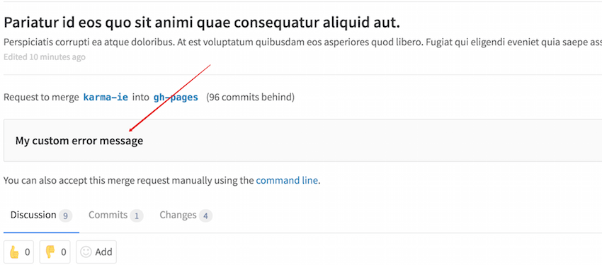

# Custom Git Hooks

>
**Note:** Custom Git hooks must be configured on the filesystem of the GitLab
server. Only GitLab server administrators will be able to complete these tasks.
Please explore [webhooks](../web_hooks/web_hooks.md) as an option if you do not
have filesystem access. For a user configurable Git hook interface, please see
[GitLab Enterprise Edition Git Hooks](http://docs.gitlab.com/ee/git_hooks/git_hooks.html).

Git natively supports hooks that are executed on different actions.
Examples of server-side git hooks include pre-receive, post-receive, and update.
See [Git SCM Server-Side Hooks][hooks] for more information about each hook type.

As of gitlab-shell version 2.2.0 (which requires GitLab 7.5+), GitLab
administrators can add custom git hooks to any GitLab project.

## Setup

Normally, Git hooks are placed in the repository or project's `hooks` directory.
GitLab creates a symlink from each project's `hooks` directory to the
gitlab-shell `hooks` directory for ease of maintenance between gitlab-shell
upgrades. As such, custom hooks are implemented a little differently. Behavior
is exactly the same once the hook is created, though.

Follow the steps below to set up a custom hook:

1. Pick a project that needs a custom Git hook.
1. On the GitLab server, navigate to the project's repository directory.
   For an installation from source the path is usually
   `/home/git/repositories/<group>/<project>.git`. For Omnibus installs the path is
   usually `/var/opt/gitlab/git-data/repositories/<group>/<project>.git`.
1. Create a new directory in this location called `custom_hooks`.
1. Inside the new `custom_hooks` directory, create a file with a name matching
   the hook type. For a pre-receive hook the file name should be `pre-receive`
   with no extension.
1. Make the hook file executable and make sure it's owned by git.
1. Write the code to make the Git hook function as expected. Hooks can be
   in any language. Ensure the 'shebang' at the top properly reflects the language
   type. For example, if the script is in Ruby the shebang will probably be
   `#!/usr/bin/env ruby`.

That's it! Assuming the hook code is properly implemented the hook will fire
as appropriate.

## Custom error messages

> [Introduced][5073] in GitLab 8.10.

If the commit is declined or an error occurs during the Git hook check,
the STDERR or STDOUT message of the hook will be present in GitLab's UI.
STDERR takes precedence over STDOUT.

[hooks]: https://git-scm.com/book/en/v2/Customizing-Git-Git-Hooks#Server-Side-Hooks
[5073]: https://gitlab.com/gitlab-org/gitlab-ce/merge_requests/5073
