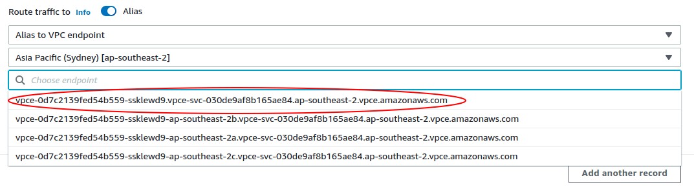



- Tier: Ultimate
- Offering: GitLab Dedicated



## Bring your own domain (BYOD)

By default, your GitLab Dedicated instance is accessible at a URL like `your-tenant.gitlab-dedicated.com`.
With bring your own domain (BYOD), you can use your own custom domain name to access your GitLab Dedicated instance and its services.
For example, you could access your instance at `gitlab.company.com` instead of `your-tenant.gitlab-dedicated.com`.

When you add a custom domain:

- The domain is included in the external URL used to access your instance.
- Any connections to your instance using the default `tenant.gitlab-dedicated.com` domain are no longer available.

GitLab automatically manages SSL/TLS certificates for your custom domain using [Let's Encrypt](https://letsencrypt.org/).
Let's Encrypt uses the [HTTP-01 challenge](https://letsencrypt.org/docs/challenge-types/#http-01-challenge)
to verify domain ownership, which requires:

- The CNAME record to be publicly resolvable through DNS.
- The same public validation process for automatic certificate renewal every 90 days.

For instances configured with private networking (such as AWS PrivateLink), public DNS resolution
ensures certificate management works properly, even when all other access is restricted to private networks.

### Configure DNS records

To use a custom domain, first update your domain's DNS records.

Prerequisites:

- Access to your domain host's DNS settings.

To set up DNS records for a custom domain with GitLab Dedicated:

1. Sign in to your domain host's website.
1. Go to the DNS settings.
1. Add a `CNAME` record that points your custom domain to your GitLab Dedicated tenant. For example:

   ```plaintext
   gitlab.my-company.com.  CNAME  my-tenant.gitlab-dedicated.com
   ```

1. Optional. If your domain has an existing `CAA` record, update it to include
   [Let's Encrypt](https://letsencrypt.org/docs/caa/) as a valid certificate authority.
   If your domain does not have any `CAA` records, you can skip this step. For example:

   ```plaintext
   example.com.  IN  CAA 0 issue "pki.goog"
   example.com.  IN  CAA 0 issue "letsencrypt.org"
   ```

   In this example, the `CAA` record defines Google Trust Services (`pki.goog`) and
   Let's Encrypt (`letsencrypt.org`) as certificate authorities that are allowed to issue certificates for your domain.

1. Save your changes and wait for the DNS changes to propagate.

Keep these DNS records in place as long as you use a custom domain with your GitLab Dedicated instance.



Your custom domain must be publicly resolvable through DNS for SSL certificate management,
even if you access your instance through private networks.



### Request a custom domain

After you configure DNS records, submit a
[support ticket](https://support.gitlab.com/hc/en-us/requests/new?ticket_form_id=4414917877650)
to enable your custom domain.

In your support ticket, specify:

- Your custom domain name.
- Whether you need a custom domain for the bundled [container registry](../../packages/container_registry.md)
  and [GitLab agent server for Kubernetes](../../clusters/kas.md).
  For example, `registry.company.com` and `kas.company.com`.

## Custom certificate authority

If your GitLab Dedicated instance connects to external services with certificates from a private
or internal certificate authority (CA), you must add that CA to your instance. By default, GitLab
trusts only publicly recognized certificate authorities and rejects connections to services with
certificates from untrusted sources.

For example, you might need to add a certificate authority to connect to:

- Internal webhook endpoints
- Private container registries

### Add a custom certificate with Switchboard

1. Sign in to [Switchboard](https://console.gitlab-dedicated.com/).
1. At the top of the page, select **Configuration**.
1. Expand **Custom certificates**.
1. Select **+ Add Certificate**.
1. Paste the certificate into the text box.
1. Select **Save**.
1. Scroll up to the top of the page and select whether to apply the changes immediately or during the next maintenance window.

### Add a custom certificate with a Support Request

If you are unable to use Switchboard to add a custom certificate, you can open a [support ticket](https://support.gitlab.com/hc/en-us/requests/new?ticket_form_id=4414917877650) and attach your custom public certificate files to request this change.

## AWS Private Link connectivity

### Inbound Private Link

[AWS Private Link](https://docs.aws.amazon.com/vpc/latest/privatelink/what-is-privatelink.html) allows users and applications in your VPC on AWS to securely connect to the GitLab Dedicated endpoint without network traffic going over the public internet.

You can create private links only in your primary and secondary AWS regions where your
GitLab Dedicated instance is deployed.

When you create a private link, you specify IAM principals that control access.
Only the IAM principals you specify can create VPC endpoints to connect to your instance.

The endpoint service is available in two availability zones that are either chosen
during onboarding or randomly selected.

Prerequisites:

- Your VPC must be in the same region as your GitLab Dedicated instance.

To create an inbound private link:

1. Sign in to [Switchboard](https://console.gitlab-dedicated.com/).
1. At the top of the page, select **Configuration**.
1. Expand **Inbound private link**.
1. Select **Add endpoint service**. This button is not available if all your available regions already have private links.
1. Select a region.
1. Add IAM principals for the AWS users or roles in your AWS organization that are establishing
   the VPC endpoints. The IAM principals must be
   [IAM role principals](https://docs.aws.amazon.com/IAM/latest/UserGuide/reference_policies_elements_principal.html#principal-roles)
   or [IAM user principals](https://docs.aws.amazon.com/IAM/latest/UserGuide/reference_policies_elements_principal.html#principal-users).
1. Select **Save**.
1. GitLab creates the endpoint service and handles domain verification for private DNS.
   The service endpoint name becomes available on the **Configuration** page.
1. In your AWS account, create an
   [endpoint interface](https://docs.aws.amazon.com/vpc/latest/privatelink/create-interface-endpoint.html) in your VPC.
1. Configure the endpoint interface with these settings:

   - **Service endpoint name**: Use the name from the **Configuration** page in Switchboard.
   - **Private DNS names enabled**: Select **Yes**.
   - **Subnets**: Select all matching subnets.

1. Use the instance URL provided during onboarding to connect to your GitLab Dedicated
   instance from your VPC.

#### Enable KAS and registry for Inbound Private Link

When you use Inbound Private Link to connect to your GitLab Dedicated instance,
only the main instance URL has automatic DNS resolution through the private network.

To access KAS (GitLab agent for Kubernetes) and registry services through your private network,
you must create an additional DNS configuration in your VPC.

Prerequisites:

- You have configured Inbound Private Link for your GitLab Dedicated instance.
- You have permissions to create Route 53 private hosted zones in your AWS account.

To enable KAS and registry through your private network:

1. In your AWS console, create a private hosted zone for `gitlab-dedicated.com`
   and associate it with the VPC that contains your private link connection.
1. After you create the private hosted zone, add the following DNS records (replace `example` with your instance name):

   1. Create an `A` record for your GitLab Dedicated instance:
      - Configure your full instance domain (for example, `example.gitlab-dedicated.com`) to resolve to your VPC endpoint as an Alias.
      - Select the VPC endpoint that does not contain an Availability Zone reference.

        

   1. Create `CNAME` records for both KAS and the registry to resolve to your GitLab Dedicated instance domain (`example.gitlab-dedicated.com`):
      - `kas.example.gitlab-dedicated.com`
      - `registry.example.gitlab-dedicated.com`

1. To verify connectivity, from a resource in your VPC, run these commands:

   ```shell
   nslookup kas.example.gitlab-dedicated.com
   nslookup registry.example.gitlab-dedicated.com
   nslookup example.gitlab-dedicated.com
   ```

   All commands should resolve to private IP addresses within your VPC.

This configuration is robust to IP address changes because it uses the VPC endpoint interface rather than specific IP addresses.

##### Enable Pages for Inbound Private Link

Access GitLab Pages through your private network by creating additional DNS
configuration in your VPC, similar to the KAS and registry configuration.

To enable Pages through your private network:

1. In your AWS console, create a private hosted zone for `<your_instance_name>.gitlab-pages.site`
   and associate it with the VPC that contains your private link connection.
1. After you create the private hosted zone, add the following DNS records:
   1. Create an apex `A` alias record for the VPC endpoint.
   1. Create a wildcard `CNAME` for `*.<your_instance_name>.gitlab-pages.site` that points to `<your_instance_name>.gitlab-pages.site`.

#### Troubleshooting

##### Error: `Service name could not be verified`

You might get an error that states `Service name could not be verified` when trying to create a VPC endpoint.

This issue occurs when the custom IAM role provided in the support ticket does not have the proper permissions or trust policies configured in your AWS account.

To resolve this issue:

1. Confirm that you can assume the custom IAM role provided to GitLab in the support ticket.
1. Verify the custom role has a trust policy that allows you to assume it. For example:

   ```json
   {
       "Version": "2012-10-17",
       "Statement": [
           {
               "Sid": "Statement1",
               "Effect": "Allow",
               "Principal": {
                   "AWS": "arn:aws:iam::CONSUMER_ACCOUNT_ID:user/user-name"
               },
               "Action": "sts:AssumeRole"
           }
       ]
   }
   ```

1. Verify the custom role has a permission policy that allows VPC endpoint and EC2 actions. For example:

   ```json
   {
      "Version": "2012-10-17",
      "Statement": [
         {
            "Sid": "VisualEditor0",
            "Effect": "Allow",
            "Action": "vpce:*",
            "Resource": "*"
         },
         {
            "Sid": "Statement1",
            "Effect": "Allow",
            "Action": [
                  "ec2:CreateVpcEndpoint",
                  "ec2:DescribeVpcEndpointServices",
                  "ec2:DescribeVpcEndpoints"
            ],
            "Resource": "*"
         }
      ]
   }
   ```

1. Using the custom role, retry creating the VPC endpoint in your AWS console or CLI.

### Outbound Private Link

Outbound private links allow your GitLab Dedicated instance and the hosted runners for GitLab Dedicated to securely communicate with services running in your VPC on AWS without exposing any traffic to the public internet.

This type of connection allows GitLab functionality to access private services:

- For the GitLab Dedicated instance:

  - [webhooks](../../../user/project/integrations/webhooks.md)
  - import or mirror projects and repositories

- For hosted runners:

  - custom secrets managers
  - artifacts or job images stored in your infrastructure
  - deployments into your infrastructure

Consider the following:

- You can only create private links within the same AWS region. Make sure your VPC is in the same region where your GitLab Dedicated instance is deployed.
- The connection requires the [Availability Zone IDs (AZ IDs)](https://docs.aws.amazon.com/AWSEC2/latest/UserGuide/using-regions-availability-zones.html#az-ids) for the two Availability Zones (AZs) in the regions that you selected during onboarding.
- If you did not specify any AZs during onboarding to Dedicated, GitLab randomly selects both AZ IDs. AZ IDs are displayed in Switchboard on the Overview page for both the Primary and Secondary regions.
- GitLab Dedicated limits the number of outbound private link connections to 10.

#### Add an outbound private link with Switchboard

Prerequisites:

- [Create the endpoint service](https://docs.aws.amazon.com/vpc/latest/privatelink/create-endpoint-service.html) for your internal service to be available to GitLab Dedicated.
- Configure a Network Load Balancer (NLB) for the endpoint service in the Availability Zones (AZs) where your Dedicated instance is deployed. Either:
  - Use the configured AZs. AZ IDs are displayed on the Overview page in Switchboard.
  - Enable the NLB in every AZ in the region.
- Add the ARN of the role that GitLab Dedicated uses to connect to your endpoint service to the Allowed Principals list on the Endpoint Service. You can find this ARN in Switchboard under Outbound private link IAM principal. For more information, see [Manage permissions](https://docs.aws.amazon.com/vpc/latest/privatelink/configure-endpoint-service.html#add-remove-permissions).
- Recommended. Set **Acceptance required** to **No** to enable GitLab Dedicated to connect in a single operation. If set to **Yes**, you must manually accept the connection after it's initiated.

  

  If you set **Acceptance required** to **Yes**, Switchboard cannot accurately determine when the link is accepted. After you manually accept the link, the status shows as **Pending** instead of **Active** until next scheduled maintenance. After maintenance, the link status refreshes and shows as connected.

  

- Once the endpoint service is created, note the Service Name and if you have enabled Private DNS or not.

1. Sign in to [Switchboard](https://console.gitlab-dedicated.com/).
1. At the top of the page, select **Configuration**.
1. Expand **Outbound private link**.
1. Complete the fields.
1. To add endpoint services, select **Add endpoint service**. You can add up to ten endpoint services for each region. At least one endpoint service is required to save the region.
1. Select **Save**.
1. Optional. To add an outbound private link for a second region, select **Add outbound connection**, then repeat the previous steps.

#### Delete an outbound private link with Switchboard

1. Sign in to [Switchboard](https://console.gitlab-dedicated.com/).
1. At the top of the page, select **Configuration**.
1. Expand **Outbound private link**.
1. Go to the outbound private link you want to delete, then select **Delete** ().
1. Select **Delete**.
1. Optional. To delete all the links in a region, from the region header, select **Delete** (). This also deletes the region configuration.

#### Add an outbound private link with a support request

1. [Create the Endpoint service](https://docs.aws.amazon.com/vpc/latest/privatelink/create-endpoint-service.html) through which your internal service
   will be available to GitLab Dedicated. Provide the associated `Service Endpoint Name` on a new
   [support ticket](https://support.gitlab.com/hc/en-us/requests/new?ticket_form_id=4414917877650).
1. Configure a Network Load Balancer (NLB) for the endpoint service in the Availability Zones (AZs) where your Dedicated instance is deployed. Either:
   - Use the configured AZs. AZ IDs are displayed on the Overview page in Switchboard.
   - Enable the NLB in every AZ in the region.
1. In your [support ticket](https://support.gitlab.com/hc/en-us/requests/new?ticket_form_id=4414917877650), GitLab will provide you with the ARN of an
   IAM role that will be initiating the connection to your endpoint service. You must ensure this ARN is included, or otherwise covered by other
   entries, in the list of "Allowed Principals" on the Endpoint Service, as described by the [AWS documentation](https://docs.aws.amazon.com/vpc/latest/privatelink/configure-endpoint-service.html#add-remove-permissions).
   Though it's optional, you should you add it explicitly, allowing you to set `Acceptance required` to No so that Dedicated can connect in a single operation.
   If you leave `Acceptance required` as Yes, then you must manually accept the connection after Dedicated has initiated it.
1. To connect to services using the Endpoint, the Dedicated services require a DNS name. Private Link automatically creates an internal name, but
   it is machine-generated and not generally directly useful. Two options are available:
   - In your Endpoint Service, enable [Private DNS name](https://docs.aws.amazon.com/vpc/latest/privatelink/manage-dns-names.html), perform the
     required validation, and let GitLab know in the support ticket that you are using this option. If `Acceptance Required` is set to Yes on your
     Endpoint Service, also note this on the support ticket because Dedicated will have to initiate the connection without Private DNS, wait for you
     to confirm it has been accepted, and then update the connection to enable the use of Private DNS.
   - Dedicated can manage a Private Hosted Zone (PHZ) within the Dedicated AWS Account and alias any arbitrary DNS names to the endpoint, directing
     requests for those names to your endpoint service. These aliases are known as PHZ entries. For more information, see [Private hosted zones](#private-hosted-zones).

GitLab then configures the tenant instance to create the necessary Endpoint Interfaces based on the service names you provided. Any matching outbound
connections made from the tenant instance are directed through the PrivateLink into your VPC.

#### Troubleshooting

If you have trouble establishing a connection after the Outbound Private Link has been set up, a few things in your AWS infrastructure could be the cause of the problem. The specific things to check vary based on the unexpected behavior you're seeking to fix. Things to check include:

- Ensure that cross-zone load balancing is turned on in your Network Load Balancer (NLB).
- Ensure that the Inbound Rules section of the appropriate Security Groups permits traffic from the correct IP ranges.
- Ensure that the inbound traffic is mapped to the correct port on the Endpoint Service.
- In Switchboard, expand **Outbound private link** and confirm that the details appear as you expect.
- Ensure that you have [allowed requests to the local network from webhooks and integrations](../../../security/webhooks.md#allow-requests-to-the-local-network-from-webhooks-and-integrations).

## Private hosted zones

A private hosted zone (PHZ) creates custom DNS aliases (CNAMEs) that resolve in your GitLab Dedicated instance's network.

Use a PHZ when you want to:

- Create multiple DNS names or aliases that use a single endpoint, such as when running a reverse proxy to connect to multiple services.
- Use a private domain that cannot be validated by public DNS.

PHZs are commonly used with reverse PrivateLink to create readable domain names instead of using AWS-generated endpoint names. For example, you can use `alpha.beta.tenant.gitlab-dedicated.com` instead of `vpce-0987654321fedcba0-k99y1abc.vpce-svc-0a123bcd4e5f678gh.eu-west-1.vpce.amazonaws.com`.

In some cases, you can also use PHZs to create aliases that resolve to publicly accessible DNS names. For example, you can create an internal DNS name that resolves to a public endpoint when you need internal systems to access a service through its private name.



Changes to private hosted zones can disrupt services that use these records for up to five minutes.



### PHZ domain structure

When using your GitLab Dedicated instance's domain as part of an alias, you must include two subdomains before the main domain, where:

- The first subdomain becomes the name of the PHZ.
- The second subdomain becomes the record entry for the alias.

For example:

- Valid PHZ entry: `subdomain2.subdomain1.<your-tenant-id>.gitlab-dedicated.com`.
- Invalid PHZ entry: `subdomain1.<your-tenant-id>.gitlab-dedicated.com`.

When not using your GitLab Dedicated instance domain, you must still provide:

- A Private Hosted Zone (PHZ) name
- A PHZ entry in the format `phz-entry.phz-name.com`

To prevent shadowing of public DNS domains when the domain is created inside the Dedicated tenant, use at least two additional subdomain levels below any public domain for your PHZ entries. For example, if your tenant is hosted at `tenant.gitlab-dedicated.com`, your PHZ entry should be at least `subdomain1.subdomain2.tenant.gitlab-dedicated.com`, or if you own `customer.com` then at least `subdomain1.subdomain2.customer.com`, where `subdomain2` is not a public domain.

### Add a private hosted zone with Switchboard

To add a private hosted zone:

1. Sign in to [Switchboard](https://console.gitlab-dedicated.com/).
1. At the top of the page, select **Configuration**.
1. Expand **Private hosted zones**.
1. Select **Add private hosted zone entry**.
1. Complete the fields.
   - In the **Hostname** field, enter your Private Hosted Zone (PHZ) entry.
   - For **Link type**, choose one of the following:
     - For an outbound private link PHZ entry, select the endpoint service from the dropdown list.
     Only links with the `Available` or `Pending Acceptance` status are shown.
     - For other PHZ entries, provide a list of DNS aliases.
1. Select **Save**.
Your PHZ entry and any aliases should appear in the list.
1. Scroll to the top of the page, and select whether to apply the changes immediately or during the next maintenance window.

### Add a private hosted zone with a support request

If you are unable to use Switchboard to add a private hosted zone, you can open a [support ticket](https://support.gitlab.com/hc/en-us/requests/new?ticket_form_id=4414917877650) and provide a list of DNS names that should resolve to the endpoint service for the outbound private link. The list can be updated as needed.

## IP allowlist

Control which IP addresses can access your instance with an IP allowlist.
When you enable the IP allowlist, IP addresses not on the allowlist are blocked
and receive an `HTTP 403 Forbidden` response when they try to access your instance.

Use Switchboard to configure and manage your IP allowlist, or submit a support request if Switchboard is unavailable.

### Add IP addresses to the allowlist with Switchboard

To add IP addresses to the allowlist:

1. Sign in to [Switchboard](https://console.gitlab-dedicated.com/).
1. At the top of the page, select **Configuration**.
1. Expand **IP allowlist**, then select **IP allowlist** to go to the IP allowlist page.
1. To enable the IP allowlist, select the vertical ellipsis (), then select **Enabled**.
1. Do one of the following:

   - To add a single IP address:

   1. Select **Add IP address**.
   1. In the **IP address** text box, enter either:
      - A single IPv4 address (for example, `192.168.1.1`).
      - An IPv4 address range in CIDR notation (for example, `192.168.1.0/24`).
   1. In the **Description** text box, enter a description.
   1. Select **Add**.

   - To import multiple IP addresses:

   1. Select **Import**.
   1. Upload a CSV file or paste a list of IP addresses.
   1. Select **Continue**.
   1. Fix any invalid or duplicate entries, then select **Continue**.
   1. Review the changes, then select **Import**.

1. At the top of the page, choose whether to apply the changes immediately or during the next maintenance window.

### Delete IP addresses from the allowlist with Switchboard

1. Sign in to [Switchboard](https://console.gitlab-dedicated.com/).
1. At the top of the page, select **Configuration**.
1. Expand **IP allowlist**, then select **IP allowlist** to go to the IP allowlist page.
1. Do one of the following:

   - To delete a single IP address:

   1. Next to the IP address you want to remove, select the trash icon ().
   1. Select **Delete IP address**.

   - To delete multiple IP addresses:

   1. Select the checkboxes for the IP addresses you want to delete.
   1. To select all IP addresses on the current page, select the checkbox in the header row.
   1. Above the IP addresses table, select **Delete**.
   1. Select **Delete** to confirm.

1. At the top of the page, choose whether to apply the changes immediately or during the next maintenance window.

### Add an IP to the allowlist with a support request

If you are unable to use Switchboard to update your IP allowlist, open a [support ticket](https://support.gitlab.com/hc/en-us/requests/new?ticket_form_id=4414917877650) and specify a comma-separated list of IP addresses that can access your instance.

### Enable OpenID Connect for your IP allowlist

Using [GitLab as an OpenID Connect identity provider](../../../integration/openid_connect_provider.md) requires internet access to the OpenID Connect verification endpoint.

To enable access to the OpenID Connect endpoint while maintaining your IP allowlist:

- In a [support ticket](https://support.gitlab.com/hc/en-us/requests/new?ticket_form_id=4414917877650), request to allow access to the OpenID Connect endpoint.

The configuration is applied during the next maintenance window.

### Enable SCIM provisioning for your IP allowlist

You can use SCIM with external identity providers to automatically provision and manage users. To use SCIM, your identity provider must be able to access the instance SCIM API endpoints. By default, IP allowlisting blocks communication to these endpoints.

To enable SCIM while maintaining your IP allowlist:

- In a [support ticket](https://support.gitlab.com/hc/en-us/requests/new?ticket_form_id=4414917877650), request to enable SCIM endpoints to the internet.

The configuration is applied during the next maintenance window.
