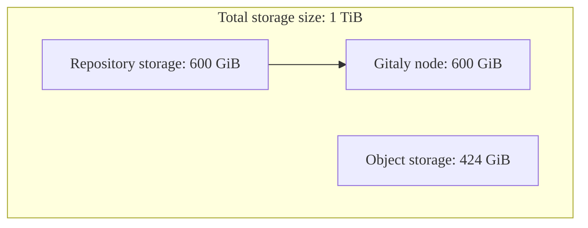
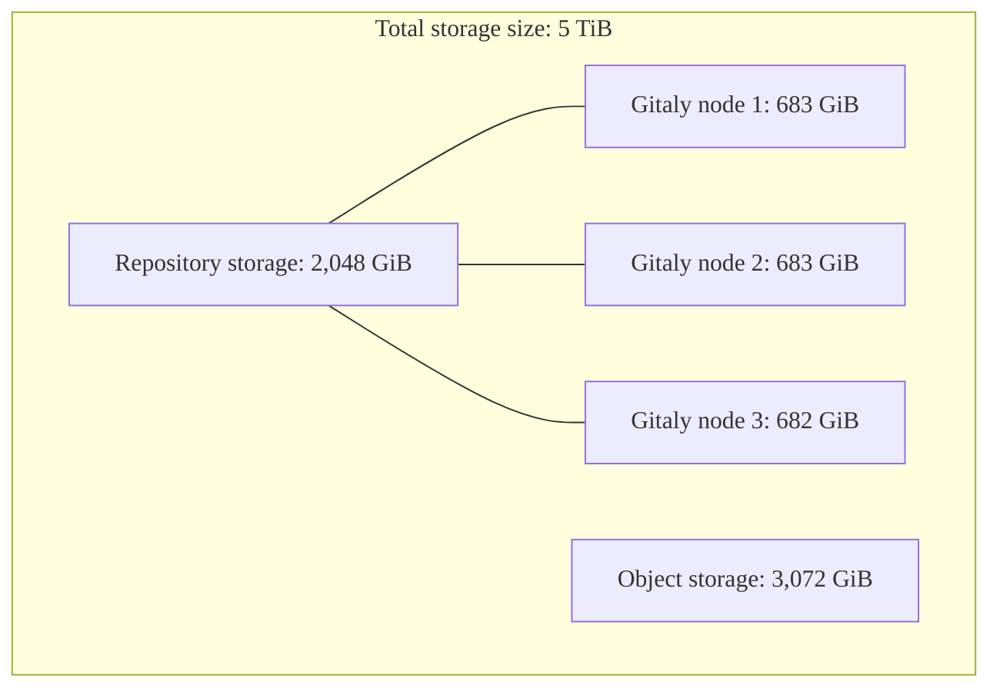



- Tier: Ultimate
- Offering: GitLab Dedicated



GitLab Dedicated provides a single-tenant, fully managed GitLab instance deployed in your preferred AWS
cloud region. Your account team works with you to determine your storage needs during the procurement
process.

Understanding how storage works in GitLab Dedicated helps you make informed decisions
about instance configuration and resource management.

## Storage components

GitLab Dedicated uses different types of storage for different purposes. The total storage allocation is
divided between these components based on usage patterns.

### Total storage size

Total storage size is the combined storage allocated to a GitLab Dedicated instance, including both
your repository storage and object storage. This allocation represents the total storage capacity purchased with a
GitLab Dedicated subscription and configured during instance provisioning.

When determining storage needs, this is the primary metric used for planning and pricing. The total
storage is then distributed between repository storage and object storage based on expected usage patterns.

### Repository storage

Repository storage refers to the space allocated for Git repositories across your Gitaly nodes. This storage
is distributed among the Gitaly nodes in your instance based on your reference architecture.

#### Repository storage per Gitaly node

Each Gitaly node in your instance has a specific storage capacity. This capacity affects how large individual
repositories can be, because no single repository can exceed the capacity of a single Gitaly node.

For example, if each Gitaly node has 100 GiB of storage capacity and there are 3 Gitaly nodes, your instance
can store a total of 300 GiB of repository data, but no single repository can exceed 100 GiB.

### Object storage

Object storage is a storage architecture that manages data as objects rather than as a file hierarchy.
In GitLab, object storage handles everything that is not part of Git repositories, including:

- Job artifacts and job logs from CI/CD pipelines
- Images stored in the container registry
- Packages stored in the package registry
- Websites deployed with GitLab Pages
- State files for Terraform projects

Object storage in GitLab Dedicated is implemented using Amazon S3 with appropriate replication for data protection.

### Blended storage

Blended storage is the overall storage used by a GitLab Dedicated instance, including object
storage, repository storage, and data transfer.

<!-- vale gitlab_base.Spelling = NO -->

### Unblended storage

Unblended storage is the storage capacity at the infrastructure level for each storage type.
You primarily work with the total storage size and repository storage numbers.

<!-- vale gitlab_base.Spelling = YES -->

## Storage planning and configuration

Storage planning for a GitLab Dedicated instance involves understanding how object and repository storage is
allocated across the infrastructure.

### Determining initial storage allocation

The GitLab Dedicated account team helps determine the appropriate storage amount based on:

- Number of users
- Number and size of repositories
- CI/CD usage patterns
- Anticipated growth

### Repository capacity and reference architectures

Your repository storage is distributed across Gitaly nodes. This affects how large
individual repositories can be, as no single repository can exceed the capacity of a single Gitaly
node.

The number of Gitaly nodes for an instance depends on the reference architecture determined during
onboarding, based primarily on user count. Reference architectures for instances with more than
2,000 users typically use three Gitaly nodes. For more information, see
[reference architectures](../../reference_architectures/_index.md).

#### View reference architecture

To view your reference architecture:

1. Sign in to [Switchboard](https://console.gitlab-dedicated.com/).
1. At the top of the page, select **Configuration**.
1. From the tenant overview page, locate the **Reference architecture** field.



To confirm the number of Gitaly nodes in your tenant architecture, [submit a support ticket](https://support.gitlab.com/hc/en-us/requests/new?ticket_form_id=4414917877650).



### Example storage calculations

These examples demonstrate how storage allocation affects repository size limitations:

#### Standard workload with 2,000 users

- Reference architecture: Up to 2,000 users (1 Gitaly node)
- Total storage size: 1 TiB (1,024 GiB)
- Allocation: 600 GiB repository storage, 424 GiB object storage
- Repository storage per Gitaly node: 600 GiB

#### CI/CD-intensive workload with 10,000 users

- Reference architecture: Up to 10,000 users (3 Gitaly nodes)
- Total storage size: 5 TiB (5,120 GiB)
- Allocation: 2,048 GiB repository storage, 3,072 GiB object storage
- Repository storage per Gitaly node: ~683 GiB (2,048 GiB ÷ 3 Gitaly nodes)

## Manage storage growth

To manage storage growth effectively:

- Set cleanup policies for the [package registry](../../../user/packages/package_registry/reduce_package_registry_storage.md#cleanup-policy) to automatically remove old package assets.
- Set cleanup policies for the [container registry](../../../user/packages/container_registry/reduce_container_registry_storage.md#cleanup-policy) to remove unused container tags.
- Set an expiration period for [job artifacts](../../../ci/jobs/job_artifacts.md#with-an-expiry).
- Review and archive or remove [unused projects](../../../user/project/working_with_projects.md).

## Frequently asked questions

### Can I change my storage allocation after my instance is provisioned?

Yes, you can request additional storage by contacting your account team or opening a support ticket.
Changes to storage affect billing.

### How does storage affect performance?

Proper storage allocation ensures optimal performance. Undersized storage can lead to performance
issues, particularly for repository operations and CI/CD pipelines.

### How is storage handled for Geo replication?

GitLab Dedicated includes a secondary Geo site for disaster recovery, with storage allocation
based on your primary site configuration.

### Can I bring my own S3 bucket for object storage?

No, GitLab Dedicated uses AWS S3 buckets managed by GitLab in your tenant account.

## Related topics

- [Data residency and high availability](data_residency_high_availability.md)
- [Reference architectures](../../reference_architectures/_index.md)
- [Repository storage](../../repository_storage_paths.md)
- [Object storage](../../object_storage.md)
