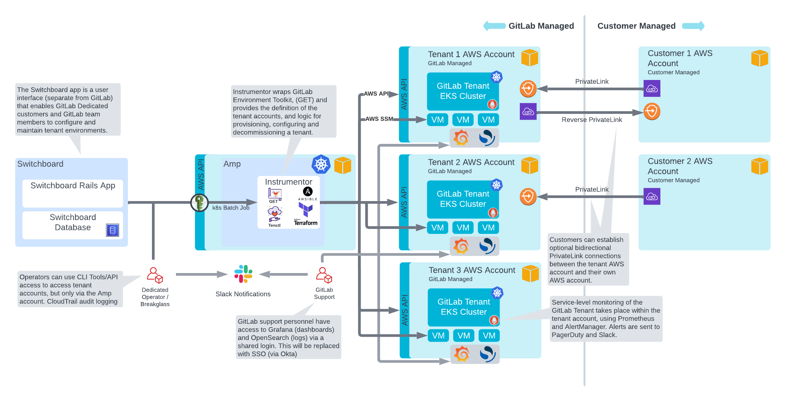
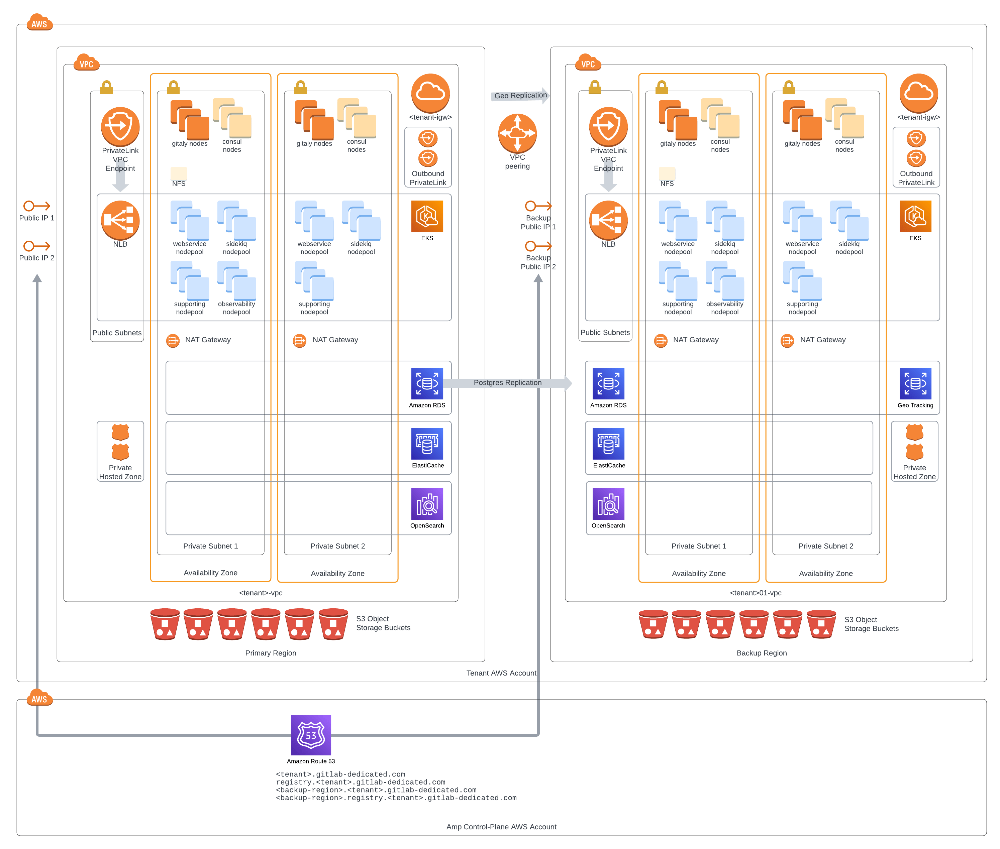

# GitLab Dedicated

DETAILS:
**Tier:** Ultimate
**Offering:** GitLab Dedicated

GitLab Dedicated is a single-tenant SaaS solution, fully managed and hosted by GitLab.
GitLab Dedicated operators and tenant administrators can use Switchboard to provision, configure, and maintain their tenant environments.

For more information about this offering, see the [subscription page](../../subscriptions/gitlab_dedicated/index.md).

## Architecture

This page collects a set of architectural documents and diagrams for GitLab Dedicated.

### High-level overview

This diagram shows a high-level overview of the architecture for GitLab Dedicated.

When managing GitLab Dedicated tenant instances:

- Switchboard is responsible for managing global configuration shared between the AWS cloud providers, accessible by tenants.
- Amp is responsible for the interaction with the customer tenant accounts, such as configuring expected roles and policies, enabling the required services, and provisioning environments.

GitLab team members with edit access can update the [source](https://lucid.app/lucidchart/e0b6661c-6c10-43d9-8afa-1fe0677e060c/edit?page=0_0#) files for the diagram in Lucidchart.

### Tenant network

The customer tenant account is a single AWS cloud provider account. The single account provides full tenancy isolation, in its own VPC, and with its own resource quotas.

The cloud provider account is where a highly resilient GitLab installation resides, in its own isolated VPC. On provisioning, the customer tenant gets access to a High Availability (HA) GitLab primary site and a GitLab Geo secondary site.

GitLab team members with edit access can update the [source](https://lucid.app/lucidchart/e69207d3-7428-4ed1-b8a7-902c608cf8a2/edit?invitationId=inv_5922f7f4-4a0b-4024-b152-a00a9d0daa22&page=0_0#) files for the diagram in Lucidchart.

#### Gitaly setup

GitLab Dedicated deploys Gitaly [in a sharded setup](../../administration/gitaly/index.md#before-deploying-gitaly-cluster), not a Gitaly Cluster. In this setup:

- Customer repositories are spread across multiple virtual machines.
- GitLab manages [storage weights](../../administration/repository_storage_paths.md#configure-where-new-repositories-are-stored) on behalf of the customer.

#### Geo setup

GitLab Dedicated leverages GitLab Geo for [disaster recovery](../../subscriptions/gitlab_dedicated/index.md#disaster-recovery).

Geo does not use an active-active failover configuration. For more information, see [Geo](../../administration/geo/index.md).

#### AWS PrivateLink connection (optional)

Optionally, private connectivity is available for your GitLab Dedicated instance, using [AWS PrivateLink](https://aws.amazon.com/privatelink/) as a connection gateway.

Both [inbound](../../administration/dedicated/configure_instance.md#inbound-private-link) and [outbound](../../administration/dedicated/configure_instance.md#outbound-private-link) private links are supported.

GitLab team members with edit access can update the [source](https://lucid.app/lucidchart/cff1ce90-f146-457f-9630-d9b2eecdee99/edit?viewport_loc=553%2C-1872%2C2903%2C1277%2C0_0&invitationId=inv_1bf96b4a-8cc0-4a34-844d-a8780f32862a) files for the diagram in Lucidchart.

### Hosted runners for GitLab Dedicated

For more information on how runners authenticate and execute the job payload, see [Runner execution flow](https://docs.gitlab.com/runner#runner-execution-flow).

GitLab team members with edit access can update the [source](https://lucid.app/lucidchart/5dd152c0-53da-48a9-95b3-80fde0afad6d/edit?viewport_loc=534%2C-238%2C2942%2C1600%2Clp8eoEUK3HcI&invitationId=inv_45c946dd-74b7-4446-acbd-0df242bd6140) files for the diagram in Lucidchart.

## Get started

To get started with GitLab Dedicated, use Switchboard to:

1. [Create your GitLab Dedicated instance](../../administration/dedicated/create_instance.md).
1. [Configure your GitLab Dedicated instance](../../administration/dedicated/configure_instance.md).
1. [Create a hosted runner](../../administration/dedicated/hosted_runners.md).
