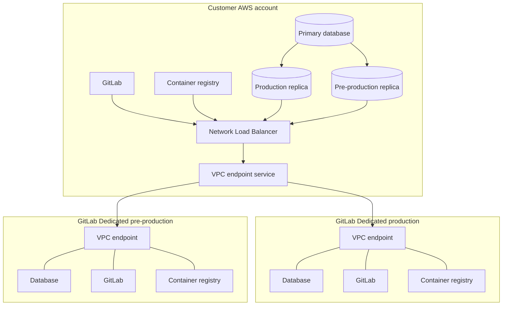



- Tier: Ultimate
- Offering: GitLab Dedicated



The migration begins when your GitLab Dedicated instance is created.
From there, it moves through a preparation period, a replication period, and two cutovers:
pre-production, then production.
The pre-production cutover rehearses the process and gives you an environment to test
integrations before the production cutover completes the migration.

## Migration architecture

During the migration, two GitLab Dedicated tenants, a pre-production tenant and a production
tenant, connect to your single source instance.
You provide the two database read replicas and the AWS connectivity on your side,
and both tenants use that same path.

> [!note]
> Two GitLab Dedicated tenants appear in the diagram, but you provide only your single production
> instance. GitLab provisions and maintains both tenants.
> For more information, see [migration phases](_index.md#migration-phases).

The diagram shows AWS RDS read replicas, which is the case when your source runs in AWS.
If your source runs on another cloud or on-premises, you create the read replicas in your own
environment and provide connectivity over the internet or an IPsec site-to-site VPN.

## Discovery, planning, and instance creation

Before you finalize your purchase of GitLab Dedicated, your Solutions Architect or Account Executive helps you collect information
about your current environment with the
[GitLab Discovery Toolkit](https://gitlab.com/gitlab-com/gl-infra/gitlab-dedicated/customer-tools/gitlab-discovery-toolkit),
[GitLab Evaluate](https://gitlab.com/gitlab-org/professional-services-automation/tools/utilities/evaluate),
and a log bundle such as [GitLabSOS](https://gitlab.com/gitlab-com/support/toolbox/gitlabsos).
GitLab assesses migration feasibility, sizing, and the timeline from that output, and identifies the
requirements you must satisfy.

After your purchase is complete, you create your GitLab Dedicated instance yourself, or GitLab
Professional Services creates it with you if you prefer.
The decisions you make during creation, such as your AWS regions and your access method, affect the
migration, so settle them with your migration team first.
For more information, see
[create your GitLab Dedicated instance](../create_instance/_index.md) and
[Geo migration requirements](requirements.md#instance-decisions).

## Preparation

Preparation is the phase where you build everything replication depends on.
You can do this work yourself, or together with GitLab Professional Services.
For more information, see [Geo migration requirements](requirements.md).

Replication cannot start until you complete the following items:

1. Configure your GitLab Self-Managed instance as a Geo primary site, so that verification can start
   generating checksums for your existing data.
1. Move all data types in use to object storage.
1. Align your Gitaly storage names with the names GitLab Dedicated supports.
1. Create the two database read replicas, and provide connectivity from GitLab Dedicated to them and to
   your GitLab instance.
   If your source is in AWS, one Terraform module does both.

You can complete the following items in parallel, and finish them before the pre-production cutover
rather than before replication:

- Outbound connectivity for integrations that reach private targets, including the outbound proxy if you
  need more than 10 endpoints.
- Replacements for features that GitLab Dedicated does not support.
  Start the move from LDAP early if it applies to you.

This phase usually takes the longest, and its duration depends far more on your environment than on your
data volume.

## Geo replication

After connectivity is in place and your instance is configured as a Geo primary site, replication to the
GitLab Dedicated secondary site begins.

Your source instance continues to serve users throughout.
No downtime occurs during replication.
You monitor progress from your GitLab Self-Managed instance in the Geo sites section of the Admin area.
For more information, see [Geo](../../geo/_index.md).

Replication starts with conservative concurrency limits.
On the secondary site entry in your Admin area, use the tuning settings to
increase them as you watch the load on your primary site and confirm stability.
For more information, see
[changing the sync and verification concurrency values](../../geo/replication/tuning.md#changing-the-syncverification-concurrency-values).

The duration is driven mainly by the volume of data in object storage.
For initial planning, assume a rough rate of about 10 TB of object storage data per week, then use the
observed rate once replication is running.
Network bandwidth, object count, and any configured rate limits also affect the duration, so your
migration team confirms an estimate for your data.

Most transient synchronization errors resolve as replication continues.

Replication is ready for the pre-production cutover when every data type reports at least 99.9%
synchronized and verified in the Geo sites section of the Admin area.
You and GitLab Professional Services investigate and resolve the remaining items together before the
production cutover, which targets complete synchronization.
For more information, see
[troubleshooting synchronization and verification](../../geo/replication/troubleshooting/synchronization_verification.md).

## Version alignment

By the time replication starts, your source instance and both GitLab Dedicated tenants run the same
GitLab version.

During replication, your migration team coordinates upgrades with you, so that your source instance and
the GitLab Dedicated tenants move together and stay aligned.
Typically one coordinated upgrade happens during this period.

From the pre-production cutover until the production cutover, upgrades are frozen on both sides, so that
nothing shifts underneath your testing.

After the production cutover, remaining upgrades bring your instance to the version the rest of the
GitLab Dedicated fleet runs.
For more information, see [version catch-up](post_cutover.md#version-catch-up).
GitLab Dedicated runs the previous minor version relative to the current GitLab release.
For more information, see the [versioning model](../releases.md#versioning-model).
For planned upgrade dates, see the
[GitLab Dedicated info portal](https://gitlab-com.gitlab.io/cs-tools/gitlab-cs-tools/dedicated-info-portal/).

## Pre-production cutover

The pre-production cutover is a full rehearsal of the production cutover, run against the GitLab
Dedicated pre-production tenant.

The rehearsal serves two purposes.
It validates the process end to end and measures how long the real cutover takes, so that the production
cutover holds no surprises.
It also gives you a working instance on which to test your integrations before the production cutover.

The rehearsal follows the same sequence as the production cutover, against the pre-production tenant, so
your source instance keeps serving users and your production DNS is untouched.
Your migration team confirms with you which hostname to use to reach the pre-production tenant, and any
identity provider configuration it needs.

The pre-production cutover targets 99.9% data completeness, rather than the 100% targeted for the
production cutover.
Minor synchronization failures can therefore be set aside during the rehearsal, and are addressed before
the production cutover.

The upgrade freeze begins at this point and continues until production cutover.

## Testing period

After the pre-production cutover, you validate the migrated instance.
This period typically runs for several weeks.

Validate the following items:

- Signing in through your identity provider
- Browsing and creating projects
- Cloning and pushing over both HTTPS and SSH
- Running CI/CD pipelines
- Container registry access with `docker login`, pull, and push
- Webhook delivery to your internal targets
- Email delivery
- Any integrations that reach private targets
- Connectivity from different on-site or VPN locations

Agree on go or no-go criteria for the production cutover with your migration team before the cutover date.

Keep the freeze period as short as practical, because your instance is not receiving upgrades during it.

## Production cutover

The production cutover is scheduled with you and requires a downtime window,
because no data can be written during that time.

The cutover runs in the following sequence:

1. You put your source instance into maintenance mode, which stops new data from being written.
1. Replication finishes the remaining items.
1. GitLab copies your source database to the GitLab Dedicated database.
   The duration depends on database volume and is measured during the pre-production rehearsal.
1. GitLab reconfigures the tenant and promotes it to the primary site.
1. If you use a [custom domain](../configure_instance/network_security.md#custom-domains), you update
   your DNS records to point to GitLab Dedicated.
1. GitLab reconfigures the site so that certificate issuance completes for your custom domains.
1. You connect to the site and sign in through your identity provider.
   The instance is still in maintenance mode, so you can verify access, and read your projects and
   repositories, before any data can be written.
1. You disable maintenance mode.
1. You carry out your write checks, such as pushing to a repository, running a pipeline, and pushing to
   the container registry.

> [!warning]
> Once maintenance mode is lifted, the instance is write enabled.
> Returning to your source instance means losing any data written after that point.
> For this reason, the go or no-go decision happens before the cutover.

## Administration after migration

After migration, you keep application administration:

- Administrator access through the GitLab UI
- User and group management
- Project and repository administration
- CI/CD configuration

GitLab takes over infrastructure administration:

- Managing the underlying infrastructure. You do not have shell access to servers.
- Upgrades. Your instance is upgraded during its assigned maintenance window, and you cannot select
  upgrade dates. For more information, see [maintenance](../maintenance.md) and [releases](../releases.md).
- Some settings, managed in Switchboard rather than the Admin area. For more information, see
  [tenant overview](../tenant_overview.md).

## Related topics

- [Geo migration to GitLab Dedicated](_index.md)
- [Geo migration requirements](requirements.md)
- [Collect Geo migration secrets](secrets.md)
- [Post-migration activities](post_cutover.md)
