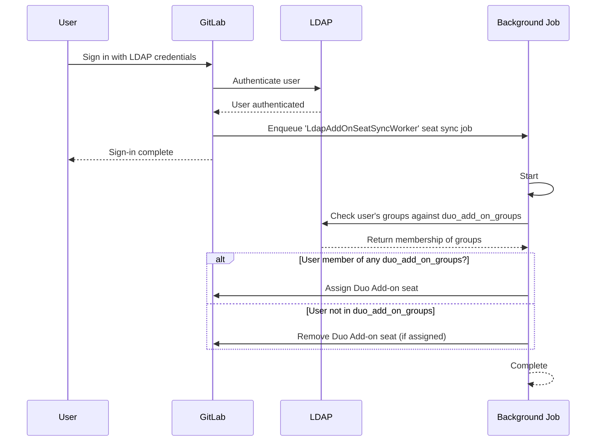

DETAILS:
**Tier:** Premium, Ultimate
**Offering:** GitLab Self-Managed, GitLab Dedicated

> - [Introduced](https://gitlab.com/gitlab-org/gitlab/-/merge_requests/175101) in GitLab 17.8.

GitLab administrators can configure automatic GitLab Duo add-on seat assignment based on LDAP group membership. When enabled, GitLab will automatically assign or remove add-on seats for users when they sign in, depending on their LDAP group memberships.

## Seat management workflow

1. **Configuration**: Administrators specify LDAP groups in the `duo_add_on_groups` [configuration settings](#configure-duo-add-on-seat-management).
1. **User sign-in**: When a user signs in through LDAP, GitLab checks their group memberships. GitLab supports only one LDAP identity per user.
1. **Seat assignment**:
   - If the user belongs to any group listed in `duo_add_on_groups`, they are assigned an add-on seat (if not already assigned).
   - If the user doesn't belong to any listed group, their add-on seat is removed (if previously assigned).
1. **Async processing**: The seat assignment and removal is handled async to ensure the main sign-in flow is not interrupted.

The following diagram illustrates the workflow:



### Configure Duo add-on seat management

To turn on add-on seat management with LDAP:

1. Open the GitLab configuration file you have edited for the [installation](auth/ldap/ldap_synchronization.md#gitlab-duo-add-on-for-groups).
1. Add the `duo_add_on_groups` setting to your LDAP server configuration.
1. Specify an array of LDAP group names that should have Duo Add-on seats.

The following example is a `gitlab.rb` configuration for Linux package installations:

```ruby
gitlab_rails['ldap_servers'] = {
  'main' => {
    # ... other LDAP settings ...
    'duo_add_on_groups' => ['duo_users', 'admins'],
  }
}
```

## Troubleshooting

See [LDAP troubleshooting](auth/ldap/ldap-troubleshooting.md).
