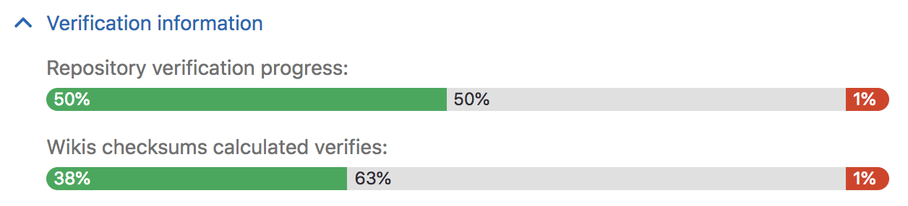
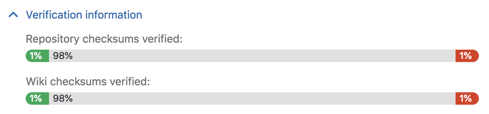

# Automatic background verification **[PREMIUM ONLY]**

NOTE: **Note:**
Automatic background verification of repositories and wikis was added in GitLab
EE 10.6, but is disabled by default. To enable it, run
`sudo gitlab-rails runner 'Feature.enable(:geo_repository_verification)'` on
the **primary**. Until [issue #5699][ee-5699] is completed, we need to reset
the cache for this feature flag on each **secondary**, to do this run
 `sudo gitlab-rails runner 'Rails.cache.expire('flipper/v1/feature/geo_repository_verification', 0)'`.

Automatic backgorund verification ensures that the transferred data matches a
calculated checksum, proving that the content on the **secondary** matches that
on the **primary**. Following a planned failover, any corrupted data may be
**lost**, depending on the extent of the corruption.

If verification fails on the **primary**, this indicates that Geo is
successfully replicating a corrupted object; restore it from backup or remove it
it from the primary to resolve the issue.

If verification succeeds on the **primary** but fails on the **secondary**, this
indicates that the object was corrupted during the replication process. Until
[issue #5195][ee-5195] is implemented, Geo won't automatically resolve
verification failures of this kind, so you should remove the registry entries to
force Geo to re-replicate the files:

```
sudo gitlab-rails runner 'Geo::ProjectRegistry.verification_failed.delete_all'
```

If verification is lagging significantly behind replication, consider giving
the node more time before scheduling a planned failover.

# Repository verification

Visit the **Admin Area ➔ Geo nodes** dashboard on the **primary** and expand
the **Verification information** tab for that node to view automatic checksumming
status for repositories and wikis. Successes are shown in green, pending work
in grey, and failures in red.



Visit the **Admin Area ➔ Geo nodes** dashboard on the **secondary** and expand
the **Verification information** tab for that node to view automatic verifcation
status for repositories and wikis. As with checksumming, successes are shown in
green, pending work in grey, and failures in red.



# Using checksums to compare Geo nodes

To check the health of Geo secondary nodes, we use a checksum over the list of
Git references and theirs values. Right now the checksum only includes `heads`
and `tags`. We should include all references ([issue #5196][ee-5196]), including
GitLab-specific references to ensure true consistency. If two nodes have the
same checksum, then they definitely hold the same data. We compute the checksum
for every node after every update to make sure that they are all in sync.

# Current limitations

Until [issue #5064][ee-5064] is completed, background verification doesn't cover
CI job artifacts and traces, LFS objects, or user uploads in file storage.
Verifytheir integrity manually by following [these instructions][foreground-verification]
on both nodes, and comparing the output between them.

Data in object storage is **not verified**, as the object store is responsible
for ensuring the integrity of the data.

[disaster-recovery]: index.md
[foreground-verification]: ../../raketasks/check.md
[ee-5699]: https://gitlab.com/gitlab-org/gitlab-ee/issues/5699
[ee-5195]: https://gitlab.com/gitlab-org/gitlab-ee/issues/5195
[ee-5196]: https://gitlab.com/gitlab-org/gitlab-ee/issues/5196
