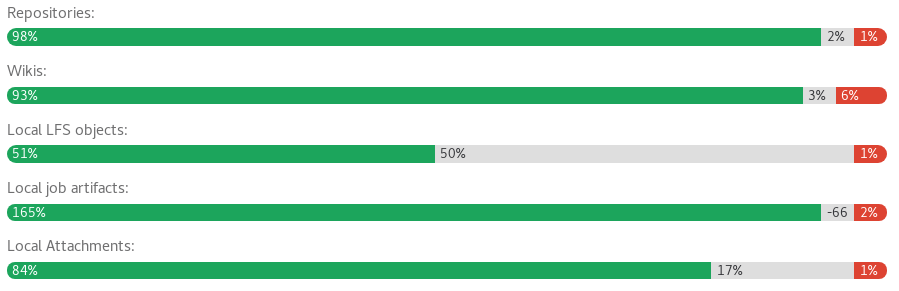
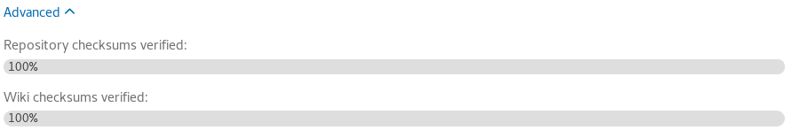

# Disaster recovery for planned failover

The primary use-case of Disaster Recovery is to ensure business continuity in
the event of unplanned outage, but it can be used in conjunction with a planned
failover to migrate your GitLab instance between regions without extended
downtime.

As replication between Geo nodes is asynchronous, a planned failover requires
a maintenance window in which updates to the **primary node** are blocked. The
length of this window is determined by your replication capacity - once the
secondary is completely in sync with the primary, the failover can occur without
data loss.

This document assumes you already have a fully configured, working Geo setup.
Please read it and the [Disaster Recovery][disaster-recovery] failover
documentation in full before proceeding.  Planned failover is a major operation,
and if performed incorrectly, there is a high risk of data loss. Consider
rehearsing the procedure until you are comfortable with the necessary steps and
have a high degree of confidence in being able to perfom them accurately.

## Not all data is automatically replicated

If you are using any GitLab features that Geo [doesn't support][limitations],
you must make separate provisions to ensure that the secondary node has an
up-to-date copy of any data associated with that feature. This may extend the
required scheduled maintenance period significantly.

A common strategy for keeping this period as short as possible for data stored
in files is to use `rsync` to transfer the data. An initial `rsync` can be
performed ahead of the maintenance window; subsequent `rsync`s (including a
final transfer inside the maintenance window) will then transfer only the
*changes* between primary and secondary.

Repository-centric strategies for using `rsync` effectively can be found in the
[moving repositories][moving-repositories] documentation; these strategies can
be adapted for use with any other file-based data, such as GitLab Pages (to
be found in `/var/opt/gitlab/gitlab-rails/shared/pages` if using Omnibus).

## Pre-flight checks

Follow these steps before scheduling a planned failover to ensure the process
will go smoothly.

### Object storage

Some classes of non-repository data can use object storage in preference to
file storage. Geo [does not replicate data in object storage](../replication/object_storage.md),
leaving that task up to the object store itself. For a planned failover, this
means you can decouple the replication of this data from the failover of the
GitLab service.

If you're already using object storage, simply verify that your **secondary**
has access to the same data as the **primary** - they must either they share the
same object storage configuration, or the **secondary** should be configured to
access a [geographically-replicated][os-repl] copy provided by the object store
itself.

If you have a large GitLab installation or cannot tolerate downtime, consider
[migrating to Object Storage][os-conf] **before** scheduling a planned failover.
Doing so reduces both the length of the maintenance window, and the risk of data
loss as a result of a poorly executed planned failover.

### Review the configuration of the secondary

Database settings are automatically replicated to the secondary, but the
`/etc/gitlab/gitlab.rb` file must be set up manually, and differs between
nodes. If features such as Mattermost, OAuth or LDAP integration are enabled
on the primary but not the secondary, they will be lost during failover.

Review the `/etc/gitlab/gitlab.rb` file for both nodes and ensure the secondary
supports everything the primary does **before** scheduling a planned failover.

### Run system checks

Run the following on both primary and secondary nodes:

```
gitlab-rake gitlab:check
gitlab-rake gitlab:geo:check
```

If any failures are reported on either node, they should be resolved **before**
scheduling a planned failover.

### Check that secrets match between nodes

The SSH host keys and `/etc/gitlab/gitlab-secrets.json` files should be
identical on all nodes. Check this by running the following on all nodes and
comparing the output:

```
sudo sha256sum /etc/ssh/ssh_host* /etc/gitlab/gitlab-secrets.json
```

If any files differ, replace the content on the **secondary** with the
content on the **primary**.

### Ensure Geo replication is up-to-date

The maintenance window won't end until Geo replication and verification is
completely finished. To keep the window as short as possible, you should
ensure these processes are close to 100% as possible during active use.

Visit the **Admin Area ➔ Geo nodes** dashboard on the **secondary** node to
review status. Replicated objects (shown in green) should be close to 100%,
and there should be no failures (shown in red). If a large proportion of
objects aren't yet replicated (shown in grey), consider giving the node more
time to complete



If any objects are failing to replicate, this should be investigated before
scheduling the maintenance window. Following a planned failover, anything that
failed to replicate will be **lost**.

You can use the [Geo status API][geo-status-api] to review failed objects and
the reasons for failure.

A common cause of replication failures is the data being missing on the
**primary** - you can resolve these failures by restoring the data from backup,
or removing references to the missing data.

### Verify the integrity of replicated data

NOTE: **Note:**
Automatic background verification of repositories and wikis was added in GitLab
EE 10.6, but is disabled by default. To enable it, run
`sudo gitlab-rails runner 'Feature.enable(:geo_repository_verification)'` on
the **primary**.

Visit the **Admin Area ➔ Geo nodes** dashboard on the **secondary** and expand
the **Advanced** tab for that node to view automatic checksumming status for
repositories and wikis. As with replication, successes are shown in green,
pending work in grey, and failures in red.



Until [issue #5064][ee-5064] is completed, background verification doesn't cover
CI job artifacts and traces, LFS objects, or user uploads in file storage.
Verifytheir integrity manually by following [these instructions][foreground-verification]
on both nodes, and comparing the output between them.

Verification ensures that the transferred data matches a calculated checksum,
proving that the content on the **secondary** matches that on the **primary**.
Following a planned failover, any corrupted data may be **lost**, depending on
the extent of the corruption.

Data in object storage is **not verified**, as the object store is responsible
for ensuring the integrity of the data.

If verification is lagging significantly behind replication, consider giving
the node more time before scheduling a planned failover.

If verification fails on the **primary**, this indicates that Geo is
successfully replicating a corrupted object; restore it from backup or remove it
it from the primary to resolve the issue.

If verification succeeds on the **primary** but fails on the **secondary**, this
indicates that the object was corrupted during the replication process. Until
[issue #5195][ee-5195] is implemented, Geo won't automatically resolve
verification failures of this kind, so you should remove the registry entries to
force Geo to re-replicate the files:

```
sudo gitlab-rails runner 'Geo::ProjectRegistry.verification_failed.delete_all'
```

### Notify users of scheduled maintenance

On the **primary**, navigate to **Admin Area ➔ Messages**, add a broadcast
message. You can check under **Admin Area ➔ Geo Nodes** to estimate how long it
will take to finish syncing. An example message would be:

> A scheduled maintenance will take place at XX:XX UTC. We expect it to take
  less than 1 hour.

## Prevent updates to the **primary**

Until a [read-only mode][ce-19739] is implemented, updates must be prevented
from happening manually. Note that your **secondary** still needs read-only
access to the primary for the duration of the maintenance window.

1. At the scheduled time, using your cloud provider or your node's firewall, block
   all HTTP, HTTPS and SSH traffic to/from the primary, **except** for your IP and
   the secondary's IP.
        
     For instance, if your secondary originates all its traffic from `5.6.7.8` and
     your IP is `100.0.0.1`, you might run the following commands on the server(s)
     making up your primary node:

     ```
     sudo iptables -A INPUT -p tcp -s 5.6.7.8 --destination-port 22 -j ACCEPT
     sudo iptables -A INPUT -p tcp -s 100.0.0.1 --destination-port 22 -j ACCEPT
     sudo iptables -A INPUT --destination-port 22 -j REJECT

     sudo iptables -A INPUT -p tcp -s 5.6.7.8 --destination-port 80 -j ACCEPT
     sudo iptables -A INPUT -p tcp -s 100.0.0.1 --destination-port 80 -j ACCEPT
     sudo iptables -A INPUT --tcp-dport 80 -j REJECT

     sudo iptables -A INPUT -p tcp -s 5.6.7.8 --destination-port 443 -j ACCEPT
     sudo iptables -A INPUT -p tcp -s 100.0.0.1 --destination-port 443 -j ACCEPT
     sudo iptables -A INPUT --tcp-dport 443 -j REJECT
     ```

     From this point, users will be unable to view their data or make changes on the
     **primary** node. They will also be unable to log in to the **secondary** node,
     but existing sessions will work for the remainder of the maintenance period, and
     public data will be accessible throughout.

1. Verify the primary is blocked to HTTP traffic by visiting it in browser via
   another IP. The server should refuse connection.

1. Verify the primary is blocked to Git over SSH traffic by attempting to pull an
   existing Git repository with an SSH remote URL. The server should refuse
   connection.

1. Disable non-Geo periodic background jobs on the primary node by navigating
   to **Admin Area ➔ Monitoring ➔ Background Jobs ➔ Cron** , pressing `Disable All`,
   and then pressing `Enable` for the `geo_sidekiq_cron_config_worker` cron job.
   This job will re-enable several other cron jobs that are essential for planned
   failover to complete successfully.

## Finish replicating and verifying all data

1. If you are manually replicating any data not managed by Geo, trigger the
   final replication process now.
1. On the **primary**, navigate to **Admin Area ➔ Monitoring ➔ Background Jobs ➔ Queues**
   and wait for all queues except those with `geo` in the name to drop to 0.
   These queues contain work that has been submitted by your users; failing over
   before it is completed will cause the work to be lost!
1. On the **primary**, navigate to **Admin Area ➔ Geo Nodes** and wait for the
   following conditions to be true of the **secondary** you are failing over to:
    * All replication meters to each 100% replicated, 0% failures
    * All verification meters reach 100% verified, 0% failures
    * Database replication lag is 0ms
    * The Geo log cursor is up to date (0 events behind)

1. On the **secondary**, navigate to **Admin Area > Monitoring ➔ Background Jobs ➔ Queues**
   and wait for all the `geo` queues to drop to 0 queued and 0 running jobs.
1. On the **secondary**, use [these instructions][foreground-verification]
   to verify the integrity of CI artifacts, LFS objects and uploads in file
   storage.

At this point, your secondary will contain an up-to-date copy of everything the
primary has, meaning nothing will be lost when you fail over.

## Promote the secondary

Finally, follow the [Disaster Recovery docs][disaster-recovery] to promote the
secondary to a primary. This process will cause a brief outage on the secondary,
and users may need to log in again.

Once it is completed, the maintenance window is over! Your new primary will now
begin to diverge from the old one. If problems do arise at this point, failing
back to the old primary [is possible][bring-primary-back], but likely to result
in the loss of any data uploaded to the new primary in the meantime.

Don't forget to remove the broadcast message after failover is complete.

[bring-primary-back]: bring_primary_back.md
[ce-19739]: https://gitlab.com/gitlab-org/gitlab-ce/issues/19739
[container-registry]: ../replication/container_registry.md
[disaster-recovery]: index.md
[ee-4930]: https://gitlab.com/gitlab-org/gitlab-ee/issues/4930
[ee-5064]: https://gitlab.com/gitlab-org/gitlab-ee/issues/5064
[ee-5195]: https://gitlab.com/gitlab-org/gitlab-ee/issues/5195
[foreground-verification]: ../../raketasks/check.md
[geo-status-api]: ../../../api/geo_nodes.html#retrieve-project-sync-failures-ocurred-on-the-current-node
[limitations]: ../replication/index.md#current-limitations
[moving-repositories]: ../../operations/moving_repositories.md
[os-conf]: ../replication/object_storage.md#configuration
[os-repl]: ../replication/object_storage.md#replication
