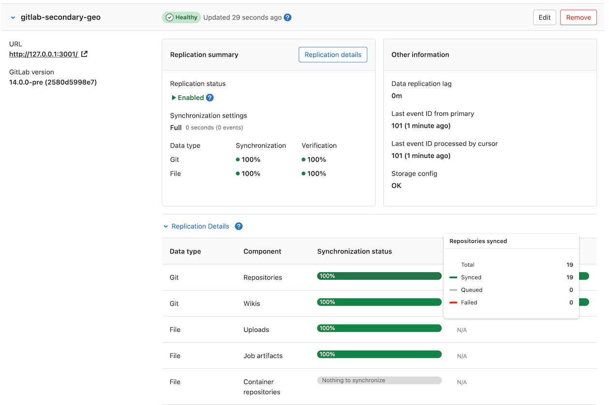



- Tier: Premium, Ultimate
- Offering: GitLab Self-Managed



The primary use case of Disaster Recovery is to ensure business continuity in
the event of unplanned outage, but it can be used in conjunction with a planned
failover to migrate your GitLab instance between regions without extended
downtime.

Replication between Geo sites is asynchronous, so a planned failover requires a maintenance window
in which updates to the primary site are blocked. The length of this window depends on how long
it takes to fully synchronize the secondary site with the primary site. When synchronization is
complete, the failover can occur without data loss.

This document assumes you already have a fully configured, working Geo setup.
Read this document and the [Disaster Recovery](_index.md) failover
documentation in full before proceeding. Planned failover is a major operation,
and if performed incorrectly, there is a high risk of data loss.
Rehearse the procedure until you are comfortable with the necessary steps, and
have a high degree of confidence you can perform them accurately.

## Recommendations for failover

Following these recommendations helps ensure a smooth failover process
and reduce the risk of data loss or extended downtime.

### Resolve sync and verification failures

If there are **Failed** or **Queued** items during [preflight checks](#preflight-checks) (either manual validation
or when running `gitlab-ctl promotion-preflight-checks`), the failover is blocked until these are either:

- Resolved: Successfully synced (by hand-copying to secondary if necessary) and verified.
- Documented as acceptable: With clear justification such as:
  - Manual checksum comparison passes for these specific failures.
  - Repositories are deprecated, and can be excluded.
  - Items are identified as non-critical, and can be copied after the failover.

For help diagnosing sync and verification failures, see
[Troubleshooting Geo synchronization and verification errors](../replication/troubleshooting/synchronization_verification.md).

### Plan for data integrity resolution

Allow 4-6 weeks before failover completion to resolve data integrity issues
that commonly surface after setting up Geo replication for the first time. These can include
orphaned database records or inconsistent file references.
For guidance, see [Troubleshooting common Geo errors](../replication/troubleshooting/common.md).

Start addressing sync issues early to avoid tough decisions during the maintenance window:

1. 4-6 weeks before: Identify and begin resolving outstanding sync problems.
1. 1 week before: Target resolution or documentation of all remaining sync problems.
1. 1-2 days before: Resolve any new failures.
1. Hours before: Last check for any new failures.

To ensure success: create clear criteria for when to abort the failover
due to unresolved sync errors.

### Test backup timing in Geo environments



Backups from Geo replica databases might be canceled during active database transactions.



Test backup procedures ahead of time and consider these strategies:

- Take backups directly from the primary site. This might affect performance.
- Use a dedicated read replica that can be isolated from replication during backups.
- Schedule backups during low-activity periods.

### Prepare comprehensive fallback procedures



Plan the rollback decision points before promotion completes, as falling back afterwards might result in data loss.



Document specific steps to revert to the original primary, including:

- Decision criteria for when to abort the failover.
- DNS reversion procedures.
- Process to re-enable the original primary. See [Bring a demoted primary site back online](bring_primary_back.md).
- User communication plan.

### Develop a failover runbook in a staging environment

To ensure success, practice and document this highly-manual task in full detail:

1. Provision a production-like environment if you don't already have one.
1. Smoke test. For example, add groups, add projects, add a Runner, use `git push`, add images to an issue.
1. Fail over to secondary site.
1. Run a smoke test. Look for problems.
1. During these steps, write down every action taken, the actor, expected results, links to resources.
1. Repeat as needed to refine the runbook and scripts.

## Not all data is automatically replicated

If you are using any GitLab features that Geo doesn't support,
you must make separate provisions to ensure that the secondary site has an
up-to-date copy of any data associated with that feature. This might significantly
extend the maintenance period. For a list of features supported by Geo, see
the [replicated data types table](../replication/datatypes.md#replicated-data-types).

A common strategy for keeping this period as short as possible for data stored
in files is to use `rsync` to transfer the data. An initial `rsync` can be
performed ahead of the maintenance window. Later `rsync` procedures, including a
final transfer inside the maintenance window, then transfer only the
changes between the primary site and the secondary sites.

For Git repository-centric strategies for using `rsync` effectively, see
[moving repositories](../../operations/moving_repositories.md). These strategies can
be adapted for use with any other file-based data.

### Container registry

By default, the container registry is not automatically replicated to secondary
sites. This needs to be manually configured. For more information, see
[container registry for a secondary site](../replication/container_registry.md).

If you use local storage on your current primary site for the container
registry, you can `rsync` the container registry objects to the secondary
site you are about to fail over to:

```shell
# Run from the secondary site
rsync --archive --perms --delete root@<geo-primary>:/var/opt/gitlab/gitlab-rails/shared/registry/. /var/opt/gitlab/gitlab-rails/shared/registry
```

Alternatively, [back up](../../backup_restore/_index.md#back-up-gitlab)
the container registry on the primary site and restore it onto the secondary
site:

1. On your primary site, back up only the registry and
   [exclude specific directories from the backup](../../backup_restore/backup_gitlab.md#excluding-specific-data-from-the-backup):

   ```shell
   # Create a backup in the /var/opt/gitlab/backups folder
   sudo gitlab-backup create SKIP=db,uploads,builds,artifacts,lfs,terraform_state,pages,repositories,packages
   ```

1. Copy the backup tarball generated from your primary site to the `/var/opt/gitlab/backups` folder
   on your secondary site.

1. On your secondary site, restore the registry following the
   [Restore GitLab](../../backup_restore/_index.md#restore-gitlab) documentation.

### Recover data for advanced search

Advanced search is powered by Elasticsearch or OpenSearch.
The data for advanced search is not automatically replicated to secondary sites.

To recover data for advanced search on the newly promoted primary site:





1. Disable search with Elasticsearch:

   ```shell
   sudo gitlab-rake gitlab:elastic:disable_search_with_elasticsearch
   ```

1. [Reindex the entire instance](../../../integration/advanced_search/elasticsearch.md#index-the-instance).
1. [Check indexing status](../../../integration/advanced_search/elasticsearch.md#check-indexing-status).
1. [Monitor the status of background jobs](../../../integration/advanced_search/elasticsearch.md#monitor-the-status-of-background-jobs).
1. Enable search with Elasticsearch:

   ```shell
   sudo gitlab-rake gitlab:elastic:enable_search_with_elasticsearch
   ```





1. Disable search with Elasticsearch:

   ```shell
   sudo gitlab-rake gitlab:elastic:disable_search_with_elasticsearch
   ```

1. Pause indexing and wait five minutes for ongoing tasks to complete:

   ```shell
   sudo gitlab-rake gitlab:elastic:pause_indexing
   ```

1. Reindex the instance from scratch:

   ```shell
   sudo gitlab-rake gitlab:elastic:index
   ```

1. Resume indexing:

   ```shell
   sudo gitlab-rake gitlab:elastic:resume_indexing
   ```

1. [Check indexing status](../../../integration/advanced_search/elasticsearch.md#check-indexing-status).
1. [Monitor the status of background jobs](../../../integration/advanced_search/elasticsearch.md#monitor-the-status-of-background-jobs).
1. Enable search with Elasticsearch:

   ```shell
   sudo gitlab-rake gitlab:elastic:enable_search_with_elasticsearch
   ```





## Preflight checks

Before scheduling your planned failover, ensure the process goes smoothly by verifying these preflight checks.
Each step is described in more detail below.

During the actual failover process, after the primary site is down, run this command to perform
final validation checks before promoting the secondary:

```shell
gitlab-ctl promotion-preflight-checks
```

The `gitlab-ctl promotion-preflight-checks` command is part of the failover process and requires the
primary site to be down. You can't use it as a pre-maintenance validation tool while the primary is
still running. When you run this command, a prompt asks you if the primary site is down. If you answer
`No`, this error is shown: `ERROR: primary node must be down`.

For pre-maintenance validation while the primary is still operational, use the manual checks below.

### DNS TTL

If you plan to [update the primary domain DNS record](_index.md#step-4-optional-updating-the-primary-domain-dns-record),
consider setting a low TTL (time-to-live) to ensure fast propagation of DNS changes.

### Object storage

If you have a large GitLab installation or cannot tolerate downtime, consider
[migrating to Object Storage](../replication/object_storage.md) before scheduling a planned failover.
Doing so reduces both the length of the maintenance window, and the risk of data
loss as a result of a poorly executed planned failover.

If you want GitLab to manage the replication of object storage for
secondary sites, see [Object Storage replication](../replication/object_storage.md).

### Review the configuration of each secondary site

Database settings are automatically replicated to the secondary site. However, you must set up the
`/etc/gitlab/gitlab.rb` file manually, and it differs between sites. If features such as Mattermost,
OAuth or LDAP integration are enabled on the primary site but not the secondary site, they are lost during failover.

Review the `/etc/gitlab/gitlab.rb` file for both sites. Ensure the secondary site
supports everything the primary site does before scheduling a planned failover. 
Make sure that [GitLab Geo Roles](https://docs.gitlab.com/omnibus/roles/#gitlab-geo-roles) are configured correctly.

### Run system checks

Run the following on both primary and secondary sites:

```shell
gitlab-rake gitlab:check
gitlab-rake gitlab:geo:check
```

If either site reports any failures, resolve them before scheduling a planned failover.

### Check that secrets and SSH host keys match between nodes

The SSH host keys and `/etc/gitlab/gitlab-secrets.json` files should be
identical on all nodes. Check this by running the following on all nodes and
comparing the output:

```shell
sudo sha256sum /etc/ssh/sshhost /etc/gitlab/gitlab-secrets.json
```

If any files differ,
[manually replicate GitLab secrets](../replication/configuration.md#step-1-manually-replicate-secret-gitlab-values) and
[replicate SSH host keys](../replication/configuration.md#step-2-manually-replicate-the-primary-sites-ssh-host-keys)
to the secondary site as necessary.

### Check that the correct certificates are installed for HTTPS

This step can be safely skipped if the primary site and all external sites accessed by the primary site
use public CA-issued certificates.

You should install the correct certificates on the secondary site if either:

- The primary site uses custom or self-signed TLS certificates to secure inbound connections.
- The primary site connects to external services that use custom or self-signed certificates.

For more information, see
[using custom certificates](../replication/configuration.md#step-4-optional-using-custom-certificates)
with secondary sites.

### Ensure Geo replication is up-to-date

The maintenance window does not end until Geo replication and verification is
completely finished. To keep the window as short as possible, you should
ensure these processes are close to 100% as possible during active use.

On the secondary site:

1. On the left sidebar, at the bottom, select **Admin**.
1. Select **Geo** > **Sites**.
   Replicated objects (shown in green) should be close to 100%,
   and there should be no failures (shown in red). If a large proportion of
   objects aren't yet replicated (shown in gray), consider giving the site more
   time to complete:

   

If objects fail to replicate, investigate before scheduling the maintenance window.
Any objects that fail to replicate are lost after a planned failover.

A common cause of replication failures is the data being missing on the
primary site. To resolve these failures, either:

- Restore the data from backup.
- Remove references to the missing data.

### Verify the integrity of replicated data

Ensure that verification is complete before proceeding with failover. Any corrupted data
that fails verification may be lost during failover.

For more information, see [automatic background verification](background_verification.md).

### Notify users of scheduled maintenance

On the primary site:

1. On the left sidebar, at the bottom, select **Admin**.
1. Select **Messages**.
1. Add a message notifying users on the maintenance window. To estimate the time needed to finish
   syncing, go to **Geo** > **Sites**.
1. Select **Add broadcast message**.

### Runner connectivity during failover

Depending on how your instance URL is configured, there might be additional steps to keep your runner fleet
at 100% after the failover.

The token used to register runners should work on the primary or secondary instances. If you see
connection issues after failover, it is possible that the secrets were not copied over during the
[secondary configuration](../setup/two_single_node_sites.md#manually-replicate-secret-gitlab-values).
You can [reset runner tokens](../../backup_restore/troubleshooting_backup_gitlab.md#reset-runner-registration-tokens),
however, be aware that you might experience other issues unrelated to runners, if secrets are not in sync.

If a runner is repeatedly unable to connect to a GitLab instance, it stops trying to connect for a
period of time. By default, this period is 1 hour. To avoid this, shut down the runners until
the GitLab instance is reachable. See
[the `check_interval` documentation](https://docs.gitlab.com/runner/configuration/advanced-configuration.html#how-check_interval-works),
and the configuration options `unhealthy_requests_limit` and `unhealthy_interval`.

- If you use our **Location aware URL**: After the old primary is removed from the DNS configuration,
  runners should automatically connect to the next closest instance.
- If you use separate URLs: Any runner connected to the current primary should be updated
  to connect to the new primary, once it is promoted.
- If you have any runners connected to your current secondary: See
  [how to handle secondary runners](../secondary_proxy/runners.md#handling-a-planned-failover-with-secondary-runners)
  during the failover.

## Prevent updates to the primary site

To ensure that all data replicates to a secondary site, disable updates (write requests)
on the primary site to give the secondary site time to catch up:

1. Enable [maintenance mode](../../maintenance_mode/_index.md) on the primary site.
1. On the left sidebar, at the bottom, select **Admin**.
1. Select **Monitoring** > **Background jobs**.
1. On the Sidekiq dashboard, select **Cron**.
1. Select `Disable All` to disable non-Geo periodic background jobs.
1. Select `Enable` for these cron jobs:

   - `geo_metrics_update_worker`
   - `geo_prune_event_log_worker`
   - `geo_verification_cron_worker`
   - `repository_check_worker`

   Re-enabling these cron jobs is essential for the planned failover to complete successfully.

## Finish replicating and verifying all data

1. If you are manually replicating any data not managed by Geo, trigger the
   final replication process now.
1. On the primary site:
   1. On the left sidebar, at the bottom, select **Admin**.
   1. On the left sidebar, select **Monitoring** > **Background jobs**.
   1. On the Sidekiq dashboard, select **Queues**. Wait for all queues, except
      those with `geo` in the name, to drop to 0.
      These queues contain work submitted by your users. Failing over
      before the queues empty causes the work to be lost.
   1. On the left sidebar, select **Geo** > **Sites**. Wait for the
      following conditions to be true of the secondary site you are failing over to:

      - All replication meters reach 100% replicated, and 0% failures.
      - All verification meters reach 100% verified, and 0% failures.
      - Database replication lag is 0 ms.
      - The Geo log cursor is up to date (0 events behind).

1. On the secondary site:
   1. On the left sidebar, at the bottom, select **Admin**.
   1. On the left sidebar, select **Monitoring** > **Background jobs**.
   1. On the Sidekiq dashboard, select **Queues**. Wait for all the `geo`
      queues to drop to 0 queued and 0 running jobs.
   1. [Run an integrity check](../../raketasks/check.md) to verify the integrity
      of CI artifacts, LFS objects, and uploads in file storage.

At this point, your secondary site contains an up-to-date copy of everything the
primary site has, ensuring no data loss when you fail over.

## Promote the secondary site

After the replication finishes, [promote the secondary site to a primary site](_index.md).
This process causes a brief outage on the secondary site, and users might need to sign in again. If you
follow the steps correctly, the old primary Geo site is disabled, and user traffic flows to the
newly-promoted site instead.

When the promotion completes, the maintenance window is over, and your new primary site now
begins to diverge from the old one. If problems occur at this point, [failing back](bring_primary_back.md)
back to the old primary site is possible, but likely to result
in the loss of any data uploaded to the new primary in the meantime.

Don't forget to remove the broadcast message after the failover is complete.

Finally, bring the
[old site back as a secondary](bring_primary_back.md#configure-the-former-primary-site-to-be-a-secondary-site).
