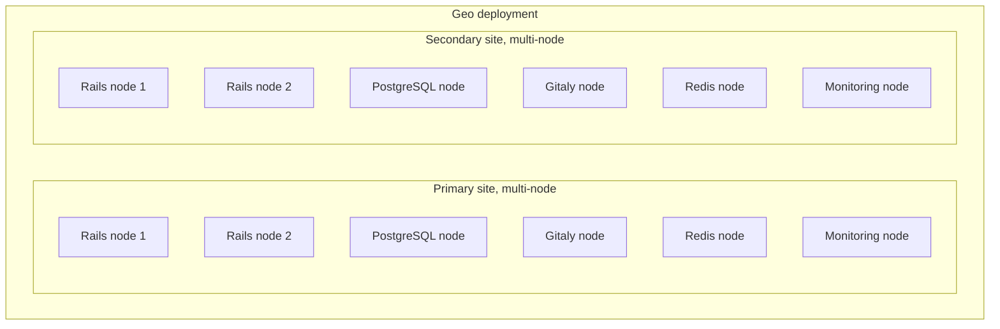

DETAILS:
**Tier:** Premium, Ultimate
**Offering:** GitLab Self-Managed
**Status:** Experiment

Disaster Recovery (Geo) promotion runbooks.

WARNING:
This runbook is an [experiment](../../../../policy/development_stages_support.md#experiment). For complete, production-ready documentation, see the
[disaster recovery documentation](../_index.md).

## Geo planned failover for a multi-node configuration

| Component   | Configuration                |
|:------------|:-----------------------------|
| PostgreSQL  | Managed by the Linux package |
| Geo site    | Multi-node                   |
| Secondaries | One                          |

This runbook guides you through a planned failover of a multi-node Geo site
with one secondary. The following [40 RPS / 2,000 user reference architecture](../../../reference_architectures/2k_users.md) is assumed:



The load balancer node and optional NFS server are omitted for clarity.

This guide results in the following:

1. An offline primary.
1. A promoted secondary that is now the new primary.

What is not covered:

1. Re-adding the old **primary** as a secondary.
1. Adding a new secondary.

### Preparation

NOTE:
Before following any of those steps, make sure you have `root` access to the
**secondary** to promote it, because there isn't provided an automated way to
promote a Geo replica and perform a failover.

On the **secondary** site:

1. On the left sidebar, at the bottom, select **Admin**.
1. Select **Geo > Sites** to see its status.
   Replicated objects (shown in green) should be close to 100%,
   and there should be no failures (shown in red). If a large proportion of
   objects aren't replicated (shown in gray), consider giving the site more
   time to complete.

   

If any objects are failing to replicate, this should be investigated before
scheduling the maintenance window. After a planned failover, anything that
failed to replicate is **lost**.

A common cause of replication failures is data that is missing on the
**primary** site - you can resolve these failures by restoring the data from backup,
or removing references to the missing data.

The maintenance window doesn't end until Geo replication and verification is
completely finished. To keep the window as short as possible, you should
ensure these processes are close to 100% as possible during active use.

If the **secondary** site is still replicating data from the **primary** site,
follow these steps to avoid unnecessary data loss:

1. Enable [maintenance mode](../../../maintenance_mode/_index.md) on the **primary** site,
   and make sure to stop any [background jobs](../../../maintenance_mode/_index.md#background-jobs).
1. Finish replicating and verifying all data:

   WARNING:
   Not all data is automatically replicated. Read more about
   [what is excluded](../planned_failover.md#not-all-data-is-automatically-replicated).

   1. If you are manually replicating any
      [data not managed by Geo](../../replication/datatypes.md#replicated-data-types),
      trigger the final replication process now.
   1. On the **primary** site:
      1. On the left sidebar, at the bottom, select **Admin**.
      1. On the left sidebar, select **Monitoring > Background jobs**.
      1. On the Sidekiq dashboard, select **Queues**, and wait for all queues except
         those with `geo` in the name to drop to 0.
         These queues contain work that has been submitted by your users; failing over
         before it is completed, causes the work to be lost.
      1. On the left sidebar, select **Geo > Sites** and wait for the
         following conditions to be true of the **secondary** site you are failing over to:

         - All replication meters reach 100% replicated, 0% failures.
         - All verification meters reach 100% verified, 0% failures.
         - Database replication lag is 0 ms.
         - The Geo log cursor is up to date (0 events behind).

   1. On the **secondary** site:
      1. On the left sidebar, at the bottom, select **Admin**.
      1. On the left sidebar, select **Monitoring > Background jobs**.
      1. On the Sidekiq dashboard, select **Queues**, and wait for all the `geo`
         queues to drop to 0 queued and 0 running jobs.
      1. [Run an integrity check](../../../raketasks/check.md) to verify the integrity
         of CI artifacts, LFS objects, and uploads in file storage.

   At this point, your **secondary** site contains an up-to-date copy of everything the
   **primary** site has, meaning nothing is lost when you fail over.

1. In this final step, you must permanently disable the **primary** site.

   WARNING:
   When the **primary** site goes offline, there may be data saved on the **primary** site
   that has not been replicated to the **secondary** site. This data should be treated
   as lost if you proceed.

   NOTE:
   If you plan to [update the **primary** domain DNS record](../_index.md#step-4-optional-updating-the-primary-domain-dns-record),
   you may wish to lower the TTL now to speed up propagation.

   When performing a failover, we want to avoid a split-brain situation where
   writes can occur in two different GitLab instances. So to prepare for the
   failover, you must disable the **primary** site:

   - If you have SSH access to the **primary** site, stop and disable GitLab:

     ```shell
     sudo gitlab-ctl stop
     ```

     Prevent GitLab from starting up again if the server unexpectedly reboots:

     ```shell
     sudo systemctl disable gitlab-runsvdir
     ```

     NOTE:
     (**CentOS only**) In CentOS 6 or older, it is challenging to prevent GitLab from being
     started if the machine reboots isn't available (see [issue 3058](https://gitlab.com/gitlab-org/omnibus-gitlab/-/issues/3058)).
     It may be safest to uninstall the GitLab package completely with `sudo yum remove gitlab-ee`.

     NOTE:
     (**Ubuntu 14.04 LTS**) If you are using an older version of Ubuntu
     or any other distribution based on the Upstart init system, you can prevent GitLab
     from starting if the machine reboots as `root` with
     `initctl stop gitlab-runsvvdir && echo 'manual' > /etc/init/gitlab-runsvdir.override && initctl reload-configuration`.

   - If you do not have SSH access to the **primary** site, take the machine offline and
     prevent it from rebooting. As there are many ways you may prefer to accomplish
     this, we avoid a single recommendation. You may have to:

     - Reconfigure the load balancers.
     - Change DNS records (for example, point the **primary** DNS record to the
       **secondary** site to stop using the **primary** site).
     - Stop the virtual servers.
     - Block traffic through a firewall.
     - Revoke object storage permissions from the **primary** site.
     - Physically disconnect a machine.

### Promoting the **secondary** site

1. SSH to every Sidekiq, PostgreSQL, and Gitaly node in the **secondary** site and run one of the following commands:

   - To promote the secondary site to primary:

     ```shell
     sudo gitlab-ctl geo promote
     ```

   - To promote the secondary site to primary **without any further confirmation**:

     ```shell
     sudo gitlab-ctl geo promote --force
     ```

1. SSH into each Rails node on your **secondary** site and run one of the following commands:

   - To promote the secondary site to primary:

     ```shell
     sudo gitlab-ctl geo promote
     ```

   - To promote the secondary site to primary **without any further confirmation**:

     ```shell
     sudo gitlab-ctl geo promote --force
     ```

1. Verify you can connect to the newly promoted **primary** site using the URL used
   previously for the **secondary** site.

1. If successful, the **secondary** site is now promoted to the **primary** site.

### Next steps

To regain geographic redundancy as quickly as possible, you should
[add a new **secondary** site](../../setup/_index.md). To
do that, you can re-add the old **primary** as a new secondary and bring it back
online.
