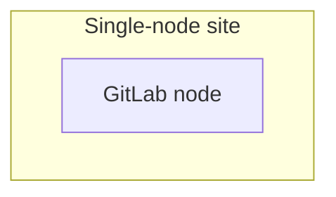
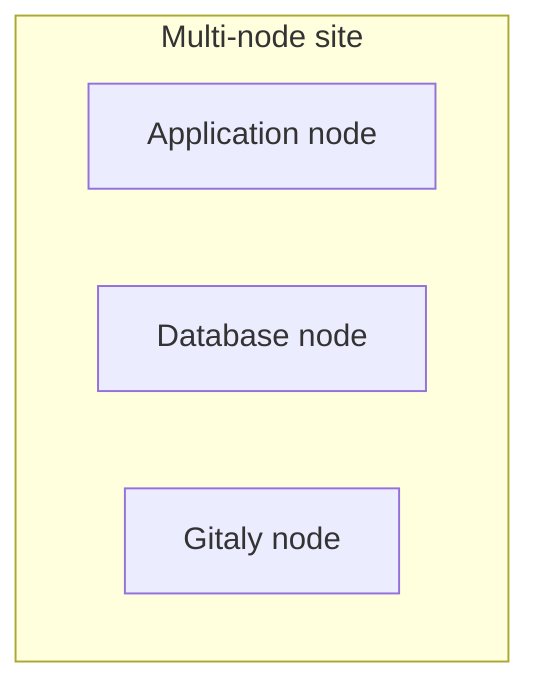
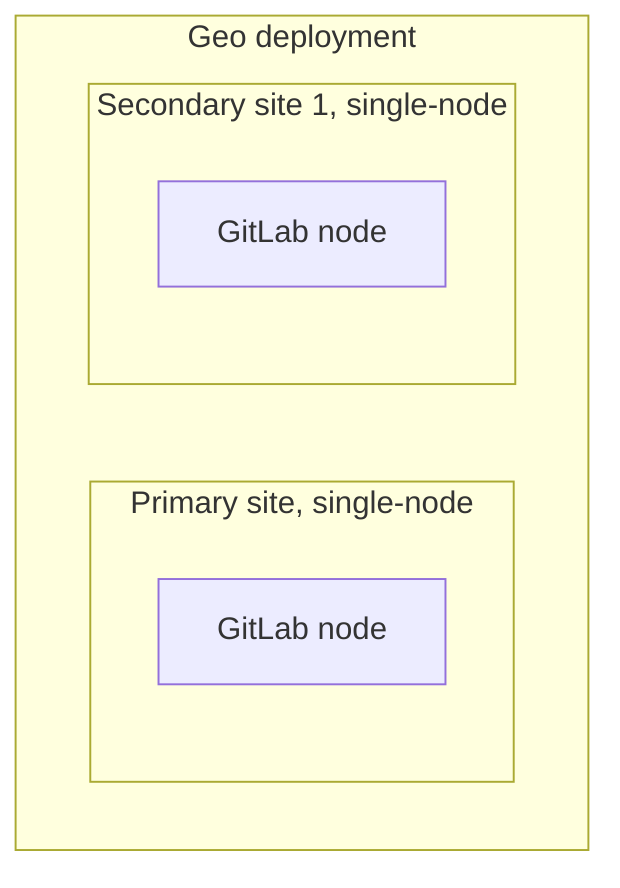
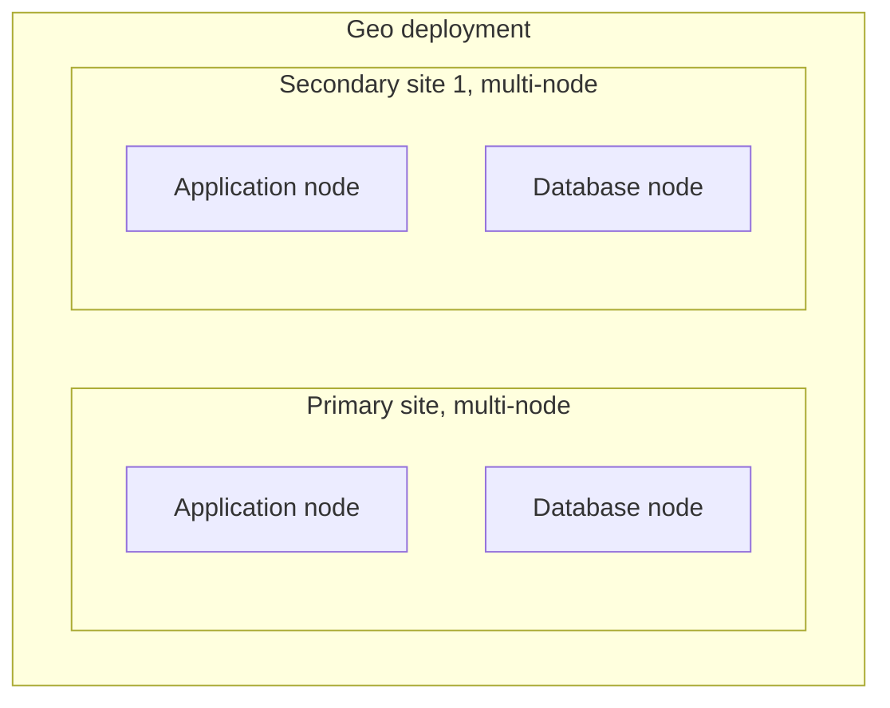
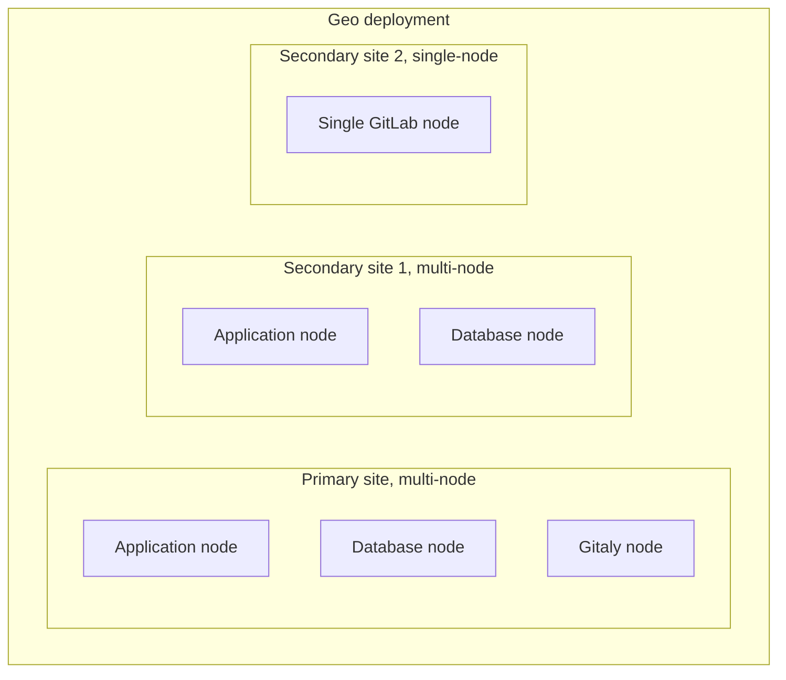

# Geo Glossary **(PREMIUM SELF)**

NOTE:
We are updating the Geo documentation, user interface and commands to reflect these changes. Not all pages comply with
these definitions yet.

 These are the defined terms to describe all aspects of Geo. Using a set of clearly
 defined terms helps us to communicate efficiently and avoids confusion. The language
 on this page aims to be [ubiquitous](https://about.gitlab.com/handbook/communication/#ubiquitous-language)
 and [as simple as possible](https://about.gitlab.com/handbook/communication/#simple-language).

 We provide example diagrams and statements to demonstrate correct usage of terms.

| Term                      | Definition                                                                                                                                                                             | Scope        | Discouraged synonyms                            |
|---------------------------|----------------------------------------------------------------------------------------------------------------------------------------------------------------------------------------|--------------|-------------------------------------------------|
| Node                      | An individual server that runs GitLab either with a specific role or as a whole (for example a Rails application node). In a cloud context this can be a specific machine type.                 | GitLab       | instance, server                                |
| Site                      | One or a collection of nodes running a single GitLab application. A site can be single-node or multi-node.                                                                             | GitLab       | deployment, installation instance               |
| Single-node site          | A specific configuration of GitLab that uses exactly one node.                                                                                                                     | GitLab       | single-server, single-instance
| Multi-node site           | A specific configuration of GitLab that uses more than one node.                                                                                                                   | GitLab       | multi-server, multi-instance, high availability |
| Primary site              | A GitLab site that is configured to be read and writable. There can only be a single primary site.                                                                                     | Geo-specific | Geo deployment, Primary node                    |
| Secondary site(s)         | GitLab site that is configured to be read-only. There can be one or more secondary sites.                                                                                              | Geo-specific | Geo deployment, Secondary node                  |
| Geo deployment            | A collection of two or more GitLab sites with exactly one primary site being replicated by one or more secondary sites.                                                                | Geo-specific |                                                 |
| Reference architecture(s) | A [specified configuration of GitLab for a number of users](../reference_architectures/index.md), possibly including multiple nodes and multiple sites. | GitLab       |                                                 |
| Promoting                 | Changing the role of a site from secondary to primary.                                                                                                                                 | Geo-specific |                                                 |
| Demoting                  | Changing the role of a site from primary to secondary.                                                                                                                                 | Geo-specific |                                                 |
| Failover                  | The entire process that shifts users from a primary Site to a secondary site. This includes promoting a secondary, but contains other parts as well. For example, scheduling maintenance.       | Geo-specific |                                                 |

## Examples

### Single-node site

### Multi-node site

### Geo deployment - Single-node sites

This Geo deployment has a single-node primary site, a single-node secondary site:

### Geo deployment - Multi-node sites

This Geo deployment has a multi-node primary site, a multi-node secondary site:

### Geo deployment - Mixed sites

This Geo deployment has a multi-node primary site, a multi-node secondary site and another single-node secondary site:

