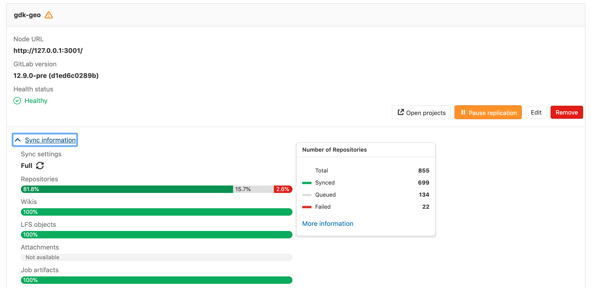

# Geo configuration **(PREMIUM ONLY)**

## Configuring a new **secondary** node

NOTE: **Note:**
This is the final step in setting up a **secondary** Geo node. Stages of the
setup process must be completed in the documented order.
Before attempting the steps in this stage, [complete all prior stages][setup-geo-omnibus].

The basic steps of configuring a **secondary** node are to:

- Replicate required configurations between the **primary** node and the **secondary** nodes.
- Configure a tracking database on each **secondary** node.
- Start GitLab on each **secondary** node.

You are encouraged to first read through all the steps before executing them
in your testing/production environment.

NOTE: **Note:**
**Do not** set up any custom authentication for the **secondary** nodes. This will be handled by the **primary** node.  
Any change that requires access to the **Admin Area** needs to be done in the
**primary** node because the **secondary** node is a read-only replica.

### Step 1. Manually replicate secret GitLab values

GitLab stores a number of secret values in the `/etc/gitlab/gitlab-secrets.json`
file which *must* be the same on all nodes. Until there is
a means of automatically replicating these between nodes (see issue [gitlab-org/gitlab-ee#3789]),
they must be manually replicated to the **secondary** node.

1. SSH into the **primary** node, and execute the command below:

   ```sh
   sudo cat /etc/gitlab/gitlab-secrets.json
   ```

   This will display the secrets that need to be replicated, in JSON format.

1. SSH into the **secondary** node and login as the `root` user:

   ```sh
   sudo -i
   ```

1. Make a backup of any existing secrets:

   ```sh
   mv /etc/gitlab/gitlab-secrets.json /etc/gitlab/gitlab-secrets.json.`date +%F`
   ```

1. Copy `/etc/gitlab/gitlab-secrets.json` from the **primary** node to the **secondary** node, or
   copy-and-paste the file contents between nodes:

   ```sh
   sudo editor /etc/gitlab/gitlab-secrets.json

   # paste the output of the `cat` command you ran on the primary
   # save and exit
   ```

1. Ensure the file permissions are correct:

   ```sh
   chown root:root /etc/gitlab/gitlab-secrets.json
   chmod 0600 /etc/gitlab/gitlab-secrets.json
   ```

1. Reconfigure the **secondary** node for the change to take effect:

   ```sh
   gitlab-ctl reconfigure
   gitlab-ctl restart
   ```

### Step 2. Manually replicate the **primary** node's SSH host keys

GitLab integrates with the system-installed SSH daemon, designating a user
(typically named git) through which all access requests are handled.

In a [Disaster Recovery] situation, GitLab system
administrators will promote a **secondary** node to the **primary** node. DNS records for the
**primary** domain should also be updated to point to the new **primary** node
(previously a **secondary** node). Doing so will avoid the need to update Git remotes and API URLs.

This will cause all SSH requests to the newly promoted **primary** node to
fail due to SSH host key mismatch. To prevent this, the primary SSH host
keys must be manually replicated to the **secondary** node.

1. SSH into the **secondary** node and login as the `root` user:

   ```sh
   sudo -i
   ```

1. Make a backup of any existing SSH host keys:

   ```sh
   find /etc/ssh -iname ssh_host_* -exec cp {} {}.backup.`date +%F` \;
   ```

1. Copy OpenSSH host keys from the **primary** node:

   If you can access your **primary** node using the **root** user:

   ```sh
   # Run this from the secondary node, change `<primary_node_fqdn>` for the IP or FQDN of the server
   scp root@<primary_node_fqdn>:/etc/ssh/ssh_host_*_key* /etc/ssh
   ```

   If you only have access through a user with **sudo** privileges:

   ```sh
   # Run this from your primary node:
   sudo tar --transform 's/.*\///g' -zcvf ~/geo-host-key.tar.gz /etc/ssh/ssh_host_*_key*

   # Run this from your secondary node:
   scp <user_with_sudo>@<primary_node_fqdn>:geo-host-key.tar.gz .
   tar zxvf ~/geo-host-key.tar.gz -C /etc/ssh
   ```

1. On your **secondary** node, ensure the file permissions are correct:

   ```sh
   chown root:root /etc/ssh/ssh_host_*_key*
   chmod 0600 /etc/ssh/ssh_host_*_key*
   ```

1. To verify key fingerprint matches, execute the following command on both nodes:

   ```sh
   for file in /etc/ssh/ssh_host_*_key; do ssh-keygen -lf $file; done
   ```

   You should get an output similar to this one and they should be identical on both nodes:

   ```sh
   1024 SHA256:FEZX2jQa2bcsd/fn/uxBzxhKdx4Imc4raXrHwsbtP0M root@serverhostname (DSA)
   256 SHA256:uw98R35Uf+fYEQ/UnJD9Br4NXUFPv7JAUln5uHlgSeY root@serverhostname (ECDSA)
   256 SHA256:sqOUWcraZQKd89y/QQv/iynPTOGQxcOTIXU/LsoPmnM root@serverhostname (ED25519)
   2048 SHA256:qwa+rgir2Oy86QI+PZi/QVR+MSmrdrpsuH7YyKknC+s root@serverhostname (RSA)
   ```

1. Verify that you have the correct public keys for the existing private keys:

   ```sh
   # This will print the fingerprint for private keys:
   for file in /etc/ssh/ssh_host_*_key; do ssh-keygen -lf $file; done

   # This will print the fingerprint for public keys:
   for file in /etc/ssh/ssh_host_*_key.pub; do ssh-keygen -lf $file; done
   ```

   NOTE: **Note:**
   The output for private keys and public keys command should generate the same fingerprint.

1. Restart sshd on your **secondary** node:

   ```sh
   # Debian or Ubuntu installations
   sudo service ssh reload

   # CentOS installations
   sudo service sshd reload
   ```

### Step 3. Add the **secondary** node

1. Visit the **primary** node's **Admin Area > Geo**
   (`/admin/geo/nodes`) in your browser.
1. Add the **secondary** node by providing its full URL. **Do NOT** check the
   **This is a primary node** checkbox.
1. Optionally, choose which groups or storage shards should be replicated by the
   **secondary** node. Leave blank to replicate all. Read more in
   [selective synchronization](#selective-synchronization).
1. Click the **Add node** button.
1. SSH into your GitLab **secondary** server and restart the services:

   ```sh
   gitlab-ctl restart
   ```

   Check if there are any common issue with your Geo setup by running:

   ```sh
   gitlab-rake gitlab:geo:check
   ```

1. SSH into your **primary** server and login as root to verify the
   **secondary** node is reachable or there are any common issue with your Geo setup:

   ```sh
   gitlab-rake gitlab:geo:check
   ```

Once added to the admin panel and restarted, the **secondary** node will automatically start
replicating missing data from the **primary** node in a process known as **backfill**.
Meanwhile, the **primary** node will start to notify each **secondary** node of any changes, so
that the **secondary** node can act on those notifications immediately.

Make sure the **secondary** node is running and accessible.
You can login to the **secondary** node with the same credentials as used for the **primary** node.

### Step 4. Enabling Hashed Storage

Using Hashed Storage significantly improves Geo replication. Project and group
renames no longer require synchronization between nodes.

1. Visit the **primary** node's **Admin Area > Settings > Repository**
   (`/admin/application_settings/repository`) in your browser.
1. In the **Repository storage** section, check **Use hashed storage paths for newly created and renamed projects**.

### Step 5. (Optional) Configuring the **secondary** node to trust the **primary** node

You can safely skip this step if your **primary** node uses a CA-issued HTTPS certificate.

If your **primary** node is using a self-signed certificate for *HTTPS* support, you will
need to add that certificate to the **secondary** node's trust store. Retrieve the
certificate from the **primary** node and follow
[these instructions][omnibus-ssl]
on the **secondary** node.

### Step 6. Enable Git access over HTTP/HTTPS

Geo synchronizes repositories over HTTP/HTTPS, and therefore requires this clone
method to be enabled. Navigate to **Admin Area > Settings**
(`/admin/application_settings`) on the **primary** node, and set
`Enabled Git access protocols` to `Both SSH and HTTP(S)` or `Only HTTP(S)`.

### Step 7. Verify proper functioning of the **secondary** node

Your **secondary** node is now configured!

You can login to the **secondary** node with the same credentials you used for the
**primary** node. Visit the **secondary** node's **Admin Area > Geo**
(`/admin/geo/nodes`) in your browser to check if it's correctly identified as a
**secondary** Geo node and if Geo is enabled.

The initial replication, or 'backfill', will probably still be in progress. You
can monitor the synchronization process on each geo node from the **primary**
node's Geo Nodes dashboard in your browser.



If your installation isn't working properly, check the
[troubleshooting document].

The two most obvious issues that can become apparent in the dashboard are:

1. Database replication not working well.
1. Instance to instance notification not working. In that case, it can be
   something of the following:
   - You are using a custom certificate or custom CA (see the [troubleshooting document](troubleshooting.md)).
   - The instance is firewalled (check your firewall rules).

Please note that disabling a **secondary** node will stop the synchronization process.

Please note that if `git_data_dirs` is customized on the **primary** node for multiple
repository shards you must duplicate the same configuration on each **secondary** node.

Point your users to the ["Using a Geo Server" guide][using-geo].

Currently, this is what is synced:

- Git repositories.
- Wikis.
- LFS objects.
- Issues, merge requests, snippets, and comment attachments.
- Users, groups, and project avatars.

## Selective synchronization

Geo supports selective synchronization, which allows admins to choose
which projects should be synchronized by **secondary** nodes.
A subset of projects can be chosen, either by group or by storage shard. The
former is ideal for replicating data belonging to a subset of users, while the
latter is more suited to progressively rolling out Geo to a large GitLab
instance.

It is important to note that selective synchronization:

1. Does not restrict permissions from **secondary** nodes.
1. Does not hide project metadata from **secondary** nodes.
   - Since Geo currently relies on PostgreSQL replication, all project metadata
     gets replicated to **secondary** nodes, but repositories that have not been
     selected will be empty.
1. Does not reduce the number of events generated for the Geo event log.
   - The **primary** node generates events as long as any **secondary** nodes are present.
     Selective synchronization restrictions are implemented on the **secondary** nodes,
     not the **primary** node.

## Upgrading Geo

See the [updating the Geo nodes document](updating_the_geo_nodes.md).

## Troubleshooting

See the [troubleshooting document](troubleshooting.md).

[setup-geo-omnibus]: index.md#using-omnibus-gitlab
[Hashed Storage]: ../../repository_storage_types.md
[Disaster Recovery]: ../disaster_recovery/index.md
[gitlab-org/gitlab-ee#3789]: https://gitlab.com/gitlab-org/gitlab-ee/issues/3789
[gitlab-com/infrastructure#2821]: https://gitlab.com/gitlab-com/infrastructure/issues/2821
[omnibus-ssl]: https://docs.gitlab.com/omnibus/settings/ssl.html
[using-geo]: using_a_geo_server.md
