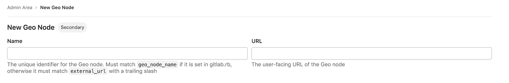

# Geo configuration **(PREMIUM SELF)**

## Configuring a new **secondary** site

NOTE:
This is the final step in setting up a **secondary** Geo site. Stages of the
setup process must be completed in the documented order.
Before attempting the steps in this stage, [complete all prior stages](../setup/index.md#using-omnibus-gitlab).

The basic steps of configuring a **secondary** site are to:

- Replicate required configurations between the **primary** site and the **secondary** sites.
- Configure a tracking database on each **secondary** site.
- Start GitLab on each **secondary** site.

You are encouraged to first read through all the steps before executing them
in your testing/production environment.

NOTE:
**Do not** set up any custom authentication for the **secondary** sites. This is handled by the **primary** site.
Any change that requires access to the **Admin Area** needs to be done in the
**primary** site because the **secondary** site is a read-only replica.

### Step 1. Manually replicate secret GitLab values

GitLab stores a number of secret values in the `/etc/gitlab/gitlab-secrets.json`
file which *must* be the same on all of a site's nodes. Until there is
a means of automatically replicating these between sites (see [issue #3789](https://gitlab.com/gitlab-org/gitlab/-/issues/3789)),
they must be manually replicated to **all nodes of the secondary site**.

1. SSH into a **Rails node on your primary** site, and execute the command below:

   ```shell
   sudo cat /etc/gitlab/gitlab-secrets.json
   ```

   This displays the secrets that need to be replicated, in JSON format.

1. SSH **into each node on your secondary Geo site** and login as the `root` user:

   ```shell
   sudo -i
   ```

1. Make a backup of any existing secrets:

   ```shell
   mv /etc/gitlab/gitlab-secrets.json /etc/gitlab/gitlab-secrets.json.`date +%F`
   ```

1. Copy `/etc/gitlab/gitlab-secrets.json` from the **Rails node on your primary** site to **each node on your secondary** site, or
   copy-and-paste the file contents between nodes:

   ```shell
   sudo editor /etc/gitlab/gitlab-secrets.json

   # paste the output of the `cat` command you ran on the primary
   # save and exit
   ```

1. Ensure the file permissions are correct:

   ```shell
   chown root:root /etc/gitlab/gitlab-secrets.json
   chmod 0600 /etc/gitlab/gitlab-secrets.json
   ```

1. Reconfigure **each Rails, Sidekiq and Gitaly nodes on your secondary** site for the change to take effect:

   ```shell
   gitlab-ctl reconfigure
   gitlab-ctl restart
   ```

### Step 2. Manually replicate the **primary** site's SSH host keys

GitLab integrates with the system-installed SSH daemon, designating a user
(typically named `git`) through which all access requests are handled.

In a [Disaster Recovery](../disaster_recovery/index.md) situation, GitLab system
administrators promote a **secondary** site to the **primary** site. DNS records for the
**primary** domain should also be updated to point to the new **primary** site
(previously a **secondary** site). Doing so avoids the need to update Git remotes and API URLs.

This causes all SSH requests to the newly promoted **primary** site to
fail due to SSH host key mismatch. To prevent this, the primary SSH host
keys must be manually replicated to the **secondary** site.

1. SSH into **each node on your secondary** site and login as the `root` user:

   ```shell
   sudo -i
   ```

1. Make a backup of any existing SSH host keys:

   ```shell
   find /etc/ssh -iname ssh_host_* -exec cp {} {}.backup.`date +%F` \;
   ```

1. Copy OpenSSH host keys from the **primary** site:

   If you can access one of the **nodes on your primary** site serving SSH traffic (usually, the main GitLab Rails application nodes) using the **root** user:

   ```shell
   # Run this from the secondary site, change `<primary_site_fqdn>` for the IP or FQDN of the server
   scp root@<primary_node_fqdn>:/etc/ssh/ssh_host_*_key* /etc/ssh
   ```

   If you only have access through a user with `sudo` privileges:

   ```shell
   # Run this from the node on your primary site:
   sudo tar --transform 's/.*\///g' -zcvf ~/geo-host-key.tar.gz /etc/ssh/ssh_host_*_key*

   # Run this on each node on your secondary site:
   scp <user_with_sudo>@<primary_site_fqdn>:geo-host-key.tar.gz .
   tar zxvf ~/geo-host-key.tar.gz -C /etc/ssh
   ```

1. On **each node on your secondary** site, ensure the file permissions are correct:

   ```shell
   chown root:root /etc/ssh/ssh_host_*_key*
   chmod 0600 /etc/ssh/ssh_host_*_key*
   ```

1. To verify key fingerprint matches, execute the following command on both primary and secondary nodes on each site:

   ```shell
   for file in /etc/ssh/ssh_host_*_key; do ssh-keygen -lf $file; done
   ```

   You should get an output similar to this one and they should be identical on both nodes:

   ```shell
   1024 SHA256:FEZX2jQa2bcsd/fn/uxBzxhKdx4Imc4raXrHwsbtP0M root@serverhostname (DSA)
   256 SHA256:uw98R35Uf+fYEQ/UnJD9Br4NXUFPv7JAUln5uHlgSeY root@serverhostname (ECDSA)
   256 SHA256:sqOUWcraZQKd89y/QQv/iynPTOGQxcOTIXU/LsoPmnM root@serverhostname (ED25519)
   2048 SHA256:qwa+rgir2Oy86QI+PZi/QVR+MSmrdrpsuH7YyKknC+s root@serverhostname (RSA)
   ```

1. Verify that you have the correct public keys for the existing private keys:

   ```shell
   # This will print the fingerprint for private keys:
   for file in /etc/ssh/ssh_host_*_key; do ssh-keygen -lf $file; done

   # This will print the fingerprint for public keys:
   for file in /etc/ssh/ssh_host_*_key.pub; do ssh-keygen -lf $file; done
   ```

   NOTE:
   The output for private keys and public keys command should generate the same fingerprint.

1. Restart `sshd` on **each node on your secondary** site:

   ```shell
   # Debian or Ubuntu installations
   sudo service ssh reload

   # CentOS installations
   sudo service sshd reload
   ```

1. Verify SSH is still functional.

   SSH into your GitLab **secondary** server in a new terminal. If you are unable to connect,
   verify the permissions are correct according to the previous steps.

### Step 3. Add the **secondary** site

1. SSH into **each Rails and Sidekiq node on your secondary** site and login as root:

   ```shell
   sudo -i
   ```

1. Edit `/etc/gitlab/gitlab.rb` and add a **unique** name for your site. You need this in the next steps:

   ```ruby
   ##
   ## The unique identifier for the Geo site. See
   ## https://docs.gitlab.com/ee/user/admin_area/geo_nodes.html#common-settings
   ##
   gitlab_rails['geo_node_name'] = '<site_name_here>'
   ```

1. Reconfigure **each Rails and Sidekiq node on your secondary** site for the change to take effect:

   ```shell
   gitlab-ctl reconfigure
   ```

1. On the top bar, select **Menu >** **{admin}** **Admin**.
1. On the left sidebar, select **Geo > Sites**.
1. Select **New site**.
   
1. Fill in **Name** with the `gitlab_rails['geo_node_name']` in
   `/etc/gitlab/gitlab.rb`. These values must always match *exactly*, character
   for character.
1. Fill in **URL** with the `external_url` in `/etc/gitlab/gitlab.rb`. These
   values must always match, but it doesn't matter if one ends with a `/` and
   the other doesn't.
1. Optionally, choose which groups or storage shards should be replicated by the
   **secondary** site. Leave blank to replicate all. Read more in
   [selective synchronization](#selective-synchronization).
1. Select **Add site** to add the **secondary** site.
1. SSH into **each Rails, and Sidekiq node on your secondary** site and restart the services:

   ```shell
   gitlab-ctl restart
   ```

   Check if there are any common issue with your Geo setup by running:

   ```shell
   gitlab-rake gitlab:geo:check
   ```

1. SSH into a **Rails or Sidekiq server on your primary** site and login as root to verify the
   **secondary** site is reachable or there are any common issue with your Geo setup:

   ```shell
   gitlab-rake gitlab:geo:check
   ```

Once added to the Geo administration page and restarted, the **secondary** site automatically starts
replicating missing data from the **primary** site in a process known as **backfill**.
Meanwhile, the **primary** site starts to notify each **secondary** site of any changes, so
that the **secondary** site can act on those notifications immediately.

Be sure the _secondary_ site is running and accessible. You can sign in to the
_secondary_ site with the same credentials as were used with the _primary_ site.

### Step 4. (Optional) Configuring the **secondary** site to trust the **primary** site

You can safely skip this step if your **primary** site uses a CA-issued HTTPS certificate.

If your **primary** site is using a self-signed certificate for *HTTPS* support, you
need to add that certificate to the **secondary** site's trust store. Retrieve the
certificate from the **primary** site and follow
[these instructions](https://docs.gitlab.com/omnibus/settings/ssl.html)
on the **secondary** site.

### Step 5. Enable Git access over HTTP/HTTPS

Geo synchronizes repositories over HTTP/HTTPS, and therefore requires this clone
method to be enabled. This is enabled by default, but if converting an existing site to Geo it should be checked:

On the **primary** site:

1. On the top bar, select **Menu >** **{admin}** **Admin**.
1. On the left sidebar, select **Settings > General**.
1. Expand **Visibility and access controls**.
1. Ensure "Enabled Git access protocols" is set to either "Both SSH and HTTP(S)" or "Only HTTP(S)".

### Step 6. Verify proper functioning of the **secondary** site

You can sign in to the **secondary** site with the same credentials you used with
the **primary** site. After you sign in:

1. On the top bar, select **Menu >** **{admin}** **Admin**.
1. On the left sidebar, select **Geo > Sites**.
1. Verify that it's correctly identified as a **secondary** Geo site, and that
   Geo is enabled.

The initial replication, or 'backfill', is probably still in progress. You
can monitor the synchronization process on each Geo site from the **primary**
site's **Geo Sites** dashboard in your browser.


If your installation isn't working properly, check the
[troubleshooting document](troubleshooting.md).

The two most obvious issues that can become apparent in the dashboard are:

1. Database replication not working well.
1. Instance to instance notification not working. In that case, it can be
   something of the following:
   - You are using a custom certificate or custom CA (see the [troubleshooting document](troubleshooting.md)).
   - The instance is firewalled (check your firewall rules).

Disabling a **secondary** site stops the synchronization process.

If `git_data_dirs` is customized on the **primary** site for multiple
repository shards you must duplicate the same configuration on each **secondary** site.

Point your users to the [Using a Geo Site guide](usage.md).

Currently, this is what is synced:

- Git repositories.
- Wikis.
- LFS objects.
- Issues, merge requests, snippets, and comment attachments.
- Users, groups, and project avatars.

## Selective synchronization

Geo supports selective synchronization, which allows administrators to choose
which projects should be synchronized by **secondary** sites.
A subset of projects can be chosen, either by group or by storage shard. The
former is ideal for replicating data belonging to a subset of users, while the
latter is more suited to progressively rolling out Geo to a large GitLab
instance.

It is important to note that selective synchronization:

1. Does not restrict permissions from **secondary** sites.
1. Does not hide project metadata from **secondary** sites.
   - Since Geo currently relies on PostgreSQL replication, all project metadata
     gets replicated to **secondary** sites, but repositories that have not been
     selected are empty.
1. Does not reduce the number of events generated for the Geo event log.
   - The **primary** site generates events as long as any **secondary** sites are present.
     Selective synchronization restrictions are implemented on the **secondary** sites,
     not the **primary** site.

### Git operations on unreplicated repositories

> [Introduced](https://gitlab.com/groups/gitlab-org/-/epics/2562) in GitLab 12.10 for HTTP(S) and in GitLab 13.0 for SSH.

Git clone, pull, and push operations over HTTP(S) and SSH are supported for repositories that
exist on the **primary** site but not on **secondary** sites. This situation can occur
when:

- Selective synchronization does not include the project attached to the repository.
- The repository is actively being replicated but has not completed yet.

## Upgrading Geo

See the [updating the Geo sites document](updating_the_geo_nodes.md).

## Troubleshooting

See the [troubleshooting document](troubleshooting.md).
