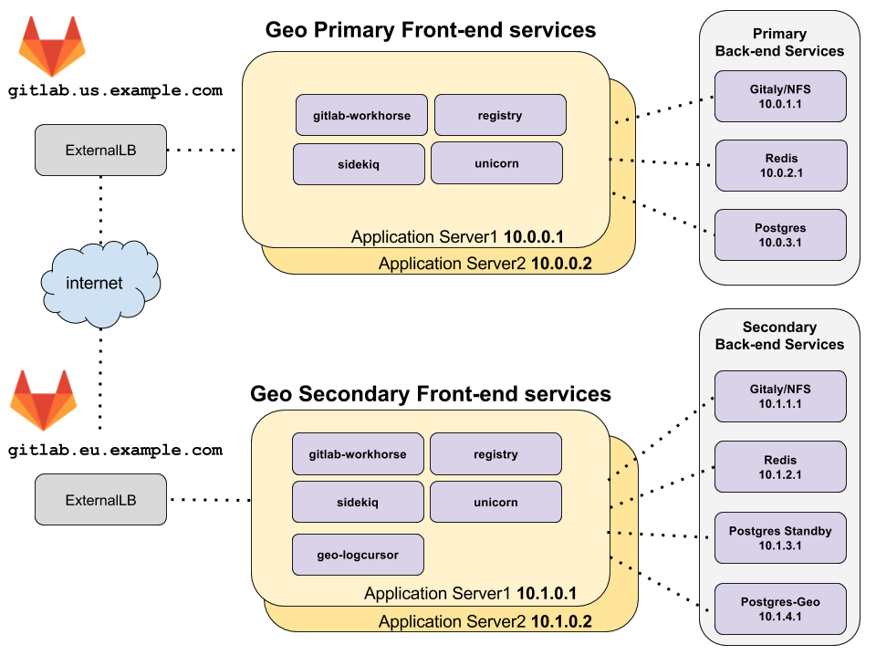

# Geo High Availability

This document describes a minimal reference architecture for running Geo
in a high availability configuration. If your HA setup differs from the one
described, it is possible to adapt these instructions to your needs.

## Architecture overview



_[diagram source - gitlab employees only][diagram-source]_

The topology above assumes that the primary and secondary Geo clusters
are located in two separate locations, on their own virtual network
with private IP addresses. The network is configured such that all machines within
one geographic location can communicate with each other using their private IP addresses.
The IP addresses given are examples and may be different depending on the
network topology of your deployment.

The only external way to access the two Geo deployments is by HTTPS at
`gitlab.us.example.com` and `gitlab.eu.example.com` in the example above.

> **Note:** The primary and secondary Geo deployments must be able to
  communicate to each other over HTTPS.

## Redis and PostgreSQL High Availability

The primary and secondary Redis and PostgreSQL should be configured
for high availability.  Because of the additional complexity involved
in setting up this configuration for PostgreSQL and Redis
it is not covered by this Geo HA documentation.
The two services will instead be configured such that
they will each run on a single machine.

For more information about setting up a highly available PostgreSQL cluster and Redis cluster using the omnibus package see the high availability documentation for
[PostgreSQL][postgresql-ha] and [Redis][redis-ha], respectively.

From these instructions you will need the following for the examples below:
* `gitlab_rails['db_password']` for the PostgreSQL "DB password"
* `redis['password']` for the Redis "Redis password"

NOTE: **Note:**
It is possible to use cloud hosted services for PostgreSQL and Redis but this is beyond the scope of this document.

### Prerequisites

Make sure you have GitLab EE installed using the
[Omnibus package](https://about.gitlab.com/installation).


### Step 1: Configure the Geo Backend Services

On the **primary** backend servers configure the following services:

* [Redis][redis-ha] for high availability.
* [NFS Server][nfs-ha] for repository, LFS, and upload storage.
* [PostgreSQL][postgresql-ha] for high availability.

On the **secondary** backend servers configure the following services:

* [Redis][redis-ha] for high availability.
* [NFS Server][nfs-ha] which will store data that is synchronized from the Geo primary.

### Step 2: Configure the Postgres services on the Geo Secondary

1. Configure the [secondary Geo PostgreSQL database][database]
 as a read-only secondary of the primary Geo PostgreSQL database.

1. Configure the Geo tracking database on the secondary server, to do this modify `/etc/gitlab/gitlab.rb`:

    ```ruby
    geo_postgresql['enable'] = true

    geo_postgresql['listen_address'] = '10.1.4.1'
    geo_postgresql['trust_auth_cidr_addresses'] = ['10.1.0.0/16']

    geo_secondary['auto_migrate'] = true
    geo_secondary['db_host'] = '10.1.4.1'
    geo_secondary['db_password'] = 'Geo tracking DB password'
    ```

NOTE: **Note:**
Be sure that other non-postgresql services are disabled by setting `enable` to `false` in
the [gitlab.rb configuration][gitlab-rb-template].

After making these changes be sure to run `sudo gitlab-ctl reconfigure` so that they take effect.

### Step 3: Setup the LoadBalancer

In this topology there will need to be a load balancers at each geographical location
to route traffic to the application servers.

See the [Load Balancer for GitLab HA][load-balancer-ha]
documentation for more information.

### Step 4: Configure the Geo Frontend Application Servers

In the architecture overview there are two machines running the GitLab application
services.  These services are enabled selectively in the configuration. Additionally
the addresses of the remote endpoints for PostgreSQL and Redis will need to be specified.

#### On the GitLab Primary Frontend servers

1. Edit `/etc/gitlab/gitlab.rb` and ensure the following to disable PostgreSQL and Redis from running locally.

    ```ruby
    ##
    ## Disable PostgreSQL on the local machine and connect to the remote
    ##

    postgresql['enable'] = false
    gitlab_rails['auto_migrate'] = false
    gitlab_rails['db_host'] = '10.0.3.1'
    gitlab_rails['db_password'] = 'DB password'

    ##
    ## Disable Redis on the local machine and connect to the remote
    ##

    redis['enable'] = false
    gitlab_rails['redis_host'] = '10.0.2.1'
    gitlab_rails['redis_password'] = 'Redis password'

    geo_primary_role['enable'] = true
    ```

#### On the GitLab Secondary Frontend servers

On the secondary the remote endpoint for the PostgreSQL Geo database will
be specified.

1. Edit `/etc/gitlab/gitlab.rb` and ensure the following to disable PostgreSQL and 
   Redis from running locally. Configure the secondary to connect to the Geo tracking database.


    ```ruby
    ##
    ## Disable PostgreSQL on the local machine and connect to the remote
    ##

    postgresql['enable'] = false
    gitlab_rails['auto_migrate'] = false
    gitlab_rails['db_host'] = '10.1.3.1'
    gitlab_rails['db_password'] = 'DB password'

    ##
    ## Disable Redis on the local machine and connect to the remote
    ##

    redis['enable'] = false
    gitlab_rails['redis_host'] = '10.1.2.1'
    gitlab_rails['redis_password'] = 'Redis password'


    ##
    ## Enable the geo secondary role and configure the
    ## geo tracking database
    ##

    geo_secondary_role['enable'] = true
    geo_secondary['db_host'] = '10.1.4.1'
    geo_secondary['db_password'] = 'Geo tracking DB password'
    geo_postgresql['enable'] = false
    ```


After making these changes [Reconfigure GitLab][gitlab-reconfigure] so that they take effect.

On the primary the following GitLab frontend services will be enabled:

* gitlab-pages
* gitlab-workhorse
* logrotate
* nginx
* registry
* remote-syslog
* sidekiq
* unicorn

On the secondary the following GitLab frontend services will be enabled:

* geo-logcursor
* gitlab-pages
* gitlab-workhorse
* logrotate
* nginx
* registry
* remote-syslog
* sidekiq
* unicorn

Verify these services by running `sudo gitlab-ctl status` on the frontend
application servers.

[diagram-source]: https://docs.google.com/drawings/d/1z0VlizKiLNXVVVaERFwgsIOuEgjcUqDTWPdQYsE7Z4c/edit
[gitlab-reconfigure]: ../../restart_gitlab.md#omnibus-gitlab-reconfigure
[redis-ha]: ../../high_availability/redis.md
[postgresql-ha]: ../../high_availability/database.md
[nfs-ha]: ../../high_availability/nfs.md
[load-balancer-ha]: ../../high_availability/load_balancer.md
[database]: database.md
[gitlab-rb-template]: https://gitlab.com/gitlab-org/omnibus-gitlab/blob/master/files/gitlab-config-template/gitlab.rb.template
