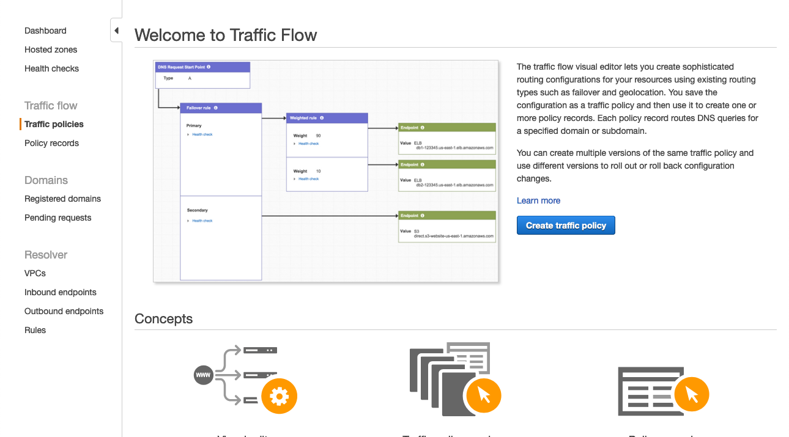
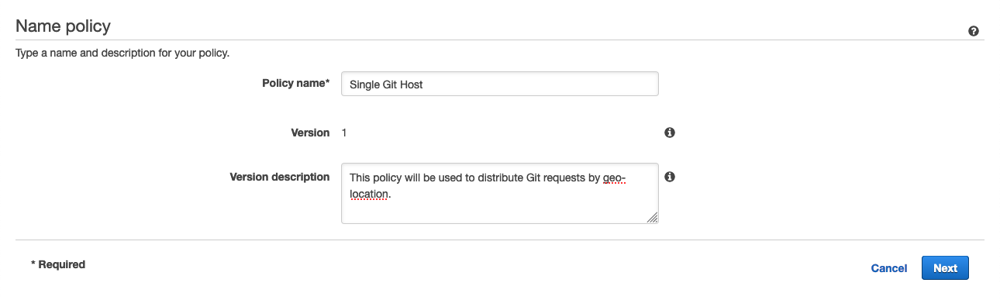
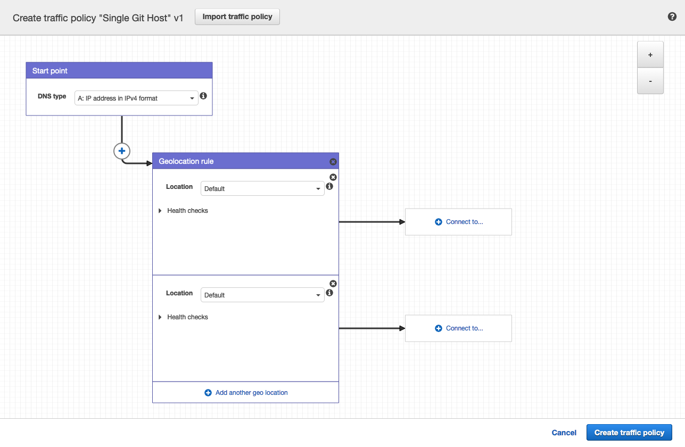
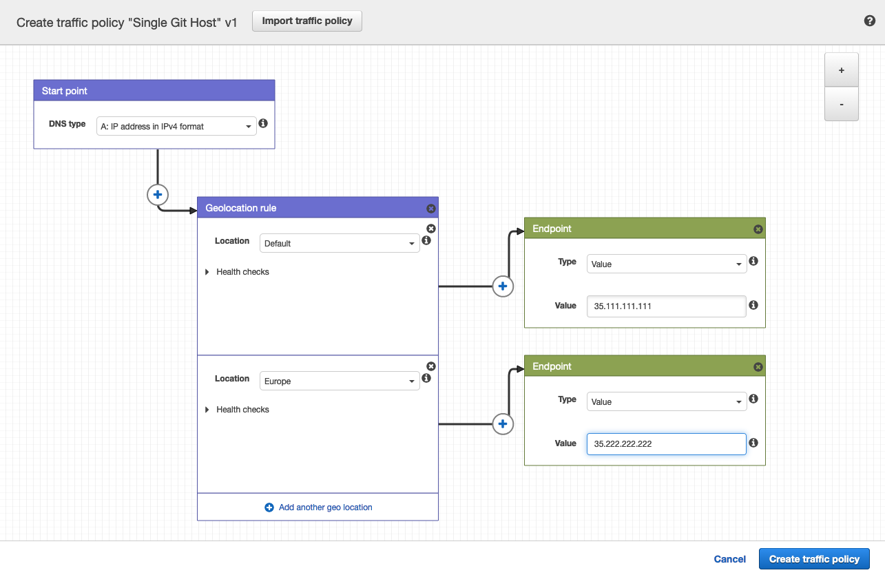
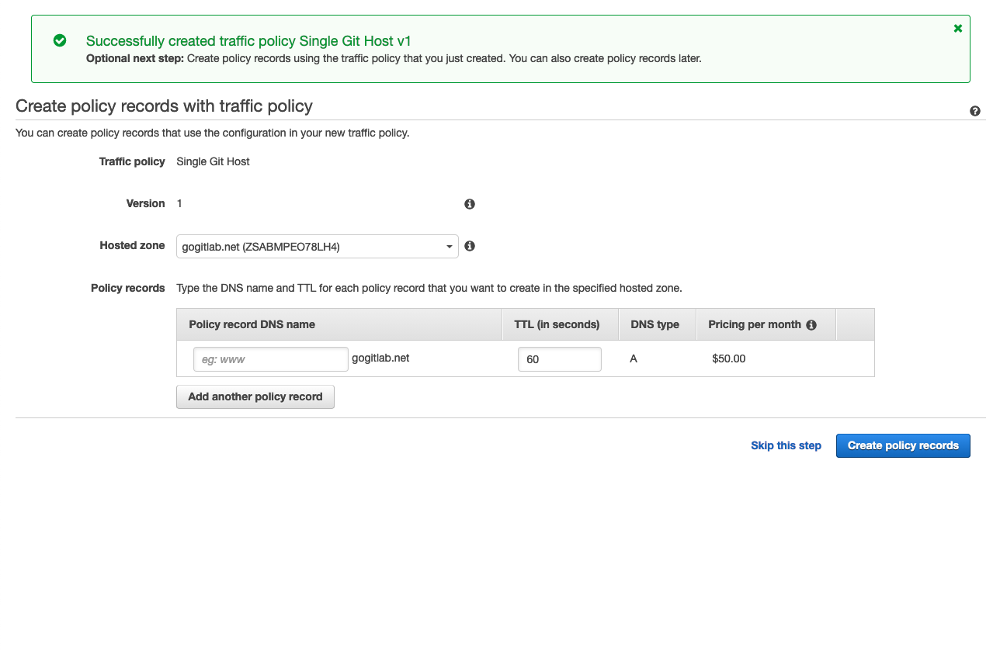
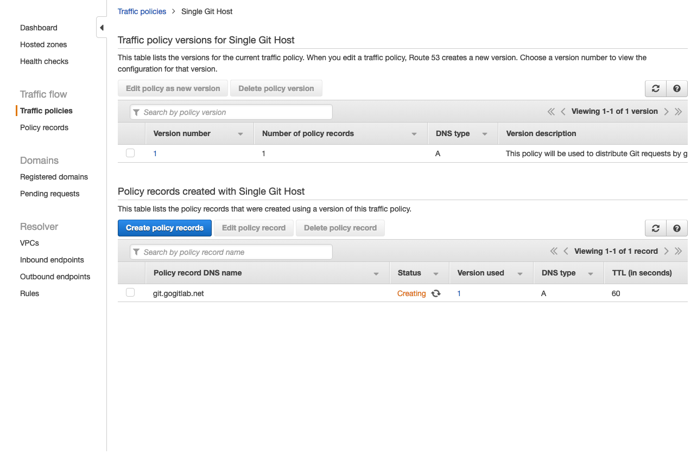
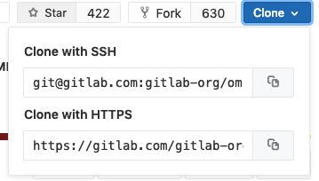

# Location-aware Git remote URL with AWS Route53 **(PREMIUM ONLY)**

You can provide GitLab users with a single remote URL that automatically uses
the Geo node closest to them. This means users don't need to update their Git
configuration to take advantage of closer Geo nodes as they move.

This is possible because, Git push requests can be automatically redirected
(HTTP) or proxied (SSH) from **secondary** nodes to the **primary** node.

Though these instructions use [AWS Route53](https://aws.amazon.com/route53/),
other services such as [Cloudflare](https://www.cloudflare.com/) could be used
as well.

NOTE: **Note**
You can also use a load balancer to distribute web UI or API traffic to
[multiple Geo **secondary** nodes](../../../user/admin_area/geo_nodes.md#multiple-secondary-nodes-behind-a-load-balancer).
Importantly, the **primary** node cannot yet be included. See the feature request
[Support putting the **primary** behind a Geo node load balancer](https://gitlab.com/gitlab-org/gitlab/-/issues/10888).

## Prerequisites

In this example, we have already set up:

- `primary.example.com` as a Geo **primary** node.
- `secondary.example.com` as a Geo **secondary** node.

We will create a `git.example.com` subdomain that will automatically direct
requests:

- From Europe to the **secondary** node.
- From all other locations to the **primary** node.

In any case, you require:

- A working GitLab **primary** node that is accessible at its own address.
- A working GitLab **secondary** node.
- A Route53 Hosted Zone managing your domain.

If you have not yet setup a Geo **primary** node and **secondary** node, please consult
[the Geo setup instructions](index.md#setup-instructions).

## Create a traffic policy

In a Route53 Hosted Zone, traffic policies can be used to set up a variety of
routing configurations.

1. Navigate to the
[Route53 dashboard](https://console.aws.amazon.com/route53/home) and click
**Traffic policies**.

   

1. Click the **Create traffic policy** button.

   

1. Fill in the **Policy Name** field with `Single Git Host` and click **Next**.

   

1. Leave **DNS type** as `A: IP Address in IPv4 format`.
1. Click **Connect to...** and select **Geolocation rule**.

   

1. For the first **Location**, leave it as `Default`.
1. Click **Connect to...** and select **New endpoint**.
1. Choose **Type** `value` and fill it in with `<your **primary** IP address>`.
1. For the second **Location**, choose `Europe`.
1. Click **Connect to...** and select **New endpoint**.
1. Choose **Type** `value` and fill it in with `<your **secondary** IP address>`.

   

1. Click **Create traffic policy**.

   

1. Fill in **Policy record DNS name** with `git`.
1. Click **Create policy records**.

   

You have successfully set up a single host, e.g. `git.example.com` which
distributes traffic to your Geo nodes by geolocation!

## Configure Git clone URLs to use the special Git URL

When a user clones a repository for the first time, they typically copy the Git
remote URL from the project page. By default, these SSH and HTTP URLs are based
on the external URL of the current host. For example:

- `git@secondary.example.com:group1/project1.git`
- `https://secondary.example.com/group1/project1.git`

You can customize the:

- SSH remote URL to use the location-aware `git.example.com`. To do so, change the SSH remote URL's
  host by setting `gitlab_rails['gitlab_ssh_host']` in `gitlab.rb` of web nodes.
- HTTP remote URL as shown in
  [Custom Git clone URL for HTTP(S)](../../../user/admin_area/settings/visibility_and_access_controls.md#custom-git-clone-url-for-https).

## Example Git request handling behavior

After following the configuration steps above, handling for Git requests is now location aware.
For requests:

- Outside Europe, all requests are directed to the **primary** node.
- Within Europe, over:
  - HTTP:
    - `git clone http://git.example.com/foo/bar.git` is directed to the **secondary** node.
    - `git push` is initially directed to the **secondary**, which automatically
      redirects to `primary.example.com`.
  - SSH:
    - `git clone git@git.example.com:foo/bar.git` is directed to the **secondary**.
    - `git push` is initially directed to the **secondary**, which automatically
       proxies the request to `primary.example.com`.
