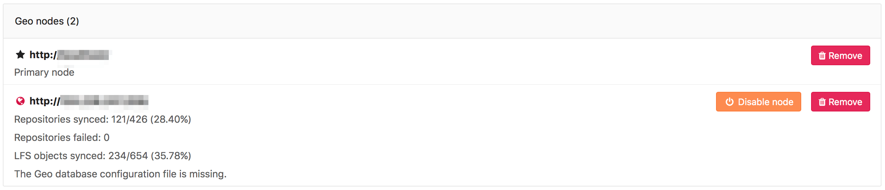

# Geo Troubleshooting

>**Note:**
This list is an attempt to document all the moving parts that can go wrong.
We are working into getting all this steps verified automatically in a
rake task in the future.

Setting up Geo requires careful attention to details and sometimes it's easy to
miss a step. Here is a list of questions you should ask to try to detect
what you need to fix (all commands and path locations are for Omnibus installs):

#### First check the health of the secondary

Visit the primary node's **Admin Area ➔ Geo Nodes** (`/admin/geo_nodes`) in
your browser. We perform the following health checks on each secondary node
to help identify if something is wrong:

- Is the node running?
- Is the node's secondary database configured for streaming replication?
- Is the node's secondary tracking database configured?
- Is the node's secondary tracking database connected?
- Is the node's secondary tracking database up-to-date?



There is also an option to check the status of the secondary node by running a special rake task:

```
sudo gitlab-rake geo:status
```

#### Is Postgres replication working?

#### Are my nodes pointing to the correct database instance?

You should make sure your primary Geo node points to the instance with
writing permissions.

Any secondary nodes should point only to read-only instances.

#### Can Geo detect my current node correctly?

Geo uses the defined node from the `Admin ➔ Geo` screen, and tries to match
it with the value defined in the `/etc/gitlab/gitlab.rb` configuration file.
The relevant line looks like: `external_url "http://gitlab.example.com"`.

To check if the node on the current machine is correctly detected type:

```bash
sudo gitlab-rails runner "puts Gitlab::Geo.current_node.inspect"
```

and expect something like:

```
#<GeoNode id: 2, schema: "https", host: "gitlab.example.com", port: 443, relative_url_root: "", primary: false, ...>
```

By running the command above, `primary` should be `true` when executed in
the primary node, and `false` on any secondary.

#### How do I fix the message, "ERROR:  replication slots can only be used if max_replication_slots > 0"?

This means that the `max_replication_slots` PostgreSQL variable needs to
be set on the primary database. In GitLab 9.4, we have made this setting
default to 1. You may need to increase this value if you have more Geo
secondary nodes. Be sure to restart PostgreSQL for this to take
effect. See the [PostgreSQL replication
setup][database-pg-replication] guide for more details.

#### How do I fix the message, "FATAL:  could not start WAL streaming: ERROR:  replication slot "geo_secondary_my_domain_com" does not exist"?

This occurs when PostgreSQL does not have a replication slot for the
secondary by that name. You may want to rerun the [replication
process](database.md) on the secondary.

#### How do I fix the message, "Command exceeded allowed execution time" when setting up replication?

This may happen while [initiating the replication process][database-start-replication] on the Geo secondary, 
and indicates that your initial dataset is too large to be replicated in the default timeout (30 minutes).

Re-run `gitlab-ctl replicate-geo-database`, but include a larger value for
`--backup-timeout`:

```bash
sudo gitlab-ctl replicate-geo-database --host=primary.geo.example.com --slot-name=secondary_geo_example_com --backup-timeout=21600
```

This will give the initial replication up to six hours to complete, rather than
the default thirty minutes. Adjust as required for your installation.

#### How do I fix the message, "PANIC: could not write to file 'pg_xlog/xlogtemp.123': No space left on device"

Determine if you have any unused replication slots in the primary database.  This can cause large amounts of 
log data to build up in `pg_xlog`. Removing the unused slots can reduce the amount of space used in the `pg_xlog`.

1. Start a PostgreSQL console session:

    ```bash
    sudo gitlab-psql gitlabhq_production
    ```

    > Note that using `gitlab-rails dbconsole` will not work, because managing replication slots requires 
      superuser permissions.

2. View your replication slots with

     ```sql
     SELECT * FROM pg_replication_slots;
     ```

Slots where `active` is `f` are not active.

- When this slot should be active, because you have a secondary configured using that slot,
  log in to that secondary and check the PostgreSQL logs why the replication is not running.

- If you are no longer using the slot (e.g. you no longer have Geo enabled), you can remove it with in the 
  PostgreSQL console session:

    ```sql
    SELECT pg_drop_replication_slot('name_of_extra_slot');
    ```

#### Very large repositories never successfully synchronize on the secondary

GitLab places a timeout on all repository clones, including project imports
and Geo synchronization operations. If a fresh `git clone` of a repository
on the primary takes more than a few minutes, you may be affected by this.
To increase the timeout, add the following line to `/etc/gitlab/gitlab.rb`
on the secondary:

```ruby
gitlab_rails['gitlab_shell_git_timeout'] = 10800
```

Then reconfigure GitLab:

```bash
sudo gitlab-ctl reconfigure
```

This will increase the timeout to three hours (10800 seconds). Choose a time
long enough to accommodate a full clone of your largest repositories.

#### How to reset Geo secondary replication

If you get a secondary node in a broken state and want to reset the replication state,
to start again from scratch, there are a few steps that can help you:

1. Stop Sidekiq and the Geo LogCursor

    It's possible to make Sidekiq stop gracefully, but making it stop getting new jobs and
    wait until the current jobs to finish processing.
    
    You need to send a **SIGTSTP** kill signal for the first phase and them a **SIGTERM**
    when all jobs have finished. Otherwise just use the `gitlab-ctl stop` commands.
    
    ```bash
    gitlab-ctl status sidekiq
    # run: sidekiq: (pid 10180) <- this is the PID you will use
    kill -TSTP 10180 # change to the correct PID
    
    gitlab-ctl stop sidekiq
    gitlab-ctl stop geo-logcursor
    ```
    
    You can watch sidekiq logs to know when sidekiq jobs processing have finished:
    
    ```bash
    gitlab-ctl tail sidekiq
    ```

1. Rename repository storage folders and create new ones

    ```bash
    mv /var/opt/gitlab/git-data/repositories /var/opt/gitlab/git-data/repositories.old
    mkdir -p /var/opt/gitlab/git-data/repositories
    chown git:git /var/opt/gitlab/git-data/repositories
    ```
    
    TIP: **Tip**
    You may want to remove the `/var/opt/gitlab/git-data/repositories.old` in the future
    as soon as you confirmed that you don't need it anymore, to save disk space.
    
1. _(Optional)_ Rename other data folders and create new ones

    CAUTION: **Caution**:
    You may still have files on the secondary that have been removed from primary but 
    removal have not been reflected. If you skip this step, they will never be removed
    from this Geo node.
    
    Any uploaded content like file attachments, avatars or LFS objects are stored in a
    subfolder in one of the two paths below:
    
    1. /var/opt/gitlab/gitlab-rails/shared
    1. /var/opt/gitlab/gitlab-rails/uploads
    
    To rename all of them:
    
    ```bash
    gitlab-ctl stop
 
    mv /var/opt/gitlab/gitlab-rails/shared /var/opt/gitlab/gitlab-rails/shared.old
    mkdir -p /var/opt/gitlab/gitlab-rails/shared
 
    mv /var/opt/gitlab/gitlab-rails/uploads /var/opt/gitlab/gitlab-rails/uploads.old
    mkdir -p /var/opt/gitlab/gitlab-rails/uploads
    ```
    
    Reconfigure in order to recreate the folders and make sure permissions and ownership
    are correctly
    
    ```bash
    gitlab-ctl reconfigure
    ```

1. Reset the Tracking Database

    ```bash
    gitlab-rake geo:db:reset
    ```

1. Restart previously stopped services

    ```bash
    gitlab-ctl start
    ```

[database-start-replication]: database.md#step-3-initiate-the-replication-process
[database-pg-replication]: database.md#postgresql-replication
