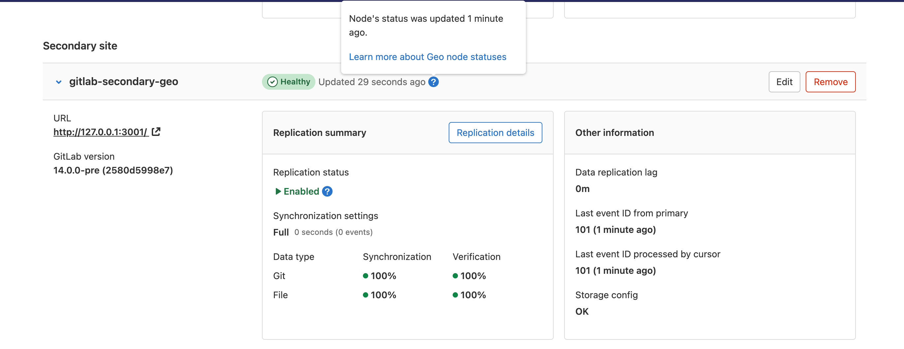

# Troubleshooting Geo **(PREMIUM SELF)**

Setting up Geo requires careful attention to details, and sometimes it's easy to
miss a step.

Here is a list of steps you should take to attempt to fix problem:

1. Perform [basic troubleshooting](#basic-troubleshooting).
1. Fix any [PostgreSQL database replication errors](#fixing-postgresql-database-replication-errors).
1. Fix any [common](#fixing-common-errors) errors.
1. Fix any [non-PostgreSQL replication failures](#fixing-non-postgresql-replication-failures).

## Basic troubleshooting

Before attempting more advanced troubleshooting:

- Check [the health of the **secondary** site](#check-the-health-of-the-secondary-site).
- Check [if PostgreSQL replication is working](#check-if-postgresql-replication-is-working).

### Check the health of the **secondary** site

On the **primary** site:

1. On the top bar, select **Main menu > Admin**.
1. On the left sidebar, select **Geo > Sites**.

We perform the following health checks on each **secondary** site
to help identify if something is wrong:

- Is the site running?
- Is the secondary site's database configured for streaming replication?
- Is the secondary site's tracking database configured?
- Is the secondary site's tracking database connected?
- Is the secondary site's tracking database up-to-date?
- Is the secondary site's status less than 10 minutes old?



A site shows as "Unhealthy" if the site's status is more than 10 minutes old. In that case, try running the following in the [Rails console](../../operations/rails_console.md) on the affected secondary site:

```ruby
Geo::MetricsUpdateWorker.new.perform
```

If it raises an error, then the error is probably also preventing the jobs from completing. If it takes longer than 10 minutes, then there may be a performance issue, and the UI may always show "Unhealthy" even if the status eventually does get updated.

If it successfully updates the status, then something may be wrong with Sidekiq. Is it running? Do the logs show errors? This job is supposed to be enqueued every minute. It takes an exclusive lease in Redis to ensure that only one of these jobs can run at a time. The primary site updates its status directly in the PostgreSQL database. Secondary sites send an HTTP Post request to the primary site with their status data.

A site also shows as "Unhealthy" if certain health checks fail. You can reveal the failure by running the following in the [Rails console](../../operations/rails_console.md) on the affected secondary site:

```ruby
Gitlab::Geo::HealthCheck.new.perform_checks
```

If it returns `""` (an empty string) or `"Healthy"`, then the checks succeeded. If it returns anything else, then the message should explain what failed, or show the exception message.

For information about how to resolve common error messages reported from the user interface,
see [Fixing Common Errors](#fixing-common-errors).

If the user interface is not working, or you are unable to sign in, you can run the Geo
health check manually to get this information and a few more details.

#### Health check Rake task

> The use of a custom NTP server was [introduced](https://gitlab.com/gitlab-org/gitlab/-/merge_requests/105514) in GitLab 15.7.

This Rake task can be run on a **Rails** node in the **primary** or **secondary**
Geo sites:

```shell
sudo gitlab-rake gitlab:geo:check
```

Example output:

```plaintext
Checking Geo ...

GitLab Geo is available ... yes
GitLab Geo is enabled ... yes
This machine's Geo node name matches a database record ... yes, found a secondary node named "Shanghai"
GitLab Geo tracking database is correctly configured ... yes
Database replication enabled? ... yes
Database replication working? ... yes
GitLab Geo HTTP(S) connectivity ...
* Can connect to the primary node ... yes
HTTP/HTTPS repository cloning is enabled ... yes
Machine clock is synchronized ... yes
Git user has default SSH configuration? ... yes
OpenSSH configured to use AuthorizedKeysCommand ... yes
GitLab configured to disable writing to authorized_keys file ... yes
GitLab configured to store new projects in hashed storage? ... yes
All projects are in hashed storage? ... yes

Checking Geo ... Finished
```

You can also specify a custom NTP server using environment variables. For example:

```shell
export NTP_HOST="ntp.ubuntu.com"
export NTP_TIMEOUT="30"
sudo gitlab-rake gitlab:geo:check
```

The following environment variables are supported.

| Variable    | Description | Default value |
| ----------- | ----------- | ------------- |
|`NTP_HOST`   | The NTP host. | `pool.ntp.org` |
|`NTP_PORT`   | The NTP port the host listens on. |`ntp`|
|`NTP_TIMEOUT`| The NTP timeout in seconds. | The value defined in the `net-ntp` Ruby library ([60 seconds](https://github.com/zencoder/net-ntp/blob/3d0990214f439a5127782e0f50faeaf2c8ca7023/lib/net/ntp/ntp.rb#L6)). |

#### Sync status Rake task

Current sync information can be found manually by running this Rake task on any
node running Rails (Puma, Sidekiq, or Geo Log Cursor) on the Geo **secondary** site:

```shell
sudo gitlab-rake geo:status
```

The output includes:

- a count of "failed" items if any failures occurred
- the percentage of "succeeded" items, relative to the "total"

Example:

```plaintext
http://secondary.example.com/
-----------------------------------------------------
                        GitLab Version: 14.9.2-ee
                              Geo Role: Secondary
                         Health Status: Healthy
                          Repositories: succeeded 12345 / total 12345 (100%)
                 Verified Repositories: succeeded 12345 / total 12345 (100%)
                                 Wikis: succeeded 6789 / total 6789 (100%)
                        Verified Wikis: succeeded 6789 / total 6789 (100%)
                           Attachments: succeeded 4 / total 4 (100%)
                      CI job artifacts: succeeded 0 / total 0 (0%)
                   Design repositories: succeeded 1 / total 1 (100%)
                           LFS Objects: failed 1 / succeeded 2 / total 3 (67%)
                   Merge Request Diffs: succeeded 0 / total 0 (0%)
                         Package Files: failed 1 / succeeded 2 / total 3 (67%)
              Terraform State Versions: failed 1 / succeeded 2 / total 3 (67%)
                  Snippet Repositories: failed 1 / succeeded 2 / total 3 (67%)
               Group Wiki Repositories: succeeded 4 / total 4 (100%)
                    Pipeline Artifacts: failed 3 / succeeded 0 / total 3 (0%)
                     Pages Deployments: succeeded 0 / total 0 (0%)
                  Repositories Checked: failed 5 / succeeded 0 / total 5 (0%)
                Package Files Verified: succeeded 0 / total 10 (0%)
     Terraform State Versions Verified: succeeded 0 / total 10 (0%)
         Snippet Repositories Verified: succeeded 99 / total 100 (99%)
           Pipeline Artifacts Verified: succeeded 0 / total 10 (0%)
                         Sync Settings: Full
              Database replication lag: 0 seconds
       Last event ID seen from primary: 12345 (about 2 minutes ago)
     Last event ID processed by cursor: 12345 (about 2 minutes ago)
                Last status report was: 1 minute ago
```

There are up to three statuses for each item. For example, for `Repositories`, you see the following lines:

```plaintext
  Repositories: succeeded 12345 / total 12345 (100%)
  Verified Repositories: succeeded 12345 / total 12345 (100%)
  Repositories Checked: failed 5 / succeeded 0 / total 5 (0%)
```

The 3 status items are defined as follows:

- The `Repositories` output shows how many repositories are synced from the primary to the secondary.
- The `Verified Repositories` output shows how many repositories on this secondary have a matching repository checksum with the Primary.
- The `Repositories Checked` output shows how many repositories have passed a local Git repository check (`git fsck`) on the secondary.

To find more details about failed items, check
[the `gitlab-rails/geo.log` file](../../logs/log_parsing.md#find-most-common-geo-sync-errors)

If you notice replication or verification failures, you can try to [resolve them](#fixing-non-postgresql-replication-failures).

If there are Repository check failures, you can try to [resolve them](#find-repository-check-failures-in-a-geo-secondary-site).

### Check if PostgreSQL replication is working

To check if PostgreSQL replication is working, check if:

- [Sites are pointing to the correct database node](#are-sites-pointing-to-the-correct-database-node).
- [Geo can detect the current site correctly](#can-geo-detect-the-current-site-correctly).

#### Are sites pointing to the correct database node?

You should make sure your **primary** Geo [site](../glossary.md) points to
the database node that has write permissions.

Any **secondary** sites should point only to read-only database nodes.

#### Can Geo detect the current site correctly?

Geo finds the current Puma or Sidekiq node's Geo [site](../glossary.md) name in
`/etc/gitlab/gitlab.rb` with the following logic:

1. Get the "Geo node name" (there is
   [an issue to rename the settings to "Geo site name"](https://gitlab.com/gitlab-org/gitlab/-/issues/335944)):
   - Omnibus GitLab: Get the `gitlab_rails['geo_node_name']` setting.
   - GitLab Helm Charts: Get the `global.geo.nodeName` setting (see [Charts with GitLab Geo](https://docs.gitlab.com/charts/advanced/geo/index.html)).
1. If that is not defined, then get the `external_url` setting.

This name is used to look up the Geo site with the same **Name** in the **Geo Sites**
dashboard.

To check if the current machine has a site name that matches a site in the
database, run the check task:

```shell
sudo gitlab-rake gitlab:geo:check
```

It displays the current machine's site name and whether the matching database
record is a **primary** or **secondary** site.

```plaintext
This machine's Geo node name matches a database record ... yes, found a secondary node named "Shanghai"
```

```plaintext
This machine's Geo node name matches a database record ... no
  Try fixing it:
  You could add or update a Geo node database record, setting the name to "https://example.com/".
  Or you could set this machine's Geo node name to match the name of an existing database record: "London", "Shanghai"
  For more information see:
  doc/administration/geo/replication/troubleshooting.md#can-geo-detect-the-current-node-correctly
```

For more information about recommended site names in the description of the Name field, see
[Geo Admin Area Common Settings](../../../user/admin_area/geo_sites.md#common-settings).

### Reverify all uploads (or any SSF data type which is verified)

1. SSH into a GitLab Rails node in the primary Geo site.
1. Open [Rails console](../../operations/rails_console.md).
1. Mark all uploads as "pending verification":

WARNING:
Commands that change data can cause damage if not run correctly or under the right conditions. Always run commands in a test environment first and have a backup instance ready to restore.

   ```ruby
   Upload.verification_state_table_class.each_batch do |relation|
     relation.update_all(verification_state: 0)
   end
   ```

1. This causes the primary to start checksumming all Uploads.
1. When a primary successfully checksums a record, then all secondaries recalculate the checksum as well, and they compare the values.

A similar thing can be done for all Models handled by the [Geo Self-Service Framework](../../../development/geo/framework.md) which have implemented verification:

- `LfsObject`
- `MergeRequestDiff`
- `Packages::PackageFile`
- `Terraform::StateVersion`
- `SnippetRepository`
- `Ci::PipelineArtifact`
- `PagesDeployment`
- `Upload`
- `Ci::JobArtifact`
- `Ci::SecureFile`

NOTE:
`GroupWikiRepository` is not in the previous list since verification is not implemented.
There is an [issue to implement this functionality in the Admin Area UI](https://gitlab.com/gitlab-org/gitlab/-/issues/364729).

### Message: `WARNING: oldest xmin is far in the past` and `pg_wal` size growing

If a replication slot is inactive,
the `pg_wal` logs corresponding to the slot are reserved forever
(or until the slot is active again). This causes continuous disk usage growth
and the following messages appear repeatedly in the
[PostgreSQL logs](../../logs/index.md#postgresql-logs):

```plaintext
WARNING: oldest xmin is far in the past
HINT: Close open transactions soon to avoid wraparound problems.
You might also need to commit or roll back old prepared transactions, or drop stale replication slots.
```

To fix this:

1. [Connect to the primary database](https://docs.gitlab.com/omnibus/settings/database.html#connecting-to-the-bundled-postgresql-database).

1. Run `SELECT * FROM pg_replication_slots;`.
   Note the `slot_name` that reports `active` as `f` (false).

1. Follow [the steps to remove that Geo site](remove_geo_site.md).

## Fixing errors found when running the Geo check Rake task

When running this Rake task, you may see error messages if the nodes are not properly configured:

```shell
sudo gitlab-rake gitlab:geo:check
```

- Rails did not provide a password when connecting to the database.

  ```plaintext
  Checking Geo ...

  GitLab Geo is available ... Exception: fe_sendauth: no password supplied
  GitLab Geo is enabled ... Exception: fe_sendauth: no password supplied
  ...
  Checking Geo ... Finished
  ```

  Ensure you have the `gitlab_rails['db_password']` set to the plain-text
  password used when creating the hash for `postgresql['sql_user_password']`.

- Rails is unable to connect to the database.

  ```plaintext
  Checking Geo ...

  GitLab Geo is available ... Exception: FATAL:  no pg_hba.conf entry for host "1.1.1.1",  user "gitlab", database "gitlabhq_production", SSL on
  FATAL:  no pg_hba.conf entry for host "1.1.1.1", user "gitlab", database "gitlabhq_production", SSL off
  GitLab Geo is enabled ... Exception: FATAL:  no pg_hba.conf entry for host "1.1.1.1", user "gitlab", database "gitlabhq_production", SSL on
  FATAL:  no pg_hba.conf entry for host "1.1.1.1", user "gitlab", database "gitlabhq_production", SSL off
  ...
  Checking Geo ... Finished
  ```

  Ensure you have the IP address of the rails node included in `postgresql['md5_auth_cidr_addresses']`.
  Also, ensure you have included the subnet mask on the IP address: `postgresql['md5_auth_cidr_addresses'] = ['1.1.1.1/32']`.

- Rails has supplied the incorrect password.

  ```plaintext
  Checking Geo ...
  GitLab Geo is available ... Exception: FATAL:  password authentication failed for user "gitlab"
  FATAL:  password authentication failed for user "gitlab"
  GitLab Geo is enabled ... Exception: FATAL:  password authentication failed for user "gitlab"
  FATAL:  password authentication failed for user "gitlab"
  ...
  Checking Geo ... Finished
  ```

  Verify the correct password is set for `gitlab_rails['db_password']` that was
  used when creating the hash in  `postgresql['sql_user_password']` by running
  `gitlab-ctl pg-password-md5 gitlab` and entering the password.

- Check returns `not a secondary node`.

  ```plaintext
  Checking Geo ...

  GitLab Geo is available ... yes
  GitLab Geo is enabled ... yes
  GitLab Geo tracking database is correctly configured ... not a secondary node
  Database replication enabled? ... not a secondary node
  ...
  Checking Geo ... Finished
  ```

  Ensure you have added the secondary site in the **Main menu > Admin > Geo > Sites** on the web interface for the **primary** site.
  Also ensure you entered the `gitlab_rails['geo_node_name']`
  when adding the secondary site in the Admin Area of the **primary** site.
  In GitLab 12.3 and earlier, edit the secondary site in the Admin Area of the **primary**
  site and ensure that there is a trailing `/` in the `Name` field.

- Check returns `Exception: PG::UndefinedTable: ERROR:  relation "geo_nodes" does not exist`.

  ```plaintext
  Checking Geo ...

  GitLab Geo is available ... no
    Try fixing it:
    Add a new license that includes the GitLab Geo feature
    For more information see:
    https://about.gitlab.com/features/gitlab-geo/
  GitLab Geo is enabled ... Exception: PG::UndefinedTable: ERROR:  relation "geo_nodes" does not exist
  LINE 8:                WHERE a.attrelid = '"geo_nodes"'::regclass
                                             ^
  :               SELECT a.attname, format_type(a.atttypid, a.atttypmod),
                       pg_get_expr(d.adbin, d.adrelid), a.attnotnull, a.atttypid, a.atttypmod,
                       c.collname, col_description(a.attrelid, a.attnum) AS comment
                  FROM pg_attribute a
                  LEFT JOIN pg_attrdef d ON a.attrelid = d.adrelid AND a.attnum = d.adnum
                  LEFT JOIN pg_type t ON a.atttypid = t.oid
                  LEFT JOIN pg_collation c ON a.attcollation = c.oid AND a.attcollation <> t.typcollation
                 WHERE a.attrelid = '"geo_nodes"'::regclass
                   AND a.attnum > 0 AND NOT a.attisdropped
                 ORDER BY a.attnum
  ...
  Checking Geo ... Finished
  ```

  When performing a PostgreSQL major version (9 > 10), update this is expected. Follow
  the [initiate-the-replication-process](../setup/database.md#step-3-initiate-the-replication-process).

- Rails does not appear to have the configuration necessary to connect to the Geo tracking database.

  ```plaintext
  Checking Geo ...

  GitLab Geo is available ... yes
  GitLab Geo is enabled ... yes
  GitLab Geo tracking database is correctly configured ... no
  Try fixing it:
  Rails does not appear to have the configuration necessary to connect to the Geo tracking database. If the tracking database is running on a node other than this one, then you may need to add configuration.
  ...
  Checking Geo ... Finished
  ```

  - If you are running the secondary site on a single node for all services, then follow [Geo database replication - Configure the secondary server](../setup/database.md#step-2-configure-the-secondary-server).
  - If you are running the secondary site's tracking database on its own node, then follow [Geo for multiple servers - Configure the Geo tracking database on the Geo secondary site](multiple_servers.md#step-3-configure-the-geo-tracking-database-on-the-geo-secondary-site)
  - If you are running the secondary site's tracking database in a Patroni cluster, then follow [Geo database replication - Configure the tracking database on the secondary sites](../setup/database.md#step-3-configure-the-tracking-database-on-the-secondary-sites)
  - If you are running the secondary site's tracking database in an external database, then follow [Geo with external PostgreSQL instances](../setup/external_database.md#configure-the-tracking-database)
  - If the Geo check task was run on a node which is not running a service which runs the GitLab Rails app (Puma, Sidekiq, or Geo Log Cursor), then this error can be ignored. The node does not need Rails to be configured.

### Message: Machine clock is synchronized ... Exception

The Rake task attempts to verify that the server clock is synchronized with NTP. Synchronized clocks
are required for Geo to function correctly. As an example, for security, when the server time on the
primary site and secondary site differ by about a minute or more, requests between Geo sites
fail. If this check task fails to complete due to a reason other than mismatching times, it
does not necessarily mean that Geo will not work.

The Ruby gem which performs the check is hard coded with `pool.ntp.org` as its reference time source.

- Exception message `Machine clock is synchronized ... Exception: Timeout::Error`

  This issue occurs when your server cannot access the host `pool.ntp.org`.

- Exception message `Machine clock is synchronized ... Exception: No route to host - recvfrom(2)`

  This issue occurs when the hostname `pool.ntp.org` resolves to a server which does not provide a time service.

In this case, in GitLab 15.7 and newer, [specify a custom NTP server using environment variables](#health-check-rake-task).

In GitLab 15.6 and older, use one of the following workarounds:

- Add entries in `/etc/hosts` for `pool.ntp.org` to direct the request to valid local time servers.
  This fixes the long timeout and the timeout error.
- Direct the check to any valid IP address. This resolves the timeout issue, but the check fails
  with the `No route to host` error, as noted above.

[Cloud native GitLab deployments](https://docs.gitlab.com/charts/advanced/geo/#set-the-geo-primary-site)
generate an error because containers in Kubernetes do not have access to the host clock:

```plaintext
Machine clock is synchronized ... Exception: getaddrinfo: Servname not supported for ai_socktype
```

### Message: `ActiveRecord::StatementInvalid: PG::ReadOnlySqlTransaction: ERROR:  cannot execute INSERT in a read-only transaction`

When this error is encountered on a secondary site, it likely affects all usages of GitLab Rails such as `gitlab-rails` or `gitlab-rake` commands, as well the Puma, Sidekiq, and Geo Log Cursor services.

```plaintext
ActiveRecord::StatementInvalid: PG::ReadOnlySqlTransaction: ERROR:  cannot execute INSERT in a read-only transaction
/opt/gitlab/embedded/service/gitlab-rails/app/models/application_record.rb:86:in `block in safe_find_or_create_by'
/opt/gitlab/embedded/service/gitlab-rails/app/models/concerns/cross_database_modification.rb:92:in `block in transaction'
/opt/gitlab/embedded/service/gitlab-rails/lib/gitlab/database.rb:332:in `block in transaction'
/opt/gitlab/embedded/service/gitlab-rails/lib/gitlab/database.rb:331:in `transaction'
/opt/gitlab/embedded/service/gitlab-rails/app/models/concerns/cross_database_modification.rb:83:in `transaction'
/opt/gitlab/embedded/service/gitlab-rails/app/models/application_record.rb:86:in `safe_find_or_create_by'
/opt/gitlab/embedded/service/gitlab-rails/app/models/shard.rb:21:in `by_name'
/opt/gitlab/embedded/service/gitlab-rails/app/models/shard.rb:17:in `block in populate!'
/opt/gitlab/embedded/service/gitlab-rails/app/models/shard.rb:17:in `map'
/opt/gitlab/embedded/service/gitlab-rails/app/models/shard.rb:17:in `populate!'
/opt/gitlab/embedded/service/gitlab-rails/config/initializers/fill_shards.rb:9:in `<top (required)>'
/opt/gitlab/embedded/service/gitlab-rails/config/environment.rb:7:in `<top (required)>'
/opt/gitlab/embedded/bin/bundle:23:in `load'
/opt/gitlab/embedded/bin/bundle:23:in `<main>'
```

The PostgreSQL read-replica database would be producing these errors:

```plaintext
2023-01-17_17:44:54.64268 ERROR:  cannot execute INSERT in a read-only transaction
2023-01-17_17:44:54.64271 STATEMENT:  /*application:web,db_config_name:main*/ INSERT INTO "shards" ("name") VALUES ('storage1') RETURNING "id"
```

This situation can occur during initial configuration when a secondary site is not yet aware that it is a secondary site.

To resolve the error, follow [Step 3. Add the secondary site](configuration.md#step-3-add-the-secondary-site).

## Fixing PostgreSQL database replication errors

The following sections outline troubleshooting steps for fixing replication
error messages (indicated by `Database replication working? ... no` in the
[`geo:check` output](#health-check-rake-task).

### Message: `ERROR:  replication slots can only be used if max_replication_slots > 0`?

This means that the `max_replication_slots` PostgreSQL variable needs to
be set on the **primary** database. This setting defaults to 1. You may need to
increase this value if you have more **secondary** sites.

Be sure to restart PostgreSQL for this to take effect. See the
[PostgreSQL replication setup](../setup/database.md#postgresql-replication) guide for more details.

### Message: `FATAL:  could not start WAL streaming: ERROR:  replication slot "geo_secondary_my_domain_com" does not exist`?

This occurs when PostgreSQL does not have a replication slot for the
**secondary** site by that name.

You may want to rerun the [replication process](../setup/database.md) on the **secondary** site .

### Message: "Command exceeded allowed execution time" when setting up replication?

This may happen while [initiating the replication process](../setup/database.md#step-3-initiate-the-replication-process) on the **secondary** site,
and indicates your initial dataset is too large to be replicated in the default timeout (30 minutes).

Re-run `gitlab-ctl replicate-geo-database`, but include a larger value for
`--backup-timeout`:

```shell
sudo gitlab-ctl \
   replicate-geo-database \
   --host=<primary_node_hostname> \
   --slot-name=<secondary_slot_name> \
   --backup-timeout=21600
```

This gives the initial replication up to six hours to complete, rather than
the default 30 minutes. Adjust as required for your installation.

### Message: "PANIC: could not write to file `pg_xlog/xlogtemp.123`: No space left on device"

Determine if you have any unused replication slots in the **primary** database. This can cause large amounts of
log data to build up in `pg_xlog`. Removing the unused slots can reduce the amount of space used in the `pg_xlog`.

1. Start a PostgreSQL console session:

   ```shell
   sudo gitlab-psql
   ```

   NOTE:
   Using `gitlab-rails dbconsole` does not work, because managing replication slots requires superuser permissions.

1. View your replication slots:

   ```sql
   SELECT * FROM pg_replication_slots;
   ```

Slots where `active` is `f` are not active.

- When this slot should be active, because you have a **secondary** site configured using that slot,
  sign in on the web interface for the **secondary** site and check the [PostgreSQL logs](../../logs/index.md#postgresql-logs)
  to view why the replication is not running.

- If you are no longer using the slot (for example, you no longer have Geo enabled), you can remove it with in the
  PostgreSQL console session:

  ```sql
  SELECT pg_drop_replication_slot('<name_of_extra_slot>');
  ```

### Message: "ERROR: canceling statement due to conflict with recovery"

This error message occurs infrequently under typical usage, and the system is resilient
enough to recover.

However, under certain conditions, some database queries on secondaries may run
excessively long, which increases the frequency of this error message. This can lead to a situation
where some queries never complete due to being canceled on every replication.

These long-running queries are
[planned to be removed in the future](https://gitlab.com/gitlab-org/gitlab/-/issues/34269),
but as a workaround, we recommend enabling
[`hot_standby_feedback`](https://www.postgresql.org/docs/10/hot-standby.html#HOT-STANDBY-CONFLICT).
This increases the likelihood of bloat on the **primary** site as it prevents
`VACUUM` from removing recently-dead rows. However, it has been used
successfully in production on GitLab.com.

To enable `hot_standby_feedback`, add the following to `/etc/gitlab/gitlab.rb`
on the **secondary** site:

```ruby
postgresql['hot_standby_feedback'] = 'on'
```

Then reconfigure GitLab:

```shell
sudo gitlab-ctl reconfigure
```

To help us resolve this problem, consider commenting on
[the issue](https://gitlab.com/gitlab-org/gitlab/-/issues/4489).

### Message: `FATAL:  could not connect to the primary server: server certificate for "PostgreSQL" does not match host name`

This happens because the PostgreSQL certificate that the Omnibus GitLab package automatically creates contains
the Common Name `PostgreSQL`, but the replication is connecting to a different host and GitLab attempts to use
the `verify-full` SSL mode by default.

To fix this issue, you can either:

- Use the `--sslmode=verify-ca` argument with the `replicate-geo-database` command.
- For an already replicated database, change `sslmode=verify-full` to `sslmode=verify-ca`
  in `/var/opt/gitlab/postgresql/data/gitlab-geo.conf` and run `gitlab-ctl restart postgresql`.
- [Configure SSL for PostgreSQL](https://docs.gitlab.com/omnibus/settings/database.html#configuring-ssl)
  with a custom certificate (including the host name that's used to connect to the database in the CN or SAN)
  instead of using the automatically generated certificate.

### Message: `LOG:  invalid CIDR mask in address`

This happens on wrongly-formatted addresses in `postgresql['md5_auth_cidr_addresses']`.

```plaintext
2020-03-20_23:59:57.60499 LOG:  invalid CIDR mask in address "***"
2020-03-20_23:59:57.60501 CONTEXT:  line 74 of configuration file "/var/opt/gitlab/postgresql/data/pg_hba.conf"
```

To fix this, update the IP addresses in `/etc/gitlab/gitlab.rb` under `postgresql['md5_auth_cidr_addresses']`
to respect the CIDR format (that is, `1.2.3.4/32`).

### Message: `LOG:  invalid IP mask "md5": Name or service not known`

This happens when you have added IP addresses without a subnet mask in `postgresql['md5_auth_cidr_addresses']`.

```plaintext
2020-03-21_00:23:01.97353 LOG:  invalid IP mask "md5": Name or service not known
2020-03-21_00:23:01.97354 CONTEXT:  line 75 of configuration file "/var/opt/gitlab/postgresql/data/pg_hba.conf"
```

To fix this, add the subnet mask in `/etc/gitlab/gitlab.rb` under `postgresql['md5_auth_cidr_addresses']`
to respect the CIDR format (that is, `1.2.3.4/32`).

### Message: `Found data in the gitlabhq_production database!` when running `gitlab-ctl replicate-geo-database`

This happens if data is detected in the `projects` table. When one or more projects are detected, the operation
is aborted to prevent accidental data loss. To bypass this message, pass the `--force` option to the command.

In GitLab 13.4, a seed project is added when GitLab is first installed. This makes it necessary to pass `--force` even
on a new Geo secondary site. There is an [issue to account for seed projects](https://gitlab.com/gitlab-org/omnibus-gitlab/-/issues/5618)
when checking the database.

### Message: `Synchronization failed - Error syncing repository`

WARNING:
If large repositories are affected by this problem,
their resync may take a long time and cause significant load on your Geo sites,
storage and network systems.

If you see the error message `Synchronization failed - Error syncing repository` along with `fatal: fsck error in packed object`, this indicates
a consistency check error when syncing the repository.

One example of a consistency error is: `error: object f4a87a3be694fbbd6e50a668a31a8513caeaafe3: hasDotgit: contains '.git`.

Removing the malformed objects causing consistency errors require rewriting the repository history, which is not always an option. However,
it's possible to override the consistency checks instead. To do that, follow
[the instructions in the Gitaly docs](../../gitaly/configure_gitaly.md#repository-consistency-checks).

You can also get the error message `Synchronization failed - Error syncing repository` along with the following log messages, this indicates that the expected `geo` remote is not present in the `.git/config` file
of a repository on the secondary Geo site's file system:

```json
{
  "created": "@1603481145.084348757",
  "description": "Error received from peer unix:/var/opt/gitlab/gitaly/gitaly.socket",
  …
  "grpc_message": "exit status 128",
  "grpc_status": 13
}
{  …
  "grpc.request.fullMethod": "/gitaly.RemoteService/FindRemoteRootRef",
  "grpc.request.glProjectPath": "<namespace>/<project>",
  …
  "level": "error",
  "msg": "fatal: 'geo' does not appear to be a git repository
          fatal: Could not read from remote repository. …",
}
```

To solve this:

1. Sign in on the web interface for the secondary Geo site.

1. Back up [the `.git` folder](../../repository_storage_types.md#translate-hashed-storage-paths).

1. Optional. [Spot-check](../../logs/log_parsing.md#find-all-projects-affected-by-a-fatal-git-problem)
   a few of those IDs whether they indeed correspond
   to a project with known Geo replication failures.
   Use `fatal: 'geo'` as the `grep` term and the following API call:

   ```shell
   curl --request GET --header "PRIVATE-TOKEN: <your_access_token>" "https://gitlab.example.com/api/v4/projects/<first_failed_geo_sync_ID>"
   ```

1. Enter the [Rails console](../../operations/rails_console.md) and run:

   ```ruby
   failed_geo_syncs = Geo::ProjectRegistry.failed.pluck(:id)
   failed_geo_syncs.each do |fgs|
     puts Geo::ProjectRegistry.failed.find(fgs).project_id
   end
   ```

1. Run the following commands to reset each project's
   Geo-related attributes and execute a new sync:

   ```ruby
   failed_geo_syncs.each do |fgs|
     registry = Geo::ProjectRegistry.failed.find(fgs)
     registry.update(resync_repository: true, force_to_redownload_repository: false, repository_retry_count: 0)
     Geo::RepositorySyncService.new(registry.project).execute
   end
   ```

### Very large repositories never successfully synchronize on the **secondary** site

#### GitLab 10.1 and earlier

GitLab places a timeout on all repository clones, including project imports
and Geo synchronization operations. If a fresh `git clone` of a repository
on the **primary** takes more than the default three hours, you may be affected by this.

To increase the timeout:

1. On the **Sidekiq nodes on your secondary** site,
add the following line to `/etc/gitlab/gitlab.rb`:

   ```ruby
   gitlab_rails['gitlab_shell_git_timeout'] = 14400
   ```

1. Reconfigure GitLab:

   ```shell
   sudo gitlab-ctl reconfigure
   ```

This increases the timeout to four hours (14400 seconds). Choose a time
long enough to accommodate a full clone of your largest repositories.

#### GitLab 10.2 and later

Geo [replicates Git repositories over HTTPS](../index.md#how-it-works). GitLab does not place a timeout on these requests. If a Git repository is failing to replicate, with a consistent job execution time, then you should check for timeouts applied by external components such as load balancers.

### New LFS objects are never replicated

If new LFS objects are never replicated to secondary Geo sites, check the version of
GitLab you are running. GitLab versions 11.11.x or 12.0.x are affected by
[a bug that results in new LFS objects not being replicated to Geo secondary sites](https://gitlab.com/gitlab-org/gitlab/-/issues/32696).

To resolve the issue, upgrade to GitLab 12.1 or later.

### Failures during backfill

During a [backfill](../index.md#backfill), failures are scheduled to be retried at the end
of the backfill queue, therefore these failures only clear up **after** the backfill completes.

### Resetting Geo **secondary** site replication

If you get a **secondary** site in a broken state and want to reset the replication state,
to start again from scratch, there are a few steps that can help you:

1. Stop Sidekiq and the Geo LogCursor.

   It's possible to make Sidekiq stop gracefully, but making it stop getting new jobs and
   wait until the current jobs to finish processing.

   You need to send a **SIGTSTP** kill signal for the first phase and them a **SIGTERM**
   when all jobs have finished. Otherwise just use the `gitlab-ctl stop` commands.

   ```shell
   gitlab-ctl status sidekiq
   # run: sidekiq: (pid 10180) <- this is the PID you will use
   kill -TSTP 10180 # change to the correct PID

   gitlab-ctl stop sidekiq
   gitlab-ctl stop geo-logcursor
   ```

   You can watch the [Sidekiq logs](../../logs/index.md#sidekiq-logs) to know when Sidekiq jobs processing has finished:

   ```shell
   gitlab-ctl tail sidekiq
   ```

1. Rename repository storage folders and create new ones. If you are not concerned about possible orphaned directories and files, you can skip this step.

   ```shell
   mv /var/opt/gitlab/git-data/repositories /var/opt/gitlab/git-data/repositories.old
   mkdir -p /var/opt/gitlab/git-data/repositories
   chown git:git /var/opt/gitlab/git-data/repositories
   ```

   NOTE:
   You may want to remove the `/var/opt/gitlab/git-data/repositories.old` in the future
   as soon as you confirmed that you don't need it anymore, to save disk space.

1. Optional. Rename other data folders and create new ones.

   WARNING:
   You may still have files on the **secondary** site that have been removed from the **primary** site, but this
   removal has not been reflected. If you skip this step, these files are not removed from the Geo **secondary** site.

   Any uploaded content (like file attachments, avatars, or LFS objects) is stored in a
   subfolder in one of these paths:

   - `/var/opt/gitlab/gitlab-rails/shared`
   - `/var/opt/gitlab/gitlab-rails/uploads`

   To rename all of them:

   ```shell
   gitlab-ctl stop

   mv /var/opt/gitlab/gitlab-rails/shared /var/opt/gitlab/gitlab-rails/shared.old
   mkdir -p /var/opt/gitlab/gitlab-rails/shared

   mv /var/opt/gitlab/gitlab-rails/uploads /var/opt/gitlab/gitlab-rails/uploads.old
   mkdir -p /var/opt/gitlab/gitlab-rails/uploads

   gitlab-ctl start postgresql
   gitlab-ctl start geo-postgresql
   ```

   Reconfigure to recreate the folders and make sure permissions and ownership
   are correct:

   ```shell
   gitlab-ctl reconfigure
   ```

1. Reset the Tracking Database.

   WARNING:
   If you skipped the optional step 3, be sure both `geo-postgresql` and `postgresql` services are running.

   ```shell
   gitlab-rake db:drop:geo DISABLE_DATABASE_ENVIRONMENT_CHECK=1   # on a secondary app node
   gitlab-ctl reconfigure     # on the tracking database node
   gitlab-rake db:migrate:geo # on a secondary app node
   ```

1. Restart previously stopped services.

   ```shell
   gitlab-ctl start
   ```

### Design repository failures on mirrored projects and project imports

On the top bar, under **Main menu > Admin > Geo > Sites**,
if the Design repositories progress bar shows
`Synced` and `Failed` greater than 100%, and negative `Queued`, the instance
is likely affected by
[a bug in GitLab 13.2 and 13.3](https://gitlab.com/gitlab-org/gitlab/-/issues/241668).
It was [fixed in GitLab 13.4 and later](https://gitlab.com/gitlab-org/gitlab/-/merge_requests/40643).

To determine the actual replication status of design repositories in
a [Rails console](../../operations/rails_console.md):

```ruby
secondary = Gitlab::Geo.current_node
counts = {}
secondary.designs.select("projects.id").find_each do |p|
  registry = Geo::DesignRegistry.find_by(project_id: p.id)
  state = registry ? "#{registry.state}" : "registry does not exist yet"
  # puts "Design ID##{p.id}: #{state}" # uncomment this for granular information
  counts[state] ||= 0
  counts[state] += 1
end
puts "\nCounts:", counts
```

Example output:

```plaintext
Design ID#5: started
Design ID#6: synced
Design ID#7: failed
Design ID#8: pending
Design ID#9: synced

Counts:
{"started"=>1, "synced"=>2, "failed"=>1, "pending"=>1}
```

Example output if there are actually zero design repository replication failures:

```plaintext
Design ID#5: synced
Design ID#6: synced
Design ID#7: synced

Counts:
{"synced"=>3}
```

#### If you are promoting a Geo secondary site running on a single node

`gitlab-ctl promotion-preflight-checks` fails due to the existence of
`failed` rows in the `geo_design_registry` table. Use the
[previous snippet](#design-repository-failures-on-mirrored-projects-and-project-imports) to
determine the actual replication status of Design repositories.

`gitlab-ctl promote-to-primary-node` fails since it runs preflight checks.
If the [previous snippet](#design-repository-failures-on-mirrored-projects-and-project-imports)
shows that all designs are synced, you can use the
`--skip-preflight-checks` option or the `--force` option to move forward with
promotion.

#### If you are promoting a Geo secondary site running on multiple servers

`gitlab-ctl promotion-preflight-checks` fails due to the existence of
`failed` rows in the `geo_design_registry` table. Use the
[previous snippet](#design-repository-failures-on-mirrored-projects-and-project-imports) to
determine the actual replication status of Design repositories.

### Sync failure message: "Verification failed with: Error during verification: File is not checksummable"

#### Missing files on the Geo primary site

In GitLab 14.5 and earlier, certain data types which were missing on the Geo primary site were marked as "synced" on Geo secondary sites. This was because from the perspective of Geo secondary sites, the state matched the primary site and nothing more could be done on secondary sites.

Secondaries would regularly try to sync these files again by using the "verification" feature:

- Verification fails since the file doesn't exist.
- The file is marked "sync failed".
- Sync is retried.
- The file is marked "sync succeeded".
- The file is marked "needs verification".
- Repeat until the file is available again on the primary site.

This can be confusing to troubleshoot, since the registry entries are moved through a logical loop by various background jobs. Also, `last_sync_failure` and `verification_failure` are empty after "sync succeeded" but before verification is retried.

If you see sync failures repeatedly and alternately increase, while successes decrease and vice versa, this is likely to be caused by missing files on the primary site. You can confirm this by searching `geo.log` on secondary sites for `File is not checksummable` affecting the same files over and over.

After confirming this is the problem, the files on the primary site need to be fixed. Some possible causes:

- An NFS share became unmounted.
- A disk died or became corrupted.
- Someone unintentionally deleted a file or directory.
- Bugs in GitLab application:
  - A file was moved when it shouldn't have been moved.
  - A file wasn't moved when it should have been moved.
  - A wrong path was generated in the code.
- A non-atomic backup was restored.
- Services or servers or network infrastructure was interrupted/restarted during use.

The appropriate action sometimes depends on the cause. For example, you can remount an NFS share. Often, a root cause may not be apparent or not useful to discover. If you have regular backups, it may be expedient to look through them and pull files from there.

In some cases, a file may be determined to be of low value, and so it may be worth deleting the record.

Geo itself is an excellent mitigation for files missing on the primary. If a file disappears on the primary but it was already synced to the secondary, you can grab the secondary's file. In cases like this, the `File is not checksummable` error message does not occur on Geo secondary sites, and only the primary logs this error message.

This problem is more likely to show up in Geo secondary sites which were set up long after the original GitLab site. In this case, Geo is only surfacing an existing problem.

This behavior affects only the following data types through GitLab 14.6:

| Data type                | From version |
| ------------------------ | ------------ |
| Package Registry         | 13.10        |
| CI Pipeline Artifacts    | 13.11        |
| Terraform State Versions | 13.12        |
| Infrastructure Registry (renamed to Terraform Module Registry in GitLab 15.11) | 14.0 |
| External MR diffs        | 14.6         |
| LFS Objects              | 14.6         |
| Pages Deployments        | 14.6         |
| Uploads                  | 14.6         |
| CI Job Artifacts         | 14.6         |

[Since GitLab 14.7, files that are missing on the primary site are now treated as sync failures](https://gitlab.com/gitlab-org/gitlab/-/issues/348745)
to make Geo visibly surface data loss risks. The sync/verification loop is
therefore short-circuited. `last_sync_failure` is now set to `The file is missing on the Geo primary site`.

#### Failed syncs with GitLab-managed object storage replication

There is [an issue in GitLab 14.2 through 14.7](https://gitlab.com/gitlab-org/gitlab/-/issues/299819#note_822629467)
that affects Geo when the GitLab-managed object storage replication is used, causing blob object types to fail synchronization.

Since GitLab 14.2, verification failures result in synchronization failures and cause
a re-synchronization of these objects.

As verification is not implemented for files stored in object storage (see
[issue 13845](https://gitlab.com/gitlab-org/gitlab/-/issues/13845) for more details), this
results in a loop that consistently fails for all objects stored in object storage.

You can work around this by marking the objects as synced and succeeded verification, however
be aware that can also mark objects that may be
[missing from the primary](#missing-files-on-the-geo-primary-site).

To do that, enter the [Rails console](../../operations/rails_console.md)
and run:

```ruby
Gitlab::Geo.verification_enabled_replicator_classes.each do |klass|
  updated = klass.registry_class.failed.where(last_sync_failure: "Verification failed with: Error during verification: File is not checksummable").update_all(verification_checksum: '0000000000000000000000000000000000000000', verification_state: 2, verification_failure: nil, verification_retry_at: nil, state: 2, last_sync_failure: nil, retry_at: nil, verification_retry_count: 0, retry_count: 0)
  pp "Updated #{updated} #{klass.replicable_name_plural}"
end
```

### Message: curl 18 transfer closed with outstanding read data remaining & fetch-pack: unexpected disconnect while reading sideband packet

Unstable networking conditions can cause Gitaly to fail when trying to fetch large repository
data from the primary site. This is more likely to happen if a repository has to be
replicated from scratch between sites.

Geo retries several times, but if the transmission is consistently interrupted
by network hiccups, an alternative method such as `rsync` can be used to circumvent `git` and
create the initial copy of any repository that fails to be replicated by Geo.

We recommend transferring each failing repository individually and checking for consistency
after each transfer. Follow the [single target `rsync` instructions](../../operations/moving_repositories.md#single-rsync-to-another-server)
to transfer each affected repository from the primary to the secondary site.

## Fixing errors during a failover or when promoting a secondary to a primary site

The following are possible error messages that might be encountered during failover or
when promoting a secondary to a primary site with strategies to resolve them.

### Message: `ActiveRecord::RecordInvalid: Validation failed: Name has already been taken`

When [promoting a **secondary** site](../disaster_recovery/index.md#step-3-promoting-a-secondary-site),
you might encounter the following error message:

```plaintext
Running gitlab-rake geo:set_secondary_as_primary...

rake aborted!
ActiveRecord::RecordInvalid: Validation failed: Name has already been taken
/opt/gitlab/embedded/service/gitlab-rails/ee/lib/tasks/geo.rake:236:in `block (3 levels) in <top (required)>'
/opt/gitlab/embedded/service/gitlab-rails/ee/lib/tasks/geo.rake:221:in `block (2 levels) in <top (required)>'
/opt/gitlab/embedded/bin/bundle:23:in `load'
/opt/gitlab/embedded/bin/bundle:23:in `<main>'
Tasks: TOP => geo:set_secondary_as_primary
(See full trace by running task with --trace)

You successfully promoted this node!
```

If you encounter this message when running `gitlab-rake geo:set_secondary_as_primary`
or `gitlab-ctl promote-to-primary-node`, either:

- Enter a Rails console and run:

  ```ruby
  Rails.application.load_tasks; nil
  Gitlab::Geo.expire_cache!
  Rake::Task['geo:set_secondary_as_primary'].invoke
  ```

- Upgrade to GitLab 12.6.3 or later if it is safe to do so. For example,
  if the failover was just a test. A
  [caching-related bug](https://gitlab.com/gitlab-org/gitlab/-/merge_requests/22021) was fixed.

### Message: `ActiveRecord::RecordInvalid: Validation failed: Enabled Geo primary node cannot be disabled`

If you disabled a secondary site, either with the [replication pause task](../index.md#pausing-and-resuming-replication)
(GitLab 13.2) or by using the user interface (GitLab 13.1 and earlier), you must first
re-enable the site before you can continue. This is fixed in GitLab 13.4.

This can be fixed in the database.

1. Start a database console:

   In [GitLab 14.2 and later](https://gitlab.com/gitlab-org/gitlab/-/issues/341210):

   ```shell
   sudo gitlab-rails dbconsole --database main
   ```

   In GitLab 14.1 and earlier:

   ```shell
   sudo gitlab-rails dbconsole
   ```

1. Run the following command, replacing  `https://<secondary url>/` with the URL
   for your secondary node. You can use either `http` or `https`, but ensure that you
   end the URL with a slash (`/`):

   ```sql
   UPDATE geo_nodes SET enabled = true WHERE url = 'https://<secondary url>/' AND enabled = false;"
   ```

   This should update one row.

### Message: ``NoMethodError: undefined method `secondary?' for nil:NilClass``

When [promoting a **secondary** site](../disaster_recovery/index.md#step-3-promoting-a-secondary-site),
you might encounter the following error message:

```plaintext
sudo gitlab-rake geo:set_secondary_as_primary

rake aborted!
NoMethodError: undefined method `secondary?' for nil:NilClass
/opt/gitlab/embedded/service/gitlab-rails/ee/lib/tasks/geo.rake:232:in `block (3 levels) in <top (required)>'
/opt/gitlab/embedded/service/gitlab-rails/ee/lib/tasks/geo.rake:221:in `block (2 levels) in <top (required)>'
/opt/gitlab/embedded/bin/bundle:23:in `load'
/opt/gitlab/embedded/bin/bundle:23:in `<main>'
Tasks: TOP => geo:set_secondary_as_primary
(See full trace by running task with --trace)
```

This command is intended to be executed on a secondary site only, and this error message
is displayed if you attempt to run this command on a primary site.

### Message: `sudo: gitlab-pg-ctl: command not found`

When
[promoting a **secondary** site with multiple nodes](../disaster_recovery/index.md#promoting-a-secondary-site-with-multiple-nodes-running-gitlab-144-and-earlier),
you need to run the `gitlab-pg-ctl` command to promote the PostgreSQL
read-replica database.

In GitLab 12.8 and earlier, this command fails with the message:

```plaintext
sudo: gitlab-pg-ctl: command not found
```

In this case, the workaround is to use the full path to the binary, for example:

```shell
sudo /opt/gitlab/embedded/bin/gitlab-pg-ctl promote
```

GitLab 12.9 and later are [unaffected by this error message](https://gitlab.com/gitlab-org/omnibus-gitlab/-/issues/5147).

### Message: `ERROR - Replication is not up-to-date` during `gitlab-ctl promotion-preflight-checks`

In GitLab 13.7 and earlier, if you have a data type with zero items to sync,
this command reports `ERROR - Replication is not up-to-date` even if
replication is actually up-to-date. This bug was fixed in GitLab 13.8 and
later.

### Message: `ERROR - Replication is not up-to-date` during `gitlab-ctl promote-to-primary-node`

In GitLab 13.7 and earlier, if you have a data type with zero items to sync,
this command reports `ERROR - Replication is not up-to-date` even if
replication is actually up-to-date. If replication and verification output
shows that it is complete, you can add `--skip-preflight-checks` to make the command complete promotion. This bug was fixed in GitLab 13.8 and later.

### Errors when using `--skip-preflight-checks` or `--force`

In GitLab 13.4 and earlier, you could receive one of the following error messages when using
`--skip-preflight-checks` or `--force`:

```plaintext
get_ctl_options': invalid option: --skip-preflight-checks (OptionParser::InvalidOption)

get_ctl_options': invalid option: --force (OptionParser::InvalidOption)
```

This can happen with XFS or file systems that list files in lexical order, because the
load order of the Omnibus GitLab command files can be different than expected, and a global function would get redefined.
More details can be found in [the related issue](https://gitlab.com/gitlab-org/omnibus-gitlab/-/issues/6076).

The workaround is to manually run the preflight checks and promote the database, by running
the following commands on the Geo secondary site:

```shell
sudo gitlab-ctl promotion-preflight-checks
sudo /opt/gitlab/embedded/bin/gitlab-pg-ctl promote
sudo gitlab-ctl reconfigure
sudo gitlab-rake geo:set_secondary_as_primary
```

## Expired artifacts

If you notice for some reason there are more artifacts on the Geo
**secondary** site than on the Geo **primary** site, you can use the Rake task
to [cleanup orphan artifact files](../../../raketasks/cleanup.md#remove-orphan-artifact-files).

On a Geo **secondary** site, this command also cleans up all Geo
registry record related to the orphan files on disk.

## Fixing sign in errors

### Message: The redirect URI included is not valid

If you are able to sign in to the web interface for the **primary** site, but you receive this error message
when attempting to sign in to a **secondary** web interface, you should verify the Geo
site's URL matches its external URL.

On the **primary** site:

1. On the top bar, select **Main menu > Admin**.
1. On the left sidebar, select **Geo > Sites**.
1. Find the affected **secondary** site and select **Edit**.
1. Ensure the **URL** field matches the value found in `/etc/gitlab/gitlab.rb`
   in `external_url "https://gitlab.example.com"` on the **Rails nodes of the secondary** site.

### Authenticating with SAML on the secondary site always lands on the primary site

This [problem is usually encountered when upgrading to GitLab 15.1](version_specific_upgrades.md#upgrading-to-151). To fix this problem, see [configuring instance-wide SAML in Geo with Single Sign-On](single_sign_on.md#configuring-instance-wide-saml).

## Fixing common errors

This section documents common error messages reported in the Admin Area on the web interface, and how to fix them.

### Geo database configuration file is missing

GitLab cannot find or doesn't have permission to access the `database_geo.yml` configuration file.

In an Omnibus GitLab installation, the file should be in `/var/opt/gitlab/gitlab-rails/etc`.
If it doesn't exist or inadvertent changes have been made to it, run `sudo gitlab-ctl reconfigure` to restore it to its correct state.

If this path is mounted on a remote volume, ensure your volume configuration
has the correct permissions.

### An existing tracking database cannot be reused

Geo cannot reuse an existing tracking database.

It is safest to use a fresh secondary, or reset the whole secondary by following
[Resetting Geo secondary site replication](#resetting-geo-secondary-site-replication).

### Geo site has a database that is writable which is an indication it is not configured for replication with the primary site

This error message refers to a problem with the database replica on a **secondary** site,
which Geo expects to have access to. It usually means, either:

- An unsupported replication method was used (for example, logical replication).
- The instructions to set up a [Geo database replication](../setup/database.md) were not followed correctly.
- Your database connection details are incorrect, that is you have specified the wrong
  user in your `/etc/gitlab/gitlab.rb` file.

Geo **secondary** sites require two separate PostgreSQL instances:

- A read-only replica of the **primary** site.
- A regular, writable instance that holds replication metadata. That is, the Geo tracking database.

This error message indicates that the replica database in the **secondary** site is misconfigured and replication has stopped.

To restore the database and resume replication, you can do one of the following:

- [Reset the Geo secondary site replication](#resetting-geo-secondary-site-replication).
- [Set up a new secondary Geo Omnibus instance](../setup/index.md#using-omnibus-gitlab).

If you set up a new secondary from scratch, you must also [remove the old site from the Geo cluster](remove_geo_site.md#removing-secondary-geo-sites).

### Geo site does not appear to be replicating the database from the primary site

The most common problems that prevent the database from replicating correctly are:

- **Secondary** sites cannot reach the **primary** site. Check credentials and
  [firewall rules](../index.md#firewall-rules).
- SSL certificate problems. Make sure you copied `/etc/gitlab/gitlab-secrets.json` from the **primary** site.
- Database storage disk is full.
- Database replication slot is misconfigured.
- Database is not using a replication slot or another alternative and cannot catch-up because WAL files were purged.

Make sure you follow the [Geo database replication](../setup/database.md) instructions for supported configuration.

### Geo database version (...) does not match latest migration (...)

If you are using Omnibus GitLab installation, something might have failed during upgrade. You can:

- Run `sudo gitlab-ctl reconfigure`.
- Manually trigger the database migration by running: `sudo gitlab-rake db:migrate:geo` as root on the **secondary** site.

### GitLab indicates that more than 100% of repositories were synced

This can be caused by orphaned records in the project registry. You can clear them
[using a Rake task](../../../administration/raketasks/geo.md#remove-orphaned-project-registries).

### Geo Admin Area returns 404 error for a secondary site

Sometimes `sudo gitlab-rake gitlab:geo:check` indicates that **Rails nodes of the secondary** sites are
healthy, but a 404 Not Found error message for the **secondary** site is returned in the Geo Admin Area on the web interface for
the **primary** site.

To resolve this issue:

- Try restarting **each Rails, Sidekiq and Gitaly nodes on your secondary site** using `sudo gitlab-ctl restart`.
- Check `/var/log/gitlab/gitlab-rails/geo.log` on Sidekiq nodes to see if the **secondary** site is
  using IPv6 to send its status to the **primary** site. If it is, add an entry to
  the **primary** site using IPv4 in the `/etc/hosts` file. Alternatively, you should
  [enable IPv6 on the **primary** site](https://docs.gitlab.com/omnibus/settings/nginx.html#setting-the-nginx-listen-address-or-addresses).

### Secondary site returns 502 errors with Geo proxying

When [Geo proxying for secondary sites](../secondary_proxy/index.md) is enabled, and the secondary site user interface returns
502 errors, it is possible that the response header proxied from the primary site is too large.

Check the NGINX logs for errors similar to this example:

```plaintext
2022/01/26 00:02:13 [error] 26641#0: *829148 upstream sent too big header while reading response header from upstream, client: 1.2.3.4, server: geo.staging.gitlab.com, request: "POST /users/sign_in HTTP/2.0", upstream: "http://unix:/var/opt/gitlab/gitlab-workhorse/sockets/socket:/users/sign_in", host: "geo.staging.gitlab.com", referrer: "https://geo.staging.gitlab.com/users/sign_in"
```

To resolve this issue:

1. Set `nginx['proxy_custom_buffer_size'] = '8k'` in `/etc/gitlab.rb` on all web nodes on the secondary site.
1. Reconfigure the **secondary** using `sudo gitlab-ctl reconfigure`.

If you still get this error, you can further increase the buffer size by repeating the steps above
and changing the `8k` size, for example by doubling it to `16k`.

### Geo Admin Area shows 'Unknown' for health status and 'Request failed with status code 401'

If using a load balancer, ensure that the load balancer's URL is set as the `external_url` in the
`/etc/gitlab/gitlab.rb` of the nodes behind the load balancer.

### Geo Admin Area shows 'Unhealthy' after enabling Maintenance Mode

In GitLab 13.9 through GitLab 14.3, when [GitLab Maintenance Mode](../../maintenance_mode/index.md) is enabled, the status of Geo secondary sites stops getting updated. After 10 minutes, the status changes to `Unhealthy`.

Geo secondary sites continue to replicate and verify data, and the secondary sites should still be usable. You can use the [Sync status Rake task](#sync-status-rake-task) to determine the actual status of a secondary site during Maintenance Mode.

This bug was [fixed in GitLab 14.4](https://gitlab.com/gitlab-org/gitlab/-/issues/292983).

### Primary site returns 500 error when accessing `/admin/geo/replication/projects`

Navigating to **Admin > Geo > Replication** (or `/admin/geo/replication/projects`) on a primary Geo site, shows a 500 error, while that same link on the secondary works fine. The primary's `production.log` has a similar entry to the following:

```plaintext
Geo::TrackingBase::SecondaryNotConfigured: Geo secondary database is not configured
  from ee/app/models/geo/tracking_base.rb:26:in `connection'
  [..]
  from ee/app/views/admin/geo/projects/_all.html.haml:1
```

On a Geo primary site this error can be ignored.

This happens because GitLab is attempting to display registries from the [Geo tracking database](../../../administration/geo/index.md#geo-tracking-database) which doesn't exist on the primary site (only the original projects exist on the primary; no replicated projects are present, therefore no tracking database exists).

### Secondary site returns 400 error "Request header or cookie too large"

This error can happen when the internal URL of the primary site is incorrect.

For example, when you use a unified URL and the primary site's internal URL is also equal to the external URL. This causes a loop when a secondary site proxies requests to the primary site's internal URL.

To fix this issue, set the primary site's internal URL to a URL that is:

- Unique to the primary site.
- Accessible from all secondary sites.

1. Enter the [Rails console](../../operations/rails_console.md) on the primary site.

1. Run the following, replacing `https://unique.url.for.primary.site` with your specific internal URL.
   For example, depending on your network configuration, you could use an IP address, like
   `http://1.2.3.4`.

   ```ruby
   GeoNode.where(primary: true).first.update!(internal_url: "https://unique.url.for.primary.site")
   ```

### Secondary site returns `Received HTTP code 403 from proxy after CONNECT`

If you have installed GitLab using the Linux package (Omnibus) and have configured the `no_proxy` [custom environment variable](https://docs.gitlab.com/omnibus/settings/environment-variables.html) for Gitaly, you may experience this issue. Affected versions:

- `15.4.6`
- `15.5.0`-`15.5.6`
- `15.6.0`-`15.6.3`
- `15.7.0`-`15.7.1`

This is due to [a bug introduced in the included version of cURL](https://github.com/curl/curl/issues/10122) shipped with Omnibus GitLab 15.4.6 and later. You are encouraged to upgrade to a later version where this has been [fixed](https://about.gitlab.com/releases/2023/01/09/security-release-gitlab-15-7-2-released/).

The bug causes all wildcard domains (`.example.com`) to be ignored except for the last on in the `no_proxy` environment variable list. Therefore, if for any reason you cannot upgrade to a newer version, you can work around the issue by moving your wildcard domain to the end of the list:

1. Edit `/etc/gitlab/gitlab.rb`:

   ```ruby
   gitaly['env'] = {
     "no_proxy" => "sever.yourdomain.org, .yourdomain.com",
   }
   ```

1. Reconfigure GitLab:

   ```shell
   sudo gitlab-ctl reconfigure
   ```

You can have only one wildcard domain in the `no_proxy` list.

### Secondary site shows "Unhealthy" in UI after changing the value of `external_url` for the primary site

If you have updated the value of `external_url` in `/etc/gitlab/gitlab.rb` for the primary site or changed the protocol from `http` to `https`, you may see that secondary sites are shown as `Unhealthy`. You may also find the following error in `geo.log`:

```plaintext
"class": "Geo::NodeStatusRequestService",
...
"message": "Failed to Net::HTTP::Post to primary url: http://primary-site.gitlab.tld/api/v4/geo/status",
  "error": "Failed to open TCP connection to <PRIMARY_IP_ADDRESS>:80 (Connection refused - connect(2) for \"<PRIMARY_ID_ADDRESS>\" port 80)"
```

In this case, make sure to update the changed URL on all your sites:

1. On the top bar, select **Main menu > Admin**.
1. On the left sidebar, select **Admin > Geo > Sites**.
1. Change the URL and save the change.

## Fixing non-PostgreSQL replication failures

If you notice replication failures in `Admin > Geo > Sites` or the [Sync status Rake task](#sync-status-rake-task), you can try to resolve the failures with the following general steps:

1. Geo automatically retries failures. If the failures are new and few in number, or if you suspect the root cause is already resolved, then you can wait to see if the failures go away.
1. If failures were present for a long time, then many retries have already occurred, and the interval between automatic retries has increased to up to 4 hours depending on the type of failure. If you suspect the root cause is already resolved, you can [manually retry replication or verification](#manually-retry-replication-or-verification).
1. If the failures persist, use the following sections to try to resolve them.

### Manually retry replication or verification

Project Git repositories and Project Wiki Git repositories have the ability in `Admin > Geo > Replication` to `Resync all`, `Reverify all`, or for a single resource, `Resync`  or `Reverify`.

Adding this ability to other data types is proposed in issue [364725](https://gitlab.com/gitlab-org/gitlab/-/issues/364725).

The following sections describe how to use internal application commands in the [Rails console](../../../administration/operations/rails_console.md#starting-a-rails-console-session) to cause replication or verification immediately.

WARNING:
Commands that change data can cause damage if not run correctly or under the right conditions. Always run commands in a test environment first and have a backup instance ready to restore.

### Blob types

- `Ci::JobArtifact`
- `Ci::PipelineArtifact`
- `Ci::SecureFile`
- `LfsObject`
- `MergeRequestDiff`
- `Packages::PackageFile`
- `PagesDeployment`
- `Terraform::StateVersion`
- `Upload`

`Packages::PackageFile` is used in the following
[Rails console](../../../administration/operations/rails_console.md#starting-a-rails-console-session)
examples, but things generally work the same for the other types.

WARNING:
Commands that change data can cause damage if not run correctly or under the right conditions. Always run commands in a test environment first and have a backup instance ready to restore.

#### The Replicator

The main kinds of classes are Registry, Model, and Replicator. If you have an instance of one of these classes, you can get the others. The Registry and Model mostly manage PostgreSQL DB state. The Replicator knows how to replicate/verify (or it can call a service to do it):

```ruby
model_record = Packages::PackageFile.last
model_record.replicator.registry.replicator.model_record # just showing that these methods exist
```

#### Replicate a package file, synchronously, given an ID

```ruby
model_record = Packages::PackageFile.find(id)
model_record.replicator.send(:download)
```

#### Replicate a package file, synchronously, given a registry ID

```ruby
registry = Geo::PackageFileRegistry.find(registry_id)
registry.replicator.send(:download)
```

#### Find registry records of blobs that failed to sync

```ruby
Geo::PackageFileRegistry.failed
```

#### Find registry records of blobs that are missing on the primary site

```ruby
Geo::PackageFileRegistry.where(last_sync_failure: 'The file is missing on the Geo primary site')
```

#### Verify package files on the secondary manually

This iterates over all package files on the secondary, looking at the
`verification_checksum` stored in the database (which came from the primary)
and then calculate this value on the secondary to check if they match. This
does not change anything in the UI:

```ruby
# Run on secondary
status = {}

Packages::PackageFile.find_each do |package_file|
  primary_checksum = package_file.verification_checksum
  secondary_checksum = Packages::PackageFile.hexdigest(package_file.file.path)
  verification_status = (primary_checksum == secondary_checksum)

  status[verification_status.to_s] ||= []
  status[verification_status.to_s] << package_file.id
end

# Count how many of each value we get
status.keys.each {|key| puts "#{key} count: #{status[key].count}"}

# See the output in its entirety
status
```

#### Reverify all uploads (or any SSF data type which is verified)

1. SSH into a GitLab Rails node in the primary Geo site.
1. Open [Rails console](../../../administration/operations/rails_console.md#starting-a-rails-console-session).
1. Mark all uploads as "pending verification":

   ```ruby
   Upload.verification_state_table_class.each_batch do |relation|
     relation.update_all(verification_state: 0)
   end
   ```

1. This causes the primary to start checksumming all Uploads.
1. When a primary successfully checksums a record, then all secondaries recalculate the checksum as well, and they compare the values.

For other SSF data types replace `Upload` in the command above with the desired model class.

NOTE:
There is an [issue to implement this functionality in the Admin Area UI](https://gitlab.com/gitlab-org/gitlab/-/issues/364729).

### Repository types, except for project or project wiki repositories

- `SnippetRepository`
- `GroupWikiRepository`

`SnippetRepository` is used in the examples below, but things generally work the same for the other Repository types.

[Start a Rails console session](../../../administration/operations/rails_console.md#starting-a-rails-console-session)
to enact the following, basic troubleshooting steps.

WARNING:
Commands that change data can cause damage if not run correctly or under the right conditions. Always run commands in a test environment first and have a backup instance ready to restore.

#### The Replicator

The main kinds of classes are Registry, Model, and Replicator. If you have an instance of one of these classes, you can get the others. The Registry and Model mostly manage PostgreSQL DB state. The Replicator knows how to replicate/verify (or it can call a service to do it).

```ruby
model_record = SnippetRepository.last
model_record.replicator.registry.replicator.model_record # just showing that these methods exist
```

#### Replicate a snippet repository, synchronously, given an ID

```ruby
model_record = SnippetRepository.find(id)
model_record.replicator.send(:sync_repository)
```

#### Replicate a snippet repository, synchronously, given a registry ID

```ruby
registry = Geo::SnippetRepositoryRegistry.find(registry_id)
registry.replicator.send(:sync_repository)
```

### Project or project wiki repositories

#### Find repository verification failures

[Start a Rails console session](../../../administration/operations/rails_console.md#starting-a-rails-console-session)
to gather the following, basic troubleshooting information.

WARNING:
Commands that change data can cause damage if not run correctly or under the right conditions. Always run commands in a test environment first and have a backup instance ready to restore.

##### Get the number of verification failed repositories

```ruby
Geo::ProjectRegistry.verification_failed('repository').count
```

##### Find the verification failed repositories

```ruby
Geo::ProjectRegistry.verification_failed('repository')
```

##### Find repositories that failed to sync

```ruby
Geo::ProjectRegistry.sync_failed('repository')
```

#### Resync project and project wiki repositories

[Start a Rails console session](../../../administration/operations/rails_console.md#starting-a-rails-console-session)
to enact the following, basic troubleshooting steps.

WARNING:
Commands that change data can cause damage if not run correctly or under the right conditions. Always run commands in a test environment first and have a backup instance ready to restore.

##### Queue up all repositories for resync

When you run this, Sidekiq handles each sync.

```ruby
Geo::ProjectRegistry.update_all(resync_repository: true, resync_wiki: true)
```

##### Sync individual repository now

```ruby
project = Project.find_by_full_path('<group/project>')

Geo::RepositorySyncService.new(project).execute
```

#### Find repository check failures in a Geo secondary site

When [enabled for all projects](../../repository_checks.md#enable-repository-checks-for-all-projects), [Repository checks](../../repository_checks.md) are also performed on Geo secondary sites. The metadata is stored in the Geo tracking database.

Repository check failures on a Geo secondary site do not necessarily imply a replication problem. Here is a general approach to resolve these failures.

1. Find affected repositories as mentioned below, as well as their [logged errors](../../repository_checks.md#what-to-do-if-a-check-failed).
1. Try to diagnose specific `git fsck` errors. The range of possible errors is wide, try putting them into search engines.
1. Test normal functions of the affected repositories. Pull from the secondary, view the files.
1. Check if the primary site's copy of the repository has an identical `git fsck` error. If you are planning a failover, then consider prioritizing that the secondary site has the same information that the primary site has. Ensure you have a backup of the primary, and follow [planned failover guidelines](../disaster_recovery/planned_failover.md).
1. Push to the primary and check if the change gets replicated to the secondary site.
1. If replication is not automatically working, try to manually sync the repository.

[Start a Rails console session](../../operations/rails_console.md#starting-a-rails-console-session)
to enact the following, basic troubleshooting steps.

WARNING:
Commands that change data can cause damage if not run correctly or under the right conditions. Always run commands in a test environment first and have a backup instance ready to restore.

##### Get the number of repositories that failed the repository check

```ruby
Geo::ProjectRegistry.where(last_repository_check_failed: true).count
```

##### Find the repositories that failed the repository check

```ruby
Geo::ProjectRegistry.where(last_repository_check_failed: true)
```

##### Recheck repositories that failed the repository check

When you run this, `fsck` is executed against each failed repository.

The [`fsck` Rake command](../../raketasks/check.md#check-project-code-repositories) can be used on the secondary site to understand why the repository check might be failing.

```ruby
Geo::ProjectRegistry.where(last_repository_check_failed: true).each do |pr|
    RepositoryCheck::SingleRepositoryWorker.new.perform(pr.project_id)
end
```

## Fixing client errors

### Authorization errors from LFS HTTP(S) client requests

You may have problems if you're running a version of [Git LFS](https://git-lfs.com/) before 2.4.2.
As noted in [this authentication issue](https://github.com/git-lfs/git-lfs/issues/3025),
requests redirected from the secondary to the primary site do not properly send the
Authorization header. This may result in either an infinite `Authorization <-> Redirect`
loop, or Authorization error messages.

### Error: Net::ReadTimeout when pushing through SSH on a Geo secondary

When you push large repositories through SSH on a Geo secondary site, you may encounter a timeout.
This is because Rails proxies the push to the primary and has a 60 second default timeout,
[as described in this Geo issue](https://gitlab.com/gitlab-org/gitlab/-/issues/7405).

Current workarounds are:

- Push through HTTP instead, where Workhorse proxies the request to the primary (or redirects to the primary if Geo proxying is not enabled).
- Push directly to the primary.

Example log (`gitlab-shell.log`):

```plaintext
Failed to contact primary https://primary.domain.com/namespace/push_test.git\\nError: Net::ReadTimeout\",\"result\":null}" code=500 method=POST pid=5483 url="http://127.0.0.1:3000/api/v4/geo/proxy_git_push_ssh/push"
```

## Recovering from a partial failover

The partial failover to a secondary Geo *site* may be the result of a temporary/transient issue. Therefore, first attempt to run the promote command again.

1. SSH into every Sidekiq, PostgreSQL, Gitaly, and Rails node in the **secondary** site and run one of the following commands:

   - To promote the secondary site to primary:

     ```shell
     sudo gitlab-ctl geo promote
     ```

   - To promote the secondary site to primary **without any further confirmation**:

     ```shell
     sudo gitlab-ctl geo promote --force
     ```

1. Verify you can connect to the newly-promoted **primary** site using the URL used previously for the **secondary** site.
1. If **successful**, the **secondary** site is now promoted to the **primary** site.

If the above steps are **not successful**, proceed through the next steps:

1. SSH to every Sidekiq, PostgreSQL, Gitaly and Rails node in the **secondary** site and perform the following operations:

   - Create a `/etc/gitlab/gitlab-cluster.json` file with the following content:

     ```shell
     {
       "primary": true,
       "secondary": false
     }
     ```

   - Reconfigure GitLab for the changes to take effect:

     ```shell
     sudo gitlab-ctl reconfigure
     ```

1. Verify you can connect to the newly-promoted **primary** site using the URL used previously for the **secondary** site.
1. If successful, the **secondary** site is now promoted to the **primary** site.

## Check OS locale data compatibility

If different operating systems or different operating system versions are deployed across Geo sites, you should perform a locale data compatibility check before setting up Geo.

Geo uses PostgreSQL and Streaming Replication to replicate data across Geo sites. PostgreSQL uses locale data provided by the operating system's C library for sorting text. If the locale data in the C library is incompatible across Geo sites, erroneous query results that lead to [incorrect behavior on secondary sites](https://gitlab.com/gitlab-org/gitlab/-/issues/360723).

For example, Ubuntu 18.04 (and earlier) and RHEL/Centos7 (and earlier) are incompatible with their later releases.
See the [PostgreSQL wiki for more details](https://wiki.postgresql.org/wiki/Locale_data_changes).

On all hosts running PostgreSQL, across all Geo sites, run the following shell command:

```shell
( echo "1-1"; echo "11" ) | LC_COLLATE=en_US.UTF-8 sort
```

The output looks like either:

```plaintext
1-1
11
```

or the reverse order:

```plaintext
11
1-1
```

If the output is identical on all hosts, then they running compatible versions of locale data.

If the output differs on some hosts, PostgreSQL replication does not work properly: indexes are corrupted on the database replicas. You should select operating system versions that are compatible.

A full index rebuild is required if the on-disk data is transferred 'at rest' to an operating system with an incompatible locale, or through replication.

This check is also required when using a mixture of GitLab deployments. The locale might be different between an Linux package install, a GitLab Docker container, a Helm chart deployment, or external database services.
