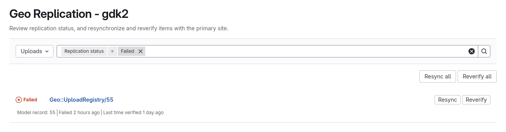
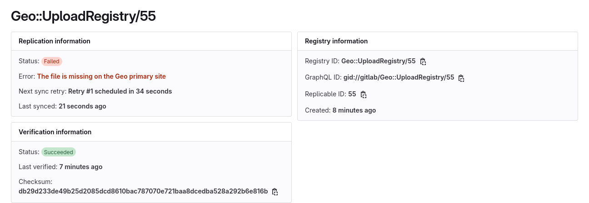



- Tier: Premium, Ultimate
- Offering: GitLab Self-Managed



If you notice replication or verification failures in `Admin > Geo > Sites` or the [Sync status Rake task](common.md#sync-status-rake-task), you can try to resolve the failures with the following general steps:

1. Geo automatically retries failures. If the failures are new and few in number, or if you suspect the root cause is already resolved, then you can wait to see if the failures go away.
1. If failures were present for a long time, then many retries have already occurred, and the interval between automatic retries has increased to up to 4 hours depending on the type of failure. If you suspect the root cause is already resolved, you can [manually retry replication or verification](#manually-retry-replication-or-verification) to avoid the wait.
1. If the failures persist, use the following sections to try to resolve them.

## Manually retry replication or verification

In [Rails console](../../../operations/rails_console.md#starting-a-rails-console-session) in a
secondary Geo site, you can:

- [Manually resync and reverify individual components](#resync-and-reverify-individual-components)
- [Manually resync and reverify multiple components](#resync-and-reverify-multiple-components)

### Resync and reverify individual components

On the secondary site, visit **Admin** > **Geo** > **Replication** to force a resync or reverify of individual items.

However, if this doesn't work, you can perform the same action using the Rails console. The
following sections describe how to use internal application commands in the
[Rails console](../../../operations/rails_console.md#starting-a-rails-console-session) to cause
replication or verification for individual records synchronously or asynchronously.

#### Obtaining a Replicator instance



Commands that change data can cause damage if not run correctly or under the right conditions.
Always run commands in a test environment first and have a backup instance ready to restore.



Before you can perform any sync or verify operations, you need to obtain a Replicator instance.

First, [start a Rails console session](../../../operations/rails_console.md#starting-a-rails-console-session)
in a **primary** or **secondary** site, depending on what you want to do.

**Primary** site:

- You can checksum a resource

**Secondary** site:

- You can sync a resource
- You can checksum a resource and verify that checksum against the primary site's checksum

Next, run one of the following snippets to get a Replicator instance.

##### Given a model record's ID

- Replace `123` with the actual ID.
- Replace `Packages::PackageFile` with any of the
  [Geo data type Model classes](#geo-data-type-model-classes).

```ruby
model_record = Packages::PackageFile.find_by(id: 123)
replicator = model_record.replicator
```

##### Given a registry record's ID

- Replace `432` with the actual ID. A Registry record may or may not have the same ID
  value as the Model record that it tracks.
- Replace `Geo::PackageFileRegistry` with any of the [Geo Registry classes](#geo-registry-classes).

In a secondary Geo site:

```ruby
registry_record = Geo::PackageFileRegistry.find_by(id: 432)
replicator = registry_record.replicator
```

##### Given an error message in a Registry record's `last_sync_failure`

- Replace `Geo::PackageFileRegistry` with any of the [Geo Registry classes](#geo-registry-classes).
- Replace `error message here` with the actual error message.

```ruby
registry = Geo::PackageFileRegistry.find_by("last_sync_failure LIKE '%error message here%'")
replicator = registry.replicator
```

##### Given an error message in a Registry record's `verification_failure`

- Replace `Geo::PackageFileRegistry` with any of the [Geo Registry classes](#geo-registry-classes).
- Replace `error message here` with the actual error message.

```ruby
registry = Geo::PackageFileRegistry.find_by("verification_failure LIKE '%error message here%'")
replicator = registry.replicator
```

#### Performing operations with a Replicator instance

After you have a Replicator instance stored in a `replicator` variable, you can perform many
operations:

##### Sync in the console

This snippet only works in a **secondary** site.

This executes the sync code synchronously in the console, so you can observe how long it takes to
sync a resource, or view a full error backtrace.

```ruby
replicator.sync
```

Optionally, make the log level of the console more verbose than the configured log level, and then
perform a sync:

```ruby
Rails.logger.level = :debug
```

##### Checksum or verify in the console

This snippet works in any **primary** or **secondary** site.

In a **primary** site, it checksums the resource and stores the result in the main GitLab
database. In a **secondary** site, it checksums the resource, compares it against the checksum in
the main GitLab database (generated by the **primary** site), and stores the result in the Geo
Tracking database.

This executes the checksum and verification code synchronously in the console, so you can observe
how long it takes, or view a full error backtrace.

```ruby
replicator.verify
```

##### Sync in a Sidekiq job

This snippet only works in a **secondary** site.

It enqueues a job for Sidekiq to perform a [sync](#sync-in-the-console) of the resource.

```ruby
replicator.enqueue_sync
```

##### Verify in a Sidekiq job

This snippet works in any **primary** or **secondary** site.

It enqueues a job for Sidekiq to perform a
[checksum or verify](#checksum-or-verify-in-the-console) of the resource.

```ruby
replicator.verify_async
```

##### Get a model record

This snippet works in any **primary** or **secondary** site.

```ruby
replicator.model_record
```

##### Get a registry record

This snippet only works in a **secondary** site because registry tables are stored in the Geo
Tracking DB.

```ruby
replicator.registry
```

#### Geo data type Model classes

A Geo data type is a specific class of data that is required by one or more GitLab features to store
relevant data and is replicated by Geo to secondary sites.

- **Blob types**:
  - `Ci::JobArtifact`
  - `Ci::PipelineArtifact`
  - `Ci::SecureFile`
  - `LfsObject`
  - `MergeRequestDiff`
  - `Packages::PackageFile`
  - `PagesDeployment`
  - `Terraform::StateVersion`
  - `Upload`
  - `DependencyProxy::Manifest`
  - `DependencyProxy::Blob`
- **Git Repository types**:
  - `DesignManagement::Repository`
  - `ProjectRepository`
  - `ProjectWikiRepository`
  - `SnippetRepository`
  - `GroupWikiRepository`
- **Other types**:
  - `ContainerRepository`

The main kinds of classes are Registry, Model, and Replicator. If you have an instance of one of
these classes, you can get the others. The Registry and Model mostly manage PostgreSQL DB state. The
Replicator knows how to replicate or verify the non-PostgreSQL data (file/Git repository/Container
repository).

#### Geo Registry classes

In the context of GitLab Geo, a **registry record** refers to registry tables in
the Geo tracking database. Each record tracks a single replicable in the main
GitLab database, such as an LFS file, or a project Git repository. The Rails
models that correspond to Geo registry tables that can be queried are:

- **Blob types**:
  - `Geo::CiSecureFileRegistry`
  - `Geo::DependencyProxyBlobRegistry`
  - `Geo::DependencyProxyManifestRegistry`
  - `Geo::JobArtifactRegistry`
  - `Geo::LfsObjectRegistry`
  - `Geo::MergeRequestDiffRegistry`
  - `Geo::PackageFileRegistry`
  - `Geo::PagesDeploymentRegistry`
  - `Geo::PipelineArtifactRegistry`
  - `Geo::ProjectWikiRepositoryRegistry`
  - `Geo::SnippetRepositoryRegistry`
  - `Geo::TerraformStateVersionRegistry`
  - `Geo::UploadRegistry`
- **Git Repository types**:
  - `Geo::DesignManagementRepositoryRegistry`
  - `Geo::ProjectRepositoryRegistry`
  - `Geo::ProjectWikiRepositoryRegistry`
  - `Geo::SnippetRepositoryRegistry`
  - `Geo::GroupWikiRepositoryRegistry`
- **Other types**:
  - `Geo::ContainerRepositoryRegistry`

### Resync and reverify multiple components



- Bulk resync and reverify [added](https://gitlab.com/gitlab-org/gitlab/-/issues/364729) in GitLab 16.5.





Commands that change data can cause damage if not run correctly or under the right conditions.
Always run commands in a test environment first and have a backup instance ready to restore.



The following sections describe how to use internal application commands in the
[Rails console](../../../operations/rails_console.md#starting-a-rails-console-session) to cause bulk
replication or verification.

#### Resync all resources of one component

You can schedule a full resync of all resources of one component from the UI:

1. On the left sidebar, at the bottom, select **Admin**. If you've [turned on the new navigation](../../../../user/interface_redesign.md#turn-new-navigation-on-or-off), in the upper-right corner, select your avatar and then select **Admin**.
1. Select **Geo** > **Sites**.
1. Under **Replication details**, select the desired component.
1. Select **Resync all**.

Alternatively,
[start a Rails console session](../../../operations/rails_console.md#starting-a-rails-console-session)
**on the secondary Geo site** to gather more information, or execute these operations manually using
the snippets below.



Commands that change data can cause damage if not run correctly or under the right conditions.
Always run commands in a test environment first and have a backup instance ready to restore.



##### Sync all resources of one component that failed to sync

The following script:

- Loops over all failed repositories.
- Displays the Geo sync and verification metadata, including the reasons for the last failure.
- Attempts to resync the repository.
- Reports back if a failure occurs, and why.
- Might take some time to complete. Each repository check must complete
  before reporting back the result. If your session times out, take measures
  to allow the process to continue running such as starting a `screen` session,
  or running it using [Rails runner](../../../operations/rails_console.md#using-the-rails-runner)
  and `nohup`.

```ruby
Geo::ProjectRepositoryRegistry.failed.find_each do |registry|
   begin
     puts "ID: #{registry.id}, Project ID: #{registry.project_id}, Last Sync Failure: '#{registry.last_sync_failure}'"
     registry.replicator.sync
     puts "Sync initiated for registry ID: #{registry.id}"
   rescue => e
     puts "ID: #{registry.id}, Project ID: #{registry.project_id}, Failed: '#{e}'", e.backtrace.join("\n")
   end
end; nil
```

#### Reverify one component on all sites

If the **primary** site's checksums are in question, then you need to make the **primary** site recalculate checksums. A "full re-verification" is then achieved, because after each checksum is recalculated on a **primary** site, events are generated which propagate to all **secondary** sites, causing them to recalculate their checksums and compare values. Any mismatch marks the registry as `sync failed`, which causes sync retries to be scheduled.

The UI does not provide a button to do a full re-verification. You can simulate this by setting your **primary** site's `Re-verification interval` to 1 (day) in **Admin** > **Geo** > **Nodes** > **Edit**. The **primary** site will then recalculate the checksum of any resource that has been checksummed more than 1 day ago.

Optionally, you can do this manually:

1. SSH into a GitLab Rails node in the **primary** site.
1. Open the [Rails console](../../../operations/rails_console.md#starting-a-rails-console-session).
1. Replacing `Upload` with any of the [Geo data type Model classes](#geo-data-type-model-classes),
   mark all resources as `pending verification`:

   ```ruby
   Upload.verification_state_table_class.each_batch do |relation|
     relation.update_all(verification_state: 0)
   end
   ```

##### Reverify all resources that failed to checksum on the primary site

The system automatically reverifies all resources that failed to checksum on the primary site, but
it uses a progressive backoff scheme to avoid an excessive volume of failures.

Optionally, for example if you've completed an attempted intervention, you can manually trigger
reverification sooner:

1. SSH into a GitLab Rails node in the **primary** site.
1. Open the [Rails console](../../../operations/rails_console.md#starting-a-rails-console-session).
1. Replacing `Upload` with any of the [Geo data type Model classes](#geo-data-type-model-classes),
   mark all resources as `pending verification`:

   ```ruby
   Upload.verification_state_table_class.where(verification_state: 3).each_batch do |relation|
     relation.update_all(verification_state: 0)
   end
   ```

#### Reverify one component on one secondary site

If you believe the **primary** site checksums are correct, you can schedule a reverification of one
component on one **secondary** site from the UI:

1. On the left sidebar, at the bottom, select **Admin**. If you've [turned on the new navigation](../../../../user/interface_redesign.md#turn-new-navigation-on-or-off), in the upper-right corner, select your avatar and then select **Admin**.
1. Select **Geo** > **Sites**.
1. Under **Replication details**, select the desired component.
1. Select **Reverify all**.

## Errors

### Message: `The file is missing on the Geo primary site`

The sync failure `The file is missing on the Geo primary site` is common when
setting up a secondary Geo site for the first time, which is caused by data
inconsistencies on the primary site.

Data inconsistencies and missing files can occur due to system or human errors
when operating GitLab. For example, an instance administrator manually deletes
several artifacts on the local file system. Such changes are not properly
propagated to the database and result in inconsistencies. These inconsistencies
remain and can cause frictions. Geo secondaries might continue to try
replicating those files as they are still referenced in the database but no
longer exist.



In case of a recent migration from local to object storage, see the dedicated
[object storage troubleshooting section](../../../object_storage.md#inconsistencies-after-migrating-to-object-storage).



#### Identify inconsistencies

When missing files or inconsistencies are present, you can encounter entries in `geo.log` such as the following. Take note of the field `"primary_missing_file" : true`:

```json
{
   "bytes_downloaded" : 0,
   "class" : "Geo::BlobDownloadService",
   "correlation_id" : "01JT69C1ECRBEMZHA60E5SAX8E",
   "download_success" : false,
   "download_time_s" : 0.196,
   "gitlab_host" : "gitlab.example.com",
   "mark_as_synced" : false,
   "message" : "Blob download",
   "model_record_id" : 55,
   "primary_missing_file" : true,
   "reason" : "Not Found",
   "replicable_name" : "upload",
   "severity" : "WARN",
   "status_code" : 404,
   "time" : "2025-05-01T16:02:44.836Z",
   "url" : "http://gitlab.example.com/api/v4/geo/retrieve/upload/55"
}
```

The same errors are also reflected in the UI under **Admin** > **Geo** > **Sites** when reviewing the synchronization status of specific replicables. In this scenario, a specific upload is missing:





#### Clean up inconsistencies



Ensure you have a recent and working backup at hand before issuing any deletion commands.



To remove those errors, first identify which particular resources are affected. Then, run the appropriate `destroy` commands to ensure the deletion is propagated across all Geo sites and their databases. Based on the previous scenario, an **upload** is causing those errors which is used as an example below.

1. Map the identified inconsistencies to their respective [Geo Model class](#geo-data-type-model-classes) name. The class name is needed in the following steps. In this scenario, for uploads it corresponds to `Upload`.
1. Start a [Rails console](../../../operations/rails_console.md#starting-a-rails-console-session) on the **Geo primary site**.
1. Query all resources where verification failed due to missing files based on the *Geo Model class* of the previous step. Adjust or remove the `limit(20)` to display more results. Observe how the listed resources should match the failed ones shown in the UI:

   ```ruby
   Upload.verification_failed.where("verification_failure like '%File is not checksummable%'").limit(20)

   => #<Upload:0x00007b362bb6c4e8
    id: 55,
    size: 13346,
    path: "503d99159e2aa8a3ac23602058cfdf58/openbao.png",
    checksum: "db29d233de49b25d2085dcd8610bac787070e721baa8dcedba528a292b6e816b",
    model_id: 1,
    model_type: "Project",
    uploader: "FileUploader",
    created_at: Thu, 01 May 2025 15:54:10.549178000 UTC +00:00,
    store: 1,
    mount_point: nil,
    secret: "[FILTERED]",
    version: 2,
    uploaded_by_user_id: 1,
    organization_id: nil,
    namespace_id: nil,
    project_id: 1,
    verification_checksum: nil>
   ```

1. Optionally, use the `id` of the affected resources to determine if they are still needed:

   ```ruby
   Upload.find(55)

   => #<Upload:0x00007b362bb6c4e8
    id: 55,
    size: 13346,
    path: "503d99159e2aa8a3ac23602058cfdf58/openbao.png",
    checksum: "db29d233de49b25d2085dcd8610bac787070e721baa8dcedba528a292b6e816b",
    model_id: 1,
    model_type: "Project",
    uploader: "FileUploader",
    created_at: Thu, 01 May 2025 15:54:10.549178000 UTC +00:00,
    store: 1,
    mount_point: nil,
    secret: "[FILTERED]",
    version: 2,
    uploaded_by_user_id: 1,
    organization_id: nil,
    namespace_id: nil,
    project_id: 1,
    verification_checksum: nil>
   ```

   - If you determine that the affected resources need to be recovered, then you can explore the following options (non-exhaustive) to recover them:
     - Check if the secondary site has the object and manually copy them to the primary.
     - Look through old backups and manually copy the object back into the primary site.
     - Spot check some to try to determine that it's probably fine to destroy the records, for example, if they are all very old artifacts, then maybe they are not critical data.

1. Use the `id` of the identified resources to properly delete them individually or in bulk by using `destroy`. Ensure to use the appropriate *Geo Model class* name.
   - Delete individual resources:

     ```ruby
     Upload.find(55).destroy
     ```

   - Delete all affected resources:

     ```ruby
     def destroy_uploads_not_checksummable
       uploads = Upload.verification_failed.where("verification_failure like '%File is not checksummable%'");1
       puts "Found #{uploads.count} resources that failed verification with 'File is not checksummable'."
       puts "Enter 'y' to continue: "
       prompt = STDIN.gets.chomp
       if prompt != 'y'
         puts "Exiting without action..."
         return
       end

       puts "Destroying all..."
       uploads.destroy_all
     end

     destroy_uploads_not_checksummable
     ```

Repeat the steps for all affected resources and Geo data types.

### Message: `"Error during verification","error":"File is not checksummable"`

The error `"Error during verification","error":"File is not checksummable"` is caused by inconsistencies on the primary site. Follow the instructions provided in [The file is missing on the Geo primary site](#message-the-file-is-missing-on-the-geo-primary-site).

### Failed verification of Uploads on the primary Geo site

If verification of some uploads is failing on the primary Geo site with `verification_checksum = nil` and with `verification_failure` containing ``Error during verification: undefined method `underscore' for NilClass:Class`` or ``The model which owns this Upload is missing.``, this is due to orphaned Uploads. The parent record owning the Upload (the upload's "model") has somehow been deleted, but the Upload record still exists. This is usually due to a bug in the application, introduced by implementing bulk delete of the "model" while forgetting to bulk delete its associated Upload records. These verification failures are therefore not failures to verify, rather, the errors are a result of bad data in Postgres.

You can find these errors in the `geo.log` file on the primary Geo site.

To confirm that model records are missing, you can run a Rake task on the primary Geo site:

```shell
sudo gitlab-rake gitlab:uploads:check
```

You can delete these Upload records on the primary Geo site to get rid of these failures by running the following script from the [Rails console](../../../operations/rails_console.md):

```ruby
def delete_orphaned_uploads(dry_run: true)
  if dry_run
    p "This is a dry run. Upload rows will only be printed."
  else
    p "This is NOT A DRY RUN! Upload rows will be deleted from the DB!"
  end

  subquery = Geo::UploadState.where("(verification_failure LIKE 'Error during verification: The model which owns this Upload is missing.%' OR verification_failure = 'Error during verification: undefined method `underscore'' for NilClass:Class') AND verification_checksum IS NULL")
  uploads = Upload.where(upload_state: subquery)
  p "Found #{uploads.count} uploads with a model that does not exist"

  uploads_deleted = 0
  begin
    uploads.each do |upload|

      if dry_run
        p upload
      else
        uploads_deleted=uploads_deleted + 1
        p upload.destroy!
      end
    rescue => e
      puts "checking upload #{upload.id} failed with #{e.message}"
    end
  end

  p "#{uploads_deleted} remote objects were destroyed." unless dry_run
end
```

The previous script defines a method named `delete_orphaned_uploads` which you can call like this to do a dry run:

```ruby
delete_orphaned_uploads(dry_run: true)
```

And to actually delete the orphaned upload rows:

```ruby
delete_orphaned_uploads(dry_run: false)
```

### Error: `Error syncing repository: 13:fatal: could not read Username`

The `last_sync_failure` error
`Error syncing repository: 13:fatal: could not read Username for 'https://gitlab.example.com': terminal prompts disabled`
indicates that JWT authentication is failing during a Geo clone or fetch request.

First, check that system clocks are synced. Run the [Health check Rake task](common.md#health-check-rake-task), or
manually check that `date`, on all Sidekiq nodes on the secondary site and all Puma nodes on the primary site, are the
same.

If system clocks are synced, then the JWT token may be expiring while Git fetch is performing calculations between its
two separate HTTP requests. See [issue 464101](https://gitlab.com/gitlab-org/gitlab/-/issues/464101), which existed in
all GitLab versions until it was fixed in GitLab 17.1.0, 17.0.5, and 16.11.7.

To validate if you are experiencing this issue:

1. Monkey patch the code in a [Rails console](../../../operations/rails_console.md#starting-a-rails-console-session) to increase the validity period of the token from 1 minute to 10 minutes. Run
   this in Rails console on the secondary site:

   ```ruby
   module Gitlab; module Geo; class BaseRequest
     private
     def geo_auth_token(message)
       signed_data = Gitlab::Geo::SignedData.new(geo_node: requesting_node, validity_period: 10.minutes).sign_and_encode_data(message)

       "#{GITLAB_GEO_AUTH_TOKEN_TYPE} #{signed_data}"
     end
   end;end;end
   ```

1. In the same Rails console, resync an affected project:

   ```ruby
   Project.find_by_full_path('<mygroup/mysubgroup/myproject>').replicator.resync
   ```

1. Look at the sync state:

   ```ruby
   Project.find_by_full_path('<mygroup/mysubgroup/myproject>').replicator.registry
   ```

1. If `last_sync_failure` no longer includes the error `fatal: could not read Username`, then you are
   affected by this issue. The state should now be `2`, which means that it's synced. If so, then you should upgrade to
   a GitLab version with the fix. You may also wish to upvote or comment on
   [issue 466681](https://gitlab.com/gitlab-org/gitlab/-/issues/466681) which would have reduced the severity of this
   issue.

To workaround the issue, you must hot-patch all Sidekiq nodes in the secondary site to extend the JWT expiration time:

1. Edit `/opt/gitlab/embedded/service/gitlab-rails/ee/lib/gitlab/geo/signed_data.rb`.
1. Find `Gitlab::Geo::SignedData.new(geo_node: requesting_node)` and add `, validity_period: 10.minutes` to it:

   ```diff
   - Gitlab::Geo::SignedData.new(geo_node: requesting_node)
   + Gitlab::Geo::SignedData.new(geo_node: requesting_node, validity_period: 10.minutes)
   ```

1. Restart Sidekiq:

   ```shell
   sudo gitlab-ctl restart sidekiq
   ```

1. Unless you upgrade to a version containing the fix, you would have to repeat this workaround after every GitLab upgrade.

### Error: `Error syncing repository: 13:creating repository: cloning repository: exit status 128`

You might see this error for projects that do not sync successfully.

Exit code 128 during repository creation means Git encountered a fatal error while cloning. This could be due to repository corruption, network issues, authentication problems, resource limits or because the project does not have an associated Git repository. More details about the specific cause for such failures can be found in the Gitaly logs.

When unsure where to start, run an integrity check on the source repository on the Primary site by [executing the `git fsck` command manually on the command line](../../../../administration/repository_checks.md#run-a-check-using-the-command-line).

### Error: `gitmodulesUrl: disallowed submodule url`

Some project repositories consistently fail to sync with the error
`Error syncing repository: 13:creating repository: cloning repository: exit status 128`. However,
for some repositories, the specific error message in the Gitaly logs is different: `gitmodulesUrl: disallowed submodule url`.
This failure happens when repositories contain invalid submodule URLs in their `.gitmodules` files.

The problem is in the repository's commit history. Submodule URLs in `.gitmodules` files contain
invalid formats, using `:` instead of `/` in the path:

- Invalid: `https://example.gitlab.com:group/project.git`
- Valid: `https://example.gitlab.com/group/project.git`

This issue is known in GitLab 17.0 and later, and is a result of more strict repository consistency
checks. This new behavior results from a change in Git itself, where this check was added. It is not
specific to GitLab Geo or Gitaly. For more information, see
[issue 468560](https://gitlab.com/gitlab-org/gitlab/-/issues/468560).

#### Workaround



If the problematic repositories are part of a fork network, this blob removal method might not work as blobs
contained in object pools cannot be removed this way.



You should remove the problematic blobs from the repository:

1. Back up the projects before proceeding, using
   the [project export option](../../../../user/project/settings/import_export.md).

1. Identify the problematic blob IDs using one of these methods:

   - Use `git fsck`: Clone the repository, then run `git fsck` to confirm the issue:

     ```shell
     git clone https://example.gitlab.com/group/project.git
     cd project
     git fsck
     ```

     The output shows the problematic blob:

     ```plaintext
     Checking object directories: 100% (256/256), done.
     error in blob <SHA>: gitmodulesUrl: disallowed submodule url: https://example.gitlab.com:group/project.git
     Checking objects: 100% (12/12), done.
     ```

   - Check the Gitaly logs. Look for error messages containing `gitmodulesUrl`
     to find the specific blob SHA.

1. Remove the offending blobs using the process documented in the
   [repository size management guide](../../../../user/project/repository/repository_size.md#remove-blobs).

1. After removing the blobs, check the `.gitmodules` files in your current branch for
   invalid URLs. Edit the files to change URLs from
   `https://example.gitlab.com:group/project.git` (with a colon) to `https://example.gitlab.com/group/project.git`
   (with a slash) and commit the changes.



After the fix, all developers working on the affected projects must remove their current local copies
and clone fresh repositories. Otherwise, they might reintroduce the offending blobs when pushing changes.



### Error: `fetch remote: signal: terminated: context deadline exceeded` at exactly 3 hours

If Git fetch fails at exactly three hours while syncing a Git repository:

1. Edit `/etc/gitlab/gitlab.rb` to increase the Git timeout from the default of 10800 seconds:

   ```ruby
   # Git timeout in seconds
   gitlab_rails['gitlab_shell_git_timeout'] = 21600
   ```

1. Reconfigure GitLab:

   ```shell
   sudo gitlab-ctl reconfigure
   ```

### Error `Failed to open TCP connection to localhost:5000` on secondary when configuring registry replication

You may face the following error when configuring container registry replication on the secondary site:

```plaintext
Failed to open TCP connection to localhost:5000 (Connection refused - connect(2) for \"localhost\" port 5000)"
```

It happens if the container registry is not enabled on the secondary site. To fix it, check that the container registry
is [enabled on the secondary site](../../../packages/container_registry.md#enable-the-container-registry). If the [Let's Encrypt integration is disabled](https://docs.gitlab.com/omnibus/settings/ssl/#configure-https-manually), container registry is disabled as well, and you must [configure it manually](../../../packages/container_registry.md#configure-container-registry-under-its-own-domain).

### Message: `Synchronization failed - Error syncing repository`



If large repositories are affected by this problem,
their resync may take a long time and cause significant load on your Geo sites,
storage and network systems.



The following error message indicates a consistency check error when syncing the repository:

```plaintext
Synchronization failed - Error syncing repository [..] fatal: fsck error in packed object
```

Several issues can trigger this error. For example, problems with email addresses:

```plaintext
Error syncing repository: 13:fetch remote: "error: object <SHA>: badEmail: invalid author/committer line - bad email
   fatal: fsck error in packed object
   fatal: fetch-pack: invalid index-pack output
```

Another issue that can trigger this error is `object <SHA>: hasDotgit: contains '.git'`. Check the specific errors because you might have more than one problem across all
your repositories.

A second synchronization error can also be caused by repository check issues:

```plaintext
Error syncing repository: 13:Received RST_STREAM with error code 2.
```

These errors can be observed by [immediately syncing all failed repositories](#sync-all-resources-of-one-component-that-failed-to-sync).

Removing the malformed objects causing consistency errors involves rewriting the repository history, which is usually not an option.

To ignore these consistency checks, reconfigure Gitaly **on the secondary Geo sites** to ignore these `git fsck` issues.
The following configuration example:

- [Uses the new configuration structure](../../../../update/versions/gitlab_16_changes.md#gitaly-configuration-structure-change) required from GitLab 16.0.
- Ignores five common check failures.

[The Gitaly documentation has more details](../../../gitaly/consistency_checks.md)
about other Git check failures and earlier versions of GitLab.

```ruby
gitaly['configuration'] = {
  git: {
    config: [
      { key: "fsck.duplicateEntries", value: "ignore" },
      { key: "fsck.badFilemode", value: "ignore" },
      { key: "fsck.missingEmail", value: "ignore" },
      { key: "fsck.badEmail", value: "ignore" },
      { key: "fsck.hasDotgit", value: "ignore" },
      { key: "fetch.fsck.duplicateEntries", value: "ignore" },
      { key: "fetch.fsck.badFilemode", value: "ignore" },
      { key: "fetch.fsck.missingEmail", value: "ignore" },
      { key: "fetch.fsck.badEmail", value: "ignore" },
      { key: "fetch.fsck.hasDotgit", value: "ignore" },
      { key: "receive.fsck.duplicateEntries", value: "ignore" },
      { key: "receive.fsck.badFilemode", value: "ignore" },
      { key: "receive.fsck.missingEmail", value: "ignore" },
      { key: "receive.fsck.badEmail", value: "ignore" },
      { key: "receive.fsck.hasDotgit", value: "ignore" },
    ],
  },
}
```

A comprehensive list of `fsck` errors can be found in the [Git documentation](https://git-scm.com/docs/git-fsck#_fsck_messages).

GitLab 16.1 and later [include an enhancement](https://gitlab.com/gitlab-org/gitaly/-/merge_requests/5879) that might resolve some of these issues.

[Gitaly issue 5625](https://gitlab.com/gitlab-org/gitaly/-/issues/5625) proposes to ensure that Geo replicates repositories even if the source repository contains
problematic commits.

### Related error `does not appear to be a git repository`

You can also get the error message `Synchronization failed - Error syncing repository` along with the following log messages.
This error indicates that the expected Geo remote is not present in the `.git/config` file
of a repository on the secondary Geo site's file system:

```json
{
  "created": "@1603481145.084348757",
  "description": "Error received from peer unix:/var/opt/gitlab/gitaly/gitaly.socket",
  …
  "grpc_message": "exit status 128",
  "grpc_status": 13
}
{  …
  "grpc.request.fullMethod": "/gitaly.RemoteService/FindRemoteRootRef",
  "grpc.request.glProjectPath": "<namespace>/<project>",
  …
  "level": "error",
  "msg": "fatal: 'geo' does not appear to be a git repository
          fatal: Could not read from remote repository. …",
}
```

To solve this:

1. Sign in on the web interface for the secondary Geo site.

1. Back up [the `.git` folder](../../../repository_storage_paths.md#translate-hashed-storage-paths).

1. Optional. [Spot-check](../../../logs/log_parsing.md#find-all-projects-affected-by-a-fatal-git-problem)
   a few of those IDs whether they indeed correspond
   to a project with known Geo replication failures.
   Use `fatal: 'geo'` as the `grep` term and the following API call:

   ```shell
   curl --request GET --header "PRIVATE-TOKEN: <your_access_token>" "https://gitlab.example.com/api/v4/projects/<first_failed_geo_sync_ID>"
   ```

1. Enter the [Rails console](../../../operations/rails_console.md) and run:

   ```ruby
   failed_project_registries = Geo::ProjectRepositoryRegistry.failed

   if failed_project_registries.any?
     puts "Found #{failed_project_registries.count} failed project repository registry entries:"

     failed_project_registries.each do |registry|
       puts "ID: #{registry.id}, Project ID: #{registry.project_id}, Last Sync Failure: '#{registry.last_sync_failure}'"
     end
   else
     puts "No failed project repository registry entries found."
   end
   ```

1. Run the following commands to execute a new sync for each project:

   ```ruby
   failed_project_registries.each do |registry|
     registry.replicator.sync
     puts "Sync initiated for registry ID: #{registry.id}, Project ID: #{registry.project_id}"
   end
   ```

## Failures during backfill

During a [backfill](../../_index.md#backfill), failures are scheduled to be retried at the end
of the backfill queue, therefore these failures only clear up **after** the backfill completes.

## Message: `unexpected disconnect while reading sideband packet`

Unstable networking conditions can cause Gitaly to fail when trying to fetch large repository
data from the primary site. Those conditions can result in this error:

```plaintext
curl 18 transfer closed with outstanding read data remaining & fetch-pack:
unexpected disconnect while reading sideband packet
```

This error is more likely to happen if a repository has to be
replicated from scratch between sites.

Geo retries several times, but if the transmission is consistently interrupted
by network hiccups, an alternative method such as `rsync` can be used to circumvent `git` and
create the initial copy of any repository that fails to be replicated by Geo.

We recommend transferring each failing repository individually and checking for consistency
after each transfer. Follow the [`rsync` to another server instructions](../../../operations/moving_repositories.md#use-rsync-to-another-server)
to transfer each affected repository from the primary to the secondary site.

## Find repository check failures in a Geo secondary site



All repositories data types have been migrated to the Geo Self-Service Framework in GitLab 16.3. There is an [issue to implement this functionality back in the Geo Self-Service Framework](https://gitlab.com/gitlab-org/gitlab/-/issues/426659).



For GitLab 16.2 and earlier:

When [enabled for all projects](../../../repository_checks.md#enable-repository-checks-for-all-projects), [Repository checks](../../../repository_checks.md) are also performed on Geo secondary sites. The metadata is stored in the Geo tracking database.

Repository check failures on a Geo secondary site do not necessarily imply a replication problem. Here is a general approach to resolve these failures.

1. Find affected repositories as mentioned below, as well as their [logged errors](../../../repository_checks.md#what-to-do-if-a-check-failed).
1. Try to diagnose specific `git fsck` errors. The range of possible errors is wide, try putting them into search engines.
1. Test typical functions of the affected repositories. Pull from the secondary, view the files.
1. Check if the primary site's copy of the repository has an identical `git fsck` error. If you are planning a failover, then consider prioritizing that the secondary site has the same information that the primary site has. Ensure you have a backup of the primary, and follow [planned failover guidelines](../../disaster_recovery/planned_failover.md).
1. Push to the primary and check if the change gets replicated to the secondary site.
1. If replication is not automatically working, try to manually sync the repository.

[Start a Rails console session](../../../operations/rails_console.md#starting-a-rails-console-session)
to enact the following, basic troubleshooting steps.



Commands that change data can cause damage if not run correctly or under the right conditions. Always run commands in a test environment first and have a backup instance ready to restore.



### Get the number of repositories that failed the repository check

```ruby
Geo::ProjectRegistry.where(last_repository_check_failed: true).count
```

### Find the repositories that failed the repository check

```ruby
Geo::ProjectRegistry.where(last_repository_check_failed: true)
```

## Hard delete a repository from Gitaly Cluster and resync



This procedure is risky, and heavy-handed. Use it as a last resort only when other
troubleshooting methods have failed. This procedure causes temporary data loss until the
repository is resynced.



This procedure deletes the repository from the secondary site's Gitaly cluster, and re-syncs it.
You should consider using it only if you understand the risks, and if these conditions are all true:

- `git clone` is working for a repository on the primary site.
- `p.replicator.sync_repository` (where `p` is a project model instance) logs a Gitaly error on a secondary site.
- Standard troubleshooting has not resolved the issue.

Prerequisites:

- Ensure you have administrative access to both the secondary site's Rails console and Praefect nodes.
- Verify that the repository is accessible and working correctly on the primary site.
- Have a backup plan in case you must reverse this procedure.

To do this:

1. Sign in to the Rails console in the secondary site.
1. Instantiate a project model, and save it to a variable `p`, using one of these options:

   - If you know the affected project ID (for example, `60087`):

     ```ruby
     p = Project.find(60087)
     ```

   - If you know the affected project path in GitLab (for example, `my-group/my-project`):

     ```ruby
     p = Project.find_by_full_path('my-group/my-project')
     ```

1. Output the project Git repository's virtual storage, and note it for later:

   ```ruby
   p.repository.storage
   ```

   Example output:

   ```ruby
   irb(main):002:0> p.repository.storage
   => "default"
   ```

1. Output the project Git repository's relative path, and note it for later:

   ```ruby
   p.repository.disk_path + '.git'
   ```

   Example output:

   ```ruby
   irb(main):003:0> p.repository.disk_path + '.git'
   => "@hashed/66/b2/66b2fc8562b3432399acc2d0108fcd2782b32bd31d59226c7a03a20b32c76ee8.git"
   ```

1. SSH into a Praefect node in the secondary site.
1. Follow the procedure to
   [Manually remove repositories from Gitaly Cluster](../../../gitaly/praefect/recovery.md#manually-remove-repositories),
   using the virtual storage and relative path you noted in the previous steps.

   The Git repository on the secondary site is now deleted.

1. In the Rails console, before you resync, set a correlation ID. This ID helps you search all logs
   related to the commands you run in this session:

   ```ruby
   Gitlab::ApplicationContext.push({})
   ```

   Example output:

   ```ruby
   [2] pry(main)> Gitlab::ApplicationContext.push({})
   => #<Labkit::Context:0x0000000122aa4060 @data={"correlation_id"=>"53da64ae800bd4794a2b61ab1c80b028"}>
   ```

1. Sync the project Git repository:

   ```ruby
   p.replicator.sync_repository
   ```

The Git repository should now be resynced from the primary site to the secondary site. Monitor the sync
process through the Geo admin interface, or by checking the repository's sync status in the Rails console.

## Resetting Geo **secondary** site replication

If you get a **secondary** site in a broken state and want to reset the replication state,
to start again from scratch, there are a few steps that can help you:

1. Stop Sidekiq and the Geo Log Cursor.

   It's possible to make Sidekiq stop gracefully, but making it stop getting new jobs and
   wait until the current jobs to finish processing.

   You need to send a **SIGTSTP** kill signal for the first phase and them a **SIGTERM**
   when all jobs have finished. Otherwise just use the `gitlab-ctl stop` commands.

   ```shell
   gitlab-ctl status sidekiq
   # run: sidekiq: (pid 10180) <- this is the PID you will use
   kill -TSTP 10180 # change to the correct PID

   gitlab-ctl stop sidekiq
   gitlab-ctl stop geo-logcursor
   ```

   You can watch the [Sidekiq logs](../../../logs/_index.md#sidekiq-logs) to know when Sidekiq jobs processing has finished:

   ```shell
   gitlab-ctl tail sidekiq
   ```

1. Clear Gitaly and Gitaly Cluster (Praefect) data.

   

   

   ```shell
   mv /var/opt/gitlab/git-data/repositories /var/opt/gitlab/git-data/repositories.old
   sudo gitlab-ctl reconfigure
   ```

   

   

   1. Optional. Disable the Praefect internal load balancer.
   1. Stop Praefect on each Praefect server:

      ```shell
      sudo gitlab-ctl stop praefect
      ```

   1. Reset the Praefect database:

      ```shell
      sudo /opt/gitlab/embedded/bin/psql -U praefect -d template1 -h localhost -c "DROP DATABASE praefect_production WITH (FORCE);"
      sudo /opt/gitlab/embedded/bin/psql -U praefect -d template1 -h localhost -c "CREATE DATABASE praefect_production WITH OWNER=praefect ENCODING=UTF8;"
      ```

   1. Rename/delete repository data from each Gitaly node:

      ```shell
      sudo mv /var/opt/gitlab/git-data/repositories /var/opt/gitlab/git-data/repositories.old
      sudo gitlab-ctl reconfigure
      ```

   1. On your Praefect deploy node run reconfigure to set up the database:

      ```shell
      sudo gitlab-ctl reconfigure
      ```

   1. Start Praefect on each Praefect server:

      ```shell
      sudo gitlab-ctl start praefect
      ```

   1. Optional. If you disabled it, reactivate the Praefect internal load balancer.

   

   

   

   You may want to remove the `/var/opt/gitlab/git-data/repositories.old` in the future
   as soon as you confirmed that you don't need it anymore, to save disk space.

   

1. Optional. Rename other data folders and create new ones.

   

   You may still have files on the **secondary** site that have been removed from the **primary** site, but this
   removal has not been reflected. If you skip this step, these files are not removed from the Geo **secondary** site.

   

   Any uploaded content (like file attachments, avatars, or LFS objects) is stored in a
   subfolder in one of these paths:

   - `/var/opt/gitlab/gitlab-rails/shared`
   - `/var/opt/gitlab/gitlab-rails/uploads`

   To rename all of them:

   ```shell
   gitlab-ctl stop

   mv /var/opt/gitlab/gitlab-rails/shared /var/opt/gitlab/gitlab-rails/shared.old
   mkdir -p /var/opt/gitlab/gitlab-rails/shared

   mv /var/opt/gitlab/gitlab-rails/uploads /var/opt/gitlab/gitlab-rails/uploads.old
   mkdir -p /var/opt/gitlab/gitlab-rails/uploads

   gitlab-ctl start postgresql
   gitlab-ctl start geo-postgresql
   ```

   Reconfigure to recreate the folders and make sure permissions and ownership
   are correct:

   ```shell
   gitlab-ctl reconfigure
   ```

1. Reset the Tracking Database.

   

   If you skipped the optional step 3, be sure both `geo-postgresql` and `postgresql` services are running.

   

   ```shell
   gitlab-rake db:drop:geo DISABLE_DATABASE_ENVIRONMENT_CHECK=1   # on a secondary app node
   gitlab-ctl reconfigure     # on the tracking database node
   gitlab-rake db:migrate:geo # on a secondary app node
   ```

1. Restart previously stopped services.

   ```shell
   gitlab-ctl start
   ```
