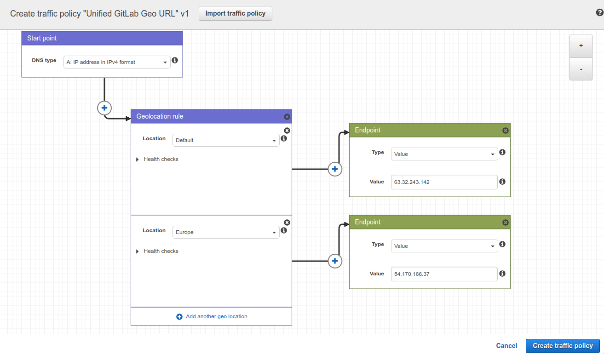
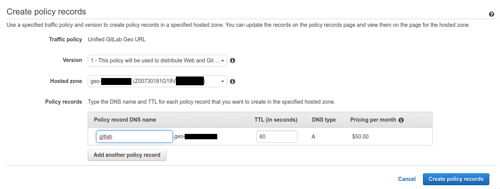

# Location-aware public URL

DETAILS:
**Tier:** Premium, Ultimate
**Offering:** Self-managed

With [Geo proxying for secondary sites](index.md), you can provide GitLab users
with a single URL that automatically uses the Geo site closest to them.
Users don't need to use different URLs or worry about read-only operations to take
advantage of closer Geo sites as they move.

With [Geo proxying for secondary sites](index.md) web and Git requests are proxied
from **secondary** sites to the **primary**.

## Prerequisites

This example creates a `gitlab.example.com` subdomain that automatically directs
requests:

- From Europe to a **secondary** site.
- From all other locations to the **primary** site.

The URLs to access each node by itself are:

- `primary.example.com` as a Geo **primary** site.
- `secondary.example.com` as a Geo **secondary** site.

For this example, you need:

- A working GitLab **primary** site that is accessible at `gitlab.example.com` _and_ `primary.example.com`.
- A working GitLab **secondary** site.
- A DNS zone managing your domain. Although the following instructions use
  [AWS Route53](https://aws.amazon.com/route53/)
  and [GCP cloud DNS](https://cloud.google.com/dns/), other services such as
  [Cloudflare](https://www.cloudflare.com/) can be used as well.

If you haven't yet set up a Geo _primary_ site and _secondary_ site, see the
[Geo setup instructions](../index.md#setup-instructions).

## AWS Route53

In this example, you use a Route53 Hosted Zone managing your domain for the Route53 setup.

In a Route53 Hosted Zone, traffic policies can be used to set up a variety of
routing configurations. To create a traffic policy:

1. Go to the
   [Route53 dashboard](https://console.aws.amazon.com/route53/home) and select
   **Traffic policies**.

1. Select **Create traffic policy**.
1. Fill in the **Policy Name** field with `Single Git Host` and select **Next**.
1. Leave **DNS type** as `A: IP Address in IPv4 format`.
1. Select **Connect to**, then select **Geolocation rule**.
1. For the first **Location**:
   1. Leave it as `Default`.
   1. Select **Connect to**, then select **New endpoint**.
   1. Choose **Type** `value` and fill it in with `<your **primary** IP address>`.

1. For the second **Location**:
   1. Choose `Europe`.
   1. Select **Connect to**, then select **New endpoint**.
   1. Choose **Type** `value` and fill it in with `<your **secondary** IP address>`.

   

1. Select **Create traffic policy**.
1. Fill in **Policy record DNS name** with `gitlab`.

   

1. Select **Create policy records**.

You have successfully set up a single host, like `gitlab.example.com`, which
distributes traffic to your Geo sites by geolocation.

## GCP

In this example, you create a GCP Cloud DNS zone managing your domain.

When creating Geo-Based record sets, GCP applies a nearest match for the source region when the source of the traffic doesn't match any policy items exactly. To create a Geo-Based record set:

1. Select **Network Services** > **Cloud DNS**.
1. Select the Zone configured for your domain.
1. Select **Add Record Set**.
1. Enter the DNS Name for your Location-aware public URL, for example, `gitlab.example.com`.
1. Select the **Routing Policy**: **Geo-Based**.
1. Select **Add Managed RRData**.
   1. Select **Source Region**: **us-central1**.
   1. Enter your `<**primary** IP address>`.
   1. Select **Done**.
1. Select **Add Managed RRData**.
   1. Select **Source Region**: **europe-west1**.
   1. Enter your `<**secondary** IP address>`.
   1. Select **Done**.
1. Select **Create**.

You have successfully set up a single host, like `gitlab.example.com`, which
distributes traffic to your Geo sites using a location-aware URL.

## Enable Geo proxying for secondary sites

After setting up a single URL to use for all Geo sites, continue with the [steps to enable Geo proxying for secondary sites](index.md).
