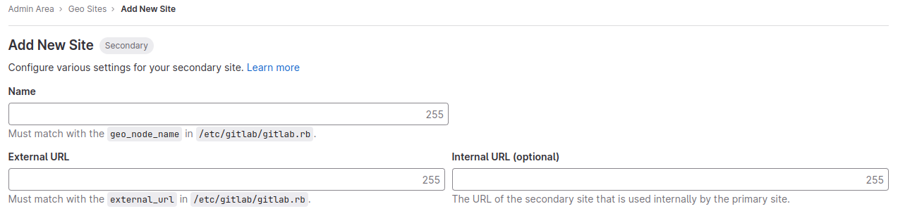
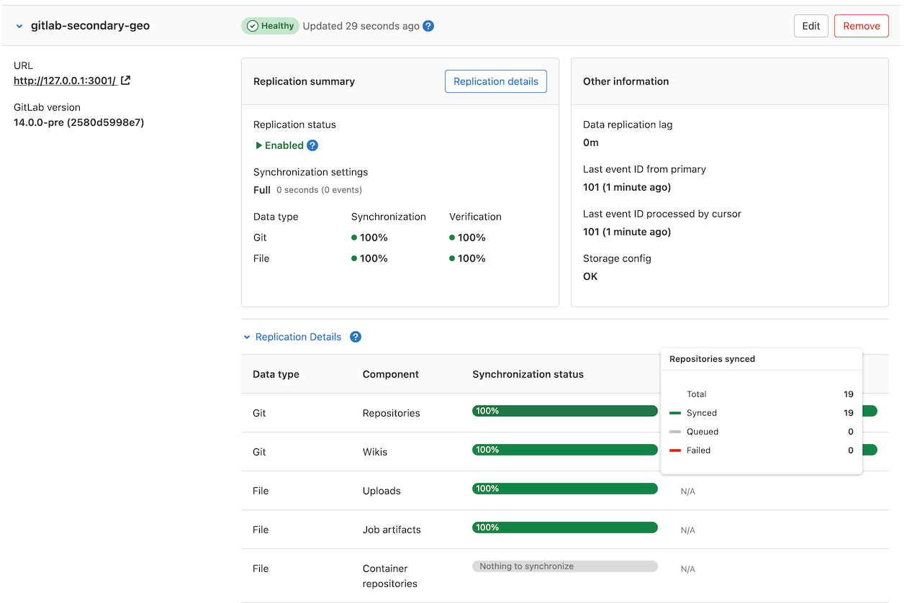

DETAILS:
**Tier:** Premium, Ultimate
**Offering:** GitLab Self-Managed

The following guide provides concise instructions on how to deploy GitLab Geo for a two single-node site installation using two Linux package instances and external PostgreSQL databases like RDS, Azure Database, or Google Cloud SQL.

Prerequisites:

- You have at least two independently working GitLab sites.
  To create the sites, see the [GitLab reference architectures documentation](../../reference_architectures/_index.md).
  - One GitLab site serves as the **Geo primary site**. You can use different reference architecture sizes for each Geo site. If you already have a working GitLab instance, you can use it as the primary site.
  - The second GitLab site serves as the **Geo secondary site**. Geo supports multiple secondary sites.
- The Geo primary site has at least a [GitLab Premium](https://about.gitlab.com/pricing/) license.
  You need only one license for all sites.
- Confirm all sites meet the [requirements for running Geo](../_index.md#requirements-for-running-geo).

## Set up Geo for Linux package (Omnibus)

Prerequisites:

- You use PostgreSQL 12 or later,
  which includes the [`pg_basebackup` tool](https://www.postgresql.org/docs/12/app-pgbasebackup.html).

### Configure the primary site

1. SSH into your GitLab primary site and sign in as root:

   ```shell
   sudo -i
   ```

1. Add a unique Geo site name to `/etc/gitlab/gitlab.rb`:

   ```ruby
   ##
   ## The unique identifier for the Geo site. See
   ## https://docs.gitlab.com/ee/administration/geo_sites.html#common-settings
   ##
   gitlab_rails['geo_node_name'] = '<site_name_here>'
   ```

1. To apply the change, reconfigure the primary site:

   ```shell
   gitlab-ctl reconfigure
   ```

1. Define the site as your primary Geo site:

   ```shell
   gitlab-ctl set-geo-primary-node
   ```

   This command uses the `external_url` defined in `/etc/gitlab/gitlab.rb`.

### Configure the external database to be replicated

To set up an external database, you can either:

- Set up [streaming replication](https://www.postgresql.org/docs/12/warm-standby.html#STREAMING-REPLICATION-SLOTS) yourself (for example Amazon RDS, or bare metal not managed by the Linux package).
- Manually perform the configuration of your Linux package installations as follows.

#### Leverage your cloud provider's tools to replicate the primary database

Given you have a primary site set up on AWS EC2 that uses RDS.
You can now just create a read-only replica in a different region and the
replication process is managed by AWS. Make sure you've set Network ACL (Access Control List), Subnet, and Security Group according to your needs, so the secondary Rails nodes can access the database.

The following instructions detail how to create a read-only replica for common
cloud providers:

- Amazon RDS - [Creating a Read Replica](https://docs.aws.amazon.com/AmazonRDS/latest/UserGuide/USER_ReadRepl.html#USER_ReadRepl.Create)
- Azure Database for PostgreSQL - [Create and manage read replicas in Azure Database for PostgreSQL](https://learn.microsoft.com/en-us/azure/postgresql/single-server/how-to-read-replicas-portal)
- Google Cloud SQL - [Creating read replicas](https://cloud.google.com/sql/docs/postgres/replication/create-replica)

When your read-only replica is set up, you can skip to [configure your secondary site](#configure-the-secondary-site-to-use-the-external-read-replica).

### Configure the secondary site to use the external read-replica

With Linux package installations, the
[`geo_secondary_role`](https://docs.gitlab.com/omnibus/roles/#gitlab-geo-roles)
has three main functions:

1. Configure the replica database.
1. Configure the tracking database.
1. Enable the [Geo Log Cursor](../_index.md#geo-log-cursor).

To configure the connection to the external read-replica database:

1. SSH into each **Rails, Sidekiq and Geo Log Cursor** node on your **secondary** site and login as root:

   ```shell
   sudo -i
   ```

1. Edit `/etc/gitlab/gitlab.rb` and add the following

   ```ruby
   ##
   ## Geo Secondary role
   ## - configure dependent flags automatically to enable Geo
   ##
   roles ['geo_secondary_role']

   # note this is shared between both databases,
   # make sure you define the same password in both
   gitlab_rails['db_password'] = '<your_db_password_here>'

   gitlab_rails['db_username'] = 'gitlab'
   gitlab_rails['db_host'] = '<database_read_replica_host>'

   # Disable the bundled Omnibus PostgreSQL, since we are
   # using an external PostgreSQL
   postgresql['enable'] = false
   ```

1. Save the file and reconfigure GitLab:

   ```shell
   gitlab-ctl reconfigure
   ```

In case you have connectivity issues to your replica database you can [check TCP connectivity](../../raketasks/maintenance.md) from your server with the following command:

```shell
gitlab-rake gitlab:tcp_check[<replica FQDN>,5432]
```

If this step fails, you might be using the wrong IP address, or a firewall might
be preventing access to the site. Check the IP address, paying close
attention to the difference between public and private addresses.
If a firewall is present, ensure the secondary site is allowed to connect to the
primary site on port 5432.

#### Manually replicate secret GitLab values

GitLab stores a number of secret values in `/etc/gitlab/gitlab-secrets.json`.
This JSON file must be the same across each of the site nodes.
You must manually replicate the secret file across all of your secondary sites, although
[issue 3789](https://gitlab.com/gitlab-org/gitlab/-/issues/3789) proposes to change this behavior.

1. SSH into a Rails node on your primary site, and execute the command below:

   ```shell
   sudo cat /etc/gitlab/gitlab-secrets.json
   ```

   This displays the secrets you must replicate, in JSON format.

1. SSH into each node on your secondary Geo site and sign in as root:

   ```shell
   sudo -i
   ```

1. Make a backup of any existing secrets:

   ```shell
   mv /etc/gitlab/gitlab-secrets.json /etc/gitlab/gitlab-secrets.json.`date +%F`
   ```

1. Copy `/etc/gitlab/gitlab-secrets.json` from the primary site Rails node to each secondary site node.
   You can also copy-and-paste the file contents between nodes:

   ```shell
   sudo editor /etc/gitlab/gitlab-secrets.json

   # paste the output of the `cat` command you ran on the primary
   # save and exit
   ```

1. Ensure the file permissions are correct:

   ```shell
   chown root:root /etc/gitlab/gitlab-secrets.json
   chmod 0600 /etc/gitlab/gitlab-secrets.json
   ```

1. To apply the changes, reconfigure every Rails, Sidekiq, and Gitaly secondary site node:

   ```shell
   gitlab-ctl reconfigure
   gitlab-ctl restart
   ```

#### Manually replicate the primary site SSH host keys

1. SSH into each node on your secondary site and sign in as root:

   ```shell
   sudo -i
   ```

1. Back up any existing SSH host keys:

   ```shell
   find /etc/ssh -iname 'ssh_host_*' -exec cp {} {}.backup.`date +%F` \;
   ```

1. Copy OpenSSH host keys from the primary site.

   - If you can access as root one of the primary site nodes serving SSH traffic (usually, the main GitLab Rails application nodes):

     ```shell
     # Run this from the secondary site, change `<primary_site_fqdn>` for the IP or FQDN of the server
     scp root@<primary_node_fqdn>:/etc/ssh/ssh_host_*_key* /etc/ssh
     ```

   - If you only have access through a user with `sudo` privileges:

     ```shell
     # Run this from the node on your primary site:
     sudo tar --transform 's/.*\///g' -zcvf ~/geo-host-key.tar.gz /etc/ssh/ssh_host_*_key*

     # Run this on each node on your secondary site:
     scp <user_with_sudo>@<primary_site_fqdn>:geo-host-key.tar.gz .
     tar zxvf ~/geo-host-key.tar.gz -C /etc/ssh
     ```

1. For each secondary site node, ensure the file permissions are correct:

   ```shell
   chown root:root /etc/ssh/ssh_host_*_key*
   chmod 0600 /etc/ssh/ssh_host_*_key
   ```

1. To verify key fingerprint matches, execute the following command on both the primary and secondary nodes on each site:

   ```shell
   for file in /etc/ssh/ssh_host_*_key; do ssh-keygen -lf $file; done
   ```

   You should get an output similar to the following:

   ```shell
   1024 SHA256:FEZX2jQa2bcsd/fn/uxBzxhKdx4Imc4raXrHwsbtP0M root@serverhostname (DSA)
   256 SHA256:uw98R35Uf+fYEQ/UnJD9Br4NXUFPv7JAUln5uHlgSeY root@serverhostname (ECDSA)
   256 SHA256:sqOUWcraZQKd89y/QQv/iynPTOGQxcOTIXU/LsoPmnM root@serverhostname (ED25519)
   2048 SHA256:qwa+rgir2Oy86QI+PZi/QVR+MSmrdrpsuH7YyKknC+s root@serverhostname (RSA)
   ```

   The output should be identical on both nodes.

1. Verify you have the correct public keys for the existing private keys:

   ```shell
   # This will print the fingerprint for private keys:
   for file in /etc/ssh/ssh_host_*_key; do ssh-keygen -lf $file; done

   # This will print the fingerprint for public keys:
   for file in /etc/ssh/ssh_host_*_key.pub; do ssh-keygen -lf $file; done
   ```

   The output for the public and private key commands should generate the same fingerprint.

1. For each secondary site node, restart `sshd`:

   ```shell
   # Debian or Ubuntu installations
   sudo service ssh reload

   # CentOS installations
   sudo service sshd reload
   ```

1. To verify SSH is still functional, from a new terminal, SSH into your GitLab secondary server.
   If you can't connect, make sure you have the correct permissions.

#### Fast lookup of authorized SSH keys

After the initial replication process is complete, follow the steps to
[configure fast lookup of authorized SSH keys](../../operations/fast_ssh_key_lookup.md).

Fast lookup is [required for Geo](../../operations/fast_ssh_key_lookup.md#fast-lookup-is-required-for-geo).

NOTE:
Authentication is handled by the primary site. Don't set up custom authentication for the secondary site.
Any change that requires access to the **Admin** area should be made in the primary site, because the
secondary site is a read-only copy.

#### Add the secondary site

1. SSH into each Rails and Sidekiq node on your secondary site and sign in as root:

   ```shell
   sudo -i
   ```

1. Edit `/etc/gitlab/gitlab.rb` and add a unique name for your site.

   ```ruby
   ##
   ## The unique identifier for the Geo site. See
   ## https://docs.gitlab.com/ee/administration/geo_sites.html#common-settings
   ##
   gitlab_rails['geo_node_name'] = '<secondary_site_name_here>'
   ```

   Save the unique name for the next steps.

1. To apply the changes, reconfigure each Rails and Sidekiq node on your secondary site.

   ```shell
   gitlab-ctl reconfigure
   ```

1. Go to the primary node GitLab instance:
   1. On the left sidebar, at the bottom, select **Admin**..
   1. Select **Geo > Sites**.
   1. Select **Add site**.

      

   1. In **Name**, enter the value for `gitlab_rails['geo_node_name']` in
      `/etc/gitlab/gitlab.rb`. The values must match exactly.
   1. In **External URL**, enter the value for `external_url` in `/etc/gitlab/gitlab.rb`.
      It's okay if one values ends in `/` and the other doesn't. Otherwise, the values must
      match exactly.
   1. Optional. In **Internal URL (optional)**, enter an internal URL for the primary site.
   1. Optional. Select which groups or storage shards should be replicated by the
      secondary site. To replicate all, leave the field blank. See [selective synchronization](../replication/selective_synchronization.md).
   1. Select **Save changes**.
1. SSH into each Rails and Sidekiq node on your secondary site and restart the services:

   ```shell
   sudo gitlab-ctl restart
   ```

1. Check if there are any common issues with your Geo setup by running:

   ```shell
   sudo gitlab-rake gitlab:geo:check
   ```

   If any of the checks fail, see the [troubleshooting documentation](../replication/troubleshooting/_index.md).

1. To verify that the secondary site is reachable, SSH into a Rails or Sidekiq server on your primary site and run:

   ```shell
   sudo gitlab-rake gitlab:geo:check
   ```

   If any of the checks fail, check the [troubleshooting documentation](../replication/troubleshooting/_index.md).

After the secondary site is added to the Geo administration page and restarted,
the site automatically starts to replicate missing data from the primary site
in a process known as backfill.

Meanwhile, the primary site starts to notify each secondary site of any changes, so
that the secondary site can act on the notifications immediately.

Be sure the secondary site is running and accessible. You can sign in to the
secondary site with the same credentials as were used with the primary site.

#### Enable Git access over HTTP/HTTPS and SSH

Geo synchronizes repositories over HTTP/HTTPS (enabled by default for new installations),
and therefore requires this clone method to be enabled.
If you convert an existing site to Geo, you should check that the clone method is enabled.

On the primary site:

1. On the left sidebar, at the bottom, select **Admin**.
1. Select **Settings > General**.
1. Expand **Visibility and access controls**.
1. If you use Git over SSH:
   1. Ensure **Enabled Git access protocols** is set to **Both SSH and HTTP(S)**.
   1. Enable the [fast lookup of authorized SSH keys in the database](../../operations/fast_ssh_key_lookup.md) on both the primary and secondary sites.
1. If you don't use Git over SSH, set **Enabled Git access protocols** to **Only HTTP(S)**.

#### Verify proper functioning of the secondary site

You can sign in to the secondary site with the same credentials you used with
the primary site.

After you sign in:

1. On the left sidebar, at the bottom, select **Admin**.
1. Select **Geo > Sites**.
1. Verify that the site is correctly identified as a secondary Geo site, and that
   Geo is enabled.

The initial replication might take some time.
You can monitor the synchronization process on each Geo site from the primary
site **Geo Sites** dashboard in your browser.



## Configure the tracking database

NOTE:
This step is optional in case you also want to have your tracking database set up externally on another server.

**Secondary** sites use a separate PostgreSQL installation as a tracking
database to keep track of replication status and automatically recover from
potential replication issues. The Linux package automatically configures a tracking database
when `roles ['geo_secondary_role']` is set.
If you want to run this database external to your Linux package installation, use the following instructions.

### Cloud-managed database services

If you are using a cloud-managed service for the tracking database, you may need
to grant additional roles to your tracking database user (by default, this is
`gitlab_geo`):

- Amazon RDS requires the [`rds_superuser`](https://docs.aws.amazon.com/AmazonRDS/latest/UserGuide/Appendix.PostgreSQL.CommonDBATasks.html#Appendix.PostgreSQL.CommonDBATasks.Roles) role.
- Azure Database for PostgreSQL requires the [`azure_pg_admin`](https://learn.microsoft.com/en-us/azure/postgresql/single-server/how-to-create-users#how-to-create-additional-admin-users-in-azure-database-for-postgresql) role.
- Google Cloud SQL requires the [`cloudsqlsuperuser`](https://cloud.google.com/sql/docs/postgres/users#default-users) role.

Additional roles are needed for the installation of extensions during installation and upgrades. As an alternative,
[ensure the extensions are installed manually, and read about the problems that may arise during future GitLab upgrades](../../../install/postgresql_extensions.md).

NOTE:
If you want to use Amazon RDS as a tracking database, make sure it has access to
the secondary database. Unfortunately, just assigning the same security group is not enough as
outbound rules do not apply to RDS PostgreSQL databases. Therefore, you need to explicitly add an inbound
rule to the read-replica's security group allowing any TCP traffic from
the tracking database on port 5432.

### Create the tracking database

Create and configure the tracking database in your PostgreSQL instance:

1. Set up PostgreSQL according to the
   [database requirements document](../../../install/requirements.md#postgresql).
1. Set up a `gitlab_geo` user with a password of your choice, create the `gitlabhq_geo_production` database, and make the user an owner of the database.
   You can see an example of this setup in the [self-compiled installation documentation](../../../install/installation.md#7-database).
1. If you are **not** using a cloud-managed PostgreSQL database, ensure that your secondary
   site can communicate with your tracking database by manually changing the
   `pg_hba.conf` that is associated with your tracking database.
   Remember to restart PostgreSQL afterwards for the changes to take effect:

   ```plaintext
   ##
   ## Geo Tracking Database Role
   ## - pg_hba.conf
   ##
   host    all         all               <trusted tracking IP>/32      md5
   host    all         all               <trusted secondary IP>/32     md5
   ```

### Configure GitLab

Configure GitLab to use this database. These steps are for Linux package and Docker deployments.

1. SSH into a GitLab **secondary** server and login as root:

   ```shell
   sudo -i
   ```

1. Edit `/etc/gitlab/gitlab.rb` with the connection parameters and credentials for
   the machine with the PostgreSQL instance:

   ```ruby
   geo_secondary['db_username'] = 'gitlab_geo'
   geo_secondary['db_password'] = '<your_tracking_db_password_here>'

   geo_secondary['db_host'] = '<tracking_database_host>'
   geo_secondary['db_port'] = <tracking_database_port>      # change to the correct port
   geo_postgresql['enable'] = false     # don't use internal managed instance
   ```

1. Save the file and reconfigure GitLab:

   ```shell
   gitlab-ctl reconfigure
   ```

#### Manually set up the database schema (optional)

The reconfigure in the [steps above](#configure-gitlab) handles these steps automatically. These steps are provided in case something went wrong.

1. This task creates the database schema. It requires the database user to be a superuser.

   ```shell
   sudo gitlab-rake db:create:geo
   ```

1. Applying Rails database migrations (schema and data updates) is also performed by reconfigure. If `geo_secondary['auto_migrate'] = false` is set, or
   the schema was created manually, this step is required:

   ```shell
   sudo gitlab-rake db:migrate:geo
   ```

## Troubleshooting

See [troubleshooting Geo](../replication/troubleshooting/_index.md).
