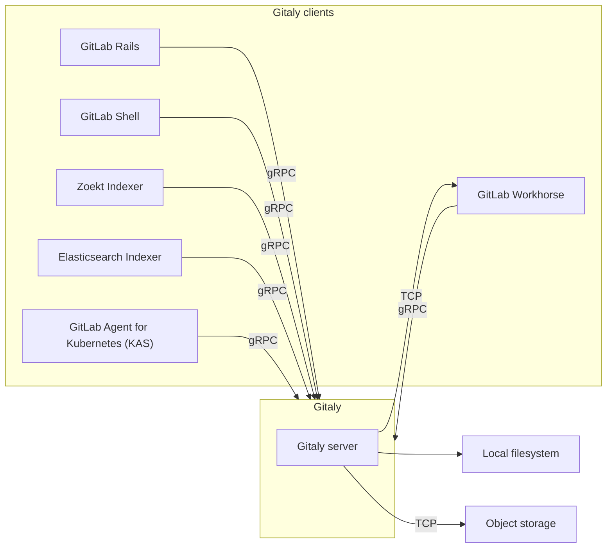

DETAILS:
**Tier:** Free, Premium, Ultimate
**Offering:** GitLab Self-Managed

[Gitaly](https://gitlab.com/gitlab-org/gitaly) provides high-level RPC access to Git repositories.
It is used by GitLab to read and write Git data.

Gitaly is present in every GitLab installation and coordinates Git repository
storage and retrieval. Gitaly can be:

- A background service operating on a single instance Linux package installation (all of
  GitLab on one machine).
- Separated onto its own instance and configured in a full cluster configuration,
  depending on scaling and availability requirements.

Gitaly implements a client-server architecture:

- A Gitaly server is any node that runs Gitaly itself.
- A Gitaly client is any node that runs a process that makes requests of the Gitaly server. Gitaly clients are also known as _Gitaly consumers_ and include:
  - [GitLab Rails application](https://gitlab.com/gitlab-org/gitlab)
  - [GitLab Shell](https://gitlab.com/gitlab-org/gitlab-shell)
  - [GitLab Workhorse](https://gitlab.com/gitlab-org/gitlab-workhorse)
  - [GitLab Elasticsearch Indexer](https://gitlab.com/gitlab-org/gitlab-elasticsearch-indexer)
  - [GitLab Zoekt Indexer](https://gitlab.com/gitlab-org/gitlab-zoekt-indexer)
  - [GitLab Agent for Kubernetes (KAS)](https://gitlab.com/gitlab-org/cluster-integration/gitlab-agent)

Gitaly manages only Git repository access for GitLab. Other types of GitLab data aren't accessed
using Gitaly.

GitLab accesses [repositories](../../user/project/repository/_index.md) through the configured
[repository storages](../repository_storage_paths.md). Each new repository is stored on one of the
repository storages based on their
[configured weights](../repository_storage_paths.md#configure-where-new-repositories-are-stored). Each
repository storage is either:

- A Gitaly storage with direct access to repositories using [storage paths](../repository_storage_paths.md),
  where each repository is stored on a single Gitaly node. All requests are routed to this node.
- A [virtual storage](#virtual-storage) provided by [Gitaly Cluster](#gitaly-cluster), where each
  repository can be stored on multiple Gitaly nodes for fault tolerance. In a Gitaly Cluster:
  - Read requests are distributed between multiple Gitaly nodes, which can improve performance.
  - Write requests are broadcast to repository replicas.

## Before deploying Gitaly Cluster

Gitaly Cluster provides the benefits of fault tolerance, but comes with additional complexity of setup and management.
Before deploying Gitaly Cluster, see:

- Existing [known issues](#known-issues).
- [Snapshot backup and recovery](#snapshot-backup-and-recovery).
- [Configuration guidance](configure_gitaly.md) and [Repository storage options](../repository_storage_paths.md) to make
  sure that Gitaly Cluster is the best setup for you.

If you have not yet migrated to Gitaly Cluster, you have two options:

- A sharded Gitaly instance.
- Gitaly Cluster.

Contact your [Customer Success Manager](https://handbook.gitlab.com/job-families/sales/customer-success-management/) or customer support if you have any questions.

### Known issues

The following table outlines current known issues impacting the use of Gitaly Cluster. For
the current status of these issues, refer to the referenced issues and epics.

| Issue                                                                                 | Summary                                                                                                                                                                                                                                                                                                                                                                                                                                                                                                                                                     | How to avoid |
|:--------------------------------------------------------------------------------------|:------------------------------------------------------------------------------------------------------------------------------------------------------------------------------------------------------------------------------------------------------------------------------------------------------------------------------------------------------------------------------------------------------------------------------------------------------------------------------------------------------------------------------------------------------------|:--------------------------------|
| Gitaly Cluster + Geo - Issues retrying failed syncs                             | If Gitaly Cluster is used on a Geo secondary site, repositories that have failed to sync could continue to fail when Geo tries to resync them. Recovering from this state requires assistance from support to run manual steps. | In GitLab 15.0 to 15.2, enable the [`gitaly_praefect_generated_replica_paths` feature flag](#praefect-generated-replica-paths) on your Geo primary site. In GitLab 15.3, the feature flag is enabled by default. |
| Praefect unable to insert data into the database due to migrations not being applied after an upgrade | If the database is not kept up to date with completed migrations, then the Praefect node is unable to perform standard operation. | Make sure the Praefect database is up and running with all migrations completed (For example: `sudo -u git -- /opt/gitlab/embedded/bin/praefect -config /var/opt/gitlab/praefect/config.toml sql-migrate-status` should show a list of all applied migrations). Consider [requesting upgrade assistance](https://about.gitlab.com/support/scheduling-upgrade-assistance/) so your upgrade plan can be reviewed by support. |
| Restoring a Gitaly Cluster node from a snapshot in a running cluster | Because the Gitaly Cluster runs with consistent state, introducing a single node that is behind results in the cluster not being able to reconcile the nodes data and other nodes data | Don't restore a single Gitaly Cluster node from a backup snapshot. If you must restore from backup:<br/><br/>1. [Shut down GitLab](../read_only_gitlab.md#shut-down-the-gitlab-ui).<br/>2. Snapshot all Gitaly Cluster nodes at the same time.<br/>3. Take a database dump of the Praefect database. |
| Limitations when running in Kubernetes, Amazon ECS, or similar | Praefect (Gitaly Cluster) is not supported and Gitaly has known limitations. For more information, see [epic 6127](https://gitlab.com/groups/gitlab-org/-/epics/6127). | Use our [reference architectures](../reference_architectures/_index.md). |

### Snapshot backup and recovery

Gitaly Cluster does not support snapshot backups. Snapshot backups can cause issues where the Praefect database becomes
out of sync with the disk storage. Because of how Praefect rebuilds the replication metadata of Gitaly disk information
during a restore, you should use the [official backup and restore Rake tasks](../backup_restore/_index.md).

The [incremental backup method](../backup_restore/backup_gitlab.md#incremental-repository-backups)
can be used to speed up Gitaly Cluster backups.

If you are unable to use either method, contact customer support for restoration help.

### What to do if you are on Gitaly Cluster experiencing an issue or limitation

Contact customer support for immediate help in restoration or recovery.

## Disk requirements

Gitaly and Gitaly Cluster require fast local storage to perform effectively because they are heavy I/O-based processes. Therefore,
we strongly recommend that all Gitaly nodes use solid-state drives (SSDs).

These SSDs should have a throughput of at least:

- 8,000 input/output operations per second (IOPS) for read operations.
- 2,000 IOPS for write operations.

These IOPS values are initial recommendations, and may be adjusted to greater or lesser values
depending on the scale of your environment's workload. If you're running the environment on a
cloud provider, refer to their documentation about how to configure IOPS correctly.

For repository data, only local storage is supported for Gitaly and Gitaly Cluster for performance and consistency reasons.
Alternatives such as [NFS](../nfs.md) or [cloud-based file systems](../nfs.md#avoid-using-cloud-based-file-systems) are not supported.

## Directly accessing repositories

GitLab doesn't advise directly accessing Gitaly repositories stored on disk with a Git client or any other tool,
because Gitaly is being continuously improved and changed. These improvements may invalidate
your assumptions, resulting in performance degradation, instability, and even data loss. For example:

- Gitaly has optimizations such as the [`info/refs` advertisement cache](https://gitlab.com/gitlab-org/gitaly/blob/master/doc/design_diskcache.md),
  that rely on Gitaly controlling and monitoring access to repositories by using the official gRPC
  interface.
- [Gitaly Cluster](#gitaly-cluster) has optimizations, such as fault tolerance and
  [distributed reads](#distributed-reads), that depend on the gRPC interface and database
  to determine repository state.

WARNING:
Accessing Git repositories directly is done at your own risk and is not supported.

## Gitaly

The following shows GitLab set up to use direct access to Gitaly:


In this example:

- Each repository is stored on one of three Gitaly storages: `storage-1`, `storage-2`, or
  `storage-3`.
- Each storage is serviced by a Gitaly node.
- The three Gitaly nodes store data on their file systems.

### Gitaly architecture

The following illustrates the Gitaly client-server architecture:



### Configure Gitaly

Gitaly comes pre-configured with a Linux package installation, which is a configuration
[suitable for up to 20 RPS / 1,000 users](../reference_architectures/1k_users.md). For:

- Linux package installations for up to 40 RPS / 2,000 users, see [specific Gitaly configuration instructions](../reference_architectures/2k_users.md#configure-gitaly).
- Self-compiled installations or custom Gitaly installations, see [Configure Gitaly](configure_gitaly.md).

GitLab installations for more than 2000 active users performing daily Git write operation may be
best suited by using Gitaly Cluster.

### Gitaly CLI

> - `gitaly git` subcommand [introduced](https://gitlab.com/gitlab-org/gitaly/-/merge_requests/7119) in GitLab 17.4.

The `gitaly` command is a command-line interface that provides additional subcommands for Gitaly administrators. For example,
the Gitaly CLI is used to:

- [Configure custom Git hooks](../server_hooks.md) for a repository.
- Validate Gitaly configuration files.
- Verify the internal Gitaly API is accessible.
- [Run Git commands](troubleshooting.md#use-gitaly-git-when-git-is-required-for-troubleshooting) against a repository on disk.

For more information on the other subcommands, run `sudo -u git -- /opt/gitlab/embedded/bin/gitaly --help`.

### Backing up repositories

When backing up or syncing repositories using tools other than GitLab, you must [prevent writes](../backup_restore/backup_gitlab.md#prevent-writes-and-copy-the-git-repository-data)
while copying repository data.

### Bundle URIs

You can use Git [bundle URIs](https://git-scm.com/docs/bundle-uri) with Gitaly.
For more information, see the [Bundle URIs documentation](bundle_uris.md).

## Gitaly Cluster

Git storage is provided through the Gitaly service in GitLab, and is essential to the operation of
GitLab. When the number of users, repositories, and activity grows, it is important to scale Gitaly
appropriately by:

- Increasing the available CPU and memory resources available to Git before
  resource exhaustion degrades Git, Gitaly, and GitLab application performance.
- Increasing available storage before storage limits are reached causing write
  operations to fail.
- Removing single points of failure to improve fault tolerance. Git should be
  considered mission critical if a service degradation would prevent you from
  deploying changes to production.

Gitaly can be run in a clustered configuration to:

- Scale the Gitaly service.
- Increase fault tolerance.

In this configuration, every Git repository can be stored on multiple Gitaly nodes in the cluster.

Using a Gitaly Cluster increases fault tolerance by:

- Replicating write operations to warm standby Gitaly nodes.
- Detecting Gitaly node failures.
- Automatically routing Git requests to an available Gitaly node.

NOTE:
Technical support for Gitaly clusters is limited to GitLab Premium and Ultimate
customers.

The following shows GitLab set up to access `storage-1`, a virtual storage provided by Gitaly
Cluster:


In this example:

- Repositories are stored on a virtual storage called `storage-1`.
- Three Gitaly nodes provide `storage-1` access: `gitaly-1`, `gitaly-2`, and `gitaly-3`.
- The three Gitaly nodes share data in three separate hashed storage locations.
- The [replication factor](#replication-factor) is `3`. Three copies are maintained
  of each repository.

The availability objectives for Gitaly clusters assuming a single node failure are:

- **Recovery Point Objective (RPO):** Less than 1 minute.

  Writes are replicated asynchronously. Any writes that have not been replicated
  to the newly promoted primary are lost.

  [Strong consistency](#strong-consistency) prevents loss in some circumstances.

- **Recovery Time Objective (RTO):** Less than 10 seconds.
  Outages are detected by a health check run by each Praefect node every
  second. Failover requires ten consecutive failed health checks on each
  Praefect node.

Improvements to RPO and RTO are proposed in epic [8903](https://gitlab.com/groups/gitlab-org/-/epics/8903).

WARNING:
If complete cluster failure occurs, disaster recovery plans should be executed. These can affect the
RPO and RTO discussed above.

### Comparison to Geo

Gitaly Cluster and [Geo](../geo/_index.md) both provide redundancy. However the redundancy of:

- Gitaly Cluster provides fault tolerance for data storage and is invisible to the user. Users are
  not aware when Gitaly Cluster is used.
- Geo provides [replication](../geo/_index.md) and [disaster recovery](../geo/disaster_recovery/_index.md) for
  an entire instance of GitLab. Users know when they are using Geo for
  [replication](../geo/_index.md). Geo [replicates multiple data types](../geo/replication/datatypes.md#replicated-data-types),
  including Git data.

The following table outlines the major differences between Gitaly Cluster and Geo:

| Tool           | Nodes    | Locations | Latency tolerance                                                                                     | Failover                                                                    | Consistency                           | Provides redundancy for |
|:---------------|:---------|:----------|:------------------------------------------------------------------------------------------------------|:----------------------------------------------------------------------------|:--------------------------------------|:------------------------|
| Gitaly Cluster | Multiple | Single    | [Less than 1 second, ideally single-digit milliseconds](praefect.md#network-latency-and-connectivity) | [Automatic](praefect.md#automatic-failover-and-primary-election-strategies) | [Strong](_index.md#strong-consistency) | Data storage in Git     |
| Geo            | Multiple | Multiple  | Up to one minute                                                                                      | [Manual](../geo/disaster_recovery/_index.md)                                 | Eventual                              | Entire GitLab instance  |

For more information, see:

- Geo [use cases](../geo/_index.md#use-cases).
- Geo [architecture](../geo/_index.md#architecture).

### Virtual storage

Virtual storage makes it viable to have a single repository storage in GitLab to simplify repository
management.

Virtual storage with Gitaly Cluster can usually replace direct Gitaly storage configurations.
However, this is at the expense of additional storage space needed to store each repository on multiple
Gitaly nodes. The benefit of using Gitaly Cluster virtual storage over direct Gitaly storage is:

- Improved fault tolerance, because each Gitaly node has a copy of every repository.
- Improved resource utilization, reducing the need for over-provisioning for shard-specific peak
  loads, because read loads are distributed across Gitaly nodes.
- Manual rebalancing for performance is not required, because read loads are distributed across
  Gitaly nodes.
- Simpler management, because all Gitaly nodes are identical.

The number of repository replicas can be configured using a
[replication factor](#replication-factor).

It can
be uneconomical to have the same replication factor for all repositories.
To provide greater flexibility for extremely large GitLab instances,
variable replication factor is tracked in [this issue](https://gitlab.com/groups/gitlab-org/-/epics/3372).

As with standard Gitaly storages, virtual storages can be sharded.

### Storage layout

WARNING:
The storage layout is an internal detail of Gitaly Cluster and is not guaranteed to remain stable between releases.
The information here is only for informational purposes and to help with debugging. Performing changes in the
repositories directly on the disk is not supported and may lead to breakage or the changes being overwritten.

Gitaly Cluster's virtual storages provide an abstraction that looks like a single storage but actually consists of
multiple physical storages. Gitaly Cluster has to replicate each operation to each physical storage. Operations
may succeed on some of the physical storages but fail on others.

Partially applied operations can cause problems with other operations and leave the system in a state it can't recover from.
To avoid these types of problems, each operation should either fully apply or not apply at all. This property of operations is called
[atomicity](https://en.wikipedia.org/wiki/Atomicity_(database_systems)).

GitLab controls the storage layout on the repository storages. GitLab instructs the repository storage where to create,
delete, and move repositories. These operations create atomicity issues when they are being applied to multiple physical storages.
For example:

- GitLab deletes a repository while one of its replicas is unavailable.
- GitLab later recreates the repository.

As a result, the stale replica that was unavailable at the time of deletion may cause conflicts and prevent
recreation of the repository.

These atomicity issues have caused multiple problems in the past with:

- Geo syncing to a secondary site with Gitaly Cluster.
- Backup restoration.
- Repository moves between repository storages.

Gitaly Cluster provides atomicity for these operations by storing repositories on the disk in a special layout that prevents
conflicts that could occur due to partially applied operations.

#### Client-generated replica paths

Repositories are stored in the storages at the relative path determined by the [Gitaly client](#gitaly-architecture). These paths can be
identified by them not beginning with the `@cluster` prefix. The relative paths
follow the [hashed storage](../repository_storage_paths.md#hashed-storage) schema.

#### Praefect-generated replica paths

> - [Introduced](https://gitlab.com/gitlab-org/gitaly/-/issues/4218) in GitLab 15.0 [with a flag](../feature_flags.md) named `gitaly_praefect_generated_replica_paths`. Disabled by default.
> - [Enabled on GitLab.com](https://gitlab.com/gitlab-org/gitaly/-/issues/4218) in GitLab 15.2.
> - [Enabled on GitLab Self-Managed](https://gitlab.com/gitlab-org/gitaly/-/merge_requests/4809) in GitLab 15.3.
> - [Generally available](https://gitlab.com/gitlab-org/gitaly/-/merge_requests/4941) in GitLab 15.6. Feature flag `gitaly_praefect_generated_replica_paths` removed.

When Gitaly Cluster creates a repository, it assigns the repository a unique and permanent ID called the _repository ID_. The repository ID is
internal to Gitaly Cluster and doesn't relate to any IDs elsewhere in GitLab. If a repository is removed from Gitaly Cluster and later moved
back, the repository is assigned a new repository ID and is a different repository from Gitaly Cluster's perspective. The sequence of repository IDs
always increases, but there may be gaps in the sequence.

The repository ID is used to derive a unique storage path called _replica path_ for each repository on the cluster. The replicas of
a repository are all stored at the same replica path on the storages. The replica path is distinct from the _relative path_:

- The relative path is a name the Gitaly client uses to identify a repository, together with its virtual storage, that is unique to them.
- The replica path is the actual physical path in the physical storages.

Praefect translates the repositories in the RPCs from the virtual `(virtual storage, relative path)` identifier into physical repository
`(storage, replica_path)` identifier when handling the client requests.

The format of the replica path for:

- Object pools is `@cluster/pools/<xx>/<xx>/<repository ID>`. Object pools are stored in a different directory than other repositories.
  They must be identifiable by Gitaly to avoid pruning them as part of housekeeping. Pruning object pools can cause data loss in the linked
  repositories.
- Other repositories is `@cluster/repositories/<xx>/<xx>/<repository ID>`

For example, `@cluster/repositories/6f/96/54771`.

The last component of the replica path, `54771`, is the repository ID. This can be used to identify the repository on the disk.

`<xx>/<xx>` are the first four hex digits of the SHA256 hash of the string representation of the repository ID. These
digits are used to balance the repositories evenly into subdirectories to avoid overly large directories that might
cause problems on some file systems. In this case, `54771` hashes to
`6f960ab01689464e768366d3315b3d3b2c28f38761a58a70110554eb04d582f7` so the first four digits are `6f` and `96`.

#### Identify repositories on disk

Use the [`praefect metadata`](troubleshooting_gitaly_cluster.md#view-repository-metadata) subcommand to:

- Retrieve a repository's virtual storage and relative path from the metadata store. After you have the hashed storage path, you can use the Rails
  console to retrieve the project path.
- Find where a repository is stored in the cluster with either:
  - The virtual storage and relative path.
  - The repository ID.

The repository on disk also contains the project path in the Git configuration file. The configuration
file can be used to determine the project path even if the repository's metadata has been deleted.
Follow the [instructions in hashed storage's documentation](../repository_storage_paths.md#from-hashed-path-to-project-name).

#### Atomicity of operations

Gitaly Cluster uses the PostgreSQL metadata store with the storage layout to ensure atomicity of repository creation,
deletion, and move operations. The disk operations can't be atomically applied across multiple storages. However, PostgreSQL guarantees
the atomicity of the metadata operations. Gitaly Cluster models the operations in a manner that the failing operations always leave
the metadata consistent. The disks may contain stale state even after successful operations. This situation is expected and
the leftover state does not interfere with future operations but may use up disk space unnecessarily until a clean up is
performed.

There is on-going work on a [background crawler](https://gitlab.com/gitlab-org/gitaly/-/issues/3719) that cleans up the leftover
repositories from the storages.

##### Repository creations

When creating repositories, Praefect:

1. Reserves a repository ID from PostgreSQL, which is atomic and no two creations receive the same ID.
1. Creates replicas on the Gitaly storages in the replica path derived from the repository ID.
1. Creates metadata records after the repository is successfully created on disk.

Even if two concurrent operations create the same repository, they'd be stored in different directories on the storages and not
conflict. The first to complete creates the metadata record and the other operation fails with an "already exists" error.
The failing creation leaves leftover repositories on the storages. There is on-going work on a
[background crawler](https://gitlab.com/gitlab-org/gitaly/-/issues/3719) that clean up the leftover repositories from the storages.

The repository IDs are generated from the `repositories_repository_id_seq` in PostgreSQL. In the above example, the failing operation took
one repository ID without successfully creating a repository with it. Failed repository creations are expected lead to gaps in the repository IDs.

##### Repository deletions

A repository is deleted by removing its metadata record. The repository ceases to logically exist as soon as the metadata record is deleted.
PostgreSQL guarantees the atomicity of the removal and a concurrent delete fails with a "not found" error. After successfully deleting
the metadata record, Praefect attempts to remove the replicas from the storages. This may fail and leave leftover state in the storages.
The leftover state is eventually cleaned up.

##### Repository moves

Unlike Gitaly, Gitaly Cluster doesn't move the repositories in the storages but only virtually moves the repository by updating the
relative path of the repository in the metadata store.

### Components

Gitaly Cluster consists of multiple components:

- [Load balancer](praefect.md#load-balancer) for distributing requests and providing fault-tolerant access to
  Praefect nodes.
- [Praefect](praefect.md#praefect) nodes for managing the cluster and routing requests to Gitaly nodes.
- [PostgreSQL database](praefect.md#postgresql) for persisting cluster metadata and [PgBouncer](praefect.md#use-pgbouncer),
  recommended for pooling Praefect's database connections.
- Gitaly nodes to provide repository storage and Git access.

### Architecture

Praefect is a router and transaction manager for Gitaly, and a required
component for running a Gitaly Cluster.


For more information, see [Gitaly High Availability (HA) Design](https://gitlab.com/gitlab-org/gitaly/-/blob/master/doc/design_ha.md).

### Features

Gitaly Cluster provides the following features:

- [Distributed reads](#distributed-reads) among Gitaly nodes.
- [Strong consistency](#strong-consistency) of the secondary replicas.
- [Replication factor](#replication-factor) of repositories for increased redundancy.
- [Automatic failover](praefect.md#automatic-failover-and-primary-election-strategies) from the
  primary Gitaly node to secondary Gitaly nodes.
- Reporting of possible [data loss](recovery.md#check-for-data-loss) if replication queue isn't empty.

Follow the [Gitaly Cluster epic](https://gitlab.com/groups/gitlab-org/-/epics/1489) for improvements
including [horizontally distributing reads](https://gitlab.com/groups/gitlab-org/-/epics/2013).

#### Distributed reads

Gitaly Cluster supports distribution of read operations across Gitaly nodes that are configured for
the [virtual storage](#virtual-storage).

All RPCs marked with the `ACCESSOR` option are redirected to an up to date and healthy Gitaly node.
For example, [`GetBlob`](https://gitlab.com/gitlab-org/gitaly/-/blob/v12.10.6/proto/blob.proto#L16).

_Up to date_ in this context means that:

- There is no replication operations scheduled for this Gitaly node.
- The last replication operation is in _completed_ state.

The primary node is chosen to serve the request if:

- No up-to-date nodes exist.
- Any other error occurs during node selection.

If you have a large, heavily modified repository (like a multi-gigabyte monorepo), the primary node can service most or all requests if changes come in faster than Praefect
can replicate to the secondaries. When this occurs, CI/CD jobs and other repository traffic are bottlenecked by the capacity of the primary node.

You can [monitor distribution of reads](monitoring.md#monitor-gitaly-cluster) using Prometheus.

#### Strong consistency

Gitaly Cluster provides strong consistency by writing changes synchronously to all healthy, up-to-date replicas. If a
replica is outdated or unhealthy at the time of the transaction, the write is asynchronously replicated to it.

Strong consistency is the primary replication method. A subset of operations still use replication jobs
(eventual consistency) instead of strong consistency. Refer to the
[strong consistency epic](https://gitlab.com/groups/gitlab-org/-/epics/1189) for more information.

If strong consistency is unavailable, Gitaly Cluster guarantees eventual consistency. In this case. Gitaly Cluster
replicates all writes to secondary Gitaly nodes after the write to the primary Gitaly node has occurred.

For more information on monitoring strong consistency, see the Gitaly Cluster
[Prometheus metrics documentation](monitoring.md#monitor-gitaly-cluster).

#### Replication factor

Replication factor is the number of copies Gitaly Cluster maintains of a given repository. A higher
replication factor:

- Offers better redundancy and distribution of read workload.
- Results in higher storage cost.

By default, Gitaly Cluster replicates repositories to every storage in a
[virtual storage](#virtual-storage).

For configuration information, see [Configure replication factor](praefect.md#configure-replication-factor).

### Configure Gitaly Cluster

For more information on configuring Gitaly Cluster, see [Configure Gitaly Cluster](praefect.md).

### Upgrade Gitaly Cluster

To upgrade a Gitaly Cluster, follow the documentation for
[zero-downtime upgrades](../../update/zero_downtime.md).

### Downgrade Gitaly Cluster to a previous version

If you need to roll back a Gitaly Cluster to an earlier version, some Praefect database migrations may need to be reverted.

To downgrade a Gitaly Cluster (assuming multiple Praefect nodes):

1. Stop the Praefect service on all Praefect nodes:

   ```shell
   gitlab-ctl stop praefect
   ```

1. Downgrade the GitLab package to the older version on one of the Praefect nodes.
1. On the downgraded node, check the state of Praefect migrations:

   ```shell
   sudo -u git -- /opt/gitlab/embedded/bin/praefect -config /var/opt/gitlab/praefect/config.toml sql-migrate-status
   ```

1. Count the number of migrations with `unknown migration` in the `APPLIED` column.
1. On a Praefect node that has **not** been downgraded, perform a dry run of the rollback to validate which migrations to revert. `<CT_UNKNOWN>`
   is the number of unknown migrations reported by the downgraded node.

   ```shell
   sudo -u git -- /opt/gitlab/embedded/bin/praefect -config /var/opt/gitlab/praefect/config.toml sql-migrate <CT_UNKNOWN>
   ```

1. If the results look correct, run the same command with the `-f` option to revert the migrations:

   ```shell
   sudo -u git -- /opt/gitlab/embedded/bin/praefect -config /var/opt/gitlab/praefect/config.toml sql-migrate -f <CT_UNKNOWN>
   ```

1. Downgrade the GitLab package on the remaining Praefect nodes and start the Praefect service again:

   ```shell
   gitlab-ctl start praefect
   ```

### Migrate to Gitaly Cluster

WARNING:
Some [known issues](#known-issues) exist in Gitaly Cluster. Review the following information before you continue.

Before migrating to Gitaly Cluster:

- Review [Before deploying Gitaly Cluster](#before-deploying-gitaly-cluster).
- Upgrade to the latest possible version of GitLab, to take advantage of improvements and bug fixes.

To migrate to Gitaly Cluster:

1. Create the required storage. Refer to
   [repository storage recommendations](praefect.md#repository-storage-recommendations).
1. Create and configure [Gitaly Cluster](praefect.md).
1. Configure the existing Gitaly instance [to use TCP](praefect.md#use-tcp-for-existing-gitlab-instances), if not already configured that way.
1. [Move the repositories](../operations/moving_repositories.md#moving-repositories). To migrate to
   Gitaly Cluster, existing repositories stored outside Gitaly Cluster must be moved. There is no
   automatic migration, but the moves can be scheduled with the GitLab API.

Even if you don't use the `default` repository storage, you must ensure it is configured.
[Read more about this limitation](configure_gitaly.md#gitlab-requires-a-default-repository-storage).

### Migrate off Gitaly Cluster

If the limitations and tradeoffs of Gitaly Cluster are found to be not suitable for your environment, you can Migrate
off Gitaly Cluster to a sharded Gitaly instance:

1. Create and configure a new [Gitaly server](configure_gitaly.md#run-gitaly-on-its-own-server).
1. [Move the repositories](../operations/moving_repositories.md#moving-repositories) to the newly created storage. You can
   move them by shard or by group, which gives you the opportunity to spread them over multiple Gitaly servers.

### Transition to Gitaly Cluster

For the sake of removing complexity, we must remove direct Git access in GitLab. However, we can't
remove it as long some GitLab installations require Git repositories on NFS.

Two facets of our efforts to remove direct Git access in GitLab are:

- Reduce the number of inefficient Gitaly queries made by GitLab.
- Persuade administrators of fault-tolerant or horizontally-scaled GitLab instances to migrate off
  NFS.

The second facet presents the only real solution. For this, we developed
[Gitaly Cluster](#gitaly-cluster).
