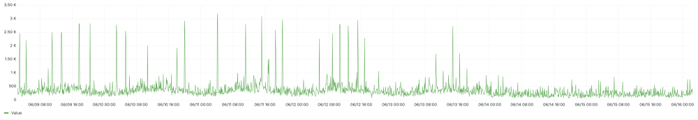



- Tier: Free, Premium, Ultimate
- Offering: GitLab Self-Managed



[Gitaly](https://gitlab.com/gitlab-org/gitaly) provides high-level remote procedure call (RPC) access to Git repositories.
It is used by GitLab to read and write Git data.

Gitaly is present in every GitLab installation and coordinates Git repository
storage and retrieval. Gitaly can be:

- A background service operating on a single instance Linux package installation (all of
  GitLab on one machine).
- Separated onto its own instance and configured in a full cluster configuration,
  depending on scaling and availability requirements.



Gitaly manages only Git repository access for GitLab. Other types of GitLab data aren't accessed
using Gitaly.



GitLab accesses [repositories](../../user/project/repository/_index.md) through the configured
[repository storages](../repository_storage_paths.md). Each new repository is stored on one of the
repository storages based on their
[configured weights](../repository_storage_paths.md#configure-where-new-repositories-are-stored). Each
repository storage is either:

- A Gitaly storage with direct access to repositories using [storage paths](../repository_storage_paths.md),
  where each repository is stored on a single Gitaly node. All requests are routed to this node.
- A [virtual storage](praefect/_index.md#virtual-storage) provided by [Gitaly Cluster (Praefect)](praefect/_index.md),
  where each repository can be stored on multiple Gitaly nodes for fault tolerance. With Gitaly Cluster (Praefect):
  - Read requests are distributed between multiple Gitaly nodes, which can improve performance.
  - Write requests are broadcast to repository replicas.

The following shows GitLab set up to use direct access to Gitaly:

In this example:

- Each repository is stored on one of three Gitaly storages: `storage-1`, `storage-2`, or
  `storage-3`.
- Each storage is serviced by a Gitaly node.
- The three Gitaly nodes store data on their file systems.

## Disk requirements

Gitaly and Gitaly Cluster (Praefect) require fast local storage to perform effectively because they are heavy
I/O-based processes. Therefore, we strongly recommend that all Gitaly nodes use solid-state drives
(SSDs). These SSDs should have high read and write throughput as Gitaly operates on many small files
concurrently.

As a reference, the following charts show the P99 disk IOPS across the Gitaly production fleet on
GitLab.com at a one-minute granularity. The data were queried from a seven-day representative
period, starting and ending on a Monday morning. Note the regular spikes in IOPS as traffic
becomes more intense during the work week. The raw data shows even larger spikes, with writes
peaking at 8000 IOPS. The available disk throughput must handle these spikes to avoid
disruptions to Gitaly requests.

- P99 disk IOPS (reads):

  

- P99 disk IOPS (writes):

  

We typically see:

- Between 500 - 1000 reads per second, with peaks of 3500 reads per second.
- Around 500 writes per second, with peaks of over 3000 writes per second.

The majority of the Gitaly fleet as of the time of writing are `t2d-standard-32` instances
with `pd-ssd` disks. The [advertised](https://cloud.google.com/compute/docs/disks/performance#t2d_instances)
maximum write and read IOPS are 60,000.

GitLab.com also employs stricter [concurrency limits](concurrency_limiting.md) on expensive
Git operations that aren't enabled by default on GitLab Self-Managed installations. Relaxed concurrency
limits, operations against particularly large monorepos, or the use of the
[pack-objects cache](configure_gitaly.md#pack-objects-cache) can also significantly increase
disk activity.

In practice for your own environment, the disk activity you observe on your Gitaly instances may vary
greatly from these published results. If you are running on a cloud environment, choosing larger
instances typically increases the available disk IOPS. You may also choose to select a provisioned IOPS
disk type with guaranteed throughput. Refer to the documentation of your cloud provider about how to
configure IOPS correctly.

For repository data, only local storage is supported for Gitaly and Gitaly Cluster (Praefect) for performance and consistency reasons.
Alternatives such as [NFS](../nfs.md) or [cloud-based file systems](../nfs.md#avoid-using-cloud-based-file-systems) are not supported.

## Gitaly architecture

Gitaly implements a client-server architecture:

- A Gitaly server is any node that runs Gitaly itself.
- A Gitaly client is any node that runs a process that makes requests of the Gitaly server. Gitaly clients are also
  known as Gitaly consumers and include:
  - [GitLab Rails application](https://gitlab.com/gitlab-org/gitlab)
  - [GitLab Shell](https://gitlab.com/gitlab-org/gitlab-shell)
  - [GitLab Workhorse](https://gitlab.com/gitlab-org/gitlab-workhorse)
  - [GitLab Elasticsearch Indexer](https://gitlab.com/gitlab-org/gitlab-elasticsearch-indexer)
  - [GitLab Zoekt Indexer](https://gitlab.com/gitlab-org/gitlab-zoekt-indexer)
  - [GitLab Agent for Kubernetes (KAS)](https://gitlab.com/gitlab-org/cluster-integration/gitlab-agent)

The following illustrates the Gitaly client-server architecture:

## Configuring Gitaly

Gitaly comes pre-configured with a Linux package installation, which is a configuration
[suitable for up to 20 RPS / 1,000 users](../reference_architectures/1k_users.md). For:

- Linux package installations for up to 40 RPS / 2,000 users, see [specific Gitaly configuration instructions](../reference_architectures/2k_users.md#configure-gitaly).
- Self-compiled installations or custom Gitaly installations, see [Configure Gitaly](configure_gitaly.md).

GitLab installations for more than 2000 active users performing daily Git write operation may be
best suited by using Gitaly Cluster (Praefect).

## Gitaly CLI



- `gitaly git` subcommand [introduced](https://gitlab.com/gitlab-org/gitaly/-/merge_requests/7119) in GitLab 17.4.



The `gitaly` command is a command-line interface that provides additional subcommands for Gitaly administrators. For example,
the Gitaly CLI is used to:

- [Configure custom Git hooks](../server_hooks.md) for a repository.
- Validate Gitaly configuration files.
- Verify the internal Gitaly API is accessible.
- [Run Git commands](troubleshooting.md#use-gitaly-git-when-git-is-required-for-troubleshooting) against a repository on disk.

For more information on the other subcommands, run `sudo -u git -- /opt/gitlab/embedded/bin/gitaly --help`.

## Backing up repositories

When backing up or syncing repositories using tools other than GitLab, you must [prevent writes](../backup_restore/backup_gitlab.md#prevent-writes-and-copy-the-git-repository-data)
while copying repository data.

## Bundle URIs

You can use Git [bundle URIs](https://git-scm.com/docs/bundle-uri) with Gitaly.
For more information, see the [Bundle URIs documentation](bundle_uris.md).

## Directly accessing repositories

GitLab doesn't advise directly accessing Gitaly repositories stored on disk with a Git client or any other tool,
because Gitaly is being continuously improved and changed. These improvements may invalidate
your assumptions, resulting in performance degradation, instability, and even data loss. For example:

- Gitaly has optimizations such as the [`info/refs` advertisement cache](https://gitlab.com/gitlab-org/gitaly/blob/master/doc/design_diskcache.md),
  that rely on Gitaly controlling and monitoring access to repositories by using the official gRPC
  interface.
- [Gitaly Cluster (Praefect)](praefect/_index.md) has optimizations, such as fault tolerance and
  [distributed reads](praefect/_index.md#distributed-reads), that depend on the gRPC interface and database
  to determine repository state.



Accessing Git repositories directly is done at your own risk and is not supported.


