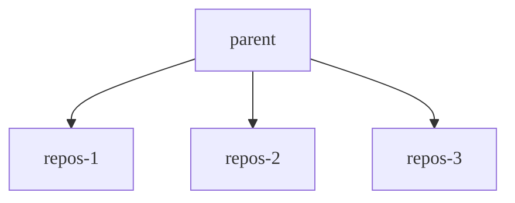

You can use control groups (cgroups) in Linux to impose limits on how much memory and CPU can be consumed by specific
processes. Cgroups can help protect systems against unexpected resource exhaustion because of memory and CPU
overconsumption. Cgroups are widely available and are commonly used as a foundational mechanism for containerization.

Cgroups are configured by using a pseudo file system, typically mounted at `/sys/fs/cgroup`, and allocate resources in a
hierarchical manner. The mountpoint is configurable in Gitaly. The structure varies depending on the version of cgroups
being used:

- Cgroups v1 follows a resource-oriented hierarchy. Parent directories are resources like `cpu` and `memory`.
- Cgroups v2 adopts a process-oriented approach. Parent directories are groups of processes, and the files within
  represent each resource being controlled.

For a more in-depth introduction, see the [cgroups Linux man page](https://man7.org/linux/man-pages/man7/cgroups.7.html).

When Gitaly runs:

- On a virtual machine, both cgroups v1 and cgroups v2 are supported. Gitaly automatically detects which cgroup
  version to use based on the mountpoint.
- On a Kubernetes cluster, only cgroups v2 is supported because read and write permissions to the cgroup hierarchy
  cannot be delegated to containers using cgroups v1.

Additional features and improvements may be available when Gitaly runs with cgroups v2, such as the ability to use the
[clone](https://man7.org/linux/man-pages/man2/clone.2.html) syscall to directly start a process under a cgroup.

## Before you begin

Enabling limits on your environment should be done with caution and only in select circumstances, such as to protect
against unexpected traffic. When reached, limits do result in disconnects that negatively impact users. For consistent
and stable performance, you should first explore other options such as adjusting node specifications, and
[reviewing large repositories](../../user/project/repository/monorepos/_index.md) or workloads.

When enabling cgroups for memory, you should ensure that no swap is configured on the Gitaly nodes because processes might
switch to using that instead of being terminated. The kernel considers available swap memory as additional to the
limits imposed by the cgroup. This situation could lead to notably compromised performance.

## How Gitaly benefits from cgroups

Some Git operations can consume excessive resources up to the point of exhaustion in situations such as:

- Unexpectedly high traffic.
- Operations running against large repositories that don't follow best practices.

The activity on specific repositories that consume these resources are known as "noisy neighbors", and can result in
degraded Git performance for other repositories hosted on the Gitaly server.

As a hard protection, Gitaly can use cgroups to tell the kernel to terminate these operations before they hog all
system resources and cause instability. Gitaly assigns Git processes to a cgroup based on the repository the Git
command is operating in. These cgroups are called repository cgroups. Each repository cgroup:

- Has a memory and CPU limit.
- Contains the Git processes for one or more repositories. The number of total cgroups is configurable. Each cgroup
  uses a consistent circular hash to ensure a Git process for a given repository always ends up in the same cgroup.

When a repository cgroup reaches its:

- Memory limit, the kernel looks through the processes for a candidate to terminate, which can lead to aborted client
  requests.
- CPU limit, processes are not terminated, but the processes are prevented from consuming more CPU than allowed, which
  means that client requests may be throttled, but not aborted.

When these limits are reached, performance may be reduced and users may be disconnected.

The following diagram illustrates the cgroup structure:

- The parent cgroup governs limits for all Git processes.
- Each repository cgroup (named `repos-1` through `repos-3`) enforces limits at a repository level.

If the Gitaly storage serves:

- Only three repositories, each repository slots directly into one of the cgroups.
- More than the number of repository cgroups, multiple repositories are assigned to the same group in a consistent manner.



## Configuring oversubscription

The number of repository cgroups should be reasonably high so that isolation can still occur on storages that serve
thousands of repositories. A good starting point for the repository count is twice the number of active repositories on
the storage.

Because repository cgroups enforce additional limits on top of the parent cgroup, if we configured them by dividing the
parent limits by the number of groups, we'd end up with overly restrictive limits. For example:

- Our parent memory limit is 32 GiB.
- We have roughly 100 active repositories.
- We've configured `cgroups.repositories.count = 100`.

If we divide 32 GiB by 100, we would allocate a mere 0.32 GiB per repository cgroup. This setting would lead to extremely
poor performance and significant underutilization.

You can use oversubscription to maintain a baseline level of performance during normal operations, while allowing a
small number of high-workload repositories to "burst" when necessary, without impacting unrelated requests.
Oversubscription refers to assigning more resources than what is technically available on the system.

Using the previous example, we can oversubscribe our repository cgroups by allocating 10 GiB of memory each, despite the system
not having 10 GiB * 100 of system memory. These values assume that 10 GiB is sufficient for normal operations against any
one repository, but also allows two repositories to burst to 10 GiB each while leaving a third bucket of resources to
maintain baseline performance.

A similar rule applies for CPU time. We purposely allocate repository cgroups with more CPU cores than available in the
entire system. For example, we might decide to allocate 4 cores per repository cgroup, even if the system does not have
400 total cores.

Two main values control oversubscription:

-`cpu_quota_us`
-`memory_bytes`

The difference between each value for parent cgroups compared to repository cgroups determines the amount of
oversubscription.

## Measurement and tuning

To establish and tune the correct baseline resource requirements for oversubscription, you must observe the production
workload on your Gitaly servers. The [Prometheus metrics](../monitoring/prometheus/_index.md) exposed by default are
sufficient for this. You can use the following queries as a guide to measure CPU and memory usage for a specific Gitaly
server:

| Query                                                                                                                                                | Resource                                                          |
|------------------------------------------------------------------------------------------------------------------------------------------------------|-------------------------------------------------------------------|
| `quantile_over_time(0.99, instance:node_cpu_utilization:ratio{type="gitaly", fqdn="gitaly.internal"}[5m])`    | p99 CPU utilisation of a Gitaly node with the specified `fqdn`    |
| `quantile_over_time(0.99, instance:node_memory_utilization:ratio{type="gitaly", fqdn="gitaly.internal"}[5m])` | p99 memory utilisation of a Gitaly node with the specified `fqdn` |

Based on the utilization you observe over a representative period of time (for example, a typical work week), you can
determine the baseline resource requirements for normal operations. To come up with the configuration in the previous
example, we would've observed consistent memory usage of 10 GiB across the work week, and a 4-core load on the CPU.

As your workload changes, you should revisit the metrics and make adjustments to the cgroups configuration. You should
also tune the configuration if you notice significantly degraded performance after enabling cgroups, because this could be
an indicator of limits that are too restrictive.

## Available configuration settings



- `max_cgroups_per_repo` [introduced](https://gitlab.com/gitlab-org/gitaly/-/issues/5689) in GitLab 16.7.
- Documentation for the legacy method was [removed](https://gitlab.com/gitlab-org/gitlab/-/merge_requests/176694) in GitLab 17.8.



To configure repository cgroups in Gitaly, use the following settings for `gitaly['configuration'][:cgroups]` in `/etc/gitlab/gitlab.rb`:

- `mountpoint` is where the parent cgroup directory is mounted. Defaults to `/sys/fs/cgroup`.
- `hierarchy_root` is the parent cgroup under which Gitaly creates groups, and
  is expected to be owned by the user and group Gitaly runs as. A Linux package installation
  creates the set of directories `mountpoint/<cpu|memory>/hierarchy_root`
  when Gitaly starts.
- `memory_bytes` is the total memory limit that is imposed collectively on all
  Git processes that Gitaly spawns. 0 implies no limit.
- `cpu_shares` is the CPU limit that is imposed collectively on all Git
  processes that Gitaly spawns. 0 implies no limit. The maximum is 1024 shares,
  which represents 100% of CPU.
- `cpu_quota_us` is the [`cfs_quota_us`](https://docs.kernel.org/scheduler/sched-bwc.html#management)
  to throttle the cgroups' processes if they exceed this quota value. We set
  `cfs_period_us` to `100ms` so 1 core is `100000`. 0 implies no limit.
- `repositories.count` is the number of cgroups in the cgroups pool. Each time a new Git
  command is spawned, Gitaly assigns it to one of these cgroups based
  on the repository the command is for. A circular hashing algorithm assigns
  Git commands to these cgroups, so a Git command for a repository is
  always assigned to the same cgroup.
- `repositories.memory_bytes` is the total memory limit imposed on all Git processes contained in a repository cgroup.
  0 implies no limit. This value cannot exceed that of the top level `memory_bytes`.
- `repositories.cpu_shares` is the CPU limit that is imposed on all Git processes contained in a repository cgroup.
  0 implies no limit. The maximum is 1024 shares, which represents 100% of CPU.
  This value cannot exceed that of the top level`cpu_shares`.
- `repositories.cpu_quota_us` is the [`cfs_quota_us`](https://docs.kernel.org/scheduler/sched-bwc.html#management)
  that is imposed on all Git processes contained in a repository cgroup. A Git
  process can't use more then the given quota. We set
  `cfs_period_us` to `100ms` so 1 core is `100000`. 0 implies no limit.
- `repositories.max_cgroups_per_repo` is the number of repository cgroups that Git processes
  targeting a specific repository can be distributed across. This enables more conservative
  CPU and memory limits to be configured for repository cgroups while still allowing for
  bursty workloads. For instance, with a `max_cgroups_per_repo` of `2` and a `memory_bytes`
  limit of 10 GB, independent Git operations against a specific repository can consume up
  to 20 GB of memory.

For example (not necessarily recommended settings):

```ruby
# in /etc/gitlab/gitlab.rb
gitaly['configuration'] = {
  # ...
  cgroups: {
    mountpoint: '/sys/fs/cgroup',
    hierarchy_root: 'gitaly',
    memory_bytes: 64424509440, # 60 GB
    cpu_shares: 1024,
    cpu_quota_us: 400000 # 4 cores
    repositories: {
      count: 1000,
      memory_bytes: 32212254720, # 20 GB
      cpu_shares: 512,
      cpu_quota_us: 200000, # 2 cores
      max_cgroups_per_repo: 2
    },
  },
}
```

## Monitoring cgroups

For information on monitoring cgroups, see [Monitor Gitaly cgroups](monitoring.md#monitor-gitaly-cgroups).
