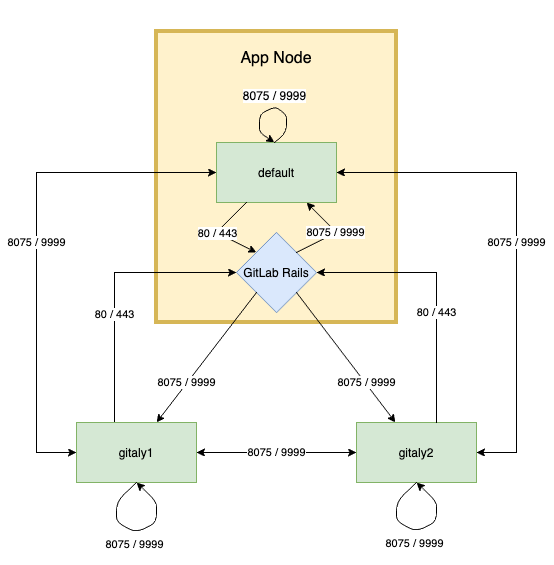

# Configure Gitaly **(FREE SELF)**

The Gitaly service itself is configured by using a [TOML configuration file](reference.md).

To change Gitaly settings:

**For Omnibus GitLab**

1. Edit `/etc/gitlab/gitlab.rb` and add or change the
   [Gitaly settings](https://gitlab.com/gitlab-org/omnibus-gitlab/blob/1dd07197c7e5ae23626aad5a4a070a800b670380/files/gitlab-config-template/gitlab.rb.template#L1622-1676).
1. Save the file and [reconfigure GitLab](../restart_gitlab.md#omnibus-gitlab-reconfigure).

**For installations from source**

1. Edit `/home/git/gitaly/config.toml` and add or change the [Gitaly settings](https://gitlab.com/gitlab-org/gitaly/blob/master/config.toml.example).
1. Save the file and [restart GitLab](../restart_gitlab.md#installations-from-source).

The following configuration options are also available:

- Enabling [TLS support](#enable-tls-support).
- Configuring the [number of `gitaly-ruby` workers](#configure-number-of-gitaly-ruby-workers).
- Limiting [RPC concurrency](#limit-rpc-concurrency).

## Run Gitaly on its own server

By default, Gitaly is run on the same server as Gitaly clients and is
[configured as above](#configure-gitaly). Single-server installations are best served by
this default configuration used by:

- [Omnibus GitLab](https://docs.gitlab.com/omnibus/).
- The GitLab [source installation guide](../../install/installation.md).

However, Gitaly can be deployed to its own server, which can benefit GitLab installations that span
multiple machines.

NOTE:
When configured to run on their own servers, Gitaly servers
[must be upgraded](https://docs.gitlab.com/omnibus/update/#upgrading-gitaly-servers) before Gitaly
clients in your cluster.

The process for setting up Gitaly on its own server is:

1. [Install Gitaly](#install-gitaly).
1. [Configure authentication](#configure-authentication).
1. [Configure Gitaly servers](#configure-gitaly-servers).
1. [Configure Gitaly clients](#configure-gitaly-clients).
1. [Disable Gitaly where not required](#disable-gitaly-where-not-required-optional) (optional).

When running Gitaly on its own server, note the following regarding GitLab versions:

- From GitLab 11.4, Gitaly was able to serve all Git requests without requiring a shared NFS mount
  for Git repository data, except for the
  [Elasticsearch indexer](https://gitlab.com/gitlab-org/gitlab-elasticsearch-indexer).
- From GitLab 11.8, the Elasticsearch indexer also uses Gitaly for data access. NFS can still be
  leveraged for redundancy on block-level Git data, but should be mounted only on the Gitaly
  servers.
- From GitLab 11.8 to 12.2, it is possible to use Elasticsearch in a Gitaly setup that doesn't use
  NFS. To use Elasticsearch in these versions, the
  [repository indexer](../../integration/elasticsearch.md#elasticsearch-repository-indexer)
  must be enabled in your GitLab configuration.
- [In GitLab 12.3 and later](https://gitlab.com/gitlab-org/gitlab/-/issues/6481), the new indexer is
  the default and no configuration is required.

### Network architecture

The following list depicts the network architecture of Gitaly:

- GitLab Rails shards repositories into [repository storages](../repository_storage_paths.md).
- `/config/gitlab.yml` contains a map from storage names to `(Gitaly address, Gitaly token)` pairs.
- The `storage name` -\> `(Gitaly address, Gitaly token)` map in `/config/gitlab.yml` is the single
  source of truth for the Gitaly network topology.
- A `(Gitaly address, Gitaly token)` corresponds to a Gitaly server.
- A Gitaly server hosts one or more storages.
- A Gitaly client can use one or more Gitaly servers.
- Gitaly addresses must be specified in such a way that they resolve correctly for **all** Gitaly
  clients.
- Gitaly clients are:
  - Puma.
  - Sidekiq.
  - GitLab Workhorse.
  - GitLab Shell.
  - Elasticsearch indexer.
  - Gitaly itself.
- A Gitaly server must be able to make RPC calls **to itself** by using its own
  `(Gitaly address, Gitaly token)` pair as specified in `/config/gitlab.yml`.
- Authentication is done through a static token which is shared among the Gitaly and GitLab Rails
  nodes.

The following digraph illustrates communication between Gitaly servers and GitLab Rails showing
the default ports for HTTP and HTTPs communication.



WARNING:
Gitaly servers must not be exposed to the public internet as Gitaly's network traffic is unencrypted
by default. The use of firewall is highly recommended to restrict access to the Gitaly server.
Another option is to [use TLS](#enable-tls-support).

In the following sections, we describe how to configure two Gitaly servers with secret token
`abc123secret`:

- `gitaly1.internal`.
- `gitaly2.internal`.

We assume your GitLab installation has three repository storages:

- `default`.
- `storage1`.
- `storage2`.

You can use as few as one server with one repository storage if desired.

NOTE:
The token referred to throughout the Gitaly documentation is just an arbitrary password selected by
the administrator. It is unrelated to tokens created for the GitLab API or other similar web API
tokens.

### Install Gitaly

Install Gitaly on each Gitaly server using either Omnibus GitLab or install it from source:

- For Omnibus GitLab, [download and install](https://about.gitlab.com/install/) the Omnibus GitLab
  package you want but **do not** provide the `EXTERNAL_URL=` value.
- To install from source, follow the steps at
  [Install Gitaly](../../install/installation.md#install-gitaly).

### Configure authentication

Gitaly and GitLab use two shared secrets for authentication:

- One to authenticate gRPC requests to Gitaly.
- A second for authentication callbacks from GitLab Shell to the GitLab internal API.

**For Omnibus GitLab**

To configure the Gitaly token:

1. On the Gitaly clients, edit `/etc/gitlab/gitlab.rb`:

   ```ruby
   gitlab_rails['gitaly_token'] = 'abc123secret'
   ```

1. Save the file and [reconfigure GitLab](../restart_gitlab.md#omnibus-gitlab-reconfigure).
1. On the Gitaly server, edit `/etc/gitlab/gitlab.rb`:

   ```ruby
   gitaly['auth_token'] = 'abc123secret'
   ```

1. [Reconfigure GitLab](../restart_gitlab.md#omnibus-gitlab-reconfigure).

There are two ways to configure the GitLab Shell token.

Method 1:

1. Copy `/etc/gitlab/gitlab-secrets.json` from the Gitaly client to same path on the Gitaly servers
   (and any other Gitaly clients).
1. [Reconfigure GitLab](../restart_gitlab.md#omnibus-gitlab-reconfigure) on Gitaly servers.

Method 2:

1. On the Gitaly clients, edit `/etc/gitlab/gitlab.rb`:

   ```ruby
   gitlab_shell['secret_token'] = 'shellsecret'
   ```

1. Save the file and [reconfigure GitLab](../restart_gitlab.md#omnibus-gitlab-reconfigure).
1. On the Gitaly servers, edit `/etc/gitlab/gitlab.rb`:

   ```ruby
   gitlab_shell['secret_token'] = 'shellsecret'
   ```

1. [Reconfigure GitLab](../restart_gitlab.md#omnibus-gitlab-reconfigure).

**For installations from source**

1. Copy `/home/git/gitlab/.gitlab_shell_secret` from the Gitaly client to the same path on the
   Gitaly servers (and any other Gitaly clients).
1. On the Gitaly clients, edit `/home/git/gitlab/config/gitlab.yml`:

   ```yaml
   gitlab:
     gitaly:
       token: 'abc123secret'
   ```

1. Save the file and [restart GitLab](../restart_gitlab.md#installations-from-source).
1. On the Gitaly servers, edit `/home/git/gitaly/config.toml`:

   ```toml
   [auth]
   token = 'abc123secret'
   ```

1. Save the file and [restart GitLab](../restart_gitlab.md#installations-from-source).

### Configure Gitaly servers

On the Gitaly servers, you must configure storage paths and enable the network listener.
The Gitaly server must be able to read, write, and set permissions on the configured path.

If you want to reduce the risk of downtime when you enable authentication, you can temporarily
disable enforcement. For more information, see the documentation on configuring
[Gitaly authentication](https://gitlab.com/gitlab-org/gitaly/blob/master/doc/configuration/README.md#authentication).

**For Omnibus GitLab**

1. Edit `/etc/gitlab/gitlab.rb`:

   <!--
   updates to following example must also be made at
   https://gitlab.com/gitlab-org/charts/gitlab/blob/master/doc/advanced/external-gitaly/external-omnibus-gitaly.md#configure-omnibus-gitlab
   -->

   ```ruby
   # Avoid running unnecessary services on the Gitaly server
   postgresql['enable'] = false
   redis['enable'] = false
   nginx['enable'] = false
   puma['enable'] = false
   sidekiq['enable'] = false
   gitlab_workhorse['enable'] = false
   grafana['enable'] = false
   gitlab_exporter['enable'] = false

   # If you run a separate monitoring node you can disable these services
   alertmanager['enable'] = false
   prometheus['enable'] = false

   # If you don't run a separate monitoring node you can
   # enable Prometheus access & disable these extra services.
   # This makes Prometheus listen on all interfaces. You must use firewalls to restrict access to this address/port.
   # prometheus['listen_address'] = '0.0.0.0:9090'
   # prometheus['monitor_kubernetes'] = false

   # If you don't want to run monitoring services uncomment the following (not recommended)
   # node_exporter['enable'] = false

   # Prevent database connections during 'gitlab-ctl reconfigure'
   gitlab_rails['auto_migrate'] = false

   # Configure the gitlab-shell API callback URL. Without this, `git push` will
   # fail. This can be your 'front door' GitLab URL or an internal load
   # balancer.
   # Don't forget to copy `/etc/gitlab/gitlab-secrets.json` from Gitaly client to Gitaly server.
   gitlab_rails['internal_api_url'] = 'https://gitlab.example.com'

   # Authentication token to ensure only authorized servers can communicate with
   # Gitaly server
   gitaly['auth_token'] = 'AUTH_TOKEN'

   # Make Gitaly accept connections on all network interfaces. You must use
   # firewalls to restrict access to this address/port.
   # Comment out following line if you only want to support TLS connections
   gitaly['listen_addr'] = "0.0.0.0:8075"
   ```

1. Append the following to `/etc/gitlab/gitlab.rb` for each respective Gitaly server:

   <!--
   updates to following example must also be made at
   https://gitlab.com/gitlab-org/charts/gitlab/blob/master/doc/advanced/external-gitaly/external-omnibus-gitaly.md#configure-omnibus-gitlab
   -->

   On `gitaly1.internal`:

   ```ruby
   git_data_dirs({
     'default' => {
       'path' => '/var/opt/gitlab/git-data'
     },
     'storage1' => {
       'path' => '/mnt/gitlab/git-data'
     },
   })
   ```

   On `gitaly2.internal`:

   ```ruby
   git_data_dirs({
     'storage2' => {
       'path' => '/srv/gitlab/git-data'
     },
   })
   ```

1. Save the file and [reconfigure GitLab](../restart_gitlab.md#omnibus-gitlab-reconfigure).
1. Run `sudo /opt/gitlab/embedded/bin/gitaly-hooks check /var/opt/gitlab/gitaly/config.toml`
   to confirm that Gitaly can perform callbacks to the GitLab internal API.

**For installations from source**

1. Edit `/home/git/gitaly/config.toml`:

   ```toml
   listen_addr = '0.0.0.0:8075'

   internal_socket_dir = '/var/opt/gitlab/gitaly'

   [logging]
   format = 'json'
   level = 'info'
   dir = '/var/log/gitaly'
   ```

1. Append the following to `/home/git/gitaly/config.toml` for each respective Gitaly server:

   On `gitaly1.internal`:

   ```toml
   [[storage]]
   name = 'default'
   path = '/var/opt/gitlab/git-data/repositories'

   [[storage]]
   name = 'storage1'
   path = '/mnt/gitlab/git-data/repositories'
   ```

   On `gitaly2.internal`:

   ```toml
   [[storage]]
   name = 'storage2'
   path = '/srv/gitlab/git-data/repositories'
   ```

1. Edit `/home/git/gitlab-shell/config.yml`:

   ```yaml
   gitlab_url: https://gitlab.example.com
   ```

1. Save the files and [restart GitLab](../restart_gitlab.md#installations-from-source).
1. Run `sudo -u git /home/git/gitaly/gitaly-hooks check /home/git/gitaly/config.toml`
   to confirm that Gitaly can perform callbacks to the GitLab internal API.

### Configure Gitaly clients

As the final step, you must update Gitaly clients to switch from using local Gitaly service to use
the Gitaly servers you just configured.

This can be risky because anything that prevents your Gitaly clients from reaching the Gitaly
servers causes all Gitaly requests to fail. For example, any sort of network, firewall, or name
resolution problems.

Additionally, you must [disable Rugged](../nfs.md#improving-nfs-performance-with-gitlab)
if previously enabled manually.

Gitaly makes the following assumptions:

- Your `gitaly1.internal` Gitaly server can be reached at `gitaly1.internal:8075` from your Gitaly
  clients, and that Gitaly server can read, write, and set permissions on `/var/opt/gitlab/git-data` and
  `/mnt/gitlab/git-data`.
- Your `gitaly2.internal` Gitaly server can be reached at `gitaly2.internal:8075` from your Gitaly
  clients, and that Gitaly server can read, write, and set permissions on `/srv/gitlab/git-data`.
- Your `gitaly1.internal` and `gitaly2.internal` Gitaly servers can reach each other.

You can't define Gitaly servers with some as a local Gitaly server
(without `gitaly_address`) and some as remote
server (with `gitaly_address`) unless you use
[mixed configuration](#mixed-configuration).

**For Omnibus GitLab**

1. Edit `/etc/gitlab/gitlab.rb`:

   ```ruby
   # Use the same token value configured on all Gitaly servers
   gitlab_rails['gitaly_token'] = '<AUTH_TOKEN>'

   git_data_dirs({
     'default'  => { 'gitaly_address' => 'tcp://gitaly1.internal:8075' },
     'storage1' => { 'gitaly_address' => 'tcp://gitaly1.internal:8075' },
     'storage2' => { 'gitaly_address' => 'tcp://gitaly2.internal:8075' },
   })
   ```

   Alternatively, if each Gitaly server is configured to use a different authentication token:

   ```ruby
   git_data_dirs({
     'default'  => { 'gitaly_address' => 'tcp://gitaly1.internal:8075', 'gitaly_token' => '<AUTH_TOKEN_1>' },
     'storage1' => { 'gitaly_address' => 'tcp://gitaly1.internal:8075', 'gitaly_token' => '<AUTH_TOKEN_1>' },
     'storage2' => { 'gitaly_address' => 'tcp://gitaly2.internal:8075', 'gitaly_token' => '<AUTH_TOKEN_2>' },
   })
   ```

1. Save the file and [reconfigure GitLab](../restart_gitlab.md#omnibus-gitlab-reconfigure).
1. Run `sudo gitlab-rake gitlab:gitaly:check` on the Gitaly client (for example, the
   Rails application) to confirm it can connect to Gitaly servers.
1. Tail the logs to see the requests:

   ```shell
   sudo gitlab-ctl tail gitaly
   ```

**For installations from source**

1. Edit `/home/git/gitlab/config/gitlab.yml`:

   ```yaml
   gitlab:
     repositories:
       storages:
         default:
           gitaly_address: tcp://gitaly1.internal:8075
           gitaly_token: AUTH_TOKEN_1
           path: /some/local/path
         storage1:
           gitaly_address: tcp://gitaly1.internal:8075
           gitaly_token: AUTH_TOKEN_1
           path: /some/local/path
         storage2:
           gitaly_address: tcp://gitaly2.internal:8075
           gitaly_token: AUTH_TOKEN_2
           path: /some/local/path
   ```

   NOTE:
   `/some/local/path` should be set to a local folder that exists, however no data is stored in
   this folder. This requirement is scheduled to be removed when
   [this issue](https://gitlab.com/gitlab-org/gitaly/-/issues/1282) is resolved.

1. Save the file and [restart GitLab](../restart_gitlab.md#installations-from-source).
1. Run `sudo -u git -H bundle exec rake gitlab:gitaly:check RAILS_ENV=production` to confirm the
   Gitaly client can connect to Gitaly servers.
1. Tail the logs to see the requests:

   ```shell
   tail -f /home/git/gitlab/log/gitaly.log
   ```

When you tail the Gitaly logs on your Gitaly server, you should see requests coming in. One sure way
to trigger a Gitaly request is to clone a repository from GitLab over HTTP or HTTPS.

WARNING:
If you have [server hooks](../server_hooks.md) configured, either per repository or globally, you
must move these to the Gitaly servers. If you have multiple Gitaly servers, copy your server hooks
to all Gitaly servers.

#### Mixed configuration

GitLab can reside on the same server as one of many Gitaly servers, but doesn't support
configuration that mixes local and remote configuration. The following setup is incorrect, because:

- All addresses must be reachable from the other Gitaly servers.
- `storage1` is assigned a Unix socket for `gitaly_address` which is
  invalid for some of the Gitaly servers.

```ruby
git_data_dirs({
  'default' => { 'gitaly_address' => 'tcp://gitaly1.internal:8075' },
  'storage1' => { 'path' => '/mnt/gitlab/git-data' },
  'storage2' => { 'gitaly_address' => 'tcp://gitaly2.internal:8075' },
})
```

To combine local and remote Gitaly servers, use an external address for the local Gitaly server. For
example:

```ruby
git_data_dirs({
  'default' => { 'gitaly_address' => 'tcp://gitaly1.internal:8075' },
  # Address of the GitLab server that has Gitaly running on it
  'storage1' => { 'gitaly_address' => 'tcp://gitlab.internal:8075', 'path' => '/mnt/gitlab/git-data' },
  'storage2' => { 'gitaly_address' => 'tcp://gitaly2.internal:8075' },
})

# Make Gitaly accept connections on all network interfaces
gitaly['listen_addr'] = "0.0.0.0:8075"

# Or for TLS
gitaly['tls_listen_addr'] = "0.0.0.0:9999"
gitaly['certificate_path'] = "/etc/gitlab/ssl/cert.pem"
gitaly['key_path'] = "/etc/gitlab/ssl/key.pem"
```

`path` can be included only for storage shards on the local Gitaly server.
If it's excluded, default Git storage directory is used for that storage shard.

### Disable Gitaly where not required (optional)

If you run Gitaly [as a remote service](#run-gitaly-on-its-own-server), consider
disabling the local Gitaly service that runs on your GitLab server by default, and run it
only where required.

Disabling Gitaly on the GitLab instance makes sense only when you run GitLab in a custom cluster configuration, where
Gitaly runs on a separate machine from the GitLab instance. Disabling Gitaly on all machines in the cluster is not
a valid configuration (some machines much act as Gitaly servers).

To disable Gitaly on a GitLab server:

**For Omnibus GitLab**

1. Edit `/etc/gitlab/gitlab.rb`:

   ```ruby
   gitaly['enable'] = false
   ```

1. Save the file and [reconfigure GitLab](../restart_gitlab.md#omnibus-gitlab-reconfigure).

**For installations from source**

1. Edit `/etc/default/gitlab`:

   ```shell
   gitaly_enabled=false
   ```

1. Save the file and [restart GitLab](../restart_gitlab.md#installations-from-source).

## Enable TLS support

> - [Introduced](https://gitlab.com/gitlab-org/gitlab-foss/-/merge_requests/22602) in GitLab 11.8.
> - [Introduced](https://gitlab.com/gitlab-org/gitaly/-/issues/3160) in GitLab 13.6, outgoing TLS connections to GitLab provide client certificates if configured.

Gitaly supports TLS encryption. To communicate with a Gitaly instance that listens for secure
connections, use the `tls://` URL scheme in the `gitaly_address` of the corresponding
storage entry in the GitLab configuration.

Gitaly provides the same server certificates as client certificates in TLS
connections to GitLab. This can be used as part of a mutual TLS authentication strategy
when combined with reverse proxies (for example, NGINX) that validate client certificate
to grant access to GitLab.

You must supply your own certificates as this isn't provided automatically. The certificate
corresponding to each Gitaly server must be installed on that Gitaly server.

Additionally, the certificate (or its certificate authority) must be installed on all:

- Gitaly servers.
- Gitaly clients that communicate with it.

Note the following:

- The certificate must specify the address you use to access the Gitaly server. You must add the hostname or IP address as a Subject Alternative Name to the certificate.
- You can configure Gitaly servers with both an unencrypted listening address `listen_addr` and an
  encrypted listening address `tls_listen_addr` at the same time. This allows you to gradually
  transition from unencrypted to encrypted traffic if necessary.

To configure Gitaly with TLS:

**For Omnibus GitLab**

1. Create certificates for Gitaly servers.
1. On the Gitaly clients, copy the certificates (or their certificate authority) into
   `/etc/gitlab/trusted-certs`:

   ```shell
   sudo cp cert.pem /etc/gitlab/trusted-certs/
   ```

1. On the Gitaly clients, edit `git_data_dirs` in `/etc/gitlab/gitlab.rb` as follows:

   ```ruby
   git_data_dirs({
     'default' => { 'gitaly_address' => 'tls://gitaly1.internal:9999' },
     'storage1' => { 'gitaly_address' => 'tls://gitaly1.internal:9999' },
     'storage2' => { 'gitaly_address' => 'tls://gitaly2.internal:9999' },
   })
   ```

1. Save the file and [reconfigure GitLab](../restart_gitlab.md#omnibus-gitlab-reconfigure).
1. On the Gitaly servers, create the `/etc/gitlab/ssl` directory and copy your key and certificate
   there:

   ```shell
   sudo mkdir -p /etc/gitlab/ssl
   sudo chmod 755 /etc/gitlab/ssl
   sudo cp key.pem cert.pem /etc/gitlab/ssl/
   sudo chmod 644 key.pem cert.pem
   ```

1. Copy all Gitaly server certificates (or their certificate authority) to
   `/etc/gitlab/trusted-certs` on all Gitaly servers and clients
   so that Gitaly servers and clients trust the certificate when calling into themselves
   or other Gitaly servers:

   ```shell
   sudo cp cert1.pem cert2.pem /etc/gitlab/trusted-certs/
   ```

1. Edit `/etc/gitlab/gitlab.rb` and add:

   <!--
   updates to following example must also be made at
   https://gitlab.com/gitlab-org/charts/gitlab/blob/master/doc/advanced/external-gitaly/external-omnibus-gitaly.md#configure-omnibus-gitlab
   -->

   ```ruby
   gitaly['tls_listen_addr'] = "0.0.0.0:9999"
   gitaly['certificate_path'] = "/etc/gitlab/ssl/cert.pem"
   gitaly['key_path'] = "/etc/gitlab/ssl/key.pem"
   ```

1. Save the file and [reconfigure GitLab](../restart_gitlab.md#omnibus-gitlab-reconfigure).
1. Verify Gitaly traffic is being served over TLS by
   [observing the types of Gitaly connections](#observe-type-of-gitaly-connections).
1. (Optional) Improve security by:
   1. Disabling non-TLS connections by commenting out or deleting `gitaly['listen_addr']` in
      `/etc/gitlab/gitlab.rb`.
   1. Saving the file.
   1. [Reconfiguring GitLab](../restart_gitlab.md#omnibus-gitlab-reconfigure).

**For installations from source**

1. Create certificates for Gitaly servers.
1. On the Gitaly clients, copy the certificates into the system trusted certificates:

   ```shell
   sudo cp cert.pem /usr/local/share/ca-certificates/gitaly.crt
   sudo update-ca-certificates
   ```

1. On the Gitaly clients, edit `storages` in `/home/git/gitlab/config/gitlab.yml` as follows:

   ```yaml
   gitlab:
     repositories:
       storages:
         default:
           gitaly_address: tls://gitaly1.internal:9999
           path: /some/local/path
         storage1:
           gitaly_address: tls://gitaly1.internal:9999
           path: /some/local/path
         storage2:
           gitaly_address: tls://gitaly2.internal:9999
           path: /some/local/path
   ```

   NOTE:
   `/some/local/path` should be set to a local folder that exists, however no data is stored
   in this folder. This requirement is scheduled to be removed when
   [Gitaly issue #1282](https://gitlab.com/gitlab-org/gitaly/-/issues/1282) is resolved.

1. Save the file and [restart GitLab](../restart_gitlab.md#installations-from-source).
1. On the Gitaly servers, create or edit `/etc/default/gitlab` and add:

   ```shell
   export SSL_CERT_DIR=/etc/gitlab/ssl
   ```

1. On the Gitaly servers, create the `/etc/gitlab/ssl` directory and copy your key and certificate there:

   ```shell
   sudo mkdir -p /etc/gitlab/ssl
   sudo chmod 755 /etc/gitlab/ssl
   sudo cp key.pem cert.pem /etc/gitlab/ssl/
   sudo chmod 644 key.pem cert.pem
   ```

1. Copy all Gitaly server certificates (or their certificate authority) to the system trusted
   certificates folder so Gitaly server trusts the certificate when calling into itself or other Gitaly
   servers.

   ```shell
   sudo cp cert.pem /usr/local/share/ca-certificates/gitaly.crt
   sudo update-ca-certificates
   ```

1. Edit `/home/git/gitaly/config.toml` and add:

   ```toml
   tls_listen_addr = '0.0.0.0:9999'

   [tls]
   certificate_path = '/etc/gitlab/ssl/cert.pem'
   key_path = '/etc/gitlab/ssl/key.pem'
   ```

1. Save the file and [restart GitLab](../restart_gitlab.md#installations-from-source).
1. Verify Gitaly traffic is being served over TLS by
   [observing the types of Gitaly connections](#observe-type-of-gitaly-connections).
1. (Optional) Improve security by:
   1. Disabling non-TLS connections by commenting out or deleting `listen_addr` in
      `/home/git/gitaly/config.toml`.
   1. Saving the file.
   1. [Restarting GitLab](../restart_gitlab.md#installations-from-source).

### Observe type of Gitaly connections

[Prometheus](../monitoring/prometheus/index.md) can be used observe what type of connections Gitaly
is serving a production environment. Use the following Prometheus query:

```prometheus
sum(rate(gitaly_connections_total[5m])) by (type)
```

## `gitaly-ruby`

Gitaly was developed to replace the Ruby application code in GitLab.

To save time and avoid the risk of rewriting existing application logic, we chose to copy some
application code from GitLab into Gitaly.

To be able to run that code, `gitaly-ruby` was created, which is a "sidecar" process for the main
Gitaly Go process. Some examples of things that are implemented in `gitaly-ruby` are:

- RPCs that deal with wikis.
- RPCs that create commits on behalf of a user, such as merge commits.

We recommend:

- At least 300 MB memory per worker.
- No more than one worker per core.

NOTE:
`gitaly-ruby` is planned to be eventually removed. To track progress, see the
[Remove the Gitaly-Ruby sidecar](https://gitlab.com/groups/gitlab-org/-/epics/2862) epic.

### Configure number of `gitaly-ruby` workers

`gitaly-ruby` has much less capacity than Gitaly implemented in Go. If your Gitaly server has to handle lots of
requests, the default setting of having just one active `gitaly-ruby` sidecar might not be enough.

If you see `ResourceExhausted` errors from Gitaly, it's very likely that you have not enough
`gitaly-ruby` capacity.

You can increase the number of `gitaly-ruby` processes on your Gitaly server with the following
settings:

**For Omnibus GitLab**

1. Edit `/etc/gitlab/gitlab.rb`:

   ```ruby
   # Default is 2 workers. The minimum is 2; 1 worker is always reserved as
   # a passive stand-by.
   gitaly['ruby_num_workers'] = 4
   ```

1. Save the file, and then [reconfigure GitLab](../restart_gitlab.md#omnibus-gitlab-reconfigure).

**For installations from source**

1. Edit `/home/git/gitaly/config.toml`:

   ```toml
   [gitaly-ruby]
   num_workers = 4
   ```

1. Save the file and [restart GitLab](../restart_gitlab.md#installations-from-source).

## Limit RPC concurrency

Clone traffic can put a large strain on your Gitaly service. The bulk of the work gets done in the
either of the following RPCs:

- `SSHUploadPack` (for Git SSH).
- `PostUploadPack` (for Git HTTP).

To prevent such workloads from overwhelming your Gitaly server, you can set concurrency limits in
Gitaly's configuration file. For example:

```ruby
# in /etc/gitlab/gitlab.rb

gitaly['concurrency'] = [
  {
    'rpc' => "/gitaly.SmartHTTPService/PostUploadPack",
    'max_per_repo' => 20
  },
  {
    'rpc' => "/gitaly.SSHService/SSHUploadPack",
    'max_per_repo' => 20
  }
]
```

This limits the number of in-flight RPC calls for the given RPCs. The limit is applied per
repository. In the example above:

- Each repository served by the Gitaly server can have at most 20 simultaneous `PostUploadPack` RPC
  calls in flight, and the same for `SSHUploadPack`.
- If another request comes in for a repository that has used up its 20 slots, that request gets
  queued.

You can observe the behavior of this queue using the Gitaly logs and Prometheus:

- In the Gitaly logs, look for the string (or structured log field) `acquire_ms`. Messages that have
  this field are reporting about the concurrency limiter.
- In Prometheus, look for the following metrics:

  - `gitaly_rate_limiting_in_progress`.
  - `gitaly_rate_limiting_queued`.
  - `gitaly_rate_limiting_seconds`.

The metric definitions are available:

- Directly from Prometheus `/metrics` endpoint configured for Gitaly.
- Using [Grafana Explore](https://grafana.com/docs/grafana/latest/explore/) on a
  Grafana instance configured against Prometheus.

NOTE:
Although the name of the Prometheus metric contains `rate_limiting`, it's a concurrency limiter, not
a rate limiter. If a Gitaly client makes 1,000 requests in a row very quickly, concurrency doesn't
exceed 1, and the concurrency limiter has no effect.

## Background Repository Optimization

Empty directories and unneeded configuration settings may accumulate in a repository and
slow down Git operations. Gitaly can schedule a daily background task with a maximum duration
to clean up these items and improve performance.

WARNING:
This is an experimental feature and may place significant load on the host while running.
Make sure to schedule this during off-peak hours and keep the duration short (for example, 30-60 minutes).

**For Omnibus GitLab**

Edit `/etc/gitlab/gitlab.rb` and add:

```ruby
gitaly['daily_maintenance_start_hour'] = 4
gitaly['daily_maintenance_start_minute'] = 30
gitaly['daily_maintenance_duration'] = '30m'
gitaly['daily_maintenance_storages'] = ["default"]
```

**For installations from source**

Edit `/home/git/gitaly/config.toml` and add:

```toml
[daily_maintenance]
start_hour = 4
start_minute = 30
duration = '30m'
storages = ["default"]
```

## Rotate Gitaly authentication token

Rotating credentials in a production environment often requires downtime, causes outages, or both.

However, you can rotate Gitaly credentials without a service interruption. Rotating a Gitaly
authentication token involves:

- [Verifying authentication monitoring](#verify-authentication-monitoring).
- [Enabling "auth transitioning" mode](#enable-auth-transitioning-mode).
- [Updating Gitaly authentication tokens](#update-gitaly-authentication-token).
- [Ensuring there are no authentication failures](#ensure-there-are-no-authentication-failures).
- [Disabling "auth transitioning" mode](#disable-auth-transitioning-mode).
- [Verifying authentication is enforced](#verify-authentication-is-enforced).

This procedure also works if you are running GitLab on a single server. In that case, "Gitaly
server" and "Gitaly client" refers to the same machine.

### Verify authentication monitoring

Before rotating a Gitaly authentication token, verify that you can monitor the authentication
behavior of your GitLab installation using Prometheus. Use the following Prometheus query:

```prometheus
sum(rate(gitaly_authentications_total[5m])) by (enforced, status)
```

In a system where authentication is configured correctly and where you have live traffic, you
see something like this:

```prometheus
{enforced="true",status="ok"}  4424.985419441742
```

There may also be other numbers with rate 0. We care only about the non-zero numbers.

The only non-zero number should have `enforced="true",status="ok"`. If you have other non-zero
numbers, something is wrong in your configuration.

The `status="ok"` number reflects your current request rate. In the example above, Gitaly is
handling about 4000 requests per second.

Now that you have established that you can monitor the Gitaly authentication behavior of your GitLab
installation, you can begin the rest of the procedure.

### Enable "auth transitioning" mode

Temporarily disable Gitaly authentication on the Gitaly servers by putting them into "auth
transitioning" mode as follows:

```ruby
# in /etc/gitlab/gitlab.rb
gitaly['auth_transitioning'] = true
```

After you have made this change, your [Prometheus query](#verify-authentication-monitoring)
should return something like:

```prometheus
{enforced="false",status="would be ok"}  4424.985419441742
```

Because `enforced="false"`, it is safe to start rolling out the new token.

### Update Gitaly authentication token

To update to a new Gitaly authentication token, on each Gitaly client **and** Gitaly server:

1. Update the configuration:

   ```ruby
   # in /etc/gitlab/gitlab.rb

   gitaly['auth_token'] = '<new secret token>'
   ```

1. Restart Gitaly:

   ```shell
   gitlab-ctl restart gitaly
   ```

If you run your [Prometheus query](#verify-authentication-monitoring) while this change is
being rolled out, you see non-zero values for the `enforced="false",status="denied"` counter.

### Ensure there are no authentication failures

After the new token is set, and all services involved have been restarted, you will
[temporarily see](#verify-authentication-monitoring) a mix of:

- `status="would be ok"`.
- `status="denied"`.

After the new token is picked up by all Gitaly clients and Gitaly servers, the
**only non-zero rate** should be `enforced="false",status="would be ok"`.

### Disable "auth transitioning" mode

To re-enable Gitaly authentication, disable "auth transitioning" mode. Update the configuration on
your Gitaly servers as follows:

```ruby
# in /etc/gitlab/gitlab.rb
gitaly['auth_transitioning'] = false
```

WARNING:
Without completing this step, you have **no Gitaly authentication**.

### Verify authentication is enforced

Refresh your [Prometheus query](#verify-authentication-monitoring). You should now see a similar
result as you did at the start. For example:

```prometheus
{enforced="true",status="ok"}  4424.985419441742
```

Note that `enforced="true"` means that authentication is being enforced.

## Pack-objects cache **(FREE SELF)**

> - [Introduced](https://gitlab.com/groups/gitlab-com/gl-infra/-/epics/372) in GitLab 13.11.
> - It's enabled on GitLab.com.
> - It's recommended for production use.

[Gitaly](index.md), the service that provides storage for Git
repositories, can be configured to cache a short rolling window of Git
fetch responses. This can reduce server load when your server receives
lots of CI fetch traffic.

### Overview

The pack-objects cache wraps `git pack-objects`, an internal part of
Git that gets invoked indirectly via the PostUploadPack and
SSHUploadPack Gitaly RPCs. These are the RPCs that Gitaly runs when a
user does a Git fetch via HTTP or SSH, respectively. When the cache is
enabled, anything that uses PostUploadPack or SSHUploadPack can
benefit from it. It is orthogonal to:

- The transport (HTTP or SSH).
- Git protocol version (v0 or v2).
- The type of fetch (full clones, incremental fetches, shallow clones,
  partial clones, and so on).

The strength of this cache is its ability to deduplicate concurrent
identical fetches. It:

- Can benefit GitLab instances where your users run CI/CD pipelines with many concurrent jobs.
  There should be a noticeable reduction in server CPU utilization.
- Does not benefit unique fetches at all. For example, if you run a spot check by cloning a
  repository to your local computer, you are unlikely to see a benefit from this cache because
  your fetch is probably unique.

The pack-objects cache is a local cache. It:

- Stores its metadata in the memory of the Gitaly process it is enabled in.
- Stores the actual Git data it is caching in files on local storage.

Using local files has the benefit that the operating system may
automatically keep parts of the pack-objects cache files in RAM,
making it faster.

Because the pack-objects cache can lead to a significant increase in
disk write IO, it is off by default.

### Configure the cache

These are the configuration settings for the pack-objects cache. Each
setting is discussed in greater detail below.

|Setting|Default|Description|
|:---|:---|:---|
|`enabled`|`false`|Turns on the cache. When off, Gitaly runs a dedicated `git pack-objects` process for each request. |
|`dir`|`<PATH TO FIRST STORAGE>/+gitaly/PackObjectsCache`|Local directory where cache files get stored.|
|`max_age`|`5m` (5 minutes)|Cache entries older than this get evicted and removed from disk.|

In `/etc/gitlab/gitlab.rb`, set:

```ruby
gitaly['pack_objects_cache_enabled'] = true
## gitaly['pack_objects_cache_dir'] = '/var/opt/gitlab/git-data/repositories/+gitaly/PackObjectsCache'
## gitaly['pack_objects_cache_max_age'] = '5m'
```

#### `enabled` defaults to `false`

The cache is disabled by default. This is because in some cases, it
can create an [extreme
increase](https://gitlab.com/gitlab-com/gl-infra/production/-/issues/4010#note_534564684)
in the number of bytes written to disk. On GitLab.com, we have verified
that our repository storage disks can handle this extra workload, but
we felt we cannot assume this is true everywhere.

#### Cache storage directory `dir`

The cache needs a directory to store its files in. This directory
should be:

- In a file system with enough space. If the cache file system runs out of space, all
  fetches start failing.
- On a disk with enough IO bandwidth. If the cache disk runs out of IO bandwidth, all
  fetches, and probably the entire server, slows down.

By default, the cache storage directory is set to a subdirectory of the first Gitaly storage
defined in the configuration file.

Multiple Gitaly processes can use the same directory for cache storage. Each Gitaly process
uses a unique random string as part of the cache filenames it creates. This means:

- They do not collide.
- They do not reuse another process's files.

While the default directory puts the cache files in the same
file system as your repository data, this is not requirement. You can
put the cache files on a different file system if that works better for
your infrastructure.

The amount of IO bandwidth required from the disk depends on:

- The size and shape of the repositories on your Gitaly server.
- The kind of traffic your users generate.

You can use the `gitaly_pack_objects_generated_bytes_total` metric as a pessimistic estimate,
pretending your cache hit ratio is 0%.

The amount of space required depends on:

- The bytes per second that your users pull from the cache.
- The size of the `max_age` cache eviction window.

If your users pull 100 MB/s and you use a 5 minute window, then on average you have
`5*60*100MB = 30GB` of data in your cache directory. This is an expected average, not
a guarantee. Peak size may exceed this average.

#### Cache eviction window `max_age`

The `max_age` configuration setting lets you control the chance of a
cache hit and the average amount of storage used by cache files.
Entries older than `max_age` get evicted from the in-memory metadata
store, and deleted from disk.

Note that eviction does not interfere with ongoing requests, so it is OK
for `max_age` to be less than the time it takes to do a fetch over a
slow connection. This is because Unix filesystems do not truly delete
a file until all processes that are reading the deleted file have
closed it.

### Observe the cache

The cache can be observed in logs and using metrics.

#### Logs

|Message|Fields|Description|
|:---|:---|:---|
|`generated bytes`|`bytes`, `cache_key`|Logged when an entry was added to the cache|
|`served bytes`|`bytes`, `cache_key`|Logged when an entry was read from the cache|

In the case of a:

- Cache miss, Gitaly logs both a `generated bytes` and a `served bytes` message.
- Cache hit, Gitaly logs only a `served bytes` message.

Example:

```json
{
  "bytes":26186490,
  "cache_key":"1b586a2698ca93c2529962e85cda5eea8f0f2b0036592615718898368b462e19",
  "correlation_id":"01F1MY8JXC3FZN14JBG1H42G9F",
  "grpc.meta.deadline_type":"none",
  "grpc.method":"PackObjectsHook",
  "grpc.request.fullMethod":"/gitaly.HookService/PackObjectsHook",
  "grpc.request.glProjectPath":"root/gitlab-workhorse",
  "grpc.request.glRepository":"project-2",
  "grpc.request.repoPath":"@hashed/d4/73/d4735e3a265e16eee03f59718b9b5d03019c07d8b6c51f90da3a666eec13ab35.git",
  "grpc.request.repoStorage":"default",
  "grpc.request.topLevelGroup":"@hashed",
  "grpc.service":"gitaly.HookService",
  "grpc.start_time":"2021-03-25T14:57:52.747Z",
  "level":"info",
  "msg":"generated bytes",
  "peer.address":"@",
  "pid":20961,
  "span.kind":"server",
  "system":"grpc",
  "time":"2021-03-25T14:57:53.543Z"
}
{
  "bytes":26186490,
  "cache_key":"1b586a2698ca93c2529962e85cda5eea8f0f2b0036592615718898368b462e19",
  "correlation_id":"01F1MY8JXC3FZN14JBG1H42G9F",
  "grpc.meta.deadline_type":"none",
  "grpc.method":"PackObjectsHook",
  "grpc.request.fullMethod":"/gitaly.HookService/PackObjectsHook",
  "grpc.request.glProjectPath":"root/gitlab-workhorse",
  "grpc.request.glRepository":"project-2",
  "grpc.request.repoPath":"@hashed/d4/73/d4735e3a265e16eee03f59718b9b5d03019c07d8b6c51f90da3a666eec13ab35.git",
  "grpc.request.repoStorage":"default",
  "grpc.request.topLevelGroup":"@hashed",
  "grpc.service":"gitaly.HookService",
  "grpc.start_time":"2021-03-25T14:57:52.747Z",
  "level":"info",
  "msg":"served bytes",
  "peer.address":"@",
  "pid":20961,
  "span.kind":"server",
  "system":"grpc",
  "time":"2021-03-25T14:57:53.543Z"
}
```

#### Metrics

The following cache metrics are available.

|Metric|Type|Labels|Description|
|:---|:---|:---|:---|
|`gitaly_pack_objects_cache_enabled`|gauge|`dir`,`max_age`|Set to `1` when the cache is enabled via the Gitaly configuration file|
|`gitaly_pack_objects_cache_lookups_total`|counter|`result`|Hit/miss counter for cache lookups|
|`gitaly_pack_objects_generated_bytes_total`|counter||Number of bytes written into the cache|
|`gitaly_pack_objects_served_bytes_total`|counter||Number of bytes read from the cache|
|`gitaly_streamcache_filestore_disk_usage_bytes`|gauge|`dir`|Total size of cache files|
|`gitaly_streamcache_index_entries`|gauge|`dir`|Number of entries in the cache|

Some of these metrics start with `gitaly_streamcache`
because they are generated by the "streamcache" internal library
package in Gitaly.

Example:

```plaintext
gitaly_pack_objects_cache_enabled{dir="/var/opt/gitlab/git-data/repositories/+gitaly/PackObjectsCache",max_age="300"} 1
gitaly_pack_objects_cache_lookups_total{result="hit"} 2
gitaly_pack_objects_cache_lookups_total{result="miss"} 1
gitaly_pack_objects_generated_bytes_total 2.618649e+07
gitaly_pack_objects_served_bytes_total 7.855947e+07
gitaly_streamcache_filestore_disk_usage_bytes{dir="/var/opt/gitlab/git-data/repositories/+gitaly/PackObjectsCache"} 2.6200152e+07
gitaly_streamcache_filestore_removed_total{dir="/var/opt/gitlab/git-data/repositories/+gitaly/PackObjectsCache"} 1
gitaly_streamcache_index_entries{dir="/var/opt/gitlab/git-data/repositories/+gitaly/PackObjectsCache"} 1
```
