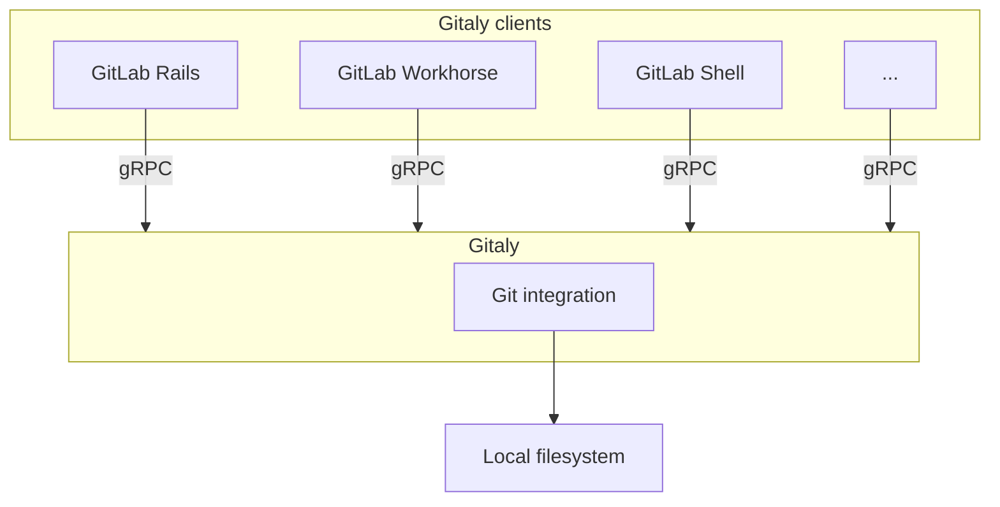

# Gitaly and Gitaly Cluster **(FREE SELF)**

[Gitaly](https://gitlab.com/gitlab-org/gitaly) provides high-level RPC access to Git repositories.
It is used by GitLab to read and write Git data.

Gitaly is present in every GitLab installation and coordinates Git repository
storage and retrieval. Gitaly can be:

- A simple background service operating on a single instance Omnibus GitLab (all of
  GitLab on one machine).
- Separated onto its own instance and configured in a full cluster configuration,
  depending on scaling and availability requirements.

Gitaly implements a client-server architecture:

- A Gitaly server is any node that runs Gitaly itself.
- A Gitaly client is any node that runs a process that makes requests of the Gitaly server. Gitaly clients are also known as _Gitaly consumers_ and include:
  - [GitLab Rails application](https://gitlab.com/gitlab-org/gitlab)
  - [GitLab Shell](https://gitlab.com/gitlab-org/gitlab-shell)
  - [GitLab Workhorse](https://gitlab.com/gitlab-org/gitlab-workhorse)
  - [GitLab Elasticsearch Indexer](https://gitlab.com/gitlab-org/gitlab-elasticsearch-indexer)

Gitaly manages only Git repository access for GitLab. Other types of GitLab data aren't accessed
using Gitaly.

GitLab accesses [repositories](../../user/project/repository/index.md) through the configured
[repository storages](../repository_storage_paths.md). Each new repository is stored on one of the
repository storages based on their
[configured weights](../repository_storage_paths.md#configure-where-new-repositories-are-stored). Each
repository storage is either:

- A Gitaly storage with direct access to repositories using [storage paths](../repository_storage_paths.md),
  where each repository is stored on a single Gitaly node. All requests are routed to this node.
- A [virtual storage](#virtual-storage) provided by [Gitaly Cluster](#gitaly-cluster), where each
  repository can be stored on multiple Gitaly nodes for fault tolerance. In a Gitaly Cluster:
  - Read requests are distributed between multiple Gitaly nodes, which can improve performance.
  - Write requests are broadcast to repository replicas.

## Guidance regarding Gitaly Cluster

Gitaly Cluster provides the benefits of fault tolerance, but comes with additional complexity of setup and management. Please review existing technical limitations and considerations prior to deploying Gitaly Cluster.

- [Known issues](#known-issues)
- [Snapshot limitations](#snapshot-backup-and-recovery-limitations).

Please also review the [configuration guidance](configure_gitaly.md) and [Repository storage options](../repository_storage_paths.md) to make sure that Gitaly Cluster is the best set-up for you. Finally, refer to the following guidance:

- If you have not yet migrated to Gitaly Cluster and want to continue using NFS, remain on the
  service you are using. NFS is supported in 14.x releases.
- If you have not yet migrated to Gitaly Cluster but want to migrate away from NFS, you have two options - a sharded Gitaly instance or Gitaly Cluster.
- If you have migrated to Gitaly Cluster and the limitations and tradeoffs are not suitable for your environment, your options are:
  1. [Migrate off Gitaly Cluster](#migrate-off-gitaly-cluster) back to your NFS solution
  1. [Migrate off Gitaly Cluster](#migrate-off-gitaly-cluster) to NFS solution or to a sharded Gitaly instance.

Reach out to your Technical Account Manager or customer support if you have any questions.

### Known issues

The following table outlines current known issues impacting the use of Gitaly Cluster. For
the current status of these issues, please refer to the referenced issues and epics.

| Issue                                                                                 | Summary                                                                                                                                                                                                                                                                                                                                                                                                                                                                                                                                                     | How to avoid |
|:--------------------------------------------------------------------------------------|:------------------------------------------------------------------------------------------------------------------------------------------------------------------------------------------------------------------------------------------------------------------------------------------------------------------------------------------------------------------------------------------------------------------------------------------------------------------------------------------------------------------------------------------------------------|:--------------------------------|
| Gitaly Cluster + Geo - Issues retrying failed syncs                             | If Gitaly Cluster is used on a Geo secondary site, repositories that have failed to sync could continue to fail when Geo tries to resync them. Recovering from this state requires assistance from support to run manual steps. Work is in-progress to update Gitaly Cluster to [identify repositories with a unique and persistent identifier](https://gitlab.com/gitlab-org/gitaly/-/issues/3485), which is expected to resolve the issue.                                                                                                                                                                                                                                          | No known solution at this time. |
| Database inconsistencies due to repository access outside of Gitaly Cluster's control | Operations that write to the repository storage that do not go through normal Gitaly Cluster methods can cause database inconsistencies. These can include (but are not limited to) snapshot restoration for cluster node disks, node upgrades which modify files under Git control, or any other disk operation that may touch repository storage external to GitLab. The Gitaly team is actively working to provide manual commands to [reconcile the Praefect database with the repository storage](https://gitlab.com/groups/gitlab-org/-/epics/6723).  | Don't directly change repositories on any Gitaly Cluster node at this time. |
| Praefect unable to insert data into the database due to migrations not being applied after an upgrade | If the database is not kept up to date with completed migrations, then the Praefect node is unable to perform normal operation. | Make sure the Praefect database is up and running with all migrations completed (For example: `/opt/gitlab/embedded/bin/praefect -config /var/opt/gitlab/praefect/config.toml sql-migrate-status` should show a list of all applied migrations). Consider [requesting live upgrade assistance](https://about.gitlab.com/support/scheduling-live-upgrade-assistance.html) so your upgrade plan can be reviewed by support. |
| Restoring a Gitaly Cluster node from a snapshot in a running cluster | Because the Gitaly Cluster runs with consistent state, introducing a single node that is behind will result in the cluster not being able to reconcile the nodes data and other nodes data | Don't restore a single Gitaly Cluster node from a backup snapshot. If you need to restore from backup, it's best to snapshot all Gitaly Cluster nodes at the same time and take a database dump of the Praefect database. |

### Snapshot backup and recovery limitations

Gitaly Cluster does not support snapshot backups because these can cause issues where the Praefect
database becomes out of sync with the disk storage. Because of how Praefect rebuilds the replication
metadata of Gitaly disk information during a restore, we recommend using the
[official backup and restore Rake tasks](../../raketasks/backup_restore.md). If you are unable to use this method, please contact customer support for restoration help.

To track progress on work on a solution for manually re-synchronizing the Praefect database with
disk storage, see [this epic](https://gitlab.com/groups/gitlab-org/-/epics/6575).

### What to do if you are on Gitaly Cluster experiencing an issue or limitation

Please contact customer support for immediate help in restoration or recovery.

## Gitaly

The following shows GitLab set up to use direct access to Gitaly:


In this example:

- Each repository is stored on one of three Gitaly storages: `storage-1`, `storage-2`, or
  `storage-3`.
- Each storage is serviced by a Gitaly node.
- The three Gitaly nodes store data on their file systems.

### Gitaly architecture

The following illustrates the Gitaly client-server architecture:



### Configure Gitaly

Gitaly comes pre-configured with Omnibus GitLab, which is a configuration
[suitable for up to 1000 users](../reference_architectures/1k_users.md). For:

- Omnibus GitLab installations for up to 2000 users, see [specific Gitaly configuration instructions](../reference_architectures/2k_users.md#configure-gitaly).
- Source installations or custom Gitaly installations, see [Configure Gitaly](configure_gitaly.md).

GitLab installations for more than 2000 active users performing daily Git write operation may be
best suited by using Gitaly Cluster.

## Gitaly Cluster

Git storage is provided through the Gitaly service in GitLab, and is essential to the operation of
GitLab. When the number of users, repositories, and activity grows, it is important to scale Gitaly
appropriately by:

- Increasing the available CPU and memory resources available to Git before
  resource exhaustion degrades Git, Gitaly, and GitLab application performance.
- Increasing available storage before storage limits are reached causing write
  operations to fail.
- Removing single points of failure to improve fault tolerance. Git should be
  considered mission critical if a service degradation would prevent you from
  deploying changes to production.

Gitaly can be run in a clustered configuration to:

- Scale the Gitaly service.
- Increase fault tolerance.

In this configuration, every Git repository can be stored on multiple Gitaly nodes in the cluster.

Using a Gitaly Cluster increases fault tolerance by:

- Replicating write operations to warm standby Gitaly nodes.
- Detecting Gitaly node failures.
- Automatically routing Git requests to an available Gitaly node.

NOTE:
Technical support for Gitaly clusters is limited to GitLab Premium and Ultimate
customers.

The following shows GitLab set up to access `storage-1`, a virtual storage provided by Gitaly
Cluster:


In this example:

- Repositories are stored on a virtual storage called `storage-1`.
- Three Gitaly nodes provide `storage-1` access: `gitaly-1`, `gitaly-2`, and `gitaly-3`.
- The three Gitaly nodes share data in three separate hashed storage locations.
- The [replication factor](#replication-factor) is `3`. There are three copies maintained
  of each repository.

The availability objectives for Gitaly clusters assuming a single node failure are:

- **Recovery Point Objective (RPO):** Less than 1 minute.

  Writes are replicated asynchronously. Any writes that have not been replicated
  to the newly promoted primary are lost.

  [Strong consistency](#strong-consistency) prevents loss in some circumstances.

- **Recovery Time Objective (RTO):** Less than 10 seconds.
  Outages are detected by a health check run by each Praefect node every
  second. Failover requires ten consecutive failed health checks on each
  Praefect node.

  Faster outage detection, to improve this speed to less than 1 second,
  is tracked [in this issue](https://gitlab.com/gitlab-org/gitaly/-/issues/2608).

WARNING:
If complete cluster failure occurs, disaster recovery plans should be executed. These can affect the
RPO and RTO discussed above.

### Virtual storage

Virtual storage makes it viable to have a single repository storage in GitLab to simplify repository
management.

Virtual storage with Gitaly Cluster can usually replace direct Gitaly storage configurations.
However, this is at the expense of additional storage space needed to store each repository on multiple
Gitaly nodes. The benefit of using Gitaly Cluster virtual storage over direct Gitaly storage is:

- Improved fault tolerance, because each Gitaly node has a copy of every repository.
- Improved resource utilization, reducing the need for over-provisioning for shard-specific peak
  loads, because read loads are distributed across Gitaly nodes.
- Manual rebalancing for performance is not required, because read loads are distributed across
  Gitaly nodes.
- Simpler management, because all Gitaly nodes are identical.

The number of repository replicas can be configured using a
[replication factor](#replication-factor).

It can
be uneconomical to have the same replication factor for all repositories.
To provide greater flexibility for extremely large GitLab instances,
variable replication factor is tracked in [this issue](https://gitlab.com/groups/gitlab-org/-/epics/3372).

As with normal Gitaly storages, virtual storages can be sharded.

### Moving beyond NFS

Engineering support for NFS for Git repositories is deprecated. Technical support is planned to be unavailable starting GitLab 15.0. Please see our [statement of support](https://about.gitlab.com/support/statement-of-support.html#gitaly-and-nfs) for more details.

[Network File System (NFS)](https://en.wikipedia.org/wiki/Network_File_System)
is not well suited to Git workloads which are CPU and IOPS sensitive.
Specifically:

- Git is sensitive to file system latency. Even simple operations require many
  read operations. Operations that are fast on block storage can become an order of
  magnitude slower. This significantly impacts GitLab application performance.
- NFS performance optimizations that prevent the performance gap between
  block storage and NFS being even wider are vulnerable to race conditions. We have observed
  [data inconsistencies](https://gitlab.com/gitlab-org/gitaly/-/issues/2589)
  in production environments caused by simultaneous writes to different NFS
  clients. Data corruption is not an acceptable risk.

Gitaly Cluster is purpose built to provide reliable, high performance, fault
tolerant Git storage.

Further reading:

- Blog post: [The road to Gitaly v1.0 (aka, why GitLab doesn't require NFS for storing Git data anymore)](https://about.gitlab.com/blog/2018/09/12/the-road-to-gitaly-1-0/)
- Blog post: [How we spent two weeks hunting an NFS bug in the Linux kernel](https://about.gitlab.com/blog/2018/11/14/how-we-spent-two-weeks-hunting-an-nfs-bug/)

### Components

Gitaly Cluster consists of multiple components:

- [Load balancer](praefect.md#load-balancer) for distributing requests and providing fault-tolerant access to
  Praefect nodes.
- [Praefect](praefect.md#praefect) nodes for managing the cluster and routing requests to Gitaly nodes.
- [PostgreSQL database](praefect.md#postgresql) for persisting cluster metadata and [PgBouncer](praefect.md#use-pgbouncer),
  recommended for pooling Praefect's database connections.
- Gitaly nodes to provide repository storage and Git access.

### Architecture

Praefect is a router and transaction manager for Gitaly, and a required
component for running a Gitaly Cluster.


For more information, see [Gitaly High Availability (HA) Design](https://gitlab.com/gitlab-org/gitaly/-/blob/master/doc/design_ha.md).

### Features

Gitaly Cluster provides the following features:

- [Distributed reads](#distributed-reads) among Gitaly nodes.
- [Strong consistency](#strong-consistency) of the secondary replicas.
- [Replication factor](#replication-factor) of repositories for increased redundancy.
- [Automatic failover](praefect.md#automatic-failover-and-primary-election-strategies) from the
  primary Gitaly node to secondary Gitaly nodes.
- Reporting of possible [data loss](recovery.md#check-for-data-loss) if replication queue isn't empty.

Follow the [Gitaly Cluster epic](https://gitlab.com/groups/gitlab-org/-/epics/1489) for improvements
including [horizontally distributing reads](https://gitlab.com/groups/gitlab-org/-/epics/2013).

#### Distributed reads

> - Introduced in GitLab 13.1 in [beta](https://about.gitlab.com/handbook/product/gitlab-the-product/#alpha-beta-ga) with feature flag `gitaly_distributed_reads` set to disabled.
> - [Made generally available and enabled by default](https://gitlab.com/gitlab-org/gitaly/-/issues/2951) in GitLab 13.3.
> - [Disabled by default](https://gitlab.com/gitlab-org/gitaly/-/issues/3178) in GitLab 13.5.
> - [Enabled by default](https://gitlab.com/gitlab-org/gitaly/-/issues/3334) in GitLab 13.8.
> - [Feature flag removed](https://gitlab.com/gitlab-org/gitaly/-/issues/3383) in GitLab 13.11.

Gitaly Cluster supports distribution of read operations across Gitaly nodes that are configured for
the [virtual storage](#virtual-storage).

All RPCs marked with the `ACCESSOR` option are redirected to an up to date and healthy Gitaly node.
For example, [`GetBlob`](https://gitlab.com/gitlab-org/gitaly/-/blob/v12.10.6/proto/blob.proto#L16).

_Up to date_ in this context means that:

- There is no replication operations scheduled for this Gitaly node.
- The last replication operation is in _completed_ state.

The primary node is chosen to serve the request if:

- There are no up to date nodes.
- Any other error occurs during node selection.

You can [monitor distribution of reads](#monitor-gitaly-cluster) using Prometheus.

#### Strong consistency

> - Introduced in GitLab 13.1 in [alpha](https://about.gitlab.com/handbook/product/gitlab-the-product/#alpha-beta-ga), disabled by default.
> - Entered [beta](https://about.gitlab.com/handbook/product/gitlab-the-product/#alpha-beta-ga) in GitLab 13.2, disabled by default.
> - In GitLab 13.3, disabled unless primary-wins voting strategy is disabled.
> - From GitLab 13.4, enabled by default.
> - From GitLab 13.5, you must use Git v2.28.0 or higher on Gitaly nodes to enable strong consistency.
> - From GitLab 13.6, primary-wins voting strategy and the `gitaly_reference_transactions_primary_wins` feature flag was removed.
> - From GitLab 14.0, [Gitaly Cluster only supports strong consistency](https://gitlab.com/gitlab-org/gitaly/-/merge_requests/3575), and the `gitaly_reference_transactions` feature flag was removed.

Gitaly Cluster provides strong consistency by writing changes synchronously to all healthy, up-to-date replicas. If a
replica is outdated or unhealthy at the time of the transaction, the write is asynchronously replicated to it.

If strong consistency is unavailable, Gitaly Cluster guarantees eventual consistency. In this case. Gitaly Cluster
replicates all writes to secondary Gitaly nodes after the write to the primary Gitaly node has occurred.

Strong consistency:

- Is the primary replication method in GitLab 14.0 and later. A subset of operations still use replication jobs
  (eventual consistency) instead of strong consistency. Refer to the
  [strong consistency epic](https://gitlab.com/groups/gitlab-org/-/epics/1189) for more information.
- Must be configured in GitLab versions 13.1 to 13.12. For configuration information, refer to either:
  - Documentation on your GitLab instance at `/help`.
  - The [13.12 documentation](https://docs.gitlab.com/13.12/ee/administration/gitaly/praefect.html#strong-consistency).
- Is unavailable in GitLab 13.0 and earlier.

For more information on monitoring strong consistency, see the Gitaly Cluster [Prometheus metrics documentation](#monitor-gitaly-cluster).

#### Replication factor

Replication factor is the number of copies Gitaly Cluster maintains of a given repository. A higher
replication factor:

- Offers better redundancy and distribution of read workload.
- Results in higher storage cost.

By default, Gitaly Cluster replicates repositories to every storage in a
[virtual storage](#virtual-storage).

For configuration information, see [Configure replication factor](praefect.md#configure-replication-factor).

### Configure Gitaly Cluster

For more information on configuring Gitaly Cluster, see [Configure Gitaly Cluster](praefect.md).

## Migrating to Gitaly Cluster

Please see [current guidance on Gitaly Cluster](#guidance-regarding-gitaly-cluster). The basic process for migrating to Gitaly Cluster involves:

1. Create the required storage. Refer to
   [repository storage recommendations](faq.md#what-are-some-repository-storage-recommendations).
1. Create and configure [Gitaly Cluster](praefect.md).
1. [Move the repositories](../operations/moving_repositories.md#move-repositories). To migrate to
   Gitaly Cluster, existing repositories stored outside Gitaly Cluster must be moved. There is no
   automatic migration but the moves can be scheduled with the GitLab API.

WARNING:
Some [known database inconsistency issues](#known-issues) exist in Gitaly Cluster. We recommend you
remain on your current service for now.

NOTE:
GitLab requires a `default` repository storage to be configured.
[Read more about this limitation](configure_gitaly.md#gitlab-requires-a-default-repository-storage).

### Migrate off Gitaly Cluster

If you have repositories stored on a Gitaly Cluster, but you'd like to migrate
them back to direct Gitaly storage:

1. Create and configure a new
   [Gitaly server](configure_gitaly.md#run-gitaly-on-its-own-server).
1. [Move the repositories](../operations/moving_repositories.md#move-repositories)
   to the newly created storage. There are different possibilities to move them
   by shard or by group, this gives you the opportunity to spread them over
   multiple Gitaly servers.

## Monitor Gitaly and Gitaly Cluster

You can use the available logs and [Prometheus metrics](../monitoring/prometheus/index.md) to
monitor Gitaly and Gitaly Cluster (Praefect).

Metric definitions are available:

- Directly from Prometheus `/metrics` endpoint configured for Gitaly.
- Using [Grafana Explore](https://grafana.com/docs/grafana/latest/explore/) on a
  Grafana instance configured against Prometheus.

### Monitor Gitaly

You can observe the behavior of [queued requests](configure_gitaly.md#limit-rpc-concurrency) using
the Gitaly logs and Prometheus:

- In the [Gitaly logs](../logs.md#gitaly-logs), look for the string (or structured log field)
  `acquire_ms`. Messages that have this field are reporting about the concurrency limiter.
- In Prometheus, look for the following metrics:
  - `gitaly_rate_limiting_in_progress`.
  - `gitaly_rate_limiting_queued`.
  - `gitaly_rate_limiting_seconds`.

  Although the name of the Prometheus metric contains `rate_limiting`, it's a concurrency limiter,
  not a rate limiter. If a Gitaly client makes 1,000 requests in a row very quickly, concurrency
  doesn't exceed 1, and the concurrency limiter has no effect.

The following [pack-objects cache](configure_gitaly.md#pack-objects-cache) metrics are available:

- `gitaly_pack_objects_cache_enabled`, a gauge set to `1` when the cache is enabled. Available
  labels: `dir` and `max_age`.
- `gitaly_pack_objects_cache_lookups_total`, a counter for cache lookups. Available label: `result`.
- `gitaly_pack_objects_generated_bytes_total`, a counter for the number of bytes written into the
  cache.
- `gitaly_pack_objects_served_bytes_total`, a counter for the number of bytes read from the cache.
- `gitaly_streamcache_filestore_disk_usage_bytes`, a gauge for the total size of cache files.
  Available label: `dir`.
- `gitaly_streamcache_index_entries`, a gauge for the number of entries in the cache. Available
  label: `dir`.

Some of these metrics start with `gitaly_streamcache` because they are generated by the
`streamcache` internal library package in Gitaly.

Example:

```plaintext
gitaly_pack_objects_cache_enabled{dir="/var/opt/gitlab/git-data/repositories/+gitaly/PackObjectsCache",max_age="300"} 1
gitaly_pack_objects_cache_lookups_total{result="hit"} 2
gitaly_pack_objects_cache_lookups_total{result="miss"} 1
gitaly_pack_objects_generated_bytes_total 2.618649e+07
gitaly_pack_objects_served_bytes_total 7.855947e+07
gitaly_streamcache_filestore_disk_usage_bytes{dir="/var/opt/gitlab/git-data/repositories/+gitaly/PackObjectsCache"} 2.6200152e+07
gitaly_streamcache_filestore_removed_total{dir="/var/opt/gitlab/git-data/repositories/+gitaly/PackObjectsCache"} 1
gitaly_streamcache_index_entries{dir="/var/opt/gitlab/git-data/repositories/+gitaly/PackObjectsCache"} 1
```

#### Useful queries

The following are useful queries for monitoring Gitaly:

- Use the following Prometheus query to observe the
  [type of connections](configure_gitaly.md#enable-tls-support) Gitaly is serving a production
  environment:

  ```prometheus
  sum(rate(gitaly_connections_total[5m])) by (type)
  ```

- Use the following Prometheus query to monitor the
  [authentication behavior](configure_gitaly.md#observe-type-of-gitaly-connections) of your GitLab
  installation:

  ```prometheus
  sum(rate(gitaly_authentications_total[5m])) by (enforced, status)
  ```

  In a system where authentication is configured correctly and where you have live traffic, you
  see something like this:

  ```prometheus
  {enforced="true",status="ok"}  4424.985419441742
  ```

  There may also be other numbers with rate 0, but you only have to take note of the non-zero numbers.

  The only non-zero number should have `enforced="true",status="ok"`. If you have other non-zero
  numbers, something is wrong in your configuration.

  The `status="ok"` number reflects your current request rate. In the example above, Gitaly is
  handling about 4000 requests per second.

- Use the following Prometheus query to observe the [Git protocol versions](../git_protocol.md)
  being used in a production environment:

  ```prometheus
  sum(rate(gitaly_git_protocol_requests_total[1m])) by (grpc_method,git_protocol,grpc_service)
  ```

### Monitor Gitaly Cluster

To monitor Gitaly Cluster (Praefect), you can use these Prometheus metrics. There are two separate metrics
endpoints from which metrics can be scraped:

- The default `/metrics` endpoint.
- `/db_metrics`, which contains metrics that require database queries.

#### Default Prometheus `/metrics` endpoint

The following metrics are available from the `/metrics` endpoint:

- `gitaly_praefect_read_distribution`, a counter to track [distribution of reads](#distributed-reads).
  It has two labels:

  - `virtual_storage`.
  - `storage`.

  They reflect configuration defined for this instance of Praefect.

- `gitaly_praefect_replication_latency_bucket`, a histogram measuring the amount of time it takes
  for replication to complete once the replication job starts. Available in GitLab 12.10 and later.
- `gitaly_praefect_replication_delay_bucket`, a histogram measuring how much time passes between
  when the replication job is created and when it starts. Available in GitLab 12.10 and later.
- `gitaly_praefect_node_latency_bucket`, a histogram measuring the latency in Gitaly returning
  health check information to Praefect. This indicates Praefect connection saturation. Available in
  GitLab 12.10 and later.

To monitor [strong consistency](#strong-consistency), you can use the following Prometheus metrics:

- `gitaly_praefect_transactions_total`, the number of transactions created and voted on.
- `gitaly_praefect_subtransactions_per_transaction_total`, the number of times nodes cast a vote for
  a single transaction. This can happen multiple times if multiple references are getting updated in
  a single transaction.
- `gitaly_praefect_voters_per_transaction_total`: the number of Gitaly nodes taking part in a
  transaction.
- `gitaly_praefect_transactions_delay_seconds`, the server-side delay introduced by waiting for the
  transaction to be committed.
- `gitaly_hook_transaction_voting_delay_seconds`, the client-side delay introduced by waiting for
  the transaction to be committed.

You can also monitor the [Praefect logs](../logs.md#praefect-logs).

#### Database metrics `/db_metrics` endpoint

> [Introduced](https://gitlab.com/gitlab-org/gitaly/-/issues/3286) in GitLab 14.5.

The following metrics are available from the `/db_metrics` endpoint:

- `gitaly_praefect_unavailable_repositories`, the number of repositories that have no healthy, up to date replicas.
- `gitaly_praefect_read_only_repositories`, the number of repositories in read-only mode within a virtual storage.
  This metric is available for backwards compatibility reasons. `gitaly_praefect_unavailable_repositories` is more
  accurate.
- `gitaly_praefect_replication_queue_depth`, the number of jobs in the replication queue.

## Recover from failure

Gitaly Cluster can [recover from certain types of failure](recovery.md).

## Do not bypass Gitaly

GitLab doesn't advise directly accessing Gitaly repositories stored on disk with a Git client,
because Gitaly is being continuously improved and changed. These improvements may invalidate
your assumptions, resulting in performance degradation, instability, and even data loss. For example:

- Gitaly has optimizations such as the [`info/refs` advertisement cache](https://gitlab.com/gitlab-org/gitaly/blob/master/doc/design_diskcache.md),
  that rely on Gitaly controlling and monitoring access to repositories by using the official gRPC
  interface.
- [Gitaly Cluster](#gitaly-cluster) has optimizations, such as fault tolerance and
  [distributed reads](#distributed-reads), that depend on the gRPC interface and database
  to determine repository state.

WARNING:
Accessing Git repositories directly is done at your own risk and is not supported.

## Direct access to Git in GitLab

Direct access to Git uses code in GitLab known as the "Rugged patches".

Before Gitaly existed, what are now Gitaly clients accessed Git repositories directly, either:

- On a local disk in the case of a single-machine Omnibus GitLab installation.
- Using NFS in the case of a horizontally-scaled GitLab installation.

In addition to running plain `git` commands, GitLab used a Ruby library called
[Rugged](https://github.com/libgit2/rugged). Rugged is a wrapper around
[libgit2](https://libgit2.org/), a stand-alone implementation of Git in the form of a C library.

Over time it became clear that Rugged, particularly in combination with
[Unicorn](https://yhbt.net/unicorn/), is extremely efficient. Because `libgit2` is a library and
not an external process, there was very little overhead between:

- GitLab application code that tried to look up data in Git repositories.
- The Git implementation itself.

Because the combination of Rugged and Unicorn was so efficient, the GitLab application code ended up
with lots of duplicate Git object lookups. For example, looking up the default branch commit a dozen
times in one request. We could write inefficient code without poor performance.

When we migrated these Git lookups to Gitaly calls, we suddenly had a much higher fixed cost per Git
lookup. Even when Gitaly is able to re-use an already-running `git` process (for example, to look up
a commit), you still have:

- The cost of a network roundtrip to Gitaly.
- Inside Gitaly, a write/read roundtrip on the Unix pipes that connect Gitaly to the `git` process.

Using GitLab.com to measure, we reduced the number of Gitaly calls per request until the loss of
Rugged's efficiency was no longer felt. It also helped that we run Gitaly itself directly on the Git
file servers, rather than by using NFS mounts. This gave us a speed boost that counteracted the
negative effect of not using Rugged anymore.

Unfortunately, other deployments of GitLab could not remove NFS like we did on GitLab.com, and they
got the worst of both worlds:

- The slowness of NFS.
- The increased inherent overhead of Gitaly.

The code removed from GitLab during the Gitaly migration project affected these deployments. As a
performance workaround for these NFS-based deployments, we re-introduced some of the old Rugged
code. This re-introduced code is informally referred to as the "Rugged patches".

### How it works

The Ruby methods that perform direct Git access are behind
[feature flags](../../development/gitaly.md#legacy-rugged-code), disabled by default. It wasn't
convenient to set feature flags to get the best performance, so we added an automatic mechanism that
enables direct Git access.

When GitLab calls a function that has a "Rugged patch", it performs two checks:

- Is the feature flag for this patch set in the database? If so, the feature flag setting controls
  the GitLab use of "Rugged patch" code.
- If the feature flag is not set, GitLab tries accessing the file system underneath the
  Gitaly server directly. If it can, it uses the "Rugged patch":
  - If using Puma and [thread count](../../install/requirements.md#puma-threads) is set
    to `1`.

The result of these checks is cached.

To see if GitLab can access the repository file system directly, we use the following heuristic:

- Gitaly ensures that the file system has a metadata file in its root with a UUID in it.
- Gitaly reports this UUID to GitLab by using the `ServerInfo` RPC.
- GitLab Rails tries to read the metadata file directly. If it exists, and if the UUID's match,
  assume we have direct access.

Direct Git access is enable by default in Omnibus GitLab because it fills in the correct repository
paths in the GitLab configuration file `config/gitlab.yml`. This satisfies the UUID check.

### Transition to Gitaly Cluster

For the sake of removing complexity, we must remove direct Git access in GitLab. However, we can't
remove it as long some GitLab installations require Git repositories on NFS.

There are two facets to our efforts to remove direct Git access in GitLab:

- Reduce the number of inefficient Gitaly queries made by GitLab.
- Persuade administrators of fault-tolerant or horizontally-scaled GitLab instances to migrate off
  NFS.

The second facet presents the only real solution. For this, we developed
[Gitaly Cluster](#gitaly-cluster).

## NFS deprecation notice

Engineering support for NFS for Git repositories is deprecated. Technical support is planned to be
unavailable from GitLab 15.0. For further information, please see our [NFS Deprecation](../nfs.md#gitaly-and-nfs-deprecation) documentation.
