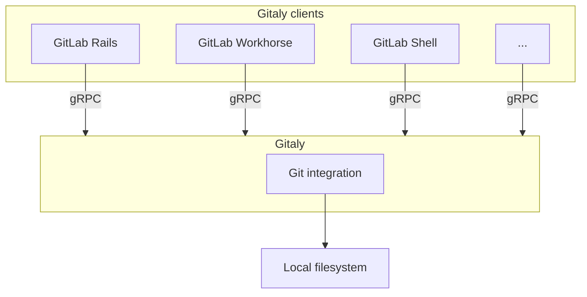

# Gitaly and Gitaly Cluster **(FREE SELF)**

[Gitaly](https://gitlab.com/gitlab-org/gitaly) provides high-level RPC access to Git repositories.
It is used by GitLab to read and write Git data.

Gitaly implements a client-server architecture:

- A Gitaly server is any node that runs Gitaly itself.
- A Gitaly client is any node that runs a process that makes requests of the Gitaly server. These
  include, but are not limited to:
  - [GitLab Rails application](https://gitlab.com/gitlab-org/gitlab).
  - [GitLab Shell](https://gitlab.com/gitlab-org/gitlab-shell).
  - [GitLab Workhorse](https://gitlab.com/gitlab-org/gitlab-workhorse).

The following illustrates the Gitaly client-server architecture:



End users do not have direct access to Gitaly. Gitaly manages only Git repository access for GitLab.
Other types of GitLab data aren't accessed using Gitaly.

<!-- vale gitlab.FutureTense = NO -->

WARNING:
From GitLab 14.0, enhancements and bug fixes for NFS for Git repositories will no longer be
considered and customer technical support will be considered out of scope.
[Read more about Gitaly and NFS](#nfs-deprecation-notice).

<!-- vale gitlab.FutureTense = YES -->

## Configure Gitaly

Gitaly comes pre-configured with Omnibus GitLab, which is a configuration
[suitable for up to 1000 users](../reference_architectures/1k_users.md). For:

- Omnibus GitLab installations for up to 2000 users, see [specific Gitaly configuration instructions](../reference_architectures/2k_users.md#configure-gitaly).
- Source installations or custom Gitaly installations, see [Configure Gitaly](configure_gitaly.md).

GitLab installations for more than 2000 users should use Gitaly Cluster.

NOTE:
If not set in GitLab, feature flags are read as false from the console and Gitaly uses their
default value. The default value depends on the GitLab version.

## Gitaly Cluster

Gitaly, the service that provides storage for Git repositories, can
be run in a clustered configuration to scale the Gitaly service and increase
fault tolerance. In this configuration, every Git repository is stored on every
Gitaly node in the cluster.

Using a Gitaly Cluster increases fault tolerance by:

- Replicating write operations to warm standby Gitaly nodes.
- Detecting Gitaly node failures.
- Automatically routing Git requests to an available Gitaly node.

NOTE:
Technical support for Gitaly clusters is limited to GitLab Premium and Ultimate
customers.

The availability objectives for Gitaly clusters are:

- **Recovery Point Objective (RPO):** Less than 1 minute.

  Writes are replicated asynchronously. Any writes that have not been replicated
  to the newly promoted primary are lost.

  [Strong consistency](praefect.md#strong-consistency) can be used to avoid loss in some
  circumstances.

- **Recovery Time Objective (RTO):** Less than 10 seconds.
  Outages are detected by a health check run by each Praefect node every
  second. Failover requires ten consecutive failed health checks on each
  Praefect node.

  [Faster outage detection](https://gitlab.com/gitlab-org/gitaly/-/issues/2608)
  is planned to improve this to less than 1 second.

Gitaly Cluster supports:

- [Strong consistency](praefect.md#strong-consistency) of the secondary replicas.
- [Automatic failover](praefect.md#automatic-failover-and-primary-election-strategies) from the primary to the secondary.
- Reporting of possible data loss if replication queue is non-empty.
- Marking repositories as [read-only](praefect.md#read-only-mode) if data loss is detected to prevent data inconsistencies.

Follow the [Gitaly Cluster epic](https://gitlab.com/groups/gitlab-org/-/epics/1489)
for improvements including
[horizontally distributing reads](https://gitlab.com/groups/gitlab-org/-/epics/2013).

### Overview

Git storage is provided through the Gitaly service in GitLab, and is essential
to the operation of the GitLab application. When the number of
users, repositories, and activity grows, it is important to scale Gitaly
appropriately by:

- Increasing the available CPU and memory resources available to Git before
  resource exhaustion degrades Git, Gitaly, and GitLab application performance.
- Increase available storage before storage limits are reached causing write
  operations to fail.
- Improve fault tolerance by removing single points of failure. Git should be
  considered mission critical if a service degradation would prevent you from
  deploying changes to production.

### Moving beyond NFS

WARNING:
From GitLab 13.0, using NFS for Git repositories is deprecated. In GitLab 14.0,
support for NFS for Git repositories is scheduled to be removed. Upgrade to
Gitaly Cluster as soon as possible.

[Network File System (NFS)](https://en.wikipedia.org/wiki/Network_File_System)
is not well suited to Git workloads which are CPU and IOPS sensitive.
Specifically:

- Git is sensitive to file system latency. Even simple operations require many
  read operations. Operations that are fast on block storage can become an order of
  magnitude slower. This significantly impacts GitLab application performance.
- NFS performance optimizations that prevent the performance gap between
  block storage and NFS being even wider are vulnerable to race conditions. We have observed
  [data inconsistencies](https://gitlab.com/gitlab-org/gitaly/-/issues/2589)
  in production environments caused by simultaneous writes to different NFS
  clients. Data corruption is not an acceptable risk.

Gitaly Cluster is purpose built to provide reliable, high performance, fault
tolerant Git storage.

Further reading:

- Blog post: [The road to Gitaly v1.0 (aka, why GitLab doesn't require NFS for storing Git data anymore)](https://about.gitlab.com/blog/2018/09/12/the-road-to-gitaly-1-0/)
- Blog post: [How we spent two weeks hunting an NFS bug in the Linux kernel](https://about.gitlab.com/blog/2018/11/14/how-we-spent-two-weeks-hunting-an-nfs-bug/)

### Where Gitaly Cluster fits

GitLab accesses [repositories](../../user/project/repository/index.md) through the configured
[repository storages](../repository_storage_paths.md). Each new repository is stored on one of the
repository storages based on their configured weights. Each repository storage is either:

- A Gitaly storage served directly by Gitaly. These map to a directory on the file system of a
  Gitaly node.
- A [virtual storage](#virtual-storage-or-direct-gitaly-storage) served by Praefect. A virtual
  storage is a cluster of Gitaly storages that appear as a single repository storage.

Virtual storages are a feature of Gitaly Cluster. They support replicating the repositories to
multiple storages for fault tolerance. Virtual storages can improve performance by distributing
requests across Gitaly nodes. Their distributed nature makes it viable to have a single repository
storage in GitLab to simplify repository management.

### Components of Gitaly Cluster

Gitaly Cluster consists of multiple components:

- [Load balancer](praefect.md#load-balancer) for distributing requests and providing fault-tolerant access to
  Praefect nodes.
- [Praefect](praefect.md#praefect) nodes for managing the cluster and routing requests to Gitaly nodes.
- [PostgreSQL database](praefect.md#postgresql) for persisting cluster metadata and [PgBouncer](praefect.md#pgbouncer),
  recommended for pooling Praefect's database connections.
- Gitaly nodes to provide repository storage and Git access.


In this example:

- Repositories are stored on a virtual storage called `storage-1`.
- Three Gitaly nodes provide `storage-1` access: `gitaly-1`, `gitaly-2`, and `gitaly-3`.
- The three Gitaly nodes store data on their file systems.

### Virtual storage or direct Gitaly storage

Gitaly supports multiple models of scaling:

- Clustering using Gitaly Cluster, where each repository is stored on multiple Gitaly nodes in the
  cluster. Read requests are distributed between repository replicas and write requests are
  broadcast to repository replicas. GitLab accesses virtual storage.
- Direct access to Gitaly storage using [repository storage paths](../repository_storage_paths.md),
  where each repository is stored on the assigned Gitaly node. All requests are routed to this node.

The following is Gitaly set up to use direct access to Gitaly instead of Gitaly Cluster:


In this example:

- Each repository is stored on one of three Gitaly storages: `storage-1`, `storage-2`,
  or `storage-3`.
- Each storage is serviced by a Gitaly node.
- The three Gitaly nodes share data in three separate hashed storage locations.
- The [replication factor](praefect.md#replication-factor) is `3`. There are three copies maintained
  of each repository.

Generally, virtual storage with Gitaly Cluster can replace direct Gitaly storage configurations, at
the expense of additional storage needed to store each repository on multiple Gitaly nodes. The
benefit of using Gitaly Cluster over direct Gitaly storage is:

- Improved fault tolerance, because each Gitaly node has a copy of every repository.
- Improved resource utilization, reducing the need for over-provisioning for shard-specific peak
  loads, because read loads are distributed across replicas.
- Manual rebalancing for performance is not required, because read loads are distributed across
  replicas.
- Simpler management, because all Gitaly nodes are identical.

Under some workloads, CPU and memory requirements may require a large fleet of Gitaly nodes. It
can be uneconomical to have one to one replication factor.

A hybrid approach can be used in these instances, where each shard is configured as a smaller
cluster. [Variable replication factor](https://gitlab.com/groups/gitlab-org/-/epics/3372) is planned
to provide greater flexibility for extremely large GitLab instances.

### Gitaly Cluster compared to Geo

Gitaly Cluster and [Geo](../geo/index.md) both provide redundancy. However the redundancy of:

- Gitaly Cluster provides fault tolerance for data storage and is invisible to the user. Users are
  not aware when Gitaly Cluster is used.
- Geo provides [replication](../geo/index.md) and [disaster recovery](../geo/disaster_recovery/index.md) for
  an entire instance of GitLab. Users know when they are using Geo for
  [replication](../geo/index.md). Geo [replicates multiple data types](../geo/replication/datatypes.md#limitations-on-replicationverification),
  including Git data.

The following table outlines the major differences between Gitaly Cluster and Geo:

| Tool           | Nodes    | Locations | Latency tolerance  | Failover                                                                    | Consistency                              | Provides redundancy for |
|:---------------|:---------|:----------|:-------------------|:----------------------------------------------------------------------------|:-----------------------------------------|:------------------------|
| Gitaly Cluster | Multiple | Single    | Approximately 1 ms | [Automatic](praefect.md#automatic-failover-and-primary-election-strategies) | [Strong](praefect.md#strong-consistency) | Data storage in Git     |
| Geo            | Multiple | Multiple  | Up to one minute   | [Manual](../geo/disaster_recovery/index.md)                                 | Eventual                                 | Entire GitLab instance  |

For more information, see:

- Geo [use cases](../geo/index.md#use-cases).
- Geo [architecture](../geo/index.md#architecture).

### Architecture

Praefect is a router and transaction manager for Gitaly, and a required
component for running a Gitaly Cluster.


For more information, see [Gitaly High Availability (HA) Design](https://gitlab.com/gitlab-org/gitaly/-/blob/master/doc/design_ha.md).

### Configure Gitaly Cluster

For more information on configuring Gitaly Cluster, see [Configure Gitaly Cluster](praefect.md).

## Do not bypass Gitaly

GitLab doesn't advise directly accessing Gitaly repositories stored on disk with a Git client,
because Gitaly is being continuously improved and changed. These improvements may invalidate
your assumptions, resulting in performance degradation, instability, and even data loss. For example:

- Gitaly has optimizations such as the [`info/refs` advertisement cache](https://gitlab.com/gitlab-org/gitaly/blob/master/doc/design_diskcache.md),
  that rely on Gitaly controlling and monitoring access to repositories by using the official gRPC
  interface.
- [Gitaly Cluster](praefect.md) has optimizations, such as fault tolerance and
  [distributed reads](praefect.md#distributed-reads), that depend on the gRPC interface and database
  to determine repository state.

WARNING:
Accessing Git repositories directly is done at your own risk and is not supported.

## Direct access to Git in GitLab

Direct access to Git uses code in GitLab known as the "Rugged patches".

Before Gitaly existed, what are now Gitaly clients accessed Git repositories directly, either:

- On a local disk in the case of a single-machine Omnibus GitLab installation.
- Using NFS in the case of a horizontally-scaled GitLab installation.

In addition to running plain `git` commands, GitLab used a Ruby library called
[Rugged](https://github.com/libgit2/rugged). Rugged is a wrapper around
[libgit2](https://libgit2.org/), a stand-alone implementation of Git in the form of a C library.

Over time it became clear that Rugged, particularly in combination with
[Unicorn](https://yhbt.net/unicorn/), is extremely efficient. Because `libgit2` is a library and
not an external process, there was very little overhead between:

- GitLab application code that tried to look up data in Git repositories.
- The Git implementation itself.

Because the combination of Rugged and Unicorn was so efficient, the GitLab application code ended up
with lots of duplicate Git object lookups. For example, looking up the default branch commit a dozen
times in one request. We could write inefficient code without poor performance.

When we migrated these Git lookups to Gitaly calls, we suddenly had a much higher fixed cost per Git
lookup. Even when Gitaly is able to re-use an already-running `git` process (for example, to look up
a commit), you still have:

- The cost of a network roundtrip to Gitaly.
- Inside Gitaly, a write/read roundtrip on the Unix pipes that connect Gitaly to the `git` process.

Using GitLab.com to measure, we reduced the number of Gitaly calls per request until the loss of
Rugged's efficiency was no longer felt. It also helped that we run Gitaly itself directly on the Git
file servers, rather than by using NFS mounts. This gave us a speed boost that counteracted the
negative effect of not using Rugged anymore.

Unfortunately, other deployments of GitLab could not remove NFS like we did on GitLab.com, and they
got the worst of both worlds:

- The slowness of NFS.
- The increased inherent overhead of Gitaly.

The code removed from GitLab during the Gitaly migration project affected these deployments. As a
performance workaround for these NFS-based deployments, we re-introduced some of the old Rugged
code. This re-introduced code is informally referred to as the "Rugged patches".

### How it works

The Ruby methods that perform direct Git access are behind
[feature flags](../../development/gitaly.md#legacy-rugged-code), disabled by default. It wasn't
convenient to set feature flags to get the best performance, so we added an automatic mechanism that
enables direct Git access.

When GitLab calls a function that has a "Rugged patch", it performs two checks:

- Is the feature flag for this patch set in the database? If so, the feature flag setting controls
  the GitLab use of "Rugged patch" code.
- If the feature flag is not set, GitLab tries accessing the file system underneath the
  Gitaly server directly. If it can, it uses the "Rugged patch":
  - If using Unicorn.
  - If using Puma and [thread count](../../install/requirements.md#puma-threads) is set
    to `1`.

The result of these checks is cached.

To see if GitLab can access the repository file system directly, we use the following heuristic:

- Gitaly ensures that the file system has a metadata file in its root with a UUID in it.
- Gitaly reports this UUID to GitLab by using the `ServerInfo` RPC.
- GitLab Rails tries to read the metadata file directly. If it exists, and if the UUID's match,
  assume we have direct access.

Direct Git access is enable by default in Omnibus GitLab because it fills in the correct repository
paths in the GitLab configuration file `config/gitlab.yml`. This satisfies the UUID check.

WARNING:
If directly copying repository data from a GitLab server to Gitaly, ensure that the metadata file,
default path `/var/opt/gitlab/git-data/repositories/.gitaly-metadata`, is not included in the transfer.
Copying this file causes GitLab to use the Rugged patches for repositories hosted on the Gitaly server,
leading to `Error creating pipeline` and `Commit not found` errors, or stale data.

### Transition to Gitaly Cluster

For the sake of removing complexity, we must remove direct Git access in GitLab. However, we can't
remove it as long some GitLab installations require Git repositories on NFS.

There are two facets to our efforts to remove direct Git access in GitLab:

- Reduce the number of inefficient Gitaly queries made by GitLab.
- Persuade administrators of fault-tolerant or horizontally-scaled GitLab instances to migrate off
  NFS.

The second facet presents the only real solution. For this, we developed
[Gitaly Cluster](#gitaly-cluster).

## NFS deprecation notice

<!-- vale gitlab.FutureTense = NO -->

From GitLab 14.0, enhancements and bug fixes for NFS for Git repositories will no longer be
considered and customer technical support will be considered out of scope.

Additional information:

- [Recommended NFS mount options and known issues with Gitaly and NFS](../nfs.md#upgrade-to-gitaly-cluster-or-disable-caching-if-experiencing-data-loss).
- [GitLab statement of support](https://about.gitlab.com/support/statement-of-support.html#gitaly-and-nfs).

<!-- vale gitlab.FutureTense = YES -->

GitLab recommends:

- Creating a [Gitaly Cluster](#gitaly-cluster) as soon as possible.
- [Moving your repositories](praefect.md#migrate-to-gitaly-cluster) from NFS-based storage to Gitaly
  Cluster.

We welcome your feedback on this process: raise a support ticket, or [comment on the epic](https://gitlab.com/groups/gitlab-org/-/epics/4916).

## Troubleshooting Gitaly

Check [Gitaly timeouts](../../user/admin_area/settings/gitaly_timeouts.md) when troubleshooting
Gitaly.

### Check versions when using standalone Gitaly servers

When using standalone Gitaly servers, you must make sure they are the same version
as GitLab to ensure full compatibility. Check **Admin Area > Overview > Gitaly Servers** on
your GitLab instance and confirm all Gitaly servers indicate that they are up to date.

### `gitaly-debug`

The `gitaly-debug` command provides "production debugging" tools for Gitaly and Git
performance. It is intended to help production engineers and support
engineers investigate Gitaly performance problems.

If you're using GitLab 11.6 or newer, this tool should be installed on
your GitLab / Gitaly server already at `/opt/gitlab/embedded/bin/gitaly-debug`.
If you're investigating an older GitLab version you can compile this
tool offline and copy the executable to your server:

```shell
git clone https://gitlab.com/gitlab-org/gitaly.git
cd cmd/gitaly-debug
GOOS=linux GOARCH=amd64 go build -o gitaly-debug
```

To see the help page of `gitaly-debug` for a list of supported sub-commands, run:

```shell
gitaly-debug -h
```

### Commits, pushes, and clones return a 401

```plaintext
remote: GitLab: 401 Unauthorized
```

You need to sync your `gitlab-secrets.json` file with your Gitaly clients (GitLab
app nodes).

### Client side gRPC logs

Gitaly uses the [gRPC](https://grpc.io/) RPC framework. The Ruby gRPC
client has its own log file which may contain debugging information when
you are seeing Gitaly errors. You can control the log level of the
gRPC client with the `GRPC_LOG_LEVEL` environment variable. The
default level is `WARN`.

You can run a gRPC trace with:

```shell
sudo GRPC_TRACE=all GRPC_VERBOSITY=DEBUG gitlab-rake gitlab:gitaly:check
```

### Server side gRPC logs

gRPC tracing can also be enabled in Gitaly itself with the `GODEBUG=http2debug`
environment variable. To set this in an Omnibus GitLab install:

1. Add the following to your `gitlab.rb` file:

   ```ruby
   gitaly['env'] = {
     "GODEBUG=http2debug" => "2"
   }
   ```

1. [Reconfigure](../restart_gitlab.md#omnibus-gitlab-reconfigure) GitLab.

### Correlating Git processes with RPCs

Sometimes you need to find out which Gitaly RPC created a particular Git process.

One method for doing this is by using `DEBUG` logging. However, this needs to be enabled
ahead of time and the logs produced are quite verbose.

A lightweight method for doing this correlation is by inspecting the environment
of the Git process (using its `PID`) and looking at the `CORRELATION_ID` variable:

```shell
PID=<Git process ID>
sudo cat /proc/$PID/environ | tr '\0' '\n' | grep ^CORRELATION_ID=
```

This method isn't reliable for `git cat-file` processes, because Gitaly
internally pools and re-uses those across RPCs.

### Observing `gitaly-ruby` traffic

[`gitaly-ruby`](configure_gitaly.md#gitaly-ruby) is an internal implementation detail of Gitaly,
so, there's not that much visibility into what goes on inside
`gitaly-ruby` processes.

If you have Prometheus set up to scrape your Gitaly process, you can see
request rates and error codes for individual RPCs in `gitaly-ruby` by
querying `grpc_client_handled_total`. Strictly speaking, this metric does
not differentiate between `gitaly-ruby` and other RPCs. However from GitLab 11.9,
all gRPC calls made by Gitaly itself are internal calls from the main Gitaly process to one of its
`gitaly-ruby` sidecars.

Assuming your `grpc_client_handled_total` counter observes only Gitaly,
the following query shows you RPCs are (most likely) internally
implemented as calls to `gitaly-ruby`:

```prometheus
sum(rate(grpc_client_handled_total[5m])) by (grpc_method) > 0
```

### Repository changes fail with a `401 Unauthorized` error

If you run Gitaly on its own server and notice these conditions:

- Users can successfully clone and fetch repositories by using both SSH and HTTPS.
- Users can't push to repositories, or receive a `401 Unauthorized` message when attempting to
  make changes to them in the web UI.

Gitaly may be failing to authenticate with the Gitaly client because it has the
[wrong secrets file](configure_gitaly.md#configure-gitaly-servers).

Confirm the following are all true:

- When any user performs a `git push` to any repository on this Gitaly server, it
  fails with a `401 Unauthorized` error:

  ```shell
  remote: GitLab: 401 Unauthorized
  To <REMOTE_URL>
  ! [remote rejected] branch-name -> branch-name (pre-receive hook declined)
  error: failed to push some refs to '<REMOTE_URL>'
  ```

- When any user adds or modifies a file from the repository using the GitLab
  UI, it immediately fails with a red `401 Unauthorized` banner.
- Creating a new project and [initializing it with a README](../../user/project/working_with_projects.md#blank-projects)
  successfully creates the project, but doesn't create the README.
- When [tailing the logs](https://docs.gitlab.com/omnibus/settings/logs.html#tail-logs-in-a-console-on-the-server)
  on a Gitaly client and reproducing the error, you get `401` errors
  when reaching the [`/api/v4/internal/allowed`](../../development/internal_api.md) endpoint:

  ```shell
  # api_json.log
  {
    "time": "2019-07-18T00:30:14.967Z",
    "severity": "INFO",
    "duration": 0.57,
    "db": 0,
    "view": 0.57,
    "status": 401,
    "method": "POST",
    "path": "\/api\/v4\/internal\/allowed",
    "params": [
      {
        "key": "action",
        "value": "git-receive-pack"
      },
      {
        "key": "changes",
        "value": "REDACTED"
      },
      {
        "key": "gl_repository",
        "value": "REDACTED"
      },
      {
        "key": "project",
        "value": "\/path\/to\/project.git"
      },
      {
        "key": "protocol",
        "value": "web"
      },
      {
        "key": "env",
        "value": "{\"GIT_ALTERNATE_OBJECT_DIRECTORIES\":[],\"GIT_ALTERNATE_OBJECT_DIRECTORIES_RELATIVE\":[],\"GIT_OBJECT_DIRECTORY\":null,\"GIT_OBJECT_DIRECTORY_RELATIVE\":null}"
      },
      {
        "key": "user_id",
        "value": "2"
      },
      {
        "key": "secret_token",
        "value": "[FILTERED]"
      }
    ],
    "host": "gitlab.example.com",
    "ip": "REDACTED",
    "ua": "Ruby",
    "route": "\/api\/:version\/internal\/allowed",
    "queue_duration": 4.24,
    "gitaly_calls": 0,
    "gitaly_duration": 0,
    "correlation_id": "XPUZqTukaP3"
  }

  # nginx_access.log
  [IP] - - [18/Jul/2019:00:30:14 +0000] "POST /api/v4/internal/allowed HTTP/1.1" 401 30 "" "Ruby"
  ```

To fix this problem, confirm that your [`gitlab-secrets.json` file](configure_gitaly.md#configure-gitaly-servers)
on the Gitaly server matches the one on Gitaly client. If it doesn't match,
update the secrets file on the Gitaly server to match the Gitaly client, then
[reconfigure](../restart_gitlab.md#omnibus-gitlab-reconfigure).

### Command line tools cannot connect to Gitaly

gRPC cannot reach your Gitaly server if:

- You can't connect to a Gitaly server with command-line tools.
- Certain actions result in a `14: Connect Failed` error message.

Verify you can reach Gitaly by using TCP:

```shell
sudo gitlab-rake gitlab:tcp_check[GITALY_SERVER_IP,GITALY_LISTEN_PORT]
```

If the TCP connection fails, check your network settings and your firewall rules.
If the TCP connection succeeds, your networking and firewall rules are correct.

If you use proxy servers in your command line environment, such as Bash, these
can interfere with your gRPC traffic.

If you use Bash or a compatible command line environment, run the following commands
to determine whether you have proxy servers configured:

```shell
echo $http_proxy
echo $https_proxy
```

If either of these variables have a value, your Gitaly CLI connections may be
getting routed through a proxy which cannot connect to Gitaly.

To remove the proxy setting, run the following commands (depending on which variables had values):

```shell
unset http_proxy
unset https_proxy
```

### Permission denied errors appearing in Gitaly or Praefect logs when accessing repositories

You might see the following in Gitaly and Praefect logs:

```shell
{
  ...
  "error":"rpc error: code = PermissionDenied desc = permission denied",
  "grpc.code":"PermissionDenied",
  "grpc.meta.client_name":"gitlab-web",
  "grpc.request.fullMethod":"/gitaly.ServerService/ServerInfo",
  "level":"warning",
  "msg":"finished unary call with code PermissionDenied",
  ...
}
```

This is a GRPC call
[error response code](https://grpc.github.io/grpc/core/md_doc_statuscodes.html).

If this error occurs, even though
[the Gitaly auth tokens are correctly setup](../gitaly/praefect.md#debugging-praefect),
it's likely that the Gitaly servers are experiencing
[clock drift](https://en.wikipedia.org/wiki/Clock_drift).

Ensure the Gitaly clients and servers are synchronized, and use an NTP time
server to keep them synchronized.
