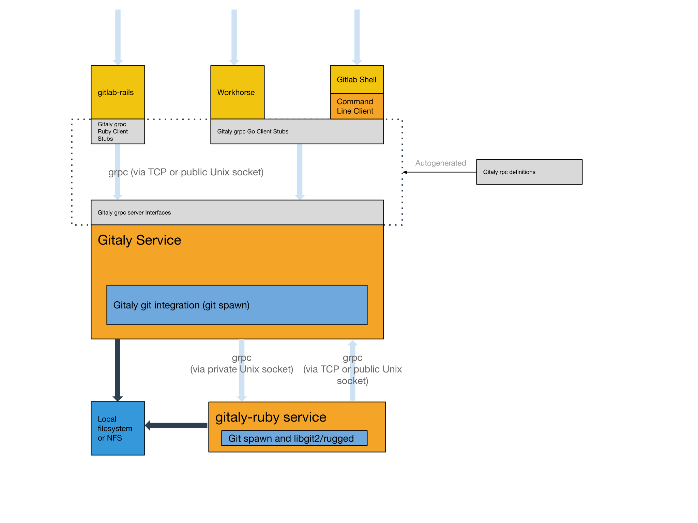
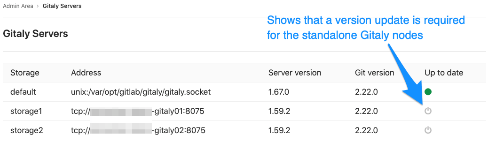

# Gitaly

[Gitaly](https://gitlab.com/gitlab-org/gitaly) is the service that
provides high-level RPC access to Git repositories. Without it, no other
components can read or write Git data. GitLab components that access Git
repositories (GitLab Rails, GitLab Shell, GitLab Workhorse, etc.) act as clients
to Gitaly. End users do not have direct access to Gitaly.

In the rest of this page, Gitaly server is referred to the standalone node that
only runs Gitaly, and Gitaly client to the GitLab Rails node that runs all other
processes except Gitaly.

## Architecture

Here's a high-level architecture overview of how Gitaly is used.



## Configuring Gitaly

The Gitaly service itself is configured via a [TOML configuration file](reference.md).

In case you want to change some of its settings:

**For Omnibus GitLab**

1. Edit `/etc/gitlab/gitlab.rb` and add or change the [Gitaly settings](https://gitlab.com/gitlab-org/omnibus-gitlab/blob/1dd07197c7e5ae23626aad5a4a070a800b670380/files/gitlab-config-template/gitlab.rb.template#L1622-1676).
1. Save the file and [reconfigure GitLab](../restart_gitlab.md#omnibus-gitlab-reconfigure).

**For installations from source**

1. Edit `/home/git/gitaly/config.toml` and add or change the [Gitaly settings](https://gitlab.com/gitlab-org/gitaly/blob/master/config.toml.example).
1. Save the file and [restart GitLab](../restart_gitlab.md#installations-from-source).

## Running Gitaly on its own server

This is an optional way to deploy Gitaly which can benefit GitLab
installations that are larger than a single machine. Most
installations will be better served with the default configuration
used by Omnibus and the GitLab source installation guide.

Starting with GitLab 11.4, Gitaly is able to serve all Git requests without
requiring a shared NFS mount for Git repository data.
Between 11.4 and 11.8 the exception was the
[Elasticsearch indexer](https://gitlab.com/gitlab-org/gitlab-elasticsearch-indexer).
But since 11.8 the indexer uses Gitaly for data access as well. NFS can still
be leveraged for redudancy on block level of the Git data. But only has to
be mounted on the Gitaly server.

Starting with GitLab 11.8, it is possible to use Elasticsearch in conjunction with
a Gitaly setup that isn't utilising NFS. In order to use Elasticsearch in this
scenario, the [new repository indexer](../../integration/elasticsearch.md#elasticsearch-repository-indexer-beta)
needs to be enabled in your GitLab configuration.

NOTE: **Note:** While Gitaly can be used as a replacement for NFS, it's not recommended
to use EFS as it may impact GitLab's performance. Review the [relevant documentation](../high_availability/nfs.md#avoid-using-awss-elastic-file-system-efs)
for more details.

### Network architecture

The following list depicts what the network architecture of Gitaly is:

- GitLab Rails shards repositories into [repository storages](../repository_storage_paths.md).
- `/config/gitlab.yml` contains a map from storage names to
  `(Gitaly address, Gitaly token)` pairs.
- the `storage name` -\> `(Gitaly address, Gitaly token)` map in
  `/config/gitlab.yml` is the single source of truth for the Gitaly network
  topology.
- A `(Gitaly address, Gitaly token)` corresponds to a Gitaly server.
- A Gitaly server hosts one or more storages.
- A GitLab server can use one or more Gitaly servers.
- Gitaly addresses must be specified in such a way that they resolve
  correctly for ALL Gitaly clients.
- Gitaly clients are: Unicorn, Sidekiq, GitLab Workhorse,
  GitLab Shell, Elasticsearch Indexer, and Gitaly itself.
- A Gitaly server must be able to make RPC calls **to itself** via its own
  `(Gitaly address, Gitaly token)` pair as specified in `/config/gitlab.yml`.
- Gitaly servers must not be exposed to the public internet as Gitaly's network
  traffic is unencrypted by default. The use of firewall is highly recommended
  to restrict access to the Gitaly server. Another option is to
  [use TLS](#tls-support).
- Authentication is done through a static token which is shared among the Gitaly
  and GitLab Rails nodes.

Below we describe how to configure two Gitaly servers one at
`gitaly1.internal` and the other at `gitaly2.internal`
with secret token `abc123secret`. We assume
your GitLab installation has three repository storages: `default`,
`storage1` and `storage2`. You can use as little as just one server with one
repository storage if desired.

Note: **Note:** The token referred to throughout the Gitaly documentation is
just an arbitrary password selected by the administrator. It is unrelated to
tokens created for the GitLab API or other similar web API tokens.

### 1. Installation

First install Gitaly on each Gitaly server using either
Omnibus GitLab or install it from source:

- For Omnibus GitLab: [Download/install](https://about.gitlab.com/install/) the Omnibus GitLab
  package you want using **steps 1 and 2** from the GitLab downloads page but
  **_do not_** provide the `EXTERNAL_URL=` value.
- From source: [Install Gitaly](../../install/installation.md#install-gitaly).

### 2. Client side token configuration

Configure a token on the instance that runs the GitLab Rails application.

**For Omnibus GitLab**

1. On the client node(s), edit `/etc/gitlab/gitlab.rb`:

   ```ruby
   gitlab_rails['gitaly_token'] = 'abc123secret'
   ```

1. Save the file and [reconfigure GitLab](../restart_gitlab.md#omnibus-gitlab-reconfigure).

**For installations from source**

1. On the client node(s), edit `/home/git/gitlab/config/gitlab.yml`:

   ```yaml
   gitlab:
     gitaly:
       token: 'abc123secret'
   ```

1. Save the file and [restart GitLab](../restart_gitlab.md#installations-from-source).

### 3. Gitaly server configuration

Next, on the Gitaly servers, you need to configure storage paths, enable
the network listener and configure the token.

NOTE: **Note:** If you want to reduce the risk of downtime when you enable
authentication you can temporarily disable enforcement, see [the
documentation on configuring Gitaly
authentication](https://gitlab.com/gitlab-org/gitaly/blob/master/doc/configuration/README.md#authentication)
.

Gitaly must trigger some callbacks to GitLab via GitLab Shell. As a result,
the GitLab Shell secret must be the same between the other GitLab servers and
the Gitaly server. The easiest way to accomplish this is to copy `/etc/gitlab/gitlab-secrets.json`
from an existing GitLab server to the Gitaly server. Without this shared secret,
Git operations in GitLab will result in an API error.

**For Omnibus GitLab**

1. Edit `/etc/gitlab/gitlab.rb`:

   <!--
   updates to following example must also be made at
   https://gitlab.com/gitlab-org/charts/gitlab/blob/master/doc/advanced/external-gitaly/external-omnibus-gitaly.md#configure-omnibus-gitlab
   -->

   ```ruby
   # /etc/gitlab/gitlab.rb

   # Avoid running unnecessary services on the Gitaly server
   postgresql['enable'] = false
   redis['enable'] = false
   nginx['enable'] = false
   prometheus['enable'] = false
   unicorn['enable'] = false
   sidekiq['enable'] = false
   gitlab_workhorse['enable'] = false

   # Prevent database connections during 'gitlab-ctl reconfigure'
   gitlab_rails['rake_cache_clear'] = false
   gitlab_rails['auto_migrate'] = false

   # Configure the gitlab-shell API callback URL. Without this, `git push` will
   # fail. This can be your 'front door' GitLab URL or an internal load
   # balancer.
   # Don't forget to copy `/etc/gitlab/gitlab-secrets.json` from web server to Gitaly server.
   gitlab_rails['internal_api_url'] = 'https://gitlab.example.com'

   # Authentication token to ensure only authorized servers can communicate with
   # Gitaly server
   gitaly['auth_token'] = 'abc123secret'

   # Make Gitaly accept connections on all network interfaces. You must use
   # firewalls to restrict access to this address/port.
   # Comment out following line if you only want to support TLS connections
   gitaly['listen_addr'] = "0.0.0.0:8075"
   ```

1. Append the following to `/etc/gitlab/gitlab.rb` for each respective server:

   On `gitaly1.internal`:

   ```
   git_data_dirs({
     'default' => {
       'path' => '/var/opt/gitlab/git-data'
     },
     'storage1' => {
       'path' => '/mnt/gitlab/git-data'
     },
   })
   ```

   On `gitaly2.internal`:

   ```
   git_data_dirs({
     'storage2' => {
       'path' => '/srv/gitlab/git-data'
     },
   })
   ```

1. Save the file and [reconfigure GitLab](../restart_gitlab.md#omnibus-gitlab-reconfigure).

**For installations from source**

1. On the client node(s), edit `/home/git/gitaly/config.toml`:

   ```toml
   listen_addr = '0.0.0.0:8075'

   internal_socket_dir = '/var/opt/gitlab/gitaly'

   [auth]
   token = 'abc123secret'

   [logging]
   format = 'json'
   level = 'info'
   dir = '/var/log/gitaly'
   ```

1. Append the following to `/home/git/gitaly/config.toml` for each respective server:

   On `gitaly1.internal`:

   ```toml
   [[storage]]
   name = 'default'
   path = '/var/opt/gitlab/git-data/repositories'

   [[storage]]
   name = 'storage1'
   path = '/mnt/gitlab/git-data/repositories'
   ```

   On `gitaly2.internal`:

   ```toml
   [[storage]]
   name = 'storage2'
   path = '/srv/gitlab/git-data/repositories'
   ```

1. Save the file and [restart GitLab](../restart_gitlab.md#installations-from-source).

### 4. Converting clients to use the Gitaly server

As the final step, you need to update the client machines to switch from using
their local Gitaly service to the new Gitaly server you just configured. This
is a risky step because if there is any sort of network, firewall, or name
resolution problem preventing your GitLab server from reaching the Gitaly server,
then all Gitaly requests will fail.

Additionally, you need to
[disable Rugged if previously manually enabled](../high_availability/nfs.md#improving-nfs-performance-with-gitlab).

We assume that your `gitaly1.internal` Gitaly server can be reached at
`gitaly1.internal:8075` from your GitLab server, and that Gitaly server
can read and write to `/mnt/gitlab/default` and `/mnt/gitlab/storage1`.

We assume also that your `gitaly2.internal` Gitaly server can be reached at
`gitaly2.internal:8075` from your GitLab server, and that Gitaly server
can read and write to `/mnt/gitlab/storage2`.

**For Omnibus GitLab**

1. Edit `/etc/gitlab/gitlab.rb`:

   ```ruby
   git_data_dirs({
     'default' => { 'gitaly_address' => 'tcp://gitaly1.internal:8075' },
     'storage1' => { 'gitaly_address' => 'tcp://gitaly1.internal:8075' },
     'storage2' => { 'gitaly_address' => 'tcp://gitaly2.internal:8075' },
   })

   gitlab_rails['gitaly_token'] = 'abc123secret'
   ```

1. Save the file and [reconfigure GitLab](../restart_gitlab.md#omnibus-gitlab-reconfigure).
1. Tail the logs to see the requests:

   ```sh
   sudo gitlab-ctl tail gitaly
   ```

**For installations from source**

1. Edit `/home/git/gitlab/config/gitlab.yml`:

   ```yaml
   gitlab:
     repositories:
       storages:
         default:
           gitaly_address: tcp://gitaly1.internal:8075
           path: /some/dummy/path
         storage1:
           gitaly_address: tcp://gitaly1.internal:8075
           path: /some/dummy/path
         storage2:
           gitaly_address: tcp://gitaly2.internal:8075
           path: /some/dummy/path

     gitaly:
       token: 'abc123secret'
   ```

   NOTE: **Note:**
   `/some/dummy/path` should be set to a local folder that exists, however no
   data will be stored in this folder. This will no longer be necessary after
   [this issue](https://gitlab.com/gitlab-org/gitaly/issues/1282) is resolved.

1. Save the file and [restart GitLab](../restart_gitlab.md#installations-from-source).
1. Tail the logs to see the requests:

   ```sh
   tail -f /home/git/gitlab/log/gitaly.log
   ```

When you tail the Gitaly logs on your Gitaly server you should see requests
coming in. One sure way to trigger a Gitaly request is to clone a repository
from your GitLab server over HTTP.

DANGER: **Danger:**
If you have [custom server-side Git hooks](../custom_hooks.md) configured,
either per repository or globally, you must move these to the Gitaly node.
If you have multiple Gitaly nodes, copy your custom hook(s) to all nodes.

### Disabling the Gitaly service in a cluster environment

If you are running Gitaly [as a remote
service](#running-gitaly-on-its-own-server) you may want to disable
the local Gitaly service that runs on your GitLab server by default.
Disabling Gitaly only makes sense when you run GitLab in a custom
cluster configuration, where different services run on different
machines. Disabling Gitaly on all machines in the cluster is not a
valid configuration.

To disable Gitaly on a client node:

**For Omnibus GitLab**

1. Edit `/etc/gitlab/gitlab.rb`:

   ```ruby
   gitaly['enable'] = false
   ```

1. Save the file and [reconfigure GitLab](../restart_gitlab.md#omnibus-gitlab-reconfigure).

**For installations from source**

1. Edit `/etc/default/gitlab`:

   ```shell
   gitaly_enabled=false
   ```

1. Save the file and [restart GitLab](../restart_gitlab.md#installations-from-source).

## TLS support

> [Introduced](https://gitlab.com/gitlab-org/gitlab-foss/merge_requests/22602) in GitLab 11.8.

Gitaly supports TLS encryption. To be able to communicate
with a Gitaly instance that listens for secure connections you will need to use `tls://` URL
scheme in the `gitaly_address` of the corresponding storage entry in the GitLab configuration.

You will need to bring your own certificates as this isn't provided automatically.
The certificate to be used needs to be installed on all Gitaly nodes, and the
certificate (or CA of certificate) on all
client nodes that communicate with it following the procedure described in
[GitLab custom certificate configuration](https://docs.gitlab.com/omnibus/settings/ssl.html#install-custom-public-certificates).

NOTE: **Note**
The self-signed certificate must specify the address you use to access the
Gitaly server. If you are addressing the Gitaly server by a hostname, you can
either use the Common Name field for this, or add it as a Subject Alternative
Name. If you are addressing the Gitaly server by its IP address, you must add it
as a Subject Alternative Name to the certificate.
[gRPC does not support using an IP address as Common Name in a certificate](https://github.com/grpc/grpc/issues/2691).

NOTE: **Note:**
It is possible to configure Gitaly servers with both an
unencrypted listening address `listen_addr` and an encrypted listening
address `tls_listen_addr` at the same time. This allows you to do a
gradual transition from unencrypted to encrypted traffic, if necessary.

To configure Gitaly with TLS:

**For Omnibus GitLab**

1. On the client node(s), edit `/etc/gitlab/gitlab.rb` as follows:

   ```ruby
   git_data_dirs({
     'default' => { 'gitaly_address' => 'tls://gitaly1.internal:9999' },
     'storage1' => { 'gitaly_address' => 'tls://gitaly1.internal:9999' },
     'storage2' => { 'gitaly_address' => 'tls://gitaly2.internal:9999' },
   })

   gitlab_rails['gitaly_token'] = 'abc123secret'
   ```

1. Save the file and [reconfigure GitLab](../restart_gitlab.md#omnibus-gitlab-reconfigure) on client node(s).
1. On the Gitaly server, create the `/etc/gitlab/ssl` directory and copy your key and certificate there:

   ```sh
   sudo mkdir -p /etc/gitlab/ssl
   sudo chmod 755 /etc/gitlab/ssl
   sudo cp key.pem cert.pem /etc/gitlab/ssl/
   ```

1. On the Gitaly server node(s), edit `/etc/gitlab/gitlab.rb` and add:

   <!--
   updates to following example must also be made at
   https://gitlab.com/gitlab-org/charts/gitlab/blob/master/doc/advanced/external-gitaly/external-omnibus-gitaly.md#configure-omnibus-gitlab
   -->

   ```ruby
   gitaly['tls_listen_addr'] = "0.0.0.0:9999"
   gitaly['certificate_path'] = "/etc/gitlab/ssl/cert.pem"
   gitaly['key_path'] = "/etc/gitlab/ssl/key.pem"
   ```

1. Save the file and [reconfigure GitLab](../restart_gitlab.md#omnibus-gitlab-reconfigure) on Gitaly server node(s).
1. (Optional) After [verifying that all Gitaly traffic is being served over TLS](#observe-type-of-gitaly-connections),
   you can improve security by disabling non-TLS connections by commenting out
   or deleting `gitaly['listen_addr']` in `/etc/gitlab/gitlab.rb`, saving the file,
   and [reconfiguring GitLab](../restart_gitlab.md#omnibus-gitlab-reconfigure)
   on Gitaly server node(s).

**For installations from source**

1. On the client node(s), edit `/home/git/gitlab/config/gitlab.yml` as follows:

   ```yaml
   gitlab:
     repositories:
       storages:
         default:
           gitaly_address: tls://gitaly1.internal:9999
           path: /some/dummy/path
         storage1:
           gitaly_address: tls://gitaly1.internal:9999
           path: /some/dummy/path
         storage2:
           gitaly_address: tls://gitaly2.internal:9999
           path: /some/dummy/path

     gitaly:
       token: 'abc123secret'
   ```

   NOTE: **Note:**
   `/some/dummy/path` should be set to a local folder that exists, however no
   data will be stored in this folder. This will no longer be necessary after
   [this issue](https://gitlab.com/gitlab-org/gitaly/issues/1282) is resolved.

1. Save the file and [restart GitLab](../restart_gitlab.md#installations-from-source) on client node(s).
1. Create the `/etc/gitlab/ssl` directory and copy your key and certificate there:

   ```sh
   sudo mkdir -p /etc/gitlab/ssl
   sudo chmod 700 /etc/gitlab/ssl
   sudo cp key.pem cert.pem /etc/gitlab/ssl/
   ```

1. On the Gitaly server node(s), edit `/home/git/gitaly/config.toml` and add:

   ```toml
   tls_listen_addr = '0.0.0.0:9999'

   [tls]
   certificate_path = '/etc/gitlab/ssl/cert.pem'
   key_path = '/etc/gitlab/ssl/key.pem'
   ```

1. Save the file and [restart GitLab](../restart_gitlab.md#installations-from-source) on Gitaly server node(s).
1. (Optional) After [verifying that all Gitaly traffic is being served over TLS](#observe-type-of-gitaly-connections),
   you can improve security by disabling non-TLS connections by commenting out
   or deleting `listen_addr` in `/home/git/gitaly/config.toml`, saving the file,
   and [restarting GitLab](../restart_gitlab.md#installations-from-source)
   on Gitaly server node(s).

### Observe type of Gitaly connections

To observe what type of connections are actually being used in a
production environment you can use the following Prometheus query:

```
sum(rate(gitaly_connections_total[5m])) by (type)
```

## `gitaly-ruby`

Gitaly was developed to replace the Ruby application code in GitLab.
In order to save time and/or avoid the risk of rewriting existing
application logic, in some cases we chose to copy some application code
from GitLab into Gitaly almost as-is. To be able to run that code,
`gitaly-ruby` was created, which is a "sidecar" process for the main Gitaly Go
process. Some examples of things that are implemented in `gitaly-ruby` are
RPCs that deal with wikis, and RPCs that create commits on behalf of
a user, such as merge commits.

### Number of `gitaly-ruby` workers

`gitaly-ruby` has much less capacity than Gitaly itself. If your Gitaly
server has to handle a lot of requests, the default setting of having
just one active `gitaly-ruby` sidecar might not be enough. If you see
`ResourceExhausted` errors from Gitaly, it's very likely that you have not
enough `gitaly-ruby` capacity.

You can increase the number of `gitaly-ruby` processes on your Gitaly
server with the following settings.

**For Omnibus GitLab**

1. Edit `/etc/gitlab/gitlab.rb`:

   ```ruby
   # Default is 2 workers. The minimum is 2; 1 worker is always reserved as
   # a passive stand-by.
   gitaly['ruby_num_workers'] = 4
   ```

1. Save the file and [reconfigure GitLab](../restart_gitlab.md#omnibus-gitlab-reconfigure).

**For installations from source**

1. Edit `/home/git/gitaly/config.toml`:

   ```toml
   [gitaly-ruby]
   num_workers = 4
   ```

1. Save the file and [restart GitLab](../restart_gitlab.md#installations-from-source).

## Eliminating NFS altogether

If you are planning to use Gitaly without NFS for your storage needs
and want to eliminate NFS from your environment altogether, there are
a few things that you need to do:

1. Make sure the [`git` user home directory](https://docs.gitlab.com/omnibus/settings/configuration.html#moving-the-home-directory-for-a-user) is on local disk.
1. Configure [database lookup of SSH keys](../operations/fast_ssh_key_lookup.md)
   to eliminate the need for a shared authorized_keys file.
1. Configure [object storage for job artifacts](../job_artifacts.md#using-object-storage)
   including [incremental logging](../job_logs.md#new-incremental-logging-architecture).
1. Configure [object storage for LFS objects](../lfs/lfs_administration.md#storing-lfs-objects-in-remote-object-storage).
1. Configure [object storage for uploads](../uploads.md#using-object-storage-core-only).
1. Configure [object storage for Merge Request Diffs](../merge_request_diffs.md#using-object-storage).
1. Configure [object storage for Packages](../packages/index.md#using-object-storage) (Optional Feature).
1. Configure [object storage for Dependency Proxy](../packages/dependency_proxy.md#using-object-storage) (Optional Feature).

NOTE: **Note:**
One current feature of GitLab that still requires a shared directory (NFS) is
[GitLab Pages](../../user/project/pages/index.md).
There is [work in progress](https://gitlab.com/gitlab-org/gitlab-pages/issues/196)
to eliminate the need for NFS to support GitLab Pages.

## Limiting RPC concurrency

It can happen that CI clone traffic puts a large strain on your Gitaly
service. The bulk of the work gets done in the SSHUploadPack (for Git
SSH) and PostUploadPack (for Git HTTP) RPC's. To prevent such workloads
from overcrowding your Gitaly server you can set concurrency limits in
Gitaly's configuration file.

```ruby
# in /etc/gitlab/gitlab.rb

gitaly['concurrency'] = [
  {
    'rpc' => "/gitaly.SmartHTTPService/PostUploadPack",
    'max_per_repo' => 20
  },
  {
    'rpc' => "/gitaly.SSHService/SSHUploadPack",
    'max_per_repo' => 20
  }
]
```

This will limit the number of in-flight RPC calls for the given RPC's.
The limit is applied per repository. In the example above, each on the
Gitaly server can have at most 20 simultaneous PostUploadPack calls in
flight, and the same for SSHUploadPack. If another request comes in for
a repository that hase used up its 20 slots, that request will get
queued.

You can observe the behavior of this queue via the Gitaly logs and via
Prometheus. In the Gitaly logs, you can look for the string (or
structured log field) `acquire_ms`. Messages that have this field are
reporting about the concurrency limiter. In Prometheus, look for the
`gitaly_rate_limiting_in_progress`, `gitaly_rate_limiting_queued` and
`gitaly_rate_limiting_seconds` metrics.

The name of the Prometheus metric is not quite right because this is a
concurrency limiter, not a rate limiter. If a client makes 1000 requests
in a row in a very short timespan, the concurrency will not exceed 1,
and this mechanism (the concurrency limiter) will do nothing.

## Rotating a Gitaly authentication token

Rotating credentials in a production environment often either requires
downtime, or causes outages, or both. If you are careful, though, you
*can* rotate Gitaly credentials without a service interruption.

This procedure also works if you are running GitLab on a single server.
In that case, "Gitaly servers" and "Gitaly clients" refers to the same
machine.

### 1. Monitor current authentication behavior

Use Prometheus to see what the current authentication behavior of your
GitLab installation is.

```
sum(rate(gitaly_authentications_total[5m])) by (enforced, status)
```

In a system where authentication is configured correctly, and where you
have live traffic, you will see something like this:

```
{enforced="true",status="ok"}  4424.985419441742
```

There may also be other numbers with rate 0. We only care about the
non-zero numbers.

The only non-zero number should have `enforced="true",status="ok"`. If
you have other non-zero numbers, something is wrong in your
configuration.

The 'status="ok"' number reflects your current request rate. In the example
above, Gitaly is handling about 4000 requests per second.

Now you have established that you can monitor the Gitaly authentication
behavior of your GitLab installation.

### 2. Reconfigure all Gitaly servers to be in "auth transitioning" mode

The second step is to temporarily disable authentication on the Gitaly servers.

```ruby
# in /etc/gitlab/gitlab.rb
gitaly['auth_transitioning'] = true
```

After you have applied this, your Prometheus query should return
something like this:

```
{enforced="false",status="would be ok"}  4424.985419441742
```

Because `enforced="false"`, it will be safe to start rolling out the new
token.

### 3. Update Gitaly token on all clients and servers

```ruby
# in /etc/gitlab/gitlab.rb

gitaly['auth_token'] = 'my new secret token'
```

Remember to apply this on both your Gitaly clients *and* servers. If you
check your Prometheus query while this change is being rolled out, you
will see non-zero values for the `enforced="false",status="denied"` counter.

### 4. Use Prometheus to ensure there are no authentication failures

After you applied the Gitaly token change everywhere, and all services
involved have been restarted, you should will temporarily see a mix of
`status="would be ok"` and `status="denied"`.

After the new token has been picked up by all Gitaly clients and
servers, the **only non-zero rate** should be
`enforced="false",status="would be ok"`.

### 5. Disable "auth transitioning" Mode

Now we turn off the 'auth transitioning' mode. These final steps are
important: without them, you have **no authentication**.

Update the configuration on your Gitaly servers:

```ruby
# in /etc/gitlab/gitlab.rb
gitaly['auth_transitioning'] = false
```

### 6. Verify that authentication is enforced again

Refresh your Prometheus query. You should now see the same kind of
result as you did in the beginning:

```
{enforced="true",status="ok"}  4424.985419441742
```

Note that `enforced="true"`, meaning that authentication is being enforced.

## Troubleshooting Gitaly

### Checking versions when using standalone Gitaly nodes

When using standalone Gitaly nodes, you must make sure they are the same version
as GitLab to ensure full compatibility. Check **Admin Area > Gitaly Servers** on
your GitLab instance and confirm all Gitaly Servers are `Up to date`.



### `gitaly-debug`

The `gitaly-debug` command provides "production debugging" tools for Gitaly and Git
performance. It is intended to help production engineers and support
engineers investigate Gitaly performance problems.

If you're using GitLab 11.6 or newer, this tool should be installed on
your GitLab / Gitaly server already at `/opt/gitlab/embedded/bin/gitaly-debug`.
If you're investigating an older GitLab version you can compile this
tool offline and copy the executable to your server:

```sh
git clone https://gitlab.com/gitlab-org/gitaly.git
cd cmd/gitaly-debug
GOOS=linux GOARCH=amd64 go build -o gitaly-debug
```

To see the help page of `gitaly-debug` for a list of supported sub-commands, run:

```sh
gitaly-debug -h
```

### Commits, pushes, and clones return a 401

```
remote: GitLab: 401 Unauthorized
```

You will need to sync your `gitlab-secrets.json` file with your GitLab
app nodes.

### Client side GRPC logs

Gitaly uses the [gRPC](https://grpc.io/) RPC framework. The Ruby gRPC
client has its own log file which may contain useful information when
you are seeing Gitaly errors. You can control the log level of the
gRPC client with the `GRPC_LOG_LEVEL` environment variable. The
default level is `WARN`.

### Observing `gitaly-ruby` traffic

[`gitaly-ruby`](#gitaly-ruby) is an internal implementation detail of Gitaly,
so, there's not that much visibility into what goes on inside
`gitaly-ruby` processes.

If you have Prometheus set up to scrape your Gitaly process, you can see
request rates and error codes for individual RPCs in `gitaly-ruby` by
querying `grpc_client_handled_total`. Strictly speaking, this metric does
not differentiate between `gitaly-ruby` and other RPCs, but in practice
(as of GitLab 11.9), all gRPC calls made by Gitaly itself are internal
calls from the main Gitaly process to one of its `gitaly-ruby` sidecars.

Assuming your `grpc_client_handled_total` counter only observes Gitaly,
the following query shows you RPCs are (most likely) internally
implemented as calls to `gitaly-ruby`:

```
sum(rate(grpc_client_handled_total[5m])) by (grpc_method) > 0
```

### Repository changes fail with a `401 Unauthorized` error

If you're running Gitaly on its own server and notice that users can
successfully clone and fetch repositories (via both SSH and HTTPS), but can't
push to them or make changes to the repository in the web UI without getting a
`401 Unauthorized` message, then it's possible Gitaly is failing to authenticate
with the other nodes due to having the [wrong secrets file](#3-gitaly-server-configuration).

Confirm the following are all true:

- When any user performs a `git push` to any repository on this Gitaly node, it
  fails with the following error (note the `401 Unauthorized`):

  ```sh
  remote: GitLab: 401 Unauthorized
  To <REMOTE_URL>
  ! [remote rejected] branch-name -> branch-name (pre-receive hook declined)
  error: failed to push some refs to '<REMOTE_URL>'
  ```

- When any user adds or modifies a file from the repository using the GitLab
  UI, it immediatley fails with a red `401 Unauthorized` banner.
- Creating a new project and [initializing it with a README](../../gitlab-basics/create-project.md#blank-projects)
  successfully creates the project but doesn't create the README.
- When [tailing the logs](https://docs.gitlab.com/omnibus/settings/logs.html#tail-logs-in-a-console-on-the-server) on an app node and reproducing the error, you get `401` errors
  when reaching the `/api/v4/internal/allowed` endpoint:

  ```sh
  # api_json.log
  {
    "time": "2019-07-18T00:30:14.967Z",
    "severity": "INFO",
    "duration": 0.57,
    "db": 0,
    "view": 0.57,
    "status": 401,
    "method": "POST",
    "path": "\/api\/v4\/internal\/allowed",
    "params": [
      {
        "key": "action",
        "value": "git-receive-pack"
      },
      {
        "key": "changes",
        "value": "REDACTED"
      },
      {
        "key": "gl_repository",
        "value": "REDACTED"
      },
      {
        "key": "project",
        "value": "\/path\/to\/project.git"
      },
      {
        "key": "protocol",
        "value": "web"
      },
      {
        "key": "env",
        "value": "{\"GIT_ALTERNATE_OBJECT_DIRECTORIES\":[],\"GIT_ALTERNATE_OBJECT_DIRECTORIES_RELATIVE\":[],\"GIT_OBJECT_DIRECTORY\":null,\"GIT_OBJECT_DIRECTORY_RELATIVE\":null}"
      },
      {
        "key": "user_id",
        "value": "2"
      },
      {
        "key": "secret_token",
        "value": "[FILTERED]"
      }
    ],
    "host": "gitlab.example.com",
    "ip": "REDACTED",
    "ua": "Ruby",
    "route": "\/api\/:version\/internal\/allowed",
    "queue_duration": 4.24,
    "gitaly_calls": 0,
    "gitaly_duration": 0,
    "correlation_id": "XPUZqTukaP3"
  }

  # nginx_access.log
  [IP] - - [18/Jul/2019:00:30:14 +0000] "POST /api/v4/internal/allowed HTTP/1.1" 401 30 "" "Ruby"
  ```

To fix this problem, confirm that your [`gitlab-secrets.json` file](#3-gitaly-server-configuration)
on the Gitaly node matches the one on all other nodes. If it doesn't match,
update the secrets file on the Gitaly node to match the others, then
[reconfigure the node](../restart_gitlab.md#omnibus-gitlab-reconfigure).

### Command line tools cannot connect to Gitaly

If you are having trouble connecting to a Gitaly node with command line (CLI) tools, and certain actions result in a `14: Connect Failed` error message, it means that gRPC cannot reach your Gitaly node.

Verify that you can reach Gitaly via TCP:

```bash
sudo gitlab-rake gitlab:tcp_check[GITALY_SERVER_IP,GITALY_LISTEN_PORT]
```

If the TCP connection fails, check your network settings and your firewall rules. If the TCP connection succeeds, your networking and firewall rules are correct.

If you use proxy servers in your command line environment, such as Bash, these can interfere with your gRPC traffic.

If you use Bash or a compatible command line environment, run the following commands to determine whether you have proxy servers configured:

```bash
echo $http_proxy
echo $https_proxy
```

If either of these variables have a value, your Gitaly CLI connections may be getting routed through a proxy which cannot connect to Gitaly.

To remove the proxy setting, run the following commands (depending on which variables had values):

```bash
unset http_proxy
unset https_proxy
```

### Praefect

Praefect is an experimental daemon that allows for replication of the Git data.
It can be setup with omnibus, [as explained here](./praefect.md).
