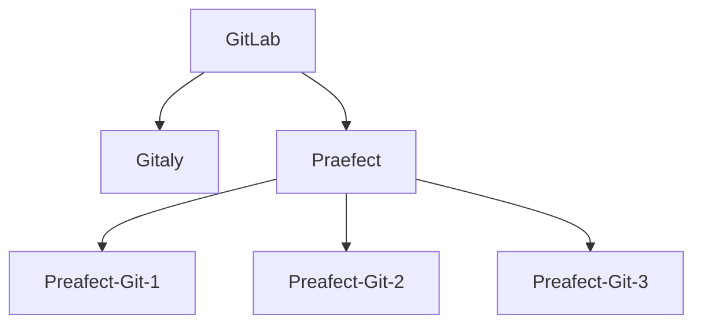

# Praefect

NOTE: **Note:** Praefect is an experimental service, and for testing purposes only at
this time.

## Omnibus

### Architecture

For this document, the following network topology is assumed:



Where `GitLab` is the collection of clients that can request Git operations.
`Gitaly` is a Gitaly server before using Praefect. The Praefect node has two
storage nodes attached. Praefect itself doesn't storage data, but connects to
three Gitaly nodes, `Praefect-Git-1`,  `Praefect-Git-2`, and `Praefect-Git-3`.
There should be no knowledge other than with Praefect about the existence of
the `Praefect-Git-X` nodes.

### Enable the daemon

Praefect is expected to run on their own host, this means that no other service
other than the support services run on this machine.

Praefect is disabled by default, to enable praefect uncomment the following line
and set it to `true`: `# praefect['enable'] = false'`

```ruby
praefect['enable'] = true
```

By default praefect will listen on port `:2305`. It's recommended to enable
prometheus to expose metrics. Uncomment the line so it looks like:

```ruby
praefect['prometheus_listen_addr'] = "localhost:9652"
```

Preafect needs at least one storage to store the Git data on. This node should
run Gitaly and should not be listed as storage for GitLab itself, that is, the
only way it receives traffic is through Praefect and it's not listed in the
`git_data_dirs` on any `gitlab.rb` in your GitLab cluster.

To set the nodes as depicted in the diagram above, the configuration should look
like:

```ruby
praefect['storage_nodes'] = [
  {
    'storage' => 'praefect-git-1',
    'address' => 'tcp://praefect-git-1.internal',
    'primary' => true
}
  {
    'storage' => 'praefect-git-2',
    'address' => 'tcp://praefect-git-2.internal'
  },
  {
    'storage' => 'praefect-git-3',
    'address' => 'tcp://praefect-git-3.internal'
  }
]
```

Save the file, and run `gitlab-ctl reconfigure`. To test if Praefect is running,
you could run `gitlab-ctl status` which should list praefect as being up.

### Enable Preafect as storage backend in GitLab

When Praefect is running, it should be exposed as a storage to GitLab. This
is done through setting the `git_data_dirs`. Assuming the default storage
configuration is used, there would be two storages available to GitLab:

```ruby
git_data_dirs({
  "default" => {
    "gitaly_address" => "tcp://gitaly.internal"
  },
  "praefect" => {
    "gitaly_address" => "tcp://praefect.internal:2305"
  }
})
```

Restart GitLab using `gitlab-ctl restart` on the GitLab node.
