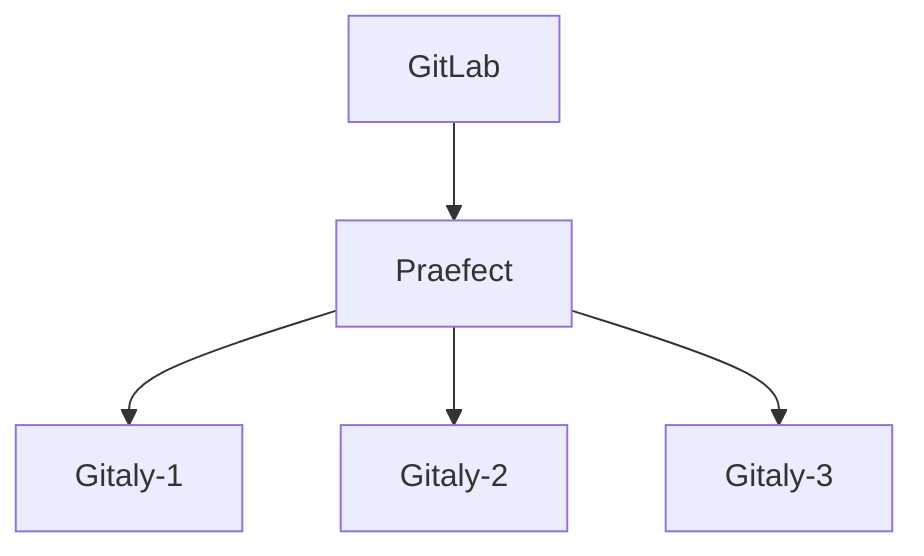

# Praefect

NOTE: **Note:** Praefect is an experimental service, and for testing purposes only at
this time.

Praefect is an optional reverse-proxy for [Gitaly](../index.md) to manage a
cluster of Gitaly nodes for high availability through replication.
If a Gitaly node becomes unavailable, it will be possible to fail over to a
warm Gitaly replica.

The first minimal version will support:

- Eventual consistency of the secondary replicas.
- Manual fail over from the primary to the secondary.

Follow the [HA Gitaly epic](https://gitlab.com/groups/gitlab-org/-/epics/1489)
for updates and roadmap.

## Omnibus

### Architecture

The most common architecture for Praefect is simplified in the diagram below:



Where `GitLab` is the collection of clients that can request Git operations.
The Praefect node has three storage nodes attached. Praefect itself doesn't
store data, but connects to three Gitaly nodes, `Gitaly-1`,  `Gitaly-2`, and `Gitaly-3`.

Praefect may be enabled on its own node or can be run on the GitLab server.
In the example below we will use a separate server, but the optimal configuration
for Praefect is still being determined.

Praefect will handle all Gitaly RPC requests to its child nodes. However, the child nodes
will still need to communicate with the GitLab server via its internal API for authentication
purposes.

### Setup

In this setup guide we will start by configuring Praefect, then its child
Gitaly nodes, and lastly the GitLab server configuration.

#### Secrets

We need to manage the following secrets and make them match across hosts:

1. `GITLAB_SHELL_SECRET_TOKEN`: this is used by Git hooks to make
    callback HTTP API requests to GitLab when accepting a Git push. This
    secret is shared with GitLab Shell for legacy reasons.
1. `PRAEFECT_EXTERNAL_TOKEN`: repositories hosted on your Praefect
    cluster can only be accessed by Gitaly clients that carry this
    token.
1. `PRAEFECT_INTERNAL_TOKEN`: this token is used for replication
    traffic inside your Praefect cluster. This is distinct from
    `PRAEFECT_EXTERNAL_TOKEN` because Gitaly clients must not be able to
    access internal nodes of the Praefect cluster directly; that could
    lead to data loss.

#### Praefect

On the Praefect node we disable all other services, including Gitaly. We list each
Gitaly node that will be connected to Praefect as members of the `praefect` hash in `praefect['virtual_storages']`.

In the example below, the Gitaly nodes are named `gitaly-N`. Note that one
node is designated as primary by setting the primary to `true`.

```ruby
# /etc/gitlab/gitlab.rb on praefect server

# Avoid running unnecessary services on the Gitaly server
postgresql['enable'] = false
redis['enable'] = false
nginx['enable'] = false
prometheus['enable'] = false
grafana['enable'] = false
unicorn['enable'] = false
sidekiq['enable'] = false
gitlab_workhorse['enable'] = false
gitaly['enable'] = false

# Prevent database connections during 'gitlab-ctl reconfigure'
gitlab_rails['rake_cache_clear'] = false
gitlab_rails['auto_migrate'] = false

praefect['enable'] = true

# Make Praefect accept connections on all network interfaces. You must use
# firewalls to restrict access to this address/port.
praefect['listen_addr'] = '0.0.0.0:2305'

# Replace PRAEFECT_EXTERNAL_TOKEN with a real secret
praefect['auth_token'] = 'PRAEFECT_EXTERNAL_TOKEN'

# Replace each instance of PRAEFECT_INTERNAL_TOKEN below with a real
# secret, distinct from PRAEFECT_EXTERNAL_TOKEN.
# Name of storage hash must match storage name in git_data_dirs on GitLab server.
praefect['virtual_storages'] = {
  'praefect' => {
    'gitaly-1' => {
      'address' => 'tcp://gitaly-1.internal:8075',
      'token'   => 'PRAEFECT_INTERNAL_TOKEN',
      'primary' => true
    },
    'gitaly-2' => {
      'address' => 'tcp://gitaly-2.internal:8075',
      'token'   => 'PRAEFECT_INTERNAL_TOKEN'
    },
    'gitaly-3' => {
      'address' => 'tcp://gitaly-3.internal:8075',
      'token'   => 'PRAEFECT_INTERNAL_TOKEN'
    }
  }
}
```

Save the file and [reconfigure Praefect](../restart_gitlab.md#omnibus-gitlab-reconfigure).

#### Gitaly

Next we will configure each Gitaly server assigned to Praefect.  Configuration for these
is the same as a normal standalone Gitaly server, except that we use storage names and
auth tokens from Praefect instead of GitLab.

Below is an example configuration for `gitaly-1`, the only difference for the
other Gitaly nodes is the storage name under `git_data_dirs`.

Note that `gitaly['auth_token']` matches the `token` value listed under `praefect['virtual_storages']`
on the Praefect node.

```ruby
# /etc/gitlab/gitlab.rb on gitaly node inside praefect cluster

# Avoid running unnecessary services on the Gitaly server
postgresql['enable'] = false
redis['enable'] = false
nginx['enable'] = false
prometheus['enable'] = false
grafana['enable'] = false
unicorn['enable'] = false
sidekiq['enable'] = false
gitlab_workhorse['enable'] = false
prometheus_monitoring['enable'] = false

# Prevent database connections during 'gitlab-ctl reconfigure'
gitlab_rails['rake_cache_clear'] = false
gitlab_rails['auto_migrate'] = false

# Replace GITLAB_SHELL_SECRET_TOKEN below with real secret
gitlab_shell['secret_token'] = 'GITLAB_SHELL_SECRET_TOKEN'

# Configure the gitlab-shell API callback URL. Without this, `git push` will
# fail. This can be your 'front door' GitLab URL or an internal load
# balancer.
gitlab_rails['internal_api_url'] = 'https://gitlab.example.com'

# Replace PRAEFECT_INTERNAL_TOKEN below with a real secret.
gitaly['auth_token'] = 'PRAEFECT_INTERNAL_TOKEN'

# Make Gitaly accept connections on all network interfaces. You must use
# firewalls to restrict access to this address/port.
# Comment out following line if you only want to support TLS connections
gitaly['listen_addr'] = "0.0.0.0:8075"

git_data_dirs({
  "gitaly-1" => {
    "path" => "/var/opt/gitlab/git-data"
  }
})
```

For more information on Gitaly server configuration, see our [Gitaly documentation](index.md#3-gitaly-server-configuration).

#### GitLab

When Praefect is running, it should be exposed as a storage to GitLab. This
is done through setting the `git_data_dirs`. Assuming the default storage
is present, there should be two storages available to GitLab:

```ruby
# /etc/gitlab/gitlab.rb on gitlab server

# Replace PRAEFECT_EXTERNAL_TOKEN below with real secret.
git_data_dirs({
  "default" => {
    "path" => "/var/opt/gitlab/git-data"
  },
  "praefect" => {
    "gitaly_address" => "tcp://praefect.internal:2305",
    "gitaly_token" => 'PRAEFECT_EXTERNAL_TOKEN'
  }
})

# Replace GITLAB_SHELL_SECRET_TOKEN below with real secret
gitlab_shell['secret_token'] = 'GITLAB_SHELL_SECRET_TOKEN'
```

Note that the storage name used is the same as the `praefect['virtual_storage_name']` set
on the Praefect node.

Save your changes and [reconfigure GitLab](../restart_gitlab.md#omnibus-gitlab-reconfigure).

Run `gitlab-rake gitlab:gitaly:check` to confirm that GitLab can reach Praefect.

### Testing Praefect

To test Praefect, first set it as the default storage node for new projects
using **Admin Area > Settings > Repository > Repository storage**. Next,
create a new project and check the "Initialize repository with a README" box.

If you receive an error, check `/var/log/gitlab/gitlab-rails/production.log`.

Here are common errors and potential causes:

- 500 response code
  - **ActionView::Template::Error (7:permission denied)**
    - `praefect['auth_token']` and `gitlab_rails['gitaly_token']` do not match on the GitLab server.
  - **Unable to save project. Error: 7:permission denied**
    - Secret token in `praefect['storage_nodes']` on GitLab server does not match the
      value in `gitaly['auth_token']` on one or more Gitaly servers.
- 503 response code
  - **GRPC::Unavailable (14:failed to connect to all addresses)**
    - GitLab was unable to reach Praefect.
  - **GRPC::Unavailable (14:all SubCons are in TransientFailure...)**
    - Praefect cannot reach one or more of its child Gitaly nodes.
