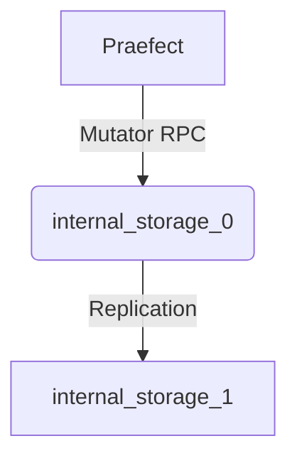
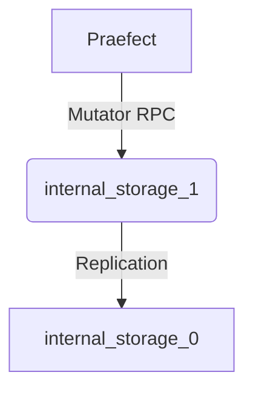
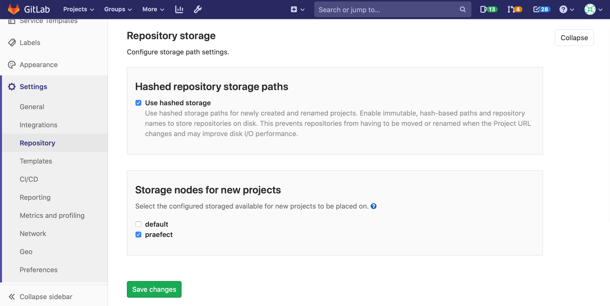

# Praefect: High Availability

NOTE: **Note:** Praefect is a
[beta](https://about.gitlab.com/handbook/product/#alpha-beta-ga) component that
allows Gitaly to be run in a highly available configuration. While unexpected
data loss is not likely, Praefect is not yet ready for production environments.

Praefect is an optional reverse-proxy for [Gitaly](../index.md) to manage a
cluster of Gitaly nodes for high availability. High availability is currently
implemented through asynchronous replication. If a Gitaly node becomes
unavailable, Praefect will automatically route traffic to a warm Gitaly replica.

The current version supports:

- Eventual consistency of the secondary replicas.
- Automatic fail over from the primary to the secondary.
- Reporting of possible data loss if replication queue is non empty.

Follow the [HA Gitaly epic](https://gitlab.com/groups/gitlab-org/-/epics/1489)
for improvements including
[strong consistency](https://gitlab.com/groups/gitlab-org/-/epics/1189) and
[horizontally distributing reads](https://gitlab.com/groups/gitlab-org/-/epics/2013).

## Requirements for configuring Gitaly for High Availability

A minimum highly available configuration requires:

- 1 highly available load balancer
- 1 highly available PostgreSQL server (PostgreSQL 9.6 or newer)
- 2 Praefect nodes
- 3 Gitaly nodes (1 primary, 2 secondary)


See the [design
document](https://gitlab.com/gitlab-org/gitaly/-/blob/master/doc/design_ha.md)
for implementation details.

## Setup Instructions

If you [installed](https://about.gitlab.com/install/) GitLab using the Omnibus
package (highly recommended), follow the steps below:

1. [Preparation](#preparation)
1. [Configuring the Praefect database](#postgresql)
1. [Configuring the Praefect proxy/router](#praefect)
1. [Configuring each Gitaly node](#gitaly) (once for each Gitaly node)
1. [Updating the GitLab server configuration](#gitlab)
1. [Configure Grafana](#grafana)

### Preparation

Before beginning, you should already have a working GitLab instance. [Learn how
to install GitLab](https://about.gitlab.com/install/).

Provision a PostgreSQL server (PostgreSQL 9.6 or newer). Configuration through
the GitLab Omnibus distribution is not yet supported. Follow this
[issue](https://gitlab.com/gitlab-org/gitaly/issues/2476) for updates.

Prepare all your new nodes by [installing
GitLab](https://about.gitlab.com/install/).

- 1 Praefect node (minimal storage required)
- 3 Gitaly nodes (high CPU, high memory, fast storage)
- 1 GitLab server

You will need the IP/host address for each node.

1. `LOADBALANCER_SERVER_ADDRESS`: the IP/hots address of the load balancer
1. `POSTGRESQL_SERVER_ADDRESS`: the IP/host address of the PostgreSQL server
1. `PRAEFECT_HOST`: the IP/host address of the Praefect server
1. `GITALY_HOST`: the IP/host address of each Gitaly server
1. `GITLAB_HOST`: the IP/host address of the GitLab server

If you are using a cloud provider, you can look up the addresses for each server through your cloud provider's management console.

If you are using Google Cloud Platform, SoftLayer, or any other vendor that provides a virtual private cloud (VPC) you can use the private addresses for each cloud instance (corresponds to “internal address” for Google Cloud Platform) for `PRAEFECT_HOST`, `GITALY_HOST`, and `GITLAB_HOST`.

#### Secrets

The communication between components is secured with different secrets, which
are described below. Before you begin, generate a unique secret for each, and
make note of it. This will make it easy to replace these placeholder tokens
with secure tokens as you complete the setup process.

1. `GITLAB_SHELL_SECRET_TOKEN`: this is used by Git hooks to make callback HTTP
   API requests to GitLab when accepting a Git push. This secret is shared with
   GitLab Shell for legacy reasons.
1. `PRAEFECT_EXTERNAL_TOKEN`: repositories hosted on your Praefect cluster can
   only be accessed by Gitaly clients that carry this token.
1. `PRAEFECT_INTERNAL_TOKEN`: this token is used for replication traffic inside
   your Praefect cluster. This is distinct from `PRAEFECT_EXTERNAL_TOKEN`
   because Gitaly clients must not be able to access internal nodes of the
   Praefect cluster directly; that could lead to data loss.
1. `PRAEFECT_SQL_PASSWORD`: this password is used by Praefect to connect to
   PostgreSQL.
1. `GRAFANA_PASSWORD`: this password is used to access the `admin`
   account in the Grafana dashboards.

We will note in the instructions below where these secrets are required.

### PostgreSQL

NOTE: **Note:** do not store the GitLab application database and the Praefect
database on the same PostgreSQL server if using
[Geo](../geo/replication/index.md). The replication state is internal to each instance
of GitLab and should not be replicated.

To complete this section you will need:

- 1 Praefect node
- 1 PostgreSQL server (PostgreSQL 9.6 or newer)
  - An SQL user with permissions to create databases

During this section, we will configure the PostgreSQL server, from the Praefect
node, using `psql` which is installed by GitLab Omnibus.

1. SSH into the **Praefect** node and login as root:

   ```shell
   sudo -i
   ```

1. Connect to the PostgreSQL server with administrative access. This is likely
   the `postgres` user. The database `template1` is used because it is created
   by default on all PostgreSQL servers.

   ```shell
   /opt/gitlab/embedded/bin/psql -U postgres -d template1 -h POSTGRESQL_SERVER_ADDRESS
   ```

   Create a new user `praefect` which will be used by Praefect. Replace
   `PRAEFECT_SQL_PASSWORD` with the strong password you generated in the
   preparation step.

   ```sql
   CREATE ROLE praefect WITH LOGIN CREATEDB PASSWORD 'PRAEFECT_SQL_PASSWORD';
   ```

1. Reconnect to the PostgreSQL server, this time as the `praefect` user:

   ```shell
   /opt/gitlab/embedded/bin/psql -U praefect -d template1 -h POSTGRESQL_SERVER_ADDRESS
   ```

   Create a new database `praefect_production`. By creating the database while
   connected as the `praefect` user, we are confident they have access.

   ```sql
   CREATE DATABASE praefect_production WITH ENCODING=UTF8;
   ```

The database used by Praefect is now configured.

### Praefect

To complete this section you will need:

- [Configured PostgreSQL server](#postgresql), including:
  - IP/host address (`POSTGRESQL_SERVER_ADDRESS`)
  - password (`PRAEFECT_SQL_PASSWORD`)

Praefect should be run on a dedicated node. Do not run Praefect on the
application server, or a Gitaly node.

1. SSH into the **Praefect** node and login as root:

   ```shell
   sudo -i
   ```

1. Disable all other services by editing `/etc/gitlab/gitlab.rb`:

   ```ruby
   # Disable all other services on the Praefect node
   postgresql['enable'] = false
   redis['enable'] = false
   nginx['enable'] = false
   prometheus['enable'] = false
   grafana['enable'] = false
   unicorn['enable'] = false
   sidekiq['enable'] = false
   gitlab_workhorse['enable'] = false
   gitaly['enable'] = false

   # Enable only the Praefect service
   praefect['enable'] = true

   # Prevent database connections during 'gitlab-ctl reconfigure'
   gitlab_rails['rake_cache_clear'] = false
   gitlab_rails['auto_migrate'] = false
   ```

1. Configure **Praefect** to listen on network interfaces by editing
   `/etc/gitlab/gitlab.rb`:

   You will need to replace:

   - `PRAEFECT_HOST` with the IP address or hostname of the Praefect node

   ```ruby
   praefect['listen_addr'] = 'PRAEFECT_HOST:2305'

   # Enable Prometheus metrics access to Praefect. You must use firewalls
   # to restrict access to this address/port.
   praefect['prometheus_listen_addr'] = 'PRAEFECT_HOST:9652'
   ```

1. Configure a strong `auth_token` for **Praefect** by editing
   `/etc/gitlab/gitlab.rb`. This will be needed by clients outside the cluster
   (like GitLab Shell) to communicate with the Praefect cluster :

   ```ruby
   praefect['auth_token'] = 'PRAEFECT_EXTERNAL_TOKEN'
   ```

1. Configure **Praefect** to connect to the PostgreSQL database by editing
   `/etc/gitlab/gitlab.rb`.

   You will need to replace `POSTGRESQL_SERVER_ADDRESS` with the IP/host address
   of the database, and `PRAEFECT_SQL_PASSWORD` with the strong password set
   above.

   ```ruby
   praefect['database_host'] = 'POSTGRESQL_SERVER_ADDRESS'
   praefect['database_port'] = 5432
   praefect['database_user'] = 'praefect'
   praefect['database_password'] = 'PRAEFECT_SQL_PASSWORD'
   praefect['database_dbname'] = 'praefect_production'
   ```

   If you want to use a TLS client certificate, the options below can be used:

   ```ruby
   # Connect to PostreSQL using a TLS client certificate
   # praefect['database_sslcert'] = '/path/to/client-cert'
   # praefect['database_sslkey'] = '/path/to/client-key'

   # Trust a custom certificate authority
   # praefect['database_sslrootcert'] = '/path/to/rootcert'
   ```

   By default Praefect will refuse to make an unencrypted connection to
   PostgreSQL. You can override this by uncommenting the following line:

   ```ruby
   # praefect['database_sslmode'] = 'disable'
   ```

1. Configure the **Praefect** cluster to connect to each Gitaly node in the
   cluster by editing `/etc/gitlab/gitlab.rb`.

   In the example below we have configured one virtual storage (or shard) named
   `storage-1`. This cluster has three Gitaly nodes `gitaly-1`, `gitaly-2`, and
   `gitaly-3`, which will be replicas of each other.

   Replace `PRAEFECT_INTERNAL_TOKEN` with a strong secret, which will be used by
   Praefect when communicating with Gitaly nodes in the cluster. This token is
   distinct from the `PRAEFECT_EXTERNAL_TOKEN`.

   Replace `GITALY_HOST` with the IP/host address of the each Gitaly node.

   More Gitaly nodes can be added to the cluster to increase the number of
   replicas. More clusters can also be added for very large GitLab instances.

   NOTE: **Note:** The `gitaly-1` node is currently denoted the primary. This
   can be used to manually fail from one node to another. This will be removed
   in the future to allow for automatic failover.

   ```ruby
   # Name of storage hash must match storage name in git_data_dirs on GitLab
   # server ('praefect') and in git_data_dirs on Gitaly nodes ('gitaly-1')
   praefect['virtual_storages'] = {
     'storage-1' => {
       'gitaly-1' => {
         'address' => 'tcp://GITALY_HOST:8075',
         'token'   => 'PRAEFECT_INTERNAL_TOKEN',
         'primary' => true
       },
       'gitaly-2' => {
         'address' => 'tcp://GITALY_HOST:8075',
         'token'   => 'PRAEFECT_INTERNAL_TOKEN'
       },
       'gitaly-3' => {
         'address' => 'tcp://GITALY_HOST:8075',
         'token'   => 'PRAEFECT_INTERNAL_TOKEN'
       }
     }
   }
   ```

1. Enable the replication queue:

    ```ruby
    praefect['postgres_queue_enabled'] = true
    ```

1. Save the changes to `/etc/gitlab/gitlab.rb` and [reconfigure Praefect](../restart_gitlab.md#omnibus-gitlab-reconfigure):

   ```shell
   gitlab-ctl reconfigure
   ```

1. Verify that Praefect can reach PostgreSQL:

   ```shell
   sudo -u git /opt/gitlab/embedded/bin/praefect -config /var/opt/gitlab/praefect/config.toml sql-ping
   ```

   If the check fails, make sure you have followed the steps correctly. If you
   edit `/etc/gitlab/gitlab.rb`, remember to run `sudo gitlab-ctl reconfigure`
   again before trying the `sql-ping` command.

#### Automatic failover

When automatic failover is enabled, Praefect will do automatic detection of the health of internal Gitaly nodes. If the
primary has a certain amount of health checks fail, it will decide to promote one of the secondaries to be primary, and
demote the primary to be a secondary.

1. To enable automatic failover, edit `/etc/gitlab/gitlab.rb`:

   ```ruby
   # failover_enabled turns on automatic failover
   praefect['failover_enabled'] = true
   praefect['virtual_storages'] = {
     'storage-1' => {
       'gitaly-1' => {
         'address' => 'tcp://GITALY_HOST:8075',
         'token'   => 'PRAEFECT_INTERNAL_TOKEN',
         'primary' => true
       },
       'gitaly-2' => {
         'address' => 'tcp://GITALY_HOST:8075',
         'token'   => 'PRAEFECT_INTERNAL_TOKEN'
       },
       'gitaly-3' => {
         'address' => 'tcp://GITALY_HOST:8075',
         'token'   => 'PRAEFECT_INTERNAL_TOKEN'
       }
     }
   }
   ```

1. Save the file and [reconfigure GitLab](../restart_gitlab.md#omnibus-gitlab-reconfigure).

Below is the picture when Praefect starts up with the config.toml above:



Let's say suddenly `internal_storage_0` goes down. Praefect will detect this and
automatically switch over to `internal_storage_1`, and `internal_storage_0` will serve as a secondary:



NOTE: **Note:**: Currently this feature is supported for setups that only have 1 Praefect instance. Praefect instances running,
for example behind a load balancer, `failover_enabled` should be disabled. The reason is The reason is because there
is no coordination that currently happens across different Praefect instances, so there could be a situation where
two Praefect instances think two different Gitaly nodes are the primary.

### Gitaly

NOTE: **Note:** Complete these steps for **each** Gitaly node.

To complete this section you will need:

- [Configured Praefect node](#praefect)
- 3 (or more) servers, with GitLab installed, to be configured as Gitaly nodes.
  These should be dedicated nodes, do not run other services on these nodes.

Every Gitaly server assigned to the Praefect cluster needs to be configured. The
configuration is the same as a normal [standalone Gitaly server](../index.md),
except:

- the storage names are exposed to Praefect, not GitLab
- the secret token is shared with Praefect, not GitLab

The configuration of all Gitaly nodes in the Praefect cluster can be identical,
because we rely on Praefect to route operations correctly.

Particular attention should be shown to:

- the `gitaly['auth_token']` configured in this section must match the `token`
  value under `praefect['virtual_storages']` on the Praefect node. This was set
  in the [previous section](#praefect). This document uses the placeholder
  `PRAEFECT_INTERNAL_TOKEN` throughout.
- the storage names in `git_data_dirs` configured in this section must match the
  storage names under `praefect['virtual_storages']` on the Praefect node. This
  was set in the [previous section](#praefect). This document uses `gitaly-1`,
  `gitaly-2`, and `gitaly-3` as Gitaly storage names.

For more information on Gitaly server configuration, see our [Gitaly
documentation](index.md#3-gitaly-server-configuration).

1. SSH into the **Gitaly** node and login as root:

   ```shell
   sudo -i
   ```

1. Disable all other services by editing `/etc/gitlab/gitlab.rb`:

   ```ruby
   # Disable all other services on the Praefect node
   postgresql['enable'] = false
   redis['enable'] = false
   nginx['enable'] = false
   prometheus['enable'] = false
   grafana['enable'] = false
   unicorn['enable'] = false
   sidekiq['enable'] = false
   gitlab_workhorse['enable'] = false
   prometheus_monitoring['enable'] = false

   # Enable only the Praefect service
   gitaly['enable'] = true

   # Prevent database connections during 'gitlab-ctl reconfigure'
   gitlab_rails['rake_cache_clear'] = false
   gitlab_rails['auto_migrate'] = false
   ```

1. Configure **Gitaly** to listen on network interfaces by editing
   `/etc/gitlab/gitlab.rb`:

   You will need to replace:

   - `GITALY_HOST` with the IP address or hostname of the Gitaly node

   ```ruby
   # Make Gitaly accept connections on all network interfaces.
   # Use firewalls to restrict access to this address/port.
   gitaly['listen_addr'] = 'GITALY_HOST:8075'

   # Enable Prometheus metrics access to Gitaly. You must use firewalls
   # to restrict access to this address/port.
   gitaly['prometheus_listen_addr'] = 'GITALY_HOST:9236'
   ```

1. Configure a strong `auth_token` for **Gitaly** by editing
   `/etc/gitlab/gitlab.rb`. This will be needed by clients to communicate with
   this Gitaly nodes. Typically, this token will be the same for all Gitaly
   nodes.

   ```ruby
   gitaly['auth_token'] = 'PRAEFECT_INTERNAL_TOKEN'
   ```

1. Configure the GitLab Shell `secret_token`, and `internal_api_url` which are
   needed for `git push` operations.

   If you have already configured [Gitaly on its own server](../index.md)

   ```ruby
   gitlab_shell['secret_token'] = 'GITLAB_SHELL_SECRET_TOKEN'

   # Configure the gitlab-shell API callback URL. Without this, `git push` will
   # fail. This can be your front door GitLab URL or an internal load balancer.
   # Examples: 'https://example.gitlab.com', 'http://1.2.3.4'
   gitlab_rails['internal_api_url'] = 'http://GITLAB_HOST'
   ```

1. Configure the storage location for Git data by setting `git_data_dirs` in
   `/etc/gitlab/gitlab.rb`. Each Gitaly node should have a unique storage name
   (eg `gitaly-1`).

   Instead of configuring `git_data_dirs` uniquely for each Gitaly node, it is
   often easier to have include the configuration for all Gitaly nodes on every
   Gitaly node. This is supported because the Praefect `virtual_storages`
   configuration maps each storage name (eg `gitaly-1`) to a specific node, and
   requests are routed accordingly. This means every Gitaly node in your fleet
   can share the same configuration.

   ```ruby
   # You can include the data dirs for all nodes in the same config, because
   # Praefect will only route requests according to the addresses provided in the
   # prior step.
   git_data_dirs({
     "gitaly-1" => {
       "path" => "/var/opt/gitlab/git-data"
     },
     "gitaly-2" => {
       "path" => "/var/opt/gitlab/git-data"
     },
     "gitaly-3" => {
       "path" => "/var/opt/gitlab/git-data"
     }
   })
   ```

1. Save the changes to `/etc/gitlab/gitlab.rb` and [reconfigure Gitaly](../restart_gitlab.md#omnibus-gitlab-reconfigure):

   ```shell
   gitlab-ctl reconfigure
   ```

1. To ensure that Gitaly [has updated its Prometheus listen address](https://gitlab.com/gitlab-org/gitaly/-/issues/2521), [restart Gitaly](../restart_gitlab.md#omnibus-gitlab-restart):

   ```shell
   gitlab-ctl restart gitaly
   ```

**The steps above must be completed for each Gitaly node!**

After all Gitaly nodes are configured, you can run the Praefect connection
checker to verify Praefect can connect to all Gitaly servers in the Praefect
config.

1. SSH into the **Praefect** node and run the Praefect connection checker:

   ```shell
   sudo /opt/gitlab/embedded/bin/praefect -config /var/opt/gitlab/praefect/config.toml dial-nodes
   ```

1. Enable automatic failover by editing `/etc/gitlab/gitlab.rb`:

   ```ruby
   praefect['failover_enabled'] = true
   ```

   When automatic failover is enabled, Praefect checks the health of internal
   Gitaly nodes. If the primary has a certain amount of health checks fail, it
   will promote one of the secondaries to be primary, and demote the primary to
   be a secondary.

   Manual failover is possible by updating `praefect['virtual_storages']` and
   nominating a new primary node.

1. By default, Praefect will nominate a primary Gitaly node for each
   shard and store the state of the primary in local memory. This state
   does not persist across restarts and will cause a split brain
   if multiple Praefect nodes are used for redundancy.

   To avoid this limitation, enable the SQL election strategy:

    ```ruby
    praefect['failover_election_strategy'] = 'sql'
    ```

1. Save the changes to `/etc/gitlab/gitlab.rb` and [reconfigure
   Praefect](../restart_gitlab.md#omnibus-gitlab-reconfigure):

   ```shell
   gitlab-ctl reconfigure
   ```

### GitLab

To complete this section you will need:

- [Configured Praefect node](#praefect)
- [Configured Gitaly nodes](#gitaly)

The Praefect cluster needs to be exposed as a storage location to the GitLab
application. This is done by updating the `git_data_dirs`.

Particular attention should be shown to:

- the storage name added to `git_data_dirs` in this section must match the
  storage name under `praefect['virtual_storages']` on the Praefect node. This
  was set in the [Praefect](#praefect) section of this guide. This document uses
  `storage-1` as the Praefect storage name.

1. SSH into the **GitLab** node and login as root:

   ```shell
   sudo -i
   ```

1. Add the Praefect cluster as a storage location by editing
   `/etc/gitlab/gitlab.rb`.

   You will need to replace:

   - `PRAEFECT_HOST` with the IP address or hostname of the Praefect node
   - `GITLAB_HOST` with the IP address or hostname of the GitLab server
   - `PRAEFECT_EXTERNAL_TOKEN` with the real secret

   ```ruby
   git_data_dirs({
     "default" => {
       "gitaly_address" => "tcp://GITLAB_HOST:8075"
     },
     "storage-1" => {
       "gitaly_address" => "tcp://PRAEFECT_HOST:2305",
       "gitaly_token" => 'PRAEFECT_EXTERNAL_TOKEN'
     }
   })
   ```

1. Allow Gitaly to listen on a tcp port by editing
   `/etc/gitlab/gitlab.rb`

   ```ruby
   gitaly['listen_addr'] = 'GITLAB_HOST:8075'
   ```

1. Configure the `gitlab_shell['secret_token']` so that callbacks from Gitaly
   nodes during a `git push` are properly authenticated by editing
   `/etc/gitlab/gitlab.rb`:

   You will need to replace `GITLAB_SHELL_SECRET_TOKEN` with the real secret.

   ```ruby
   gitlab_shell['secret_token'] = 'GITLAB_SHELL_SECRET_TOKEN'
   ```

1. Configure the `external_url` so that files could be served by GitLab
   by proper endpoint access by editing `/etc/gitlab/gitlab.rb`:

   You will need to replace `GITLAB_SERVER_URL` with the real external facing URL on which
   current GitLab instance is serving:

   ```ruby
   external_url 'GITLAB_SERVER_URL'
   ```

1. Add Prometheus monitoring settings by editing `/etc/gitlab/gitlab.rb`.

   You will need to replace:

   - `PRAEFECT_HOST` with the IP address or hostname of the Praefect node
   - `GITALY_HOST` with the IP address or hostname of each Gitaly node

   ```ruby
   prometheus['scrape_configs'] = [
     {
       'job_name' => 'praefect',
       'static_configs' => [
         'targets' => [
           'PRAEFECT_HOST:9652' # praefect
         ]
       ]
     },
     {
       'job_name' => 'praefect-gitaly',
       'static_configs' => [
         'targets' => [
           'GITALY_HOST:9236', # gitaly-1
           'GITALY_HOST:9236', # gitaly-2
           'GITALY_HOST:9236', # gitaly-3
         ]
       ]
     }
   ]
   ```

1. Save the changes to `/etc/gitlab/gitlab.rb` and [reconfigure GitLab](../restart_gitlab.md#omnibus-gitlab-reconfigure):

   ```shell
   gitlab-ctl reconfigure
   ```

1. Verify each `gitlab-shell` on each Gitaly instance can reach GitLab. On each Gitaly instance run:

   ```shell
   /opt/gitlab/embedded/service/gitlab-shell/bin/check -config /opt/gitlab/embedded/service/gitlab-shell/config.yml
   ```

1. Verify that GitLab can reach Praefect:

   ```shell
   gitlab-rake gitlab:gitaly:check
   ```

1. Update the **Repository storage** settings from **Admin Area > Settings >
   Repository > Repository storage** to make the newly configured Praefect
   cluster the storage location for new Git repositories.

   - Deselect the **default** storage location
   - Select the **praefect** storage location

   

1. Verify everything is still working by creating a new project. Check the
   "Initialize repository with a README" box so that there is content in the
   repository that viewed. If the project is created, and you can see the
   README file, it works!

### Grafana

Grafana is included with GitLab, and can be used to monitor your Praefect
cluster. See [Grafana Dashboard
Service](https://docs.gitlab.com/omnibus/settings/grafana.html)
for detailed documentation.

To get started quickly:

1. SSH into the **GitLab** node and login as root:

   ```shell
   sudo -i
   ```

1. Enable the Grafana login form by editing `/etc/gitlab/gitlab.rb`.

   ```ruby
   grafana['disable_login_form'] = false
   ```

1. Save the changes to `/etc/gitlab/gitlab.rb` and [reconfigure
   GitLab](../restart_gitlab.md#omnibus-gitlab-reconfigure):

   ```shell
   gitlab-ctl reconfigure
   ```

1. Set the Grafana admin password. This command will prompt you to enter a new
   password:

   ```shell
   gitlab-ctl set-grafana-password
   ```

1. In your web browser, open `/-/grafana` (e.g.
   `https://gitlab.example.com/-/grafana`) on your GitLab server.

   Login using the password you set, and the username `admin`.

1. Go to **Explore** and query `gitlab_build_info` to verify that you are
   getting metrics from all your machines.

Congratulations! You've configured an observable highly available Praefect
cluster.

## Automatic failover and leader election

Praefect regularly checks the health of each backend Gitaly node. This
information can be used to automatically failover to a new primary node if the
current primary node is found to be unhealthy.

- **Manual:** Automatic failover is disabled. The primary node can be
  reconfigured in `/etc/gitlab/gitlab.rb` on the Praefect node. Modify the
  `praefect['virtual_storages']` field by moving the `primary = true` to promote
  a different Gitaly node to primary. In the steps above, `gitaly-1` was set to
  the primary.
- **Memory:** Enabled by setting `praefect['failover_enabled'] = true` in
  `/etc/gitlab/gitlab.rb` on the Praefect node. If a sufficient number of health
  checks fail for the current primary backend Gitaly node, and new primary will
  be elected. **Do not use with multiple Praefect nodes!** Using with multiple
  Praefect nodes is likely to result in a split brain.
- **PostgreSQL:** Enabled by setting
  `praefect['failover_election_strategy'] = sql`. This configuration
  option will allow multiple Praefect nodes to coordinate via the
  PostgreSQL database to elect a primary Gitaly node. This configuration
  will cause Praefect nodes to elect a new primary, monitor its health,
  and elect a new primary if the current one has not been reachable in
  10 seconds by a majority of the Praefect nodes.

NOTE: **Note:**: Praefect does not yet account for replication lag on
the secondaries during the election process, so data loss can occur
during a failover. Follow issue
[#2642](https://gitlab.com/gitlab-org/gitaly/-/issues/2642) for updates.

It is likely that we will implement support for Consul, and a cloud native
strategy in the future.

## Identifying Impact of a Primary Node Failure

When a primary Gitaly node fails, there is a chance of dataloss. Dataloss can occur if there were outstanding replication jobs the secondaries did not manage to process before the failure. The Praefect `dataloss` subcommand helps identify these cases by counting the number of dead replication jobs for each repository within a given timeframe.

```shell
sudo /opt/gitlab/embedded/bin/praefect -config /var/opt/gitlab/praefect/config.toml dataloss -from <rfc3339-time> -to <rfc3339-time>
```

If the timeframe is not specified, dead replication jobs from the last six hours are counted:

```shell
sudo /opt/gitlab/embedded/bin/praefect -config /var/opt/gitlab/praefect/config.toml dataloss

Failed replication jobs between [2020-01-02 00:00:00 +0000 UTC, 2020-01-02 06:00:00 +0000 UTC):
example/repository-1: 1 jobs
example/repository-2: 4 jobs
example/repository-3: 2 jobs
```

To specify a timeframe in UTC, run:

```shell
sudo /opt/gitlab/embedded/bin/praefect -config /var/opt/gitlab/praefect/config.toml dataloss -from 2020-01-02T00:00:00+00:00 -to 2020-01-02T00:02:00+00:00
```

## Backend Node Recovery

When a Praefect backend node fails and is no longer able to
replicate changes, the backend node will start to drift from the primary. If
that node eventually recovers, it will need to be reconciled with the current
primary. The primary node is considered the single source of truth for the
state of a shard. The Praefect `reconcile` subcommand allows for the manual
reconciliation between a backend node and the current primary.

Run the following command on the Praefect server after all placeholders
(`<virtual-storage>` and `<target-storage>`) have been replaced:

```shell
sudo /opt/gitlab/embedded/bin/praefect -config /var/opt/gitlab/praefect/config.toml reconcile -virtual <virtual-storage> -target <target-storage>
```

- Replace the placeholder `<virtual-storage>` with the virtual storage containing the backend node storage to be checked.
- Replace the placeholder `<target-storage>` with the backend storage name.

The command will return a list of repositories that were found to be
inconsistent against the current primary. Each of these inconsistencies will
also be logged with an accompanying replication job ID.

## Migrating existing repositories to Praefect

If your GitLab instance already has repositories, these won't be migrated
automatically.

Repositories may be moved from one storage location using the [Repository
API](../../api/projects.html#edit-project):

```shell
curl --request PUT --header "PRIVATE-TOKEN: <your_access_token>" --data "repository_storage=praefect" https://example.gitlab.com/api/v4/projects/123
```

## Debugging Praefect

If you receive an error, check `/var/log/gitlab/gitlab-rails/production.log`.

Here are common errors and potential causes:

- 500 response code
  - **ActionView::Template::Error (7:permission denied)**
    - `praefect['auth_token']` and `gitlab_rails['gitaly_token']` do not match on the GitLab server.
  - **Unable to save project. Error: 7:permission denied**
    - Secret token in `praefect['storage_nodes']` on GitLab server does not match the
      value in `gitaly['auth_token']` on one or more Gitaly servers.
- 503 response code
  - **GRPC::Unavailable (14:failed to connect to all addresses)**
    - GitLab was unable to reach Praefect.
  - **GRPC::Unavailable (14:all SubCons are in TransientFailure...)**
    - Praefect cannot reach one or more of its child Gitaly nodes. Try running
      the Praefect connection checker to diagnose.
