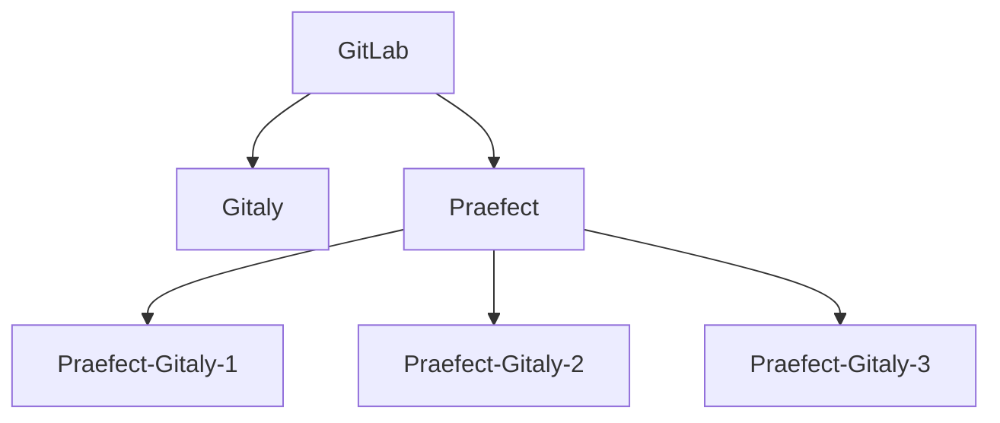

# Praefect

NOTE: **Note:** Praefect is an experimental service, and for testing purposes only at
this time.

Praefect is an optional reverse-proxy for [Gitaly](../index.md) to manage a
cluster of Gitaly nodes for high availability through replication.
If a Gitaly node becomes unavailable, it will be possible to fail over to a
warm Gitaly replica.

The first minimal version will support:

- Eventual consistency of the secondary replicas.
- Manual fail over from the primary to the secondary.

Follow the [HA Gitaly epic](https://gitlab.com/groups/gitlab-org/-/epics/1489)
for updates and roadmap.

## Omnibus

### Architecture

For this document, the following network topology is assumed:



Where `GitLab` is the collection of clients that can request Git operations.
`Gitaly` is a Gitaly server before using Praefect. The Praefect node has three
storage nodes attached. Praefect itself doesn't store data, but connects to
three Gitaly nodes, `Praefect-Gitaly-1`,  `Praefect-Gitaly-2`, and `Praefect-Gitaly-3`.

Praefect may be enabled on its own node or can be run on the GitLab server.
In the example below we will use a separate server, but the optimal configuration
for Praefect is still being determined.

Praefect will handle all Gitaly RPC requests to its child nodes. However, the child nodes
will still need to communicate with the GitLab server via its internal API for authentication
purposes.

### Setup

In this setup guide we will start by configuring Praefect, then its child
Gitaly nodes, and lastly the GitLab server configuration.

#### Praefect

On the Praefect node we disable all other services, including Gitaly. We list each
Gitaly node that will be connected to Praefect under `praefect['storage_nodes']`.

In the example below, the Gitaly nodes are named `praefect-gitaly-N`. Note that one
node is designated as primary by setting the primary to `true`.

`praefect['auth_token']` is the token used to authenticate with the GitLab server,
just like `gitaly['auth_token']` is used for a standard Gitaly server.

The `token` field under each storage listed in `praefect['storage_nodes']` is used
to authenticate each child Gitaly node with Praefect.

```ruby
# /etc/gitlab/gitlab.rb

# Avoid running unnecessary services on the Gitaly server
postgresql['enable'] = false
redis['enable'] = false
nginx['enable'] = false
prometheus['enable'] = false
unicorn['enable'] = false
sidekiq['enable'] = false
gitlab_workhorse['enable'] = false
gitaly['enable'] = false
```

##### Set up Praefect and its Gitaly nodes

In the example below, the Gitaly nodes are named `praefect-git-X`. Note that one node is designated as
primary, by setting the primary to `true`:

```ruby
# /etc/gitlab/gitlab.rb

# Prevent database connections during 'gitlab-ctl reconfigure'
gitlab_rails['rake_cache_clear'] = false
gitlab_rails['auto_migrate'] = false

praefect['enable'] = true

# Make Praefect accept connections on all network interfaces. You must use
# firewalls to restrict access to this address/port.
praefect['listen_addr'] = '0.0.0.0:2305'

# virtual_storage_name must match the same storage name given to praefect in git_data_dirs
praefect['virtual_storage_name'] = 'praefect'

# Authentication token to ensure only authorized servers can communicate with
# Praefect server
praefect['auth_token'] = 'praefect-token'
praefect['storage_nodes'] = {
  'praefect-gitaly-1' => {
    'address' => 'tcp://praefect-git-1.internal:8075',
    'token'   => 'praefect-gitaly-token',
    'primary' => true
  },
  'praefect-gitaly-2' => {
    'address' => 'tcp://praefect-git-2.internal:8075',
    'token'   => 'praefect-gitaly-token'
  },
  'praefect-gitaly-3' => {
    'address' => 'tcp://praefect-git-3.internal:8075',
    'token'   => 'praefect-gitaly-token'
  }
}
```

Save the file and [reconfigure Praefect](../restart_gitlab.md#omnibus-gitlab-reconfigure).

#### Gitaly

Next we will configure each Gitaly server assigned to Praefect.  Configuration for these
is the same as a normal standalone Gitaly server, except that we use storage names and
auth tokens from Praefect instead of GitLab.

Below is an example configuration for `praefect-gitaly-1`, the only difference for the
other Gitaly nodes is the storage name under `git_data_dirs`.

Note that `gitaly['auth_token']` matches the `token` value listed under `praefect['storage_nodes']`
on the Praefect node.

```ruby
# /etc/gitlab/gitlab.rb

# Avoid running unnecessary services on the Gitaly server
postgresql['enable'] = false
redis['enable'] = false
nginx['enable'] = false
prometheus['enable'] = false
unicorn['enable'] = false
sidekiq['enable'] = false
gitlab_workhorse['enable'] = false

# Prevent database connections during 'gitlab-ctl reconfigure'
gitlab_rails['rake_cache_clear'] = false
gitlab_rails['auto_migrate'] = false

# Configure the gitlab-shell API callback URL. Without this, `git push` will
# fail. This can be your 'front door' GitLab URL or an internal load
# balancer.
# Don't forget to copy `/etc/gitlab/gitlab-secrets.json` from web server to Gitaly server.
gitlab_rails['internal_api_url'] = 'https://gitlab.example.com'

# Authentication token to ensure only authorized servers can communicate with
# Gitaly server
gitaly['auth_token'] = 'praefect-gitaly-token'

# Make Gitaly accept connections on all network interfaces. You must use
# firewalls to restrict access to this address/port.
# Comment out following line if you only want to support TLS connections
gitaly['listen_addr'] = "0.0.0.0:8075"

git_data_dirs({
  "praefect-gitaly-1" => {
    "path" => "/var/opt/gitlab/git-data"
  }
})
```

Note that just as with a standard Gitaly server, `/etc/gitlab/gitlab-secrets.json` must
be copied from the GitLab server to the Gitaly node for authentication purposes.

For more information on Gitaly server configuration, see our [gitaly documentation](index.md#3-gitaly-server-configuration).

#### GitLab

When Praefect is running, it should be exposed as a storage to GitLab. This
is done through setting the `git_data_dirs`. Assuming the default storage
is present, there should be two storages available to GitLab:

```ruby
git_data_dirs({
  "default" => {
    "gitaly_address" => "tcp://gitaly.internal"
  },
  "praefect" => {
    "gitaly_address" => "tcp://praefect.internal:2305"
  }
})

gitlab_rails['gitaly_token'] = 'praefect-token'
```

Note that the storage name used is the same as the `praefect['virtual_storage_name']` set
on the Praefect node.

Also, the `gitlab_rails['gitaly_token']` matches the value of `praefect['auth_token']`
on Praefect.

Restart GitLab using `gitlab-ctl restart` on the GitLab node.

### Testing Praefect

To test Praefect, first set it as the default storage node for new projects
using **Admin Area > Settings > Repository > Repository storage**. Next,
create a new project and check the "Initialize repository with a README" box.

If you receive a 503 error, check `/var/log/gitlab/gitlab-rails/production.log`.
A `GRPC::Unavailable (14:failed to connect to all addresses)` error indicates
that GitLab was unable to connect to Praefect.

If the project is created but the README is not, then ensure that the
`/etc/gitlab/gitlab-secrets.json` file from the GitLab server has been copied
to the Gitaly servers.
