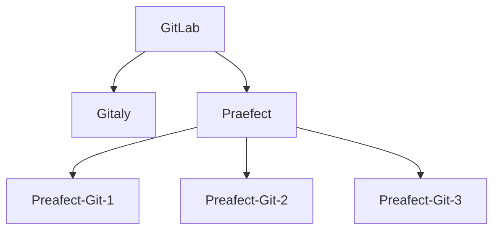

# Praefect

NOTE: **Note:** Praefect is an experimental service, and for testing purposes only at
this time.

Praefect is an optional reverse-proxy for [Gitaly](../index.md) to manage a
cluster of Gitaly nodes for high availability through replication.
If a Gitaly node becomes unavailable, it will be possible to fail over to a
warm Gitaly replica.

The first minimal version will support:

- Eventual consistency of the secondary replicas.
- Manual fail over from the primary to the secondary.

Follow the [HA Gitaly epic](https://gitlab.com/groups/gitlab-org/-/epics/1489)
for updates and roadmap.

## Omnibus

### Architecture

For this document, the following network topology is assumed:



Where `GitLab` is the collection of clients that can request Git operations.
`Gitaly` is a Gitaly server before using Praefect. The Praefect node has two
storage nodes attached. Praefect itself doesn't store data, but connects to
three Gitaly nodes, `Praefect-Git-1`,  `Praefect-Git-2`, and `Praefect-Git-3`.
There should be no knowledge other than with Praefect about the existence of
the `Praefect-Git-X` nodes.

### Setup

In this setup guide, the Gitaly node will be added first, then Praefect, and
lastly we update the GitLab configuration.

#### Gitaly

In their own machine, configure the Gitaly server as described in the
[gitaly documentation](index.md#3-gitaly-server-configuration).

#### Praefect

Next, Praefect has to be enabled on its own node.

##### Disable other services

```ruby
# /etc/gitlab/gitlab.rb

# Avoid running unnecessary services on the Gitaly server
postgresql['enable'] = false
redis['enable'] = false
nginx['enable'] = false
prometheus['enable'] = false
unicorn['enable'] = false
sidekiq['enable'] = false
gitlab_workhorse['enable'] = false
gitaly['enable'] = false
```

##### Set up Praefect and its Gitaly nodes

In the example below, the Gitaly nodes are named `praefect-git-X`. Note that one node is designated as
primary, by setting the primary to `true`:

```ruby
# /etc/gitlab/gitlab.rb

# virtual_storage_name must match the same storage name given to praefect in git_data_dirs
praefect['virtual_storage_name'] = 'praefect'
praefect['auth_token'] = 'abc123secret'
praefect['enable'] = true
praefect['storage_nodes'] = [
  {
    'storage' => 'praefect-git-1',
    'address' => 'tcp://praefect-git-1.internal',
    'token'   => 'xyz123secret',
    'primary' => true
  },
  {
    'storage' => 'praefect-git-2',
    'address' => 'tcp://praefect-git-2.internal',
    'token'   => 'xyz456secret',
  },
  {
    'storage' => 'praefect-git-3',
    'address' => 'tcp://praefect-git-3.internal',
    'token'   => 'xyz789secret',
  }
]
```

Save the file and [reconfigure Praefect](../restart_gitlab.md#omnibus-gitlab-reconfigure).

#### GitLab

When Praefect is running, it should be exposed as a storage to GitLab. This
is done through setting the `git_data_dirs`.

##### On a fresh GitLab installation

On a fresh Gitlab installation, set up the `default` storage to point to praefect:

```ruby
git_data_dirs({
  "default" => {
    "gitaly_address" => "tcp://praefect.internal:2305"
  },
})
```

##### On an existing GitLab instance

On an existing GitLab instance, the `default` storage is already being served by a
Gitaly node, so an additional storage can be added. `praefect` is chosen in the example
below, but it can be any name as long as it matches the `virtual_storage_name` in the
praefect attributes above.

Assuming the default storage
configuration is used, there would be two storages available to GitLab:

```ruby
git_data_dirs({
  "default" => {
    "gitaly_address" => "tcp://gitaly.internal"
  },
  "praefect" => {
    "gitaly_address" => "tcp://praefect.internal:2305"
  }
})
```

Restart GitLab using `gitlab-ctl restart` on the GitLab node.
