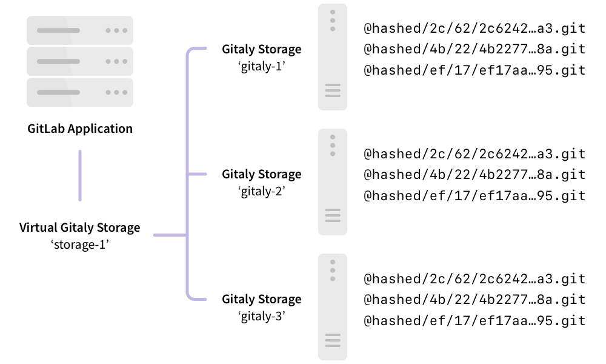
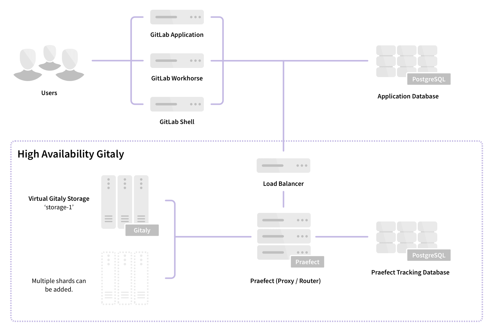
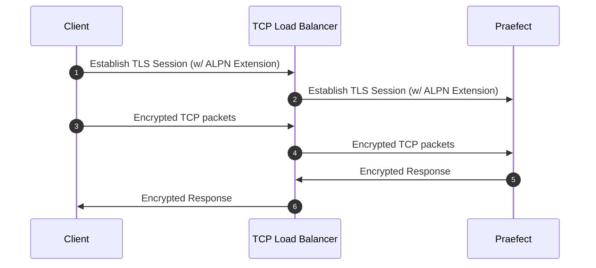
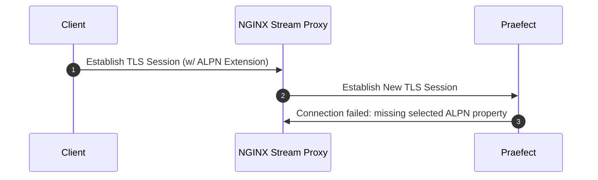



- Tier: Free, Premium, Ultimate
- Offering: GitLab Self-Managed



Git storage is provided through the Gitaly service in GitLab, and is essential to the operation of
GitLab. When the number of users, repositories, and activity grows, it is important to scale Gitaly
appropriately by:

- Increasing the available CPU and memory resources available to Git before
  resource exhaustion degrades Git, Gitaly, and GitLab application performance.
- Increasing available storage before storage limits are reached causing write
  operations to fail.
- Removing single points of failure to improve fault tolerance. Git should be
  considered mission critical if a service degradation would prevent you from
  deploying changes to production.

Gitaly can be run in a clustered configuration to:

- Scale the Gitaly service.
- Increase fault tolerance.

In this configuration, every Git repository can be stored on multiple Gitaly nodes in the cluster.

Using a Gitaly Cluster increases fault tolerance by:

- Replicating write operations to warm standby Gitaly nodes.
- Detecting Gitaly node failures.
- Automatically routing Git requests to an available Gitaly node.



Technical support for Gitaly clusters is limited to GitLab Premium and Ultimate
customers.



The following shows GitLab set up to access `storage-1`, a virtual storage provided by Gitaly
Cluster:



In this example:

- Repositories are stored on a virtual storage called `storage-1`.
- Three Gitaly nodes provide `storage-1` access: `gitaly-1`, `gitaly-2`, and `gitaly-3`.
- The three Gitaly nodes share data in three separate hashed storage locations.
- The [replication factor](#replication-factor) is `3`. Three copies are maintained
  of each repository.

The availability objectives for Gitaly clusters assuming a single node failure are:

- Recovery Point Objective (RPO): Less than 1 minute.

  Writes are replicated asynchronously. Any writes that have not been replicated
  to the newly promoted primary are lost.

  [Strong consistency](#strong-consistency) prevents loss in some circumstances.

- Recovery Time Objective (RTO): Less than 10 seconds.
  Outages are detected by a health check run by each Praefect node every
  second. Failover requires ten consecutive failed health checks on each
  Praefect node.

Improvements to RPO and RTO are proposed in epic [8903](https://gitlab.com/groups/gitlab-org/-/epics/8903).



If complete cluster failure occurs, disaster recovery plans should be executed. These can affect the
RPO and RTO discussed previously.



## Comparison to Geo

Gitaly Cluster and [Geo](../../geo/_index.md) both provide redundancy. However the redundancy of:

- Gitaly Cluster provides fault tolerance for data storage and is invisible to the user. Users are
  not aware when Gitaly Cluster is used.
- Geo provides [replication](../../geo/_index.md) and [disaster recovery](../../geo/disaster_recovery/_index.md) for
  an entire instance of GitLab. Users know when they are using Geo for
  [replication](../../geo/_index.md). Geo [replicates multiple data types](../../geo/replication/datatypes.md#replicated-data-types),
  including Git data.

The following table outlines the major differences between Gitaly Cluster and Geo:

| Tool           | Nodes    | Locations | Latency tolerance                                                                                     | Failover                                                                    | Consistency                           | Provides redundancy for |
|:---------------|:---------|:----------|:------------------------------------------------------------------------------------------------------|:----------------------------------------------------------------------------|:--------------------------------------|:------------------------|
| Gitaly Cluster | Multiple | Single    | [Less than 1 second, ideally single-digit milliseconds](#network-latency-and-connectivity) | [Automatic](#automatic-failover-and-primary-election-strategies) | [Strong](#strong-consistency) | Data storage in Git     |
| Geo            | Multiple | Multiple  | Up to one minute                                                                                      | [Manual](../../geo/disaster_recovery/_index.md)                                 | Eventual                              | Entire GitLab instance  |

For more information, see:

- Geo [use cases](../../geo/_index.md#use-cases).
- Geo [architecture](../../geo/_index.md#architecture).

## Virtual storage

Virtual storage makes it viable to have a single repository storage in GitLab to simplify repository
management.

Virtual storage with Gitaly Cluster can usually replace direct Gitaly storage configurations.
However, this is at the expense of additional storage space needed to store each repository on multiple
Gitaly nodes. The benefit of using Gitaly Cluster virtual storage over direct Gitaly storage is:

- Improved fault tolerance, because each Gitaly node has a copy of every repository.
- Improved resource utilization, reducing the need for over-provisioning for shard-specific peak
  loads, because read loads are distributed across Gitaly nodes.
- Manual rebalancing for performance is not required, because read loads are distributed across
  Gitaly nodes.
- Simpler management, because all Gitaly nodes are identical.

The number of repository replicas can be configured using a
[replication factor](#replication-factor).

It can
be uneconomical to have the same replication factor for all repositories.
To provide greater flexibility for extremely large GitLab instances,
variable replication factor is tracked in [this issue](https://gitlab.com/groups/gitlab-org/-/epics/3372).

As with standard Gitaly storages, virtual storages can be sharded.

## Storage layout



The storage layout is an internal detail of Gitaly Cluster and is not guaranteed to remain stable between releases.
The information here is only for informational purposes and to help with debugging. Performing changes in the
repositories directly on the disk is not supported and may lead to breakage or the changes being overwritten.



Gitaly Cluster's virtual storages provide an abstraction that looks like a single storage but actually consists of
multiple physical storages. Gitaly Cluster has to replicate each operation to each physical storage. Operations
may succeed on some of the physical storages but fail on others.

Partially applied operations can cause problems with other operations and leave the system in a state it can't recover from.
To avoid these types of problems, each operation should either fully apply or not apply at all. This property of operations is called
[atomicity](https://en.wikipedia.org/wiki/Atomicity_(database_systems)).

GitLab controls the storage layout on the repository storages. GitLab instructs the repository storage where to create,
delete, and move repositories. These operations create atomicity issues when they are being applied to multiple physical storages.
For example:

- GitLab deletes a repository while one of its replicas is unavailable.
- GitLab later recreates the repository.

As a result, the stale replica that was unavailable at the time of deletion may cause conflicts and prevent
recreation of the repository.

These atomicity issues have caused multiple problems in the past with:

- Geo syncing to a secondary site with Gitaly Cluster.
- Backup restoration.
- Repository moves between repository storages.

Gitaly Cluster provides atomicity for these operations by storing repositories on the disk in a special layout that prevents
conflicts that could occur due to partially applied operations.

### Client-generated replica paths

Repositories are stored in the storages at the relative path determined by the [Gitaly client](../_index.md#gitaly-architecture). These paths can be
identified by them not beginning with the `@cluster` prefix. The relative paths
follow the [hashed storage](../../repository_storage_paths.md#hashed-storage) schema.

### Praefect-generated replica paths



- [Introduced](https://gitlab.com/gitlab-org/gitaly/-/issues/4218) in GitLab 15.0 [with a flag](../../feature_flags/_index.md) named `gitaly_praefect_generated_replica_paths`. Disabled by default.
- [Enabled on GitLab.com](https://gitlab.com/gitlab-org/gitaly/-/issues/4218) in GitLab 15.2.
- [Enabled on GitLab Self-Managed](https://gitlab.com/gitlab-org/gitaly/-/merge_requests/4809) in GitLab 15.3.
- [Generally available](https://gitlab.com/gitlab-org/gitaly/-/merge_requests/4941) in GitLab 15.6. Feature flag `gitaly_praefect_generated_replica_paths` removed.



When Gitaly Cluster creates a repository, it assigns the repository a unique and permanent ID called the _repository ID_. The repository ID is
internal to Gitaly Cluster and doesn't relate to any IDs elsewhere in GitLab. If a repository is removed from Gitaly Cluster and later moved
back, the repository is assigned a new repository ID and is a different repository from Gitaly Cluster's perspective. The sequence of repository IDs
always increases, but there may be gaps in the sequence.

The repository ID is used to derive a unique storage path called _replica path_ for each repository on the cluster. The replicas of
a repository are all stored at the same replica path on the storages. The replica path is distinct from the _relative path_:

- The relative path is a name the Gitaly client uses to identify a repository, together with its virtual storage, that is unique to them.
- The replica path is the actual physical path in the physical storages.

Praefect translates the repositories in the RPCs from the virtual `(virtual storage, relative path)` identifier into physical repository
`(storage, replica_path)` identifier when handling the client requests.

The format of the replica path for:

- Object pools is `@cluster/pools/<xx>/<xx>/<repository ID>`. Object pools are stored in a different directory than other repositories.
  They must be identifiable by Gitaly to avoid pruning them as part of housekeeping. Pruning object pools can cause data loss in the linked
  repositories.
- Other repositories is `@cluster/repositories/<xx>/<xx>/<repository ID>`

For example, `@cluster/repositories/6f/96/54771`.

The last component of the replica path, `54771`, is the repository ID. This can be used to identify the repository on the disk.

`<xx>/<xx>` are the first four hex digits of the SHA256 hash of the string representation of the repository ID. These
digits are used to balance the repositories evenly into subdirectories to avoid overly large directories that might
cause problems on some file systems. In this case, `54771` hashes to
`6f960ab01689464e768366d3315b3d3b2c28f38761a58a70110554eb04d582f7` so the first four digits are `6f` and `96`.

### Identify repositories on disk

Use the [`praefect metadata`](troubleshooting.md#view-repository-metadata) subcommand to:

- Retrieve a repository's virtual storage and relative path from the metadata store. After you have the hashed storage path, you can use the Rails
  console to retrieve the project path.
- Find where a repository is stored in the cluster with either:
  - The virtual storage and relative path.
  - The repository ID.

The repository on disk also contains the project path in the Git configuration file. The configuration
file can be used to determine the project path even if the repository's metadata has been deleted.
Follow the [instructions in hashed storage's documentation](../../repository_storage_paths.md#from-hashed-path-to-project-name).

### Atomicity of operations

Gitaly Cluster uses the PostgreSQL metadata store with the storage layout to ensure atomicity of repository creation,
deletion, and move operations. The disk operations can't be atomically applied across multiple storages. However, PostgreSQL guarantees
the atomicity of the metadata operations. Gitaly Cluster models the operations in a manner that the failing operations always leave
the metadata consistent. The disks may contain stale state even after successful operations. This situation is expected and
the leftover state does not interfere with future operations but may use up disk space unnecessarily until a clean up is
performed.

There is on-going work on a [background crawler](https://gitlab.com/gitlab-org/gitaly/-/issues/3719) that cleans up the leftover
repositories from the storages.

#### Repository creations

When creating repositories, Praefect:

1. Reserves a repository ID from PostgreSQL, which is atomic and no two creations receive the same ID.
1. Creates replicas on the Gitaly storages in the replica path derived from the repository ID.
1. Creates metadata records after the repository is successfully created on disk.

Even if two concurrent operations create the same repository, they'd be stored in different directories on the storages and not
conflict. The first to complete creates the metadata record and the other operation fails with an "already exists" error.
The failing creation leaves leftover repositories on the storages. There is on-going work on a
[background crawler](https://gitlab.com/gitlab-org/gitaly/-/issues/3719) that clean up the leftover repositories from the storages.

The repository IDs are generated from the `repositories_repository_id_seq` in PostgreSQL. In the previous example, the failing operation took
one repository ID without successfully creating a repository with it. Failed repository creations are expected lead to gaps in the repository IDs.

#### Repository deletions

A repository is deleted by removing its metadata record. The repository ceases to logically exist as soon as the metadata record is deleted.
PostgreSQL guarantees the atomicity of the removal and a concurrent delete fails with a "not found" error. After successfully deleting
the metadata record, Praefect attempts to remove the replicas from the storages. This may fail and leave leftover state in the storages.
The leftover state is eventually cleaned up.

#### Repository moves

Unlike Gitaly, Gitaly Cluster doesn't move the repositories in the storages but only virtually moves the repository by updating the
relative path of the repository in the metadata store.

## Components

Gitaly Cluster consists of multiple components:

- [Load balancer](#load-balancer) for distributing requests and providing fault-tolerant access to
  Praefect nodes.
- [Praefect](#praefect) nodes for managing the cluster and routing requests to Gitaly nodes.
- [PostgreSQL database](#postgresql) for persisting cluster metadata and [PgBouncer](#use-pgbouncer),
  recommended for pooling Praefect's database connections.
- Gitaly nodes to provide repository storage and Git access.

## Architecture

Praefect is a router and transaction manager for Gitaly, and a required
component for running a Gitaly Cluster.



For more information, see [Gitaly High Availability (HA) Design](https://gitlab.com/gitlab-org/gitaly/-/blob/master/doc/design_ha.md).

## Features

Gitaly Cluster provides the following features:

- [Distributed reads](#distributed-reads) among Gitaly nodes.
- [Strong consistency](#strong-consistency) of the secondary replicas.
- [Replication factor](#replication-factor) of repositories for increased redundancy.
- [Automatic failover](#automatic-failover-and-primary-election-strategies) from the
  primary Gitaly node to secondary Gitaly nodes.
- Reporting of possible [data loss](recovery.md#check-for-data-loss) if replication queue isn't empty.

Follow the [Gitaly Cluster epic](https://gitlab.com/groups/gitlab-org/-/epics/1489) for improvements
including [horizontally distributing reads](https://gitlab.com/groups/gitlab-org/-/epics/2013).

### Distributed reads

Gitaly Cluster supports distribution of read operations across Gitaly nodes that are configured for
the [virtual storage](#virtual-storage).

All RPCs marked with the `ACCESSOR` option are redirected to an up to date and healthy Gitaly node.
For example, [`GetBlob`](https://gitlab.com/gitlab-org/gitaly/-/blob/v12.10.6/proto/blob.proto#L16).

"Up to date" in this context means that:

- There is no replication operations scheduled for this Gitaly node.
- The last replication operation is in a completed state.

The primary node is chosen to serve the request if:

- No up-to-date nodes exist.
- Any other error occurs during node selection.

If you have a large, heavily modified repository (like a multi-gigabyte monorepo), the primary node can service most or all requests if changes come in faster than Praefect
can replicate to the secondaries. When this occurs, CI/CD jobs and other repository traffic are bottlenecked by the capacity of the primary node.

You can [monitor distribution of reads](../monitoring.md#monitor-gitaly-cluster) using Prometheus.

### Strong consistency

Gitaly Cluster provides strong consistency by writing changes synchronously to all healthy, up-to-date replicas. If a
replica is outdated or unhealthy at the time of the transaction, the write is asynchronously replicated to it.

Strong consistency is the primary replication method. A subset of operations still use replication jobs
(eventual consistency) instead of strong consistency. Refer to the
[strong consistency epic](https://gitlab.com/groups/gitlab-org/-/epics/1189) for more information.

If strong consistency is unavailable, Gitaly Cluster guarantees eventual consistency. In this case. Gitaly Cluster
replicates all writes to secondary Gitaly nodes after the write to the primary Gitaly node has occurred.

For more information on monitoring strong consistency, see the Gitaly Cluster
[Prometheus metrics documentation](../monitoring.md#monitor-gitaly-cluster).

### Replication factor

Replication factor is the number of copies Gitaly Cluster maintains of a given repository. A higher
replication factor:

- Offers better redundancy and distribution of read workload.
- Results in higher storage cost.

By default, Gitaly Cluster replicates repositories to every storage in a
[virtual storage](#virtual-storage).

For configuration information, see [Configure replication factor](#configure-replication-factor).

## Upgrade Gitaly Cluster

To upgrade a Gitaly Cluster, follow the documentation for
[zero-downtime upgrades](../../../update/zero_downtime.md).

## Downgrade Gitaly Cluster to a previous version

If you need to roll back a Gitaly Cluster to an earlier version, some Praefect database migrations may need to be reverted.

To downgrade a Gitaly Cluster (assuming multiple Praefect nodes):

1. Stop the Praefect service on all Praefect nodes:

   ```shell
   gitlab-ctl stop praefect
   ```

1. Downgrade the GitLab package to the older version on one of the Praefect nodes.
1. On the downgraded node, check the state of Praefect migrations:

   ```shell
   sudo -u git -- /opt/gitlab/embedded/bin/praefect -config /var/opt/gitlab/praefect/config.toml sql-migrate-status
   ```

1. Count the number of migrations with `unknown migration` in the `APPLIED` column.
1. On a Praefect node that has not been downgraded, perform a dry run of the rollback to validate which migrations to revert. `<CT_UNKNOWN>`
   is the number of unknown migrations reported by the downgraded node.

   ```shell
   sudo -u git -- /opt/gitlab/embedded/bin/praefect -config /var/opt/gitlab/praefect/config.toml sql-migrate <CT_UNKNOWN>
   ```

1. If the results look correct, run the same command with the `-f` option to revert the migrations:

   ```shell
   sudo -u git -- /opt/gitlab/embedded/bin/praefect -config /var/opt/gitlab/praefect/config.toml sql-migrate -f <CT_UNKNOWN>
   ```

1. Downgrade the GitLab package on the remaining Praefect nodes and start the Praefect service again:

   ```shell
   gitlab-ctl start praefect
   ```

## Migrate to Gitaly Cluster



Some [known issues](#known-issues) exist in Gitaly Cluster. Review the following information before you continue.



Before migrating to Gitaly Cluster:

- Review [Before deploying Gitaly Cluster](#before-deploying-gitaly-cluster).
- Upgrade to the latest possible version of GitLab, to take advantage of improvements and bug fixes.

To migrate to Gitaly Cluster:

1. Create the required storage. Refer to
   [repository storage recommendations](#repository-storage-recommendations).
1. Create and configure [Gitaly Cluster](#configure-gitaly-cluster).
1. Configure the existing Gitaly instance [to use TCP](#use-tcp-for-existing-gitlab-instances), if not already configured that way.
1. [Move the repositories](../../operations/moving_repositories.md#moving-repositories). To migrate to
   Gitaly Cluster, existing repositories stored outside Gitaly Cluster must be moved. There is no
   automatic migration, but the moves can be scheduled with the GitLab API.

Even if you don't use the `default` repository storage, you must ensure it is configured.
[Read more about this limitation](../configure_gitaly.md#gitlab-requires-a-default-repository-storage).

## Migrate off Gitaly Cluster

If the limitations and tradeoffs of Gitaly Cluster are found to be not suitable for your environment, you can Migrate
off Gitaly Cluster to a sharded Gitaly instance:

1. Create and configure a new [Gitaly server](../configure_gitaly.md#run-gitaly-on-its-own-server).
1. [Move the repositories](../../operations/moving_repositories.md#moving-repositories) to the newly created storage. You can
   move them by shard or by group, which gives you the opportunity to spread them over multiple Gitaly servers.

## Before deploying Gitaly Cluster

Gitaly Cluster provides the benefits of fault tolerance, but comes with additional complexity of setup and management.
Before deploying Gitaly Cluster, see:

- Existing [known issues](#known-issues).
- [Snapshot backup and recovery](#snapshot-backup-and-recovery).
- [Configuration guidance](../configure_gitaly.md) and [Repository storage options](../../repository_storage_paths.md) to make
  sure that Gitaly Cluster is the best setup for you.

If you have not yet migrated to Gitaly Cluster, you have two options:

- A sharded Gitaly instance.
- Gitaly Cluster.

Contact your Customer Success Manager or customer support if you have any questions.

### Known issues

The following table outlines current known issues impacting the use of Gitaly Cluster. For
the current status of these issues, refer to the referenced issues and epics.

| Issue                                                                                 | Summary                                                                                                                                                                                                                                                                                                                                                                                                                                                                                                                                                     | How to avoid |
|:--------------------------------------------------------------------------------------|:------------------------------------------------------------------------------------------------------------------------------------------------------------------------------------------------------------------------------------------------------------------------------------------------------------------------------------------------------------------------------------------------------------------------------------------------------------------------------------------------------------------------------------------------------------|:--------------------------------|
| Gitaly Cluster + Geo - Issues retrying failed syncs                             | If Gitaly Cluster is used on a Geo secondary site, repositories that have failed to sync could continue to fail when Geo tries to resync them. Recovering from this state requires assistance from support to run manual steps. | In GitLab 15.0 to 15.2, enable the [`gitaly_praefect_generated_replica_paths` feature flag](#praefect-generated-replica-paths) on your Geo primary site. In GitLab 15.3, the feature flag is enabled by default. |
| Praefect unable to insert data into the database due to migrations not being applied after an upgrade | If the database is not kept up to date with completed migrations, then the Praefect node is unable to perform standard operation. | Make sure the Praefect database is up and running with all migrations completed (For example: `sudo -u git -- /opt/gitlab/embedded/bin/praefect -config /var/opt/gitlab/praefect/config.toml sql-migrate-status` should show a list of all applied migrations). Consider [requesting upgrade assistance](https://about.gitlab.com/support/scheduling-upgrade-assistance/) so your upgrade plan can be reviewed by support. |
| Restoring a Gitaly Cluster node from a snapshot in a running cluster | Because the Gitaly Cluster runs with consistent state, introducing a single node that is behind results in the cluster not being able to reconcile the nodes data and other nodes data | Don't restore a single Gitaly Cluster node from a backup snapshot. If you must restore from backup:<br/><br/>1. [Shut down GitLab](../../read_only_gitlab.md#shut-down-the-gitlab-ui).<br/>2. Snapshot all Gitaly Cluster nodes at the same time.<br/>3. Take a database dump of the Praefect database. |
| Limitations when running in Kubernetes, Amazon ECS, or similar | Praefect (Gitaly Cluster) is not supported and Gitaly has known limitations. For more information, see [epic 6127](https://gitlab.com/groups/gitlab-org/-/epics/6127). | Use our [reference architectures](../../reference_architectures/_index.md). |

### Snapshot backup and recovery

Gitaly Cluster does not support snapshot backups. Snapshot backups can cause issues where the Praefect database becomes
out of sync with the disk storage. Because of how Praefect rebuilds the replication metadata of Gitaly disk information
during a restore, you should use the [official backup and restore Rake tasks](../backup_restore/../_index.md).

The [incremental backup method](../../backup_restore/backup_gitlab.md#incremental-repository-backups)
can be used to speed up Gitaly Cluster backups.

If you are unable to use either method, contact customer support for restoration help.

### What to do if you are on Gitaly Cluster experiencing an issue or limitation

Contact customer support for immediate help in restoration or recovery.

## Configure Gitaly Cluster

Configure Gitaly Cluster using either:

- Gitaly Cluster configuration instructions available as part of
  [reference architectures](../../reference_architectures/_index.md) for installations of up to:
  - [60 RPS or 3,000 users](../../reference_architectures/3k_users.md#configure-gitaly-cluster).
  - [100 RPS or 5,000 users](../../reference_architectures/5k_users.md#configure-gitaly-cluster).
  - [200 RPS or 10,000 users](../../reference_architectures/10k_users.md#configure-gitaly-cluster).
  - [500 RPS or 25,000 users](../../reference_architectures/25k_users.md#configure-gitaly-cluster).
  - [1000 RPS or 50,000 users](../../reference_architectures/50k_users.md#configure-gitaly-cluster).
- The custom configuration instructions that follow on this page.

Smaller GitLab installations may need only [Gitaly itself](../_index.md).



Gitaly Cluster is not yet supported in Kubernetes, Amazon ECS, or similar container environments. For more information, see
[epic 6127](https://gitlab.com/groups/gitlab-org/-/epics/6127).



## Requirements

The minimum recommended configuration for a Gitaly Cluster requires:

- 1 load balancer
- 1 PostgreSQL server (a [supported version](../../../install/requirements.md#postgresql))
- 3 Praefect nodes
- 3 Gitaly nodes (1 primary, 2 secondary)



[Disk requirements](../_index.md#disk-requirements) apply to Gitaly nodes.



You should configure an odd number of Gitaly nodes so that transactions have a tie-breaker in case one of the
Gitaly nodes fails in a mutating RPC call.

See the [design document](https://gitlab.com/gitlab-org/gitaly/-/blob/master/doc/design_ha.md)
for implementation details.



If not set in GitLab, feature flags are read as false from the console and Praefect uses their
default value. The default value depends on the GitLab version.



### Network latency and connectivity

Network latency for Gitaly Cluster should ideally be measurable in single-digit milliseconds. Latency is particularly
important for:

- Gitaly node health checks. Nodes must be able to respond within 1 second.
- Reference transactions that enforce [strong consistency](#strong-consistency). Lower latencies mean Gitaly
  nodes can agree on changes faster.

Achieving acceptable latency between Gitaly nodes:

- On physical networks generally means high bandwidth, single location connections.
- On the cloud generally means in the same region, including allowing cross availability zone replication. These links
  are designed for this type of synchronization. Latency of less than 2 ms should be sufficient for Gitaly Cluster.

If you can't provide low network latencies for replication (for example, between distant locations), consider Geo. For
more information, see [Comparison to Geo](#comparison-to-geo).

Gitaly Cluster [components](#components) communicate with each other over many routes. Your firewall rules must
allow the following for Gitaly Cluster to function properly:

| From                   | To                     | Default port | TLS port |
|:-----------------------|:-----------------------|:-------------|:---------|
| GitLab                 | Praefect load balancer | `2305`       | `3305`   |
| Praefect load balancer | Praefect               | `2305`       | `3305`   |
| Praefect               | Gitaly                 | `8075`       | `9999`   |
| Praefect               | GitLab (internal API)  | `80`         | `443`    |
| Gitaly                 | GitLab (internal API)  | `80`         | `443`    |
| Gitaly                 | Praefect load balancer | `2305`       | `3305`   |
| Gitaly                 | Praefect               | `2305`       | `3305`   |
| Gitaly                 | Gitaly                 | `8075`       | `9999`   |



Gitaly does not directly connect to Praefect. However, requests from Gitaly to the Praefect
load balancer may still be blocked unless firewalls on the Praefect nodes allow traffic from
the Gitaly nodes.



### Praefect database storage

The requirements are relatively low because the database contains only metadata of:

- Where repositories are located.
- Some queued work.

It depends on the number of repositories, but a good minimum is 5-10 GB, similar to the main
GitLab application database.

## Setup Instructions

If you [installed](https://about.gitlab.com/install/) GitLab using the Linux package
(highly recommended), follow the steps below:

1. [Preparation](#preparation)
1. [Configuring the Praefect database](#postgresql)
1. [Configuring the Praefect proxy/router](#praefect)
1. [Configuring each Gitaly node](#gitaly) (once for each Gitaly node)
1. [Configure the load balancer](#load-balancer)
1. [Updating the GitLab server configuration](#gitlab)
1. [Configure Grafana](#grafana)

### Preparation

Before beginning, you should already have a working GitLab instance.
[Learn how to install GitLab](https://about.gitlab.com/install/).

Provision a PostgreSQL server. You should use the PostgreSQL that is shipped
with the Linux package and use it to configure the PostgreSQL database. You can use an
external PostgreSQL server but you must set it up [manually](#manual-database-setup).

Prepare all your new nodes by [installing GitLab](https://about.gitlab.com/install/). You need:

- 1 PostgreSQL node
- 1 PgBouncer node (optional)
- At least 1 Praefect node (minimal storage required)
- 3 Gitaly nodes (high CPU, high memory, fast storage)
- 1 GitLab server

You also need the IP/host address for each node:

1. `PRAEFECT_LOADBALANCER_HOST`: the IP/host address of Praefect load balancer
1. `POSTGRESQL_HOST`: the IP/host address of the PostgreSQL server
1. `PGBOUNCER_HOST`: the IP/host address of the PostgreSQL server
1. `PRAEFECT_HOST`: the IP/host address of the Praefect server
1. `GITALY_HOST_*`: the IP or host address of each Gitaly server
1. `GITLAB_HOST`: the IP/host address of the GitLab server

If you are using Google Cloud Platform, SoftLayer, or any other vendor that provides a virtual private cloud (VPC) you can use the private addresses for each cloud instance (corresponds to "internal address" for Google Cloud Platform) for `PRAEFECT_HOST`, `GITALY_HOST_*`, and `GITLAB_HOST`.

#### Secrets

The communication between components is secured with different secrets, which
are described below. Before you begin, generate a unique secret for each, and
make note of it. This enables you to replace these placeholder tokens
with secure tokens as you complete the setup process.

1. `GITLAB_SHELL_SECRET_TOKEN`: this is used by Git hooks to make callback HTTP
   API requests to GitLab when accepting a Git push. This secret is shared with
   GitLab Shell for legacy reasons.
1. `PRAEFECT_EXTERNAL_TOKEN`: repositories hosted on your Praefect cluster can
   only be accessed by Gitaly clients that carry this token.
1. `PRAEFECT_INTERNAL_TOKEN`: this token is used for replication traffic inside
   your Praefect cluster. This token is distinct from `PRAEFECT_EXTERNAL_TOKEN`
   because Gitaly clients must not be able to access internal nodes of the
   Praefect cluster directly; that could lead to data loss.
1. `PRAEFECT_SQL_PASSWORD`: this password is used by Praefect to connect to
   PostgreSQL.
1. `PRAEFECT_SQL_PASSWORD_HASH`: the hash of password of the Praefect user.
   Use `gitlab-ctl pg-password-md5 praefect` to generate the hash. The command
   asks for the password for `praefect` user. Enter `PRAEFECT_SQL_PASSWORD`
   plaintext password. By default, Praefect uses `praefect` user, but you can
   change it.
1. `PGBOUNCER_SQL_PASSWORD_HASH`: the hash of password of the PgBouncer user.
   PgBouncer uses this password to connect to PostgreSQL. For more details
   see [bundled PgBouncer](../../postgresql/pgbouncer.md) documentation.

We note in the instructions below where these secrets are required.



Linux package installations can use `gitlab-secrets.json` for `GITLAB_SHELL_SECRET_TOKEN`.



### Customize time server setting

By default, Gitaly and Praefect nodes use the time server at `pool.ntp.org` for time synchronization checks. You can customize this setting by adding the
following to `gitlab.rb` on each node:

- `gitaly['env'] = { "NTP_HOST" => "ntp.example.com" }`, for Gitaly nodes.
- `praefect['env'] = { "NTP_HOST" => "ntp.example.com" }`, for Praefect nodes.

### PostgreSQL



Do not store the GitLab application database and the Praefect
database on the same PostgreSQL server if using [Geo](../../geo/_index.md).
The replication state is internal to each instance of GitLab and should
not be replicated.



These instructions help set up a single PostgreSQL database, which creates a single point of failure. To avoid this, you can configure your own clustered
PostgreSQL.
Clustered database support for other databases (for example, Praefect and Geo databases) is proposed in
[issue 7292](https://gitlab.com/gitlab-org/omnibus-gitlab/-/issues/7292).

The following options are available:

- For non-Geo installations, either:
  - Use one of the documented [PostgreSQL setups](../../postgresql/_index.md).
  - Use your own third-party database setup. This requires [manual setup](#manual-database-setup).
- For Geo instances, either:
  - Set up a separate [PostgreSQL instance](https://www.postgresql.org/docs/16/high-availability.html).
  - Use a cloud-managed PostgreSQL service. AWS
    [Relational Database Service](https://aws.amazon.com/rds/) is recommended.

Setting up PostgreSQL creates empty Praefect tables. For more information, see the
[relevant troubleshooting section](troubleshooting.md#relation-does-not-exist-errors).

#### Running GitLab and Praefect databases on the same server

The GitLab application database and the Praefect database can be run on the same server. However, Praefect should have
its own database server when using PostgreSQL from the Linux package. If there is a failover, Praefect isn't aware and starts to
fail as the database it's trying to use would either:

- Be unavailable.
- In read-only mode.

#### Manual database setup

To complete this section you need:

- One Praefect node
- One PostgreSQL node
  - A PostgreSQL user with permissions to manage the database server

In this section, we configure the PostgreSQL database. This can be used for both external
and Linux package-provided PostgreSQL server.

To run the following instructions, you can use the Praefect node, where `psql` is installed
by the Linux package (`/opt/gitlab/embedded/bin/psql`). If you are using the Linux package-provided
PostgreSQL you can use `gitlab-psql` on the PostgreSQL node instead:

1. Create a new user `praefect` to be used by Praefect:

   ```sql
   CREATE ROLE praefect WITH LOGIN PASSWORD 'PRAEFECT_SQL_PASSWORD';
   ```

   Replace `PRAEFECT_SQL_PASSWORD` with the strong password you generated in the preparation step.

1. Create a new database `praefect_production` that is owned by `praefect` user.

   ```sql
   CREATE DATABASE praefect_production WITH OWNER praefect ENCODING UTF8;
   ```

When using the Linux package-provided PgBouncer, you need to take the following additional steps. We strongly
recommend using the PostgreSQL that is shipped with the Linux package as the backend. The following
instructions only work on the Linux package-provided PostgreSQL:

1. For the Linux package-provided PgBouncer, you need to use the hash of `praefect` password instead the of the
   actual password:

   ```sql
   ALTER ROLE praefect WITH PASSWORD 'md5<PRAEFECT_SQL_PASSWORD_HASH>';
   ```

   Replace `<PRAEFECT_SQL_PASSWORD_HASH>` with the hash of the password you generated in the
   preparation step. It is prefixed with `md5` literal.

1. Create a new user `pgbouncer` to be used by PgBouncer:

   ```sql
   CREATE ROLE pgbouncer WITH LOGIN;
   ALTER USER pgbouncer WITH password 'md5<PGBOUNCER_SQL_PASSWORD_HASH>';
   ```

   Replace `PGBOUNCER_SQL_PASSWORD_HASH` with the strong password hash you generated in the preparation step.

1. The PgBouncer that is shipped with the Linux package is configured to use [`auth_query`](https://www.pgbouncer.org/config.html#generic-settings)
   and uses `pg_shadow_lookup` function. You need to create this function in `praefect_production`
   database:

   ```sql
   CREATE OR REPLACE FUNCTION public.pg_shadow_lookup(in i_username text, out username text, out password text) RETURNS record AS $$
   BEGIN
       SELECT usename, passwd FROM pg_catalog.pg_shadow
       WHERE usename = i_username INTO username, password;
       RETURN;
   END;
   $$ LANGUAGE plpgsql SECURITY DEFINER;

   REVOKE ALL ON FUNCTION public.pg_shadow_lookup(text) FROM public, pgbouncer;
   GRANT EXECUTE ON FUNCTION public.pg_shadow_lookup(text) TO pgbouncer;
   ```

The database used by Praefect is now configured.

You can now configure Praefect to use the database:

```ruby
praefect['configuration'] = {
   # ...
   database: {
      # ...
      host: POSTGRESQL_HOST,
      user: 'praefect',
      port: 5432,
      password: PRAEFECT_SQL_PASSWORD,
      dbname: 'praefect_production',
   }
}
```

If you see Praefect database errors after configuring PostgreSQL, see
[troubleshooting steps](troubleshooting.md#relation-does-not-exist-errors).

#### Reads distribution caching

Praefect performance can be improved by additionally configuring the `session_pooled`
settings:

```ruby
praefect['configuration'] = {
   # ...
   database: {
      # ...
      session_pooled: {
         # ...
         host: POSTGRESQL_HOST,
         port: 5432

         # Use the following to override parameters of direct database connection.
         # Comment out where the parameters are the same for both connections.
         user: 'praefect',
         password: PRAEFECT_SQL_PASSWORD,
         dbname: 'praefect_production',
         # sslmode: '...',
         # sslcert: '...',
         # sslkey: '...',
         # sslrootcert: '...',
      }
   }
}
```

When configured, this connection is automatically used for the
[SQL LISTEN](https://www.postgresql.org/docs/16/sql-listen.html) feature and
allows Praefect to receive notifications from PostgreSQL for cache invalidation.

Verify this feature is working by looking for the following log entry in the Praefect
log:

```plaintext
reads distribution caching is enabled by configuration
```

#### Use PgBouncer

To reduce PostgreSQL resource consumption, you should set up and configure [PgBouncer](https://www.pgbouncer.org/) in
front of the PostgreSQL instance. However, PgBouncer isn't required because
Praefect makes a low number of connections. If you choose to use PgBouncer, you can use the same PgBouncer instance for
both the GitLab application database and the Praefect database.

To configure PgBouncer in front of the PostgreSQL instance, you must point Praefect to PgBouncer by setting database
parameters on the Praefect configuration:

```ruby
praefect['configuration'] = {
   # ...
   database: {
      # ...
      host: PGBOUNCER_HOST,
      port: 6432,
      user: 'praefect',
      password: PRAEFECT_SQL_PASSWORD,
      dbname: 'praefect_production',
      # sslmode: '...',
      # sslcert: '...',
      # sslkey: '...',
      # sslrootcert: '...',
   }
}
```

Praefect requires an additional connection to the PostgreSQL that supports the
[LISTEN](https://www.postgresql.org/docs/16/sql-listen.html) feature. With PgBouncer
this feature is only available with `session` pool mode (`pool_mode = session`).
It is not supported in `transaction` pool mode (`pool_mode = transaction`).

To configure the additional connection, you must either:

- Configure a new PgBouncer database that uses to the same PostgreSQL database endpoint,
  but with different pool mode (`pool_mode = session`).
- Connect Praefect directly to PostgreSQL and bypass PgBouncer.

##### Configure a new PgBouncer database with `pool_mode = session`

You should use PgBouncer with `session` pool mode. You can use the
[bundled PgBouncer](../../postgresql/pgbouncer.md) or use an external PgBouncer and
[configure it manually](https://www.pgbouncer.org/config.html).

The following example uses the bundled PgBouncer and sets up two separate connection pools on the PostgreSQL host,
one in `session` pool mode and the other in `transaction` pool mode. For this example to work,
you need to prepare PostgreSQL server as documented in [the setup instructions](#manual-database-setup). 

Then, configure the separate connection pools on the PgBouncer host:

```ruby
pgbouncer['databases'] = {
  # Other database configuration including gitlabhq_production
  ...

  praefect_production: {
    host: POSTGRESQL_HOST,
    # Use `pgbouncer` user to connect to database backend.
    user: 'pgbouncer',
    password: PGBOUNCER_SQL_PASSWORD_HASH,
    pool_mode: 'transaction'
  },
  praefect_production_direct: {
    host: POSTGRESQL_HOST,
    # Use `pgbouncer` user to connect to database backend.
    user: 'pgbouncer',
    password: PGBOUNCER_SQL_PASSWORD_HASH,
    dbname: 'praefect_production',
    pool_mode: 'session'
  },

  ...
}

# Allow the praefect user to connect to PgBouncer
pgbouncer['users'] = {
  'praefect': {
    'password': PRAEFECT_SQL_PASSWORD_HASH,
  }
}
```

Both `praefect_production` and `praefect_production_direct` use the same database endpoint
(`praefect_production`), but with different pool modes. This translates to the following
`databases` section of PgBouncer:

```ini
[databases]
praefect_production = host=POSTGRESQL_HOST auth_user=pgbouncer pool_mode=transaction
praefect_production_direct = host=POSTGRESQL_HOST auth_user=pgbouncer dbname=praefect_production pool_mode=session
```

Now you can configure Praefect to use PgBouncer for both connections:

```ruby
praefect['configuration'] = {
   # ...
   database: {
      # ...
      host: PGBOUNCER_HOST,
      port: 6432,
      user: 'praefect',
      # `PRAEFECT_SQL_PASSWORD` is the plain-text password of
      # Praefect user. Not to be confused with `PRAEFECT_SQL_PASSWORD_HASH`.
      password: PRAEFECT_SQL_PASSWORD,
      dbname: 'praefect_production',
      session_pooled: {
         # ...
         dbname: 'praefect_production_direct',
         # There is no need to repeat the following. Parameters of direct
         # database connection will fall back to the values specified in the
         # database block.
         #
         # host: PGBOUNCER_HOST,
         # port: 6432,
         # user: 'praefect',
         # password: PRAEFECT_SQL_PASSWORD,
      },
   },
}
```

With this configuration, Praefect uses PgBouncer for both connection types.



Linux package installations handle the authentication requirements (using `auth_query`), but if you are preparing
your databases manually and configuring an external PgBouncer, you must include `praefect` user and
its password in the file used by PgBouncer. For example, `userlist.txt` if the [`auth_file`](https://www.pgbouncer.org/config.html#auth_file)
configuration option is set. For more details, consult the PgBouncer documentation.



##### Configure Praefect to connect directly to PostgreSQL

As an alternative to configuring PgBouncer with `session` pool mode, Praefect can be configured to use different
connection parameters for direct access to PostgreSQL. This connection supports the `LISTEN` feature.

An example of Praefect configuration that bypasses PgBouncer and directly connects to PostgreSQL:

```ruby
praefect['configuration'] = {
   # ...
   database: {
      # ...
      session_pooled: {
         # ...
         host: POSTGRESQL_HOST,
         port: 5432,

         # Use the following to override parameters of direct database connection.
         # Comment out where the parameters are the same for both connections.
         #
         user: 'praefect',
         password: PRAEFECT_SQL_PASSWORD,
         dbname: 'praefect_production',
         # sslmode: '...',
         # sslcert: '...',
         # sslkey: '...',
         # sslrootcert: '...',
      },
   },
}
```

### Praefect

If there are multiple Praefect nodes:

1. Designate one node as the deploy node, and configure it using the following steps.
1. Complete the following steps for each additional node.

To complete this section you need a [configured PostgreSQL server](#postgresql), including:



Praefect should be run on a dedicated node. Do not run Praefect on the
application server, or a Gitaly node.



On the Praefect node:

1. Disable all other services by editing `/etc/gitlab/gitlab.rb`:

<!--
Updates to example must be made at:
- https://gitlab.com/gitlab-org/gitlab/-/blob/master/doc/administration/gitaly/praefect.md
- all reference architecture pages
-->

   ```ruby
   # Avoid running unnecessary services on the Praefect server
   gitaly['enable'] = false
   postgresql['enable'] = false
   redis['enable'] = false
   nginx['enable'] = false
   puma['enable'] = false
   sidekiq['enable'] = false
   gitlab_workhorse['enable'] = false
   prometheus['enable'] = false
   alertmanager['enable'] = false
   gitlab_exporter['enable'] = false
   gitlab_kas['enable'] = false

   # Enable only the Praefect service
   praefect['enable'] = true

   # Prevent database migrations from running on upgrade automatically
   praefect['auto_migrate'] = false
   gitlab_rails['auto_migrate'] = false
   ```

1. Configure Praefect to listen on network interfaces by editing
   `/etc/gitlab/gitlab.rb`:

   ```ruby
   praefect['configuration'] = {
      # ...
      listen_addr: '0.0.0.0:2305',
   }
   ```

1. Configure Prometheus metrics by editing
   `/etc/gitlab/gitlab.rb`:

   ```ruby
   praefect['configuration'] = {
      # ...
      #
      # Enable Prometheus metrics access to Praefect. You must use firewalls
      # to restrict access to this address/port.
      # The default metrics endpoint is /metrics
      prometheus_listen_addr: '0.0.0.0:9652',
      # Some metrics run queries against the database. Enabling separate database metrics allows
      # these metrics to be collected when the metrics are
      # scraped on a separate /db_metrics endpoint.
      prometheus_exclude_database_from_default_metrics: true,
   }
   ```

1. Configure a strong authentication token for Praefect by editing
   `/etc/gitlab/gitlab.rb`, which is needed by clients outside the cluster
   (like GitLab Shell) to communicate with the Praefect cluster:

   ```ruby
   praefect['configuration'] = {
      # ...
      auth: {
         # ...
         token: 'PRAEFECT_EXTERNAL_TOKEN',
      },
   }
   ```

1. Configure Praefect to [connect to the PostgreSQL database](#postgresql). We
   highly recommend using [PgBouncer](#use-pgbouncer) as well.

   If you want to use a TLS client certificate, the options below can be used:

   ```ruby
   praefect['configuration'] = {
      # ...
      database: {
         # ...
         #
         # Connect to PostgreSQL using a TLS client certificate
         # sslcert: '/path/to/client-cert',
         # sslkey: '/path/to/client-key',
         #
         # Trust a custom certificate authority
         # sslrootcert: '/path/to/rootcert',
      },
   }
   ```

   By default, Praefect uses opportunistic TLS to connect to PostgreSQL. This means that Praefect attempts to connect to PostgreSQL using `sslmode` set to
   `prefer`. You can override this by uncommenting the following line:

   ```ruby
   praefect['configuration'] = {
      # ...
      database: {
         # ...
         # sslmode: 'disable',
      },
   }
   ```

1. Configure the Praefect cluster to connect to each Gitaly node in the
   cluster by editing `/etc/gitlab/gitlab.rb`.

   The virtual storage's name must match the configured storage name in GitLab
   configuration. In a later step, we configure the storage name as `default`
   so we use `default` here as well. This cluster has three Gitaly nodes `gitaly-1`,
   `gitaly-2`, and `gitaly-3`, which are intended to be replicas of each other.

   

   If you have data on an already existing storage called
   `default`, you should configure the virtual storage with another name and
   [migrate the data to the Gitaly Cluster storage](#migrate-to-gitaly-cluster)
   afterwards.

   

   Replace `PRAEFECT_INTERNAL_TOKEN` with a strong secret, which is used by
   Praefect when communicating with Gitaly nodes in the cluster. This token is
   distinct from the `PRAEFECT_EXTERNAL_TOKEN`.

   Replace `GITALY_HOST_*` with the IP or host address of the each Gitaly node.

   More Gitaly nodes can be added to the cluster to increase the number of
   replicas. More clusters can also be added for very large GitLab instances.

   

   When adding additional Gitaly nodes to a virtual storage, all storage names
   in that virtual storage must be unique. Additionally, all Gitaly node
   addresses referenced in the Praefect configuration must be unique.

   

   ```ruby
   # Name of storage hash must match storage name in gitlab_rails['repositories_storages'] on GitLab
   # server ('default') and in gitaly['configuration'][:storage][INDEX][:name] on Gitaly nodes ('gitaly-1')
   praefect['configuration'] = {
      # ...
      virtual_storage: [
         {
            # ...
            name: 'default',
            node: [
               {
                  storage: 'gitaly-1',
                  address: 'tcp://GITALY_HOST_1:8075',
                  token: 'PRAEFECT_INTERNAL_TOKEN'
               },
               {
                  storage: 'gitaly-2',
                  address: 'tcp://GITALY_HOST_2:8075',
                  token: 'PRAEFECT_INTERNAL_TOKEN'
               },
               {
                  storage: 'gitaly-3',
                  address: 'tcp://GITALY_HOST_3:8075',
                  token: 'PRAEFECT_INTERNAL_TOKEN'
               },
            ],
         },
      ],
   }
   ```

1. Save the changes to `/etc/gitlab/gitlab.rb` and
   [reconfigure Praefect](../../restart_gitlab.md#reconfigure-a-linux-package-installation):

   ```shell
   gitlab-ctl reconfigure
   ```

1. For:

   - The "deploy node":
     1. Enable Praefect database auto-migration again by setting `praefect['auto_migrate'] = true` in
        `/etc/gitlab/gitlab.rb`.
     1. To ensure database migrations are only run during reconfigure and not automatically on
        upgrade, run:

        ```shell
        sudo touch /etc/gitlab/skip-auto-reconfigure
        ```

   - The other nodes, you can leave the settings as they are. Though
     `/etc/gitlab/skip-auto-reconfigure` isn't required, you may want to set it to prevent GitLab
     running reconfigure automatically when running commands such as `apt-get update`. This way any
     additional configuration changes can be done and then reconfigure can be run manually.

1. Save the changes to `/etc/gitlab/gitlab.rb` and
   [reconfigure Praefect](../../restart_gitlab.md#reconfigure-a-linux-package-installation):

   ```shell
   gitlab-ctl reconfigure
   ```

1. To ensure that Praefect
   [has updated its Prometheus listen address](https://gitlab.com/gitlab-org/gitaly/-/issues/2734),
   [restart Praefect](../../restart_gitlab.md#reconfigure-a-linux-package-installation):

   ```shell
   gitlab-ctl restart praefect
   ```

1. Verify that Praefect can reach PostgreSQL:

   ```shell
   sudo -u git -- /opt/gitlab/embedded/bin/praefect -config /var/opt/gitlab/praefect/config.toml sql-ping
   ```

   If the check fails, make sure you have followed the steps correctly. If you
   edit `/etc/gitlab/gitlab.rb`, remember to run `sudo gitlab-ctl reconfigure`
   again before trying the `sql-ping` command.

#### Enable TLS support

Praefect supports TLS encryption. To communicate with a Praefect instance that listens
for secure connections, you must:

- Ensure Gitaly is [configured for TLS](../tls_support.md) and use a `tls://` URL scheme in the `gitaly_address`
  of the corresponding storage entry in the GitLab configuration.
- Bring your own certificates because this isn't provided automatically. The certificate
  corresponding to each Praefect server must be installed on that Praefect server.

Additionally the certificate, or its certificate authority, must be installed on all Gitaly servers
and on all Praefect clients that communicate with it following the procedure described in
[GitLab custom certificate configuration](https://docs.gitlab.com/omnibus/settings/ssl/#install-custom-public-certificates) (and repeated below).

Note the following:

- The certificate must specify the address you use to access the Praefect server. You must add the hostname or IP
  address as a Subject Alternative Name to the certificate.
- When running Praefect sub-commands such as `dial-nodes` and `list-untracked-repositories` from the command line with
  [Gitaly TLS enabled](../tls_support.md), you must set the `SSL_CERT_DIR` or `SSL_CERT_FILE`
  environment variable so that the Gitaly certificate is trusted. For example:

   ```shell
   SSL_CERT_DIR=/etc/gitlab/trusted-certs sudo -u git -- /opt/gitlab/embedded/bin/praefect -config /var/opt/gitlab/praefect/config.toml dial-nodes
   ```

- You can configure Praefect servers with both an unencrypted listening address
  `listen_addr` and an encrypted listening address `tls_listen_addr` at the same time.
  This allows you to do a gradual transition from unencrypted to encrypted traffic, if
  necessary.

  To disable the unencrypted listener, set:

  ```ruby
  praefect['configuration'] = {
    # ...
    listen_addr: nil,
  }
  ```

Configure Praefect with TLS.

For Linux package installations:

1. Create certificates for Praefect servers.

1. On the Praefect servers, create the `/etc/gitlab/ssl` directory and copy your key
   and certificate there:

   ```shell
   sudo mkdir -p /etc/gitlab/ssl
   sudo chmod 755 /etc/gitlab/ssl
   sudo cp key.pem cert.pem /etc/gitlab/ssl/
   sudo chmod 644 key.pem cert.pem
   ```

1. Edit `/etc/gitlab/gitlab.rb` and add:

   ```ruby
   praefect['configuration'] = {
      # ...
      tls_listen_addr: '0.0.0.0:3305',
      tls: {
         # ...
         certificate_path: '/etc/gitlab/ssl/cert.pem',
         key_path: '/etc/gitlab/ssl/key.pem',
      },
   }
   ```

1. Save the file and [reconfigure](../../restart_gitlab.md#reconfigure-a-linux-package-installation).

1. On the Praefect clients (including each Gitaly server), copy the certificates,
   or their certificate authority, into `/etc/gitlab/trusted-certs`:

   ```shell
   sudo cp cert.pem /etc/gitlab/trusted-certs/
   ```

1. On the Praefect clients (except Gitaly servers), edit `gitlab_rails['repositories_storages']` in
   `/etc/gitlab/gitlab.rb` as follows:

   ```ruby
   gitlab_rails['repositories_storages'] = {
     "default" => {
       "gitaly_address" => 'tls://PRAEFECT_LOADBALANCER_HOST:3305',
       "gitaly_token" => 'PRAEFECT_EXTERNAL_TOKEN'
     }
   }
   ```

1. Save the file and [reconfigure GitLab](../../restart_gitlab.md#reconfigure-a-linux-package-installation).

For self-compiled installations:

1. Create certificates for Praefect servers.
1. On the Praefect servers, create the `/etc/gitlab/ssl` directory and copy your key and certificate
   there:

   ```shell
   sudo mkdir -p /etc/gitlab/ssl
   sudo chmod 755 /etc/gitlab/ssl
   sudo cp key.pem cert.pem /etc/gitlab/ssl/
   sudo chmod 644 key.pem cert.pem
   ```

1. On the Praefect clients (including each Gitaly server), copy the certificates,
   or their certificate authority, into the system trusted certificates:

   ```shell
   sudo cp cert.pem /usr/local/share/ca-certificates/praefect.crt
   sudo update-ca-certificates
   ```

1. On the Praefect clients (except Gitaly servers), edit `storages` in
   `/home/git/gitlab/config/gitlab.yml` as follows:

   ```yaml
   gitlab:
     repositories:
       storages:
         default:
           gitaly_address: tls://PRAEFECT_LOADBALANCER_HOST:3305
   ```

1. Save the file and [restart GitLab](../../restart_gitlab.md#self-compiled-installations).
1. Copy all Praefect server certificates, or their certificate authority, to the system
   trusted certificates on each Gitaly server so the Praefect server trusts the
   certificate when called by Gitaly servers:

   ```shell
   sudo cp cert.pem /usr/local/share/ca-certificates/praefect.crt
   sudo update-ca-certificates
   ```

1. Edit `/home/git/praefect/config.toml` and add:

   ```toml
   tls_listen_addr = '0.0.0.0:3305'

   [tls]
   certificate_path = '/etc/gitlab/ssl/cert.pem'
   key_path = '/etc/gitlab/ssl/key.pem'
   ```

1. Save the file and [restart GitLab](../../restart_gitlab.md#self-compiled-installations).

#### Service discovery



- [Introduced](https://gitlab.com/groups/gitlab-org/-/epics/8971) in GitLab 15.10.



Prerequisites:

- A DNS server.

GitLab uses service discovery to retrieve a list of Praefect hosts. Service
discovery involves periodic checks of a DNS A or AAAA record, with the IPs
retrieved from the record serving as the addresses of the target nodes.
Praefect does not support service discovery by SRV record.

By default, the minimum time between checks is 5 minutes, regardless of the
records' TTLs. Praefect does not support customizing this interval. When clients
receive an update, they:

- Establish new connections to the new IP addresses.
- Keep existing connections to intact IP addresses.
- Drop connections to removed IP addresses.

In-flight requests on to-be-removed connections are still handled until they
finish. Workhorse has a 10-minute timeout, while other clients do not specify a
graceful timeout.

The DNS server should return all IP addresses instead of load-balancing itself.
Clients can distribute requests to IP addresses in a round-robin fashion.

Before updating client configuration, ensure that DNS service discovery works
correctly. It should return the list of IP addresses correctly. `dig` is a good
tool to use to verify.

```console
 dig A praefect.service.consul @127.0.0.1

; <<>> DiG 9.10.6 <<>> A praefect.service.consul @127.0.0.1
;; global options: +cmd
;; Got answer:
;; ->>HEADER<<- opcode: QUERY, status: NOERROR, id: 29210
;; flags: qr aa rd ra; QUERY: 1, ANSWER: 3, AUTHORITY: 0, ADDITIONAL: 1

;; OPT PSEUDOSECTION:
; EDNS: version: 0, flags:; udp: 4096
;; QUESTION SECTION:
;praefect.service.consul.                     IN      A

;; ANSWER SECTION:
praefect.service.consul.              0       IN      A       10.0.0.3
praefect.service.consul.              0       IN      A       10.0.0.2
praefect.service.consul.              0       IN      A       10.0.0.1

;; Query time: 0 msec
;; SERVER: ::1#53(::1)
;; WHEN: Wed Dec 14 12:53:58 +07 2022
;; MSG SIZE  rcvd: 86
```

##### Configure service discovery

By default, Praefect delegates DNS resolution to the operating system. In such
cases, the Gitaly address can be set in either of these formats:

- `dns:[host]:[port]`
- `dns:///[host]:[port]` (note the three slashes)

You can also appoint an authoritative name server by setting it in this format:

- `dns://[authority_host]:[authority_port]/[host]:[port]`





1. Add the IP address for each Praefect node to the DNS service discovery address.
1. On the Praefect clients (except Gitaly servers), edit `gitlab_rails['repositories_storages']` in
   `/etc/gitlab/gitlab.rb` as follows. Replace `PRAEFECT_SERVICE_DISCOVERY_ADDRESS`
   with Praefect service discovery address, such as `praefect.service.consul`.

   ```ruby
   gitlab_rails['repositories_storages'] = {
     "default" => {
       "gitaly_address" => 'dns:PRAEFECT_SERVICE_DISCOVERY_ADDRESS:2305',
       "gitaly_token" => 'PRAEFECT_EXTERNAL_TOKEN'
     }
   }
   ```

1. Save the file and [reconfigure GitLab](../../restart_gitlab.md#reconfigure-a-linux-package-installation).





1. Install a DNS service discovery service. Register all Praefect nodes with the service.
1. On the Praefect clients (except Gitaly servers), edit `storages` in
   `/home/git/gitlab/config/gitlab.yml` as follows:

   ```yaml
   gitlab:
     repositories:
       storages:
         default:
           gitaly_address: dns:PRAEFECT_SERVICE_DISCOVERY_ADDRESS:2305
   ```

1. Save the file and [restart GitLab](../../restart_gitlab.md#self-compiled-installations).





##### Configure service discovery with Consul

If you already have a Consul server in your architecture then you can add
a Consul agent on each Praefect node and register the `praefect` service to it.
This registers each node's IP address to `praefect.service.consul` so it can be found
by service discovery.

Prerequisites:

- One or more [Consul](../../consul.md) servers to keep track of the Consul agents.

1. On each Praefect server, add the following to your `/etc/gitlab/gitlab.rb`:

   ```ruby
   consul['enable'] = true
   praefect['consul_service_name'] = 'praefect'

   # The following must also be added until this issue is addressed:
   # https://gitlab.com/gitlab-org/omnibus-gitlab/-/issues/8321
   consul['monitoring_service_discovery'] = true
   praefect['configuration'] = {
     # ...
     #
     prometheus_listen_addr: '0.0.0.0:9652',
   }
   ```

1. Save the file and [reconfigure GitLab](../../restart_gitlab.md#reconfigure-a-linux-package-installation).
1. Repeat the previous steps on each Praefect server to use with
   service discovery.
1. On the Praefect clients (except Gitaly servers), edit `gitlab_rails['repositories_storages']` in
   `/etc/gitlab/gitlab.rb` as follows. Replace `CONSUL_SERVER` with the IP or
   address of a Consul server. The default Consul DNS port is `8600`.

   ```ruby
   gitlab_rails['repositories_storages'] = {
     "default" => {
       "gitaly_address" => 'dns://CONSUL_SERVER:8600/praefect.service.consul:2305',
       "gitaly_token" => 'PRAEFECT_EXTERNAL_TOKEN'
     }
   }
   ```

1. Use `dig` from the Praefect clients to confirm that each IP address has been registered to
   `praefect.service.consul` with `dig A praefect.service.consul @CONSUL_SERVER -p 8600`.
   Replace `CONSUL_SERVER` with the value configured previously and all Praefect node IP addresses
   should be present in the output.
1. Save the file and [reconfigure GitLab](../../restart_gitlab.md#reconfigure-a-linux-package-installation).

### Gitaly



Complete these steps for each Gitaly node.



To complete this section you need:

- [Configured Praefect node](#praefect)
- 3 (or more) servers, with GitLab installed, to be configured as Gitaly nodes.
  These should be dedicated nodes, do not run other services on these nodes.

Every Gitaly server assigned to the Praefect cluster needs to be configured. The
configuration is the same as a standard [standalone Gitaly server](_index.md),
except:

- The storage names are exposed to Praefect, not GitLab
- The secret token is shared with Praefect, not GitLab

The configuration of all Gitaly nodes in the Praefect cluster can be identical,
because we rely on Praefect to route operations correctly.

Particular attention should be shown to:

- The `gitaly['configuration'][:auth][:token]` configured in this section must match the `token`
  value under `praefect['configuration'][:virtual_storage][<index>][:node][<index>][:token]` on the Praefect node. This value was
  set in the [previous section](#praefect). This document uses the placeholder `PRAEFECT_INTERNAL_TOKEN` throughout.
- The physical storage names in `gitaly['configuration'][:storage]` configured in this section must match the
  physical storage names under `praefect['configuration'][:virtual_storage]` on the Praefect node. This
  was set in the [previous section](#praefect). This document uses `gitaly-1`,
  `gitaly-2`, and `gitaly-3` as physical storage names.

For more information on Gitaly server configuration, see our
[Gitaly documentation](../configure_gitaly.md#configure-gitaly-servers).

1. SSH into the Gitaly node and login as root:

   ```shell
   sudo -i
   ```

1. Disable all other services by editing `/etc/gitlab/gitlab.rb`:

   ```ruby
   # Disable all other services on the Gitaly node
   postgresql['enable'] = false
   redis['enable'] = false
   nginx['enable'] = false
   puma['enable'] = false
   sidekiq['enable'] = false
   gitlab_workhorse['enable'] = false
   prometheus_monitoring['enable'] = false
   gitlab_kas['enable'] = false

   # Enable only the Gitaly service
   gitaly['enable'] = true

   # Enable Prometheus if needed
   prometheus['enable'] = true

   # Disable database migrations to prevent database connections during 'gitlab-ctl reconfigure'
   gitlab_rails['auto_migrate'] = false
   ```

1. Configure Gitaly to listen on network interfaces by editing
   `/etc/gitlab/gitlab.rb`:

   ```ruby
   gitaly['configuration'] = {
      # ...
      #
      # Make Gitaly accept connections on all network interfaces.
      # Use firewalls to restrict access to this address/port.
      listen_addr: '0.0.0.0:8075',
      # Enable Prometheus metrics access to Gitaly. You must use firewalls
      # to restrict access to this address/port.
      prometheus_listen_addr: '0.0.0.0:9236',
   }
   ```

1. Configure a strong `auth_token` for Gitaly by editing
   `/etc/gitlab/gitlab.rb`, which is needed by clients to communicate with
   this Gitaly nodes. Typically, this token is the same for all Gitaly
   nodes.

   ```ruby
   gitaly['configuration'] = {
      # ...
      auth: {
         # ...
         token: 'PRAEFECT_INTERNAL_TOKEN',
      },
   }
   ```

1. Configure the GitLab Shell secret token, which is needed for `git push` operations. Either:

   - Method 1:

     1. Copy `/etc/gitlab/gitlab-secrets.json` from the Gitaly client to same path on the Gitaly
        servers and any other Gitaly clients.
     1. [Reconfigure GitLab](../../restart_gitlab.md#reconfigure-a-linux-package-installation) on Gitaly servers.

   - Method 2:

     1. Edit `/etc/gitlab/gitlab.rb`.
     1. Replace `GITLAB_SHELL_SECRET_TOKEN` with the real secret.

        ```ruby
        gitlab_shell['secret_token'] = 'GITLAB_SHELL_SECRET_TOKEN'
        ```

1. Configure an `internal_api_url`, which is also needed for `git push` operations:

   ```ruby
   # Configure the gitlab-shell API callback URL. Without this, `git push` will
   # fail. This can be your front door GitLab URL or an internal load balancer.
   # Examples: 'https://gitlab.example.com', 'http://10.0.2.2'
   gitlab_rails['internal_api_url'] = 'https://gitlab.example.com'
   ```

1. Configure the storage location for Git data by setting `gitaly['configuration'][:storage]` in
   `/etc/gitlab/gitlab.rb`. Each Gitaly node should have a unique storage name
   (such as `gitaly-1`) and should not be duplicated on other Gitaly nodes.

   ```ruby
   gitaly['configuration'] = {
      # ...
      storage: [
        # Replace with appropriate name for each Gitaly nodes.
        {
          name: 'gitaly-1',
          path: '/var/opt/gitlab/git-data/repositories',
        },
      ],
   }
   ```

1. Save the changes to `/etc/gitlab/gitlab.rb` and
   [reconfigure Gitaly](../../restart_gitlab.md#reconfigure-a-linux-package-installation):

   ```shell
   gitlab-ctl reconfigure
   ```

1. To ensure that Gitaly
   [has updated its Prometheus listen address](https://gitlab.com/gitlab-org/gitaly/-/issues/2734),
   [restart Gitaly](../../restart_gitlab.md#reconfigure-a-linux-package-installation):

   ```shell
   gitlab-ctl restart gitaly
   ```



The previous steps must be completed for each Gitaly node!



After all Gitaly nodes are configured, run the Praefect connection
checker to verify Praefect can connect to all Gitaly servers in the Praefect
configuration.

1. SSH into each Praefect node and run the Praefect connection checker:

   ```shell
   sudo -u git -- /opt/gitlab/embedded/bin/praefect -config /var/opt/gitlab/praefect/config.toml dial-nodes
   ```

### Load Balancer

In a fault-tolerant Gitaly configuration, a load balancer is needed to route
internal traffic from the GitLab application to the Praefect nodes. The
specifics on which load balancer to use or the exact configuration is beyond the
scope of the GitLab documentation.



The load balancer must be configured to accept traffic from the Gitaly nodes in
addition to the GitLab nodes.



We hope that if you're managing fault-tolerant systems like GitLab, you have a load balancer
of choice already. Some examples include [HAProxy](https://www.haproxy.org/)
(open-source), [Google Internal Load Balancer](https://cloud.google.com/load-balancing/docs/internal/),
[AWS Elastic Load Balancer](https://aws.amazon.com/elasticloadbalancing/), F5
Big-IP LTM, and Citrix Net Scaler. This documentation outlines what ports
and protocols you need configure.

You should use the equivalent of HAProxy `leastconn` load-balancing strategy because long-running operations (for
example, clones) keep some connections open for extended periods.

| LB Port | Backend Port | Protocol |
|:--------|:-------------|:---------|
| 2305    | 2305         | TCP      |

You must use a TCP load balancer. Using an HTTP/2 or gRPC load balancer
with Praefect does not work because of [Gitaly sidechannels](https://gitlab.com/gitlab-org/gitaly/-/blob/master/doc/sidechannel.md).
This optimization intercepts the gRPC handshaking process. It redirects all heavy Git operations to a more efficient "channel" than gRPC,
but HTTP/2 or gRPC load balancers do not handle such requests properly.

If TLS is enabled, [some versions of Praefect](#alpn-enforcement) require that the Application-Layer Protocol Negotiation (ALPN) extension is used per [RFC 7540](https://datatracker.ietf.org/doc/html/rfc7540#section-3.3).
TCP load balancers pass ALPN directly without additional configuration:



Some TCP load balancers can be configured to accept a TLS client connection and
proxy the connection to Praefect with a new TLS connection. However, this only works
if ALPN is supported on both connections.

For this reason, NGINX's [`ngx_stream_proxy_module`](https://nginx.org/en/docs/stream/ngx_stream_proxy_module.html)
does not work when the `proxy_ssl` configuration option is enabled:



On step 2, ALPN is not used because [NGINX does not support this](https://mailman.nginx.org/pipermail/nginx-devel/2017-July/010307.html).
For more information, [follow NGINX issue 406](https://github.com/nginx/nginx/issues/406) for more details.

#### ALPN enforcement

ALPN enforcement was enabled in some versions of GitLab. However, ALPN enforcement broke deployments and so is disabled
[to provide a path to migrate](https://github.com/grpc/grpc-go/issues/7922). The following versions of GitLab have ALPN enforcement enabled:

- GitLab 17.7.0
- GitLab 17.6.0 - 17.6.2
- GitLab 17.5.0 - 17.5.4
- GitLab 17.4.x

With [GitLab 17.5.5, 17.6.3, and 17.7.1](https://about.gitlab.com/releases/2025/01/08/patch-release-gitlab-17-7-1-released/),
ALPN enforcement is disabled again. GitLab 17.4 and earlier never had ALPN enforcement enabled.

### GitLab

To complete this section you need:

- [Configured Praefect node](#praefect)
- [Configured Gitaly nodes](#gitaly)

The Praefect cluster needs to be exposed as a storage location to the GitLab
application, which is done by updating `gitlab_rails['repositories_storages']`.

Particular attention should be shown to:

- the storage name added to `gitlab_rails['repositories_storages']` in this section must match the
  storage name under `praefect['configuration'][:virtual_storage]` on the Praefect nodes. This
  was set in the [Praefect](#praefect) section of this guide. This document uses
  `default` as the Praefect storage name.

1. SSH into the GitLab node and login as root:

   ```shell
   sudo -i
   ```

1. Configure the `external_url` so that files could be served by GitLab
   by proper endpoint access by editing `/etc/gitlab/gitlab.rb`:

   You need to replace `GITLAB_SERVER_URL` with the real external facing
   URL on which current GitLab instance is serving:

   ```ruby
   external_url 'GITLAB_SERVER_URL'
   ```

1. Disable the default Gitaly service running on the GitLab host. It isn't needed
   because GitLab connects to the configured cluster.

   

   If you have existing data stored on the default Gitaly storage,
   you should [migrate the data to your Gitaly Cluster storage](#migrate-to-gitaly-cluster)
   first.

   

   ```ruby
   gitaly['enable'] = false
   ```

1. Add the Praefect cluster as a storage location by editing
   `/etc/gitlab/gitlab.rb`.

   You need to replace:

   - `PRAEFECT_LOADBALANCER_HOST` with the IP address or hostname of the load
     balancer.
   - `PRAEFECT_EXTERNAL_TOKEN` with the real secret

   If you are using TLS:

   - The `gitaly_address` should begin with `tls://` instead.
   - The port should be changed to `3305`.

   ```ruby
   gitlab_rails['repositories_storages'] = {
     "default" => {
       "gitaly_address" => "tcp://PRAEFECT_LOADBALANCER_HOST:2305",
       "gitaly_token" => 'PRAEFECT_EXTERNAL_TOKEN'
     }
   }
   ```

1. Configure the GitLab Shell secret token so that callbacks from Gitaly nodes during a `git push`
   are properly authenticated. Either:

   - Method 1:

     1. Copy `/etc/gitlab/gitlab-secrets.json` from the Gitaly client to same path on the Gitaly
        servers and any other Gitaly clients.
     1. [Reconfigure GitLab](../../restart_gitlab.md#reconfigure-a-linux-package-installation) on Gitaly servers.

   - Method 2:

     1. Edit `/etc/gitlab/gitlab.rb`.
     1. Replace `GITLAB_SHELL_SECRET_TOKEN` with the real secret.

        ```ruby
        gitlab_shell['secret_token'] = 'GITLAB_SHELL_SECRET_TOKEN'
        ```

1. Add Prometheus monitoring settings by editing `/etc/gitlab/gitlab.rb`. If Prometheus
   is enabled on a different node, make edits on that node instead.

   You need to replace:

   - `PRAEFECT_HOST` with the IP address or hostname of the Praefect node
   - `GITALY_HOST_*` with the IP address or hostname of each Gitaly node

   ```ruby
   prometheus['scrape_configs'] = [
     {
       'job_name' => 'praefect',
       'static_configs' => [
         'targets' => [
           'PRAEFECT_HOST:9652', # praefect-1
           'PRAEFECT_HOST:9652', # praefect-2
           'PRAEFECT_HOST:9652', # praefect-3
         ]
       ]
     },
     {
       'job_name' => 'praefect-gitaly',
       'static_configs' => [
         'targets' => [
           'GITALY_HOST_1:9236', # gitaly-1
           'GITALY_HOST_2:9236', # gitaly-2
           'GITALY_HOST_3:9236', # gitaly-3
         ]
       ]
     }
   ]
   ```

1. Save the changes to `/etc/gitlab/gitlab.rb` and [reconfigure GitLab](../../restart_gitlab.md#reconfigure-a-linux-package-installation):

   ```shell
   gitlab-ctl reconfigure
   ```

1. Verify on each Gitaly node the Git Hooks can reach GitLab. On each Gitaly node run:
   - For GitLab 15.3 and later, run `sudo -u git -- /opt/gitlab/embedded/bin/gitaly check /var/opt/gitlab/gitaly/config.toml`.
   - For GitLab 15.2 and earlier, run `sudo -u git -- /opt/gitlab/embedded/bin/gitaly-hooks check /var/opt/gitlab/gitaly/config.toml`.

1. Verify that GitLab can reach Praefect:

   ```shell
   gitlab-rake gitlab:gitaly:check
   ```

1. Check that the Praefect storage is configured to store new repositories:

   1. On the left sidebar, at the bottom, select **Admin**.
   1. On the left sidebar, select **Settings > Repository**.
   1. Expand the **Repository storage** section.

   Following this guide, the `default` storage should have weight 100 to store all new repositories.

1. Verify everything is working by creating a new project. Check the
   "Initialize repository with a README" box so that there is content in the
   repository that viewed. If the project is created, and you can see the
   README file, it works!

#### Use TCP for existing GitLab instances

When adding Gitaly Cluster to an existing Gitaly instance, the existing Gitaly storage
must be listening on TCP/TLS. If `gitaly_address` is not specified, then a Unix socket is used,
which prevents the communication with the cluster.

For example:

```ruby
gitlab_rails['repositories_storages'] = {
  'default' => { 'gitaly_address' => 'tcp://old-gitaly.internal:8075' },
  'cluster' => {
    'gitaly_address' => 'tls://<PRAEFECT_LOADBALANCER_HOST>:3305',
    'gitaly_token' => '<praefect_external_token>'
  }
}
```

See [Mixed Configuration](../configure_gitaly.md#mixed-configuration) for further information on
running multiple Gitaly storages.

### Grafana

Grafana is included with GitLab, and can be used to monitor your Praefect
cluster. See [Grafana Dashboard Service](../../monitoring/performance/grafana_configuration.md)
for detailed documentation.

To get started quickly:

1. SSH into the GitLab node (or whichever node has Grafana enabled) and login as root:

   ```shell
   sudo -i
   ```

1. Enable the Grafana login form by editing `/etc/gitlab/gitlab.rb`.

   ```ruby
   grafana['disable_login_form'] = false
   ```

1. Save the changes to `/etc/gitlab/gitlab.rb` and
   [reconfigure GitLab](../../restart_gitlab.md#reconfigure-a-linux-package-installation):

   ```shell
   gitlab-ctl reconfigure
   ```

1. Set the Grafana administrator password. This command prompts you to enter a new
   password:

   ```shell
   gitlab-ctl set-grafana-password
   ```

1. In your web browser, open `/-/grafana` (such as
   `https://gitlab.example.com/-/grafana`) on your GitLab server.

   Login using the password you set, and the username `admin`.

1. Go to **Explore** and query `gitlab_build_info` to verify that you are
   getting metrics from all your machines.

Congratulations! You've configured an observable fault-tolerant Praefect
cluster.

## Configure replication factor

Praefect supports configuring a replication factor on a per-repository basis, by assigning
specific storage nodes to host a repository.



Configurable replication factors requires [repository-specific primary nodes](#repository-specific-primary-nodes).



Praefect does not store the actual replication factor, but assigns enough storages to host the repository
so the desired replication factor is met. If a storage node is later removed from the virtual storage,
the replication factor of repositories assigned to the storage is decreased accordingly.

You can configure either:

- A default replication factor for each virtual storage that is applied to newly created repositories.
- A replication factor for an existing repository with the `set-replication-factor` subcommand.

### Configure default replication factor

If `default_replication_factor` is unset, the repositories are always replicated on every storage node defined in
`virtual_storages`. If a new storage node is introduced to the virtual storage, both new and existing repositories are
replicated to the node automatically.

For large Gitaly Cluster deployments with many storage nodes, replicating a repository to every storage node is often not
sensible and can cause problems. A replication factor of 3 is usually sufficient, which means replicate repositories to
three storages even if more are available. Higher replication factors increase the pressure on the primary storage.

To configure a default replication factor, add configuration to the `/etc/gitlab/gitlab.rb` file:

```ruby
praefect['configuration'] = {
   # ...
   virtual_storage: [
      {
         # ...
         name: 'default',
         default_replication_factor: 3,
      },
   ],
}
```

### Configure replication factor for existing repositories

The `set-replication-factor` subcommand automatically assigns or unassigns random storage nodes as
necessary to reach the desired replication factor. The repository's primary node is
always assigned first and is never unassigned.

```shell
sudo -u git -- /opt/gitlab/embedded/bin/praefect -config /var/opt/gitlab/praefect/config.toml set-replication-factor -virtual-storage <virtual-storage> -repository <relative-path> -replication-factor <replication-factor>
```

- `-virtual-storage` is the virtual storage the repository is located in.
- `-repository` is the repository's relative path in the storage.
- `-replication-factor` is the desired replication factor of the repository. The minimum value is
  `1` because the primary needs a copy of the repository. The maximum replication factor is the number of
  storages in the virtual storage.

On success, the assigned host storages are printed. For example:

```shell
$ sudo -u git -- /opt/gitlab/embedded/bin/praefect -config /var/opt/gitlab/praefect/config.toml set-replication-factor -virtual-storage default -repository @hashed/3f/db/3fdba35f04dc8c462986c992bcf875546257113072a909c162f7e470e581e278.git -replication-factor 2

current assignments: gitaly-1, gitaly-2
```

### Repository storage recommendations

The size of the required storage can vary between instances and depends on the set
[replication factor](#replication-factor). You might want to include implementing
repository storage redundancy.

For a replication factor:

- Of `1`: Gitaly and Gitaly Cluster have roughly the same storage requirements.
- More than `1`: The amount of required storage is `used space * replication factor`. `used space`
  should include any planned future growth.

## Repository verification



- [Introduced](https://gitlab.com/gitlab-org/gitaly/-/issues/4080) in GitLab 15.0.



Praefect stores metadata about the repositories in a database. If the repositories are modified on disk
without going through Praefect, the metadata can become inaccurate. For example if a Gitaly node is
rebuilt, rather than being replaced with a new node, repository verification ensures this is detected.

The metadata is used for replication and routing decisions, so any inaccuracies may cause problems.
Praefect contains a background worker that periodically verifies the metadata against the actual state on the disks.
The worker:

1. Picks up a batch of replicas to verify on healthy storages. The replicas are either unverified or have exceeded
   the configured verification interval. Replicas that have never been verified are prioritized, followed by
   the other replicas ordered by longest time since the last successful verification.
1. Checks whether the replicas exist on their respective storages. If the:
   - Replica exists, update its last successful verification time.
   - Replica doesn't exist, remove its metadata record.
   - Check failed, the replica is picked up for verification again when the next worker dequeues more work.

The worker acquires an exclusive verification lease on each of the replicas it is about to verify. This avoids multiple
workers from verifying the same replica concurrently. The worker releases the leases when it has completed its check.
If workers are terminated for some reason without releasing the lease, Praefect contains a background goroutine
that releases stale leases every 10 seconds.

The worker logs each of the metadata removals prior to executing them. The `perform_deletions` key
indicates whether the invalid metadata records are actually deleted or not. For example:

```json
{
  "level": "info",
  "msg": "removing metadata records of non-existent replicas",
  "perform_deletions": false,
  "replicas": {
    "default": {
      "@hashed/6b/86/6b86b273ff34fce19d6b804eff5a3f5747ada4eaa22f1d49c01e52ddb7875b4b.git": [
        "praefect-internal-0"
      ]
    }
  }
}
```

### Configure the verification worker

The worker is enabled by default and verifies the metadata records every seven days. The verification
interval is configurable with any valid [Go duration string](https://pkg.go.dev/time#ParseDuration).

To verify the metadata every three days:

```ruby
praefect['configuration'] = {
   # ...
   background_verification: {
      # ...
      verification_interval: '72h',
   },
}
```

Values of 0 and below disable the background verifier.

```ruby
praefect['configuration'] = {
   # ...
   background_verification: {
      # ...
      verification_interval: '0',
   },
}
```

#### Enable deletions



- [Introduced](https://gitlab.com/gitlab-org/gitaly/-/issues/4080) and disabled by default in GitLab 15.0
- [Default enabled](https://gitlab.com/gitlab-org/gitaly/-/merge_requests/5321) in GitLab 15.9.





Deletions were disabled by default prior to GitLab 15.9 due to a race condition with repository renames
that can cause incorrect deletions, which is especially prominent in Geo instances as Geo performs more renames
than instances without Geo. In GitLab 15.0 to 15.5, you should enable deletions only if the [`gitaly_praefect_generated_replica_paths` feature flag](#praefect-generated-replica-paths) is enabled. The feature flag was removed in GitLab 15.6 making deletions always safe to enable.



By default, the worker deletes invalid metadata records. It also logs the deleted records and outputs Prometheus
metrics.

You can disable deleting invalid metadata records with:

```ruby
praefect['configuration'] = {
   # ...
   background_verification: {
      # ...
      delete_invalid_records: false,
   },
}
```

### Prioritize verification manually

You can prioritize verification of some replicas ahead of their next scheduled verification time.
This might be needed after a disk failure, for example, when the administrator knows that the disk contents may have
changed. Praefect would eventually verify the replicas again, but users may encounter errors in the meantime.

To manually prioritize reverification of some replicas, use the `praefect verify` subcommand. The subcommand marks
replicas as unverified. Unverified replicas are prioritized by the background verification worker. The verification
worker must be enabled for the replicas to be verified.

Prioritize verifying the replicas of a specific repository:

```shell
sudo -u git -- /opt/gitlab/embedded/bin/praefect -config /var/opt/gitlab/praefect/config.toml verify -repository-id=<repository-id>
```

Prioritize verifying all replicas stored on a virtual storage:

```shell
sudo -u git -- /opt/gitlab/embedded/bin/praefect -config /var/opt/gitlab/praefect/config.toml verify -virtual-storage=<virtual-storage>
```

Prioritize verifying all replicas stored on a storage:

```shell
sudo -u git -- /opt/gitlab/embedded/bin/praefect -config /var/opt/gitlab/praefect/config.toml verify -virtual-storage=<virtual-storage> -storage=<storage>
```

The output includes the number of replicas that were marked unverified.

## Automatic failover and primary election strategies

Praefect regularly checks the health of each Gitaly node, which is used to automatically fail over
to a newly-elected primary Gitaly node if the current primary node is found to be unhealthy.

[Repository-specific primary nodes](#repository-specific-primary-nodes) is the only available election strategy.

### Repository-specific primary nodes

Gitaly Cluster elects a primary Gitaly node separately for each repository. Combined with
[configurable replication factors](#configure-replication-factor), you can horizontally scale storage capacity and distribute write load across Gitaly nodes.

Primary elections are run lazily. Praefect doesn't immediately elect a new primary node if the current
one is unhealthy. A new primary is elected if a request must be served while the current primary is unavailable.

A valid primary node candidate is a Gitaly node that:

- Is healthy. A Gitaly node is considered healthy if `>=50%` Praefect nodes have
  successfully health checked the Gitaly node in the previous ten seconds.
- Has a fully up to date copy of the repository.

If there are multiple primary node candidates, Praefect:

- Picks one of them randomly.
- Prioritizes promoting a Gitaly node that is assigned to host the repository. If
  there are no assigned Gitaly nodes to elect as the primary, Praefect may temporarily
  elect an unassigned one. The unassigned primary is demoted in favor of an assigned
  one when one becomes available.

If there are no valid primary candidates for a repository:

- The unhealthy primary node is demoted and the repository is left without a primary node.
- Operations that require a primary node fail until a primary is successfully elected.
