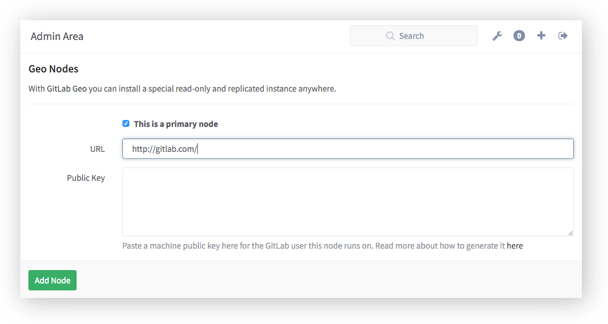

## GitLab Geo (EE)

GitLab Geo allows you to replicate your GitLab instance to other
geographical locations as a read-only fully operational version.

When Geo is enabled, we reffer to your original instance as a **primary**
node and the replicated read-only ones as **secondaries**.

### Setup instructions

GitLab Geo requires some additional work installing and configuring your
instance, than a normal setup.

#### Primary Node

To turn your GitLab instance into a primary Geo node, go to
**Admin Area > Geo Nodes** (`/admin/geo_nodes`).

In **Geo Nodes** screen, fill in the required fields and make sure you
check `This is a primary node` before hitting Add Node.

Fill **URL** field with your instance full URL, in the same way it is
configure in your `gitlab.yml` (source based install) or
`/etc/gitlab/gitlab.rb` (omnibus install).

The **Public Key** field must contain the SSH public key of the user that
your GitLab instance runs on (unless changed, should be the user `git`).

---

---

Repeat the same instructions to add your secondaries instances remembering not
to check `This is a primary node`, and to use the correct Public Key.

You will need to setup your database into a **Master <-> Slave** replication
topology, and your Primary node should always point to a database's
Master instance.

#### Secondary Node

To install a secondary node, you must follow your a normal GitLab install
instructions with some extra requirements:

 * You should point your database connection to a Slave replicated instance.
 * Your secondary node should be allowed to comunicate by HTTP/HTTPS and
   SSH with your primary node (make sure your firewall is not blocking that).

---

### Current limitations

 * You cannot push code to secondary nodes
 * Git LFS is not supported yet
 * Git Annex is not supported yet
 * Wiki's are not being replicated yet
 * Git clone from secondaries by HTTP/HTTPS only (ssh-keys
   aren't being replicated yet)

---

### Frequently Asked Questions

 * Can I use Geo in a disaster recovery situation?

> There are limitations to what we replicate (see Current limitations).
In an extreme data-loss situation you can make a secondary Geo into your
primary, but this is not officially supported yet.

 * What data is replicated to a secondary node?

> We currently replicate project repositories and whole database. This
means user accounts, issues, merge requests, groups, project data, etc
will be available for query.
We currently don't replicate user generated attachments / avatars or any
other file in `public/upload`. We also don't replicate LFS / Annex or
artifacts data (`shared/folder`).

 * Can I git push to a secondary node?

> No. All writing operations (this includes git push) must be done in your
primary node.

 * How long does it take to have a commit replicated to a secondary node?

> All replication operations are async and are queued to be dispatched
in a batched request at every 10 seconds. Besides that, it depends on a
lot of other factors including the ammount of traffic, how big your
commit is, the connectivity between your nodes, your hardware, etc.
