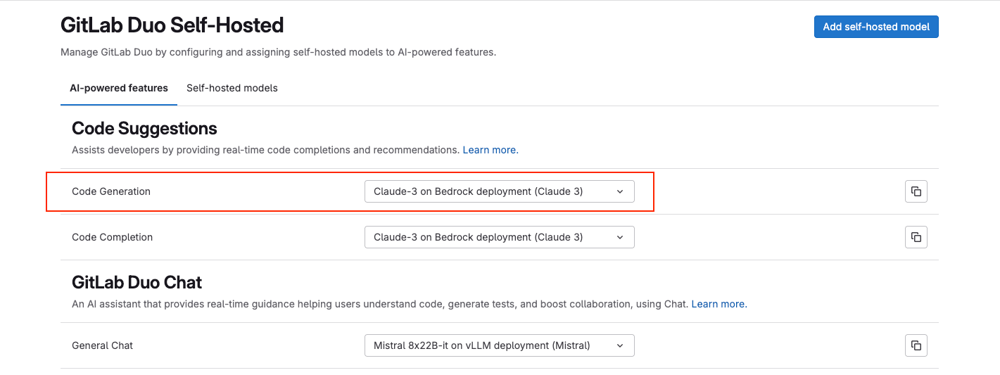
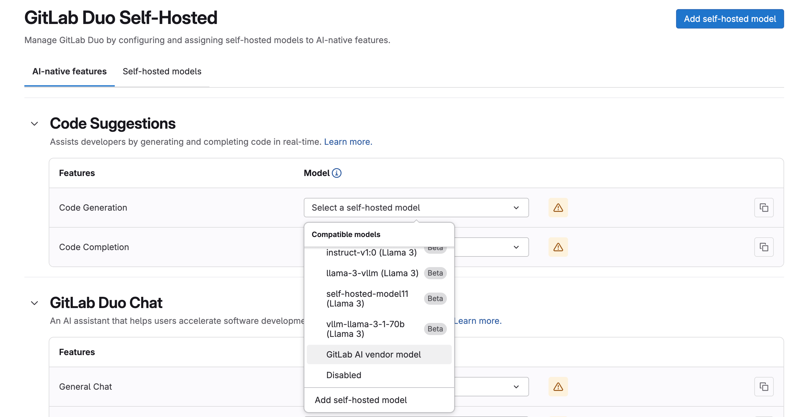
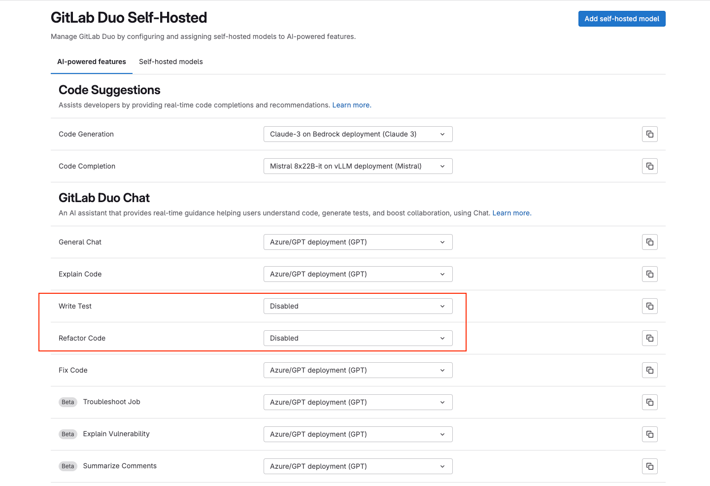



- Tier: Premium, Ultimate
- Add-on: GitLab Duo Enterprise
- Offering: GitLab Self-Managed





- [Introduced](https://gitlab.com/groups/gitlab-org/-/epics/12972) in GitLab 17.1 [with a flag](../feature_flags/_index.md) named `ai_custom_model`. Disabled by default.
- [Enabled on GitLab Self-Managed](https://gitlab.com/groups/gitlab-org/-/epics/15176) in GitLab 17.6.
- Changed to require GitLab Duo add-on in GitLab 17.6 and later.
- Feature flag `ai_custom_model` removed in GitLab 17.8
- Ability to set AI gateway URL using UI [added](https://gitlab.com/gitlab-org/gitlab/-/issues/473143) in GitLab 17.9.
- Generally available in GitLab 17.9.
- Changed to include Premium in GitLab 18.0.



Prerequisites:

- [Upgrade GitLab to version 17.9 or later](../../update/_index.md).
- You must be an administrator.

To configure your GitLab instance to access the available self-hosted models in your infrastructure:

1. [Confirm that a fully self-hosted configuration is appropriate for your use case](_index.md#configuration-types).
1. Configure your GitLab instance to access the AI gateway.
1. In GitLab 18.4 and later, configure your GitLab instance to access the GitLab Duo Agent Platform service.
1. Configure the self-hosted model.
1. Configure the GitLab Duo features to use your self-hosted model.

## Configure access to the local AI gateway

To configure access between your GitLab instance and your local AI gateway:

1. On the left sidebar, at the bottom, select **Admin**.
1. Select **GitLab Duo**.
1. Select **Change configuration**.
1. Under **Local AI Gateway URL**, enter your AI gateway URL.
1. Select **Save changes**.



If your AI gateway URL points to a local network or private IP address (for example, `172.31.x.x` or internal hostnames like `ip-172-xx-xx-xx.region.compute.internal`), GitLab might block the request for security reasons. To allow requests to this address, [add the address to the IP allowlist](../../security/webhooks.md#allow-outbound-requests-to-certain-ip-addresses-and-domains).



## Configure access to the GitLab Duo Agent Platform



- Status: Beta





- [Introduced](https://gitlab.com/groups/gitlab-org/-/epics/19213) in GitLab 18.4, as an [experiment](../../policy/development_stages_support.md#experiment) with a [feature flag](../feature_flags/_index.md) named `self_hosted_agent_platform`. Disabled by default.
- [Changed](https://gitlab.com/gitlab-org/gitlab/-/issues/558083) from experiment to beta in GitLab 18.5.





The availability of this feature is controlled by a feature flag.
For more information, see the history.



To access the Agent Platform service from your GitLab instance:

1. On the left sidebar, at the bottom, select **Admin**.
1. Select **GitLab Duo**.
1. Select **Change configuration**.
1. Under **Local URL for the GitLab Duo Agent Platform service**, enter the URL for the local Agent Platform service.
   - The URL prefix cannot start with `http://` or `https://`.

   - If the URL is not set up with TLS, you must set the `DUO_AGENT_PLATFORM_SERVICE_SECURE` environment variable in your GitLab instance:

     - For Linux package installations, in `gitlab_rails['env']`, set `'DUO_AGENT_PLATFORM_SERVICE_SECURE' => false`
     - For self-compiled installations, in `/etc/default/gitlab` set `export DUO_AGENT_PLATFORM_SERVICE_SECURE=false`
1. Select **Save changes**.

## Add a self-hosted model

You must add a self-hosted model to your GitLab instance to use it with GitLab Duo features.

To add a self-hosted model:

1. On the left sidebar, at the bottom, select **Admin**.
1. Select **GitLab Duo**.
1. Select **Configure GitLab Duo Self-Hosted**.
   - If **Configure GitLab Duo Self-Hosted** is not available, synchronize your
     subscription after purchase:
     1. On the left sidebar, select **Subscription**.
     1. In **Subscription details**, to the right of **Last sync**, select
        synchronize subscription ().
1. Select **Add self-hosted model**.
1. Complete the fields:
   - **Deployment name**: Enter a name to uniquely identify the model deployment, for example, `Mixtral-8x7B-it-v0.1 on GCP`.
   - **Model family**: Select the model family the deployment belongs to. You can select either a supported or compatible model.
   - **Endpoint**: Enter the URL where the model is hosted.
   - **API key**: Optional. Add an API key if you need one to access the model.
   - **Model identifier**: Enter the model identifier based on your deployment method. The model identifier should match the following format:

     | Deployment method | Format | Example |
     |-------------|---------|---------|
     | [vLLM](supported_llm_serving_platforms.md#find-the-model-name)        | `custom_openai/<name of the model served through vLLM>` | `custom_openai/Mixtral-8x7B-Instruct-v0.1` |
     | [Amazon Bedrock](#set-the-model-identifier-for-amazon-bedrock-models) | `bedrock/<model ID of the model>`                       | `bedrock/mistral.mixtral-8x7b-instruct-v0:1` |
     | Azure OpenAI                                                          | `azure/<model ID of the model>`                         | `azure/gpt-35-turbo` |

1. Select **Create self-hosted model**.

### Set the model identifier for Amazon Bedrock models

To set a model identifier for an Amazon Bedrock model:

1. Set your `AWS_REGION`. Ensure you have access to models in that region in your AI gateway Docker configuration.
1. Add the region prefix to the model's inference profile ID for cross-region inferencing.
1. Use the `bedrock/` prefix region as the prefix for the model identifier.

   For example, for the Anthropic Claude 3.5 v2 model in the Tokyo region:

   - The `AWS_REGION` is `ap-northeast-1`.
   - The cross-region inferencing prefix is `apac.`.
   - The model identifier is `bedrock/apac.anthropic.claude-3-5-sonnet-20241022-v2:0`.

Some regions are not supported by cross-region inferencing. For these regions, do not specify a region prefix in the model identifier. For example:

- The `AWS_REGION` is `eu-west-2`.
- The model identifier is `bedrock/anthropic.claude-3-7-sonnet-20250219-v1:0`.

## Configure self-hosted beta models and features



Turning on beta self-hosted models and features also accepts the [GitLab Testing Agreement](https://handbook.gitlab.com/handbook/legal/testing-agreement/).



To enable self-hosted beta models and features:

1. On the left sidebar, at the bottom, select **Admin**.
1. Select **GitLab Duo**.
1. Select **Change configuration**.
1. Under **Self-hosted beta models and features**, select the **Use beta models and features in GitLab Duo Self-Hosted** checkbox.
1. Select **Save changes**.

## Configure GitLab Duo features to use self-hosted models

### View configured features

1. On the left sidebar, at the bottom, select **Admin**.
1. Select **GitLab Duo**.
1. Select **Configure GitLab Duo Self-Hosted**.
   - If **Configure GitLab Duo Self-Hosted** is not available, synchronize your
     subscription after purchase:
     1. On the left sidebar, select **Subscription**.
     1. In **Subscription details**, to the right of **Last sync**, select
        synchronize subscription ().
1. Select the **AI-native features** tab.

### Configure a feature to use a self-hosted model

Configure a GitLab Duo feature and sub-feature to send queries to the self-hosted model:

1. On the left sidebar, at the bottom, select **Admin**.
1. Select **GitLab Duo**.
1. Select **Configure GitLab Duo Self-Hosted**.
1. Select the **AI-native features** tab.
1. For the feature and sub-feature you want to configure, from the dropdown list, choose the self-hosted model you want to use.

   For example, for the code generation, you can select **Claude-3 on Bedrock deployment (Claude 3)**.

   



If you don't specify a model for a GitLab Duo Chat sub-feature, it automatically uses the model configured for **General Chat**.
This ensures all Chat functionality works without requiring individual model configuration for each sub-feature.



### Configure a feature to use a GitLab AI vendor model



- Status: Beta





- [Introduced](https://gitlab.com/groups/gitlab-org/-/epics/17192) in GitLab 18.3, as a [beta](../../policy/development_stages_support.md#beta) with a [feature flag](../feature_flags/_index.md) named `ai_self_hosted_vendored_features`. Disabled by default.





The availability of this feature is controlled by a feature flag.
For more information, see the history.



You can configure a GitLab Duo feature to use the GitLab AI vendor model, even if you use a self-hosted AI gateway and models.

1. On the left sidebar, at the bottom, select **Admin**.
1. Select **GitLab Duo**.
1. Select **Configure GitLab Duo Self-Hosted**.
1. Select the **AI-native features** tab.
1. For the feature and sub-feature you want to configure, from the dropdown list, select **GitLab AI vendor model**.

### Disable GitLab Duo features

GitLab Duo features remain turned on even if you have not chosen a model for a sub-feature.

To disable a GitLab Duo feature or sub-feature:

1. On the left sidebar, at the bottom, select **Admin**.
1. Select **GitLab Duo**.
1. Select **Configure GitLab Duo Self-Hosted**.
1. Select the **AI-native features** tab.
1. For the feature or sub-feature you want to disable, from the dropdown list, select **Disabled**.

### Self-host the GitLab documentation

If your GitLab Duo Self-Hosted setup prevents you from accessing the GitLab documentation at
`docs.gitlab.com`, you can self-host the documentation.
For more information, see [Host the GitLab product documentation](../docs_self_host.md).

## Related topics

- [Supported models](supported_models_and_hardware_requirements.md#supported-models)
- [Compatible models](supported_models_and_hardware_requirements.md#compatible-models)
- [GitLab Duo Self-Hosted configuration types](_index.md#configuration-types)
