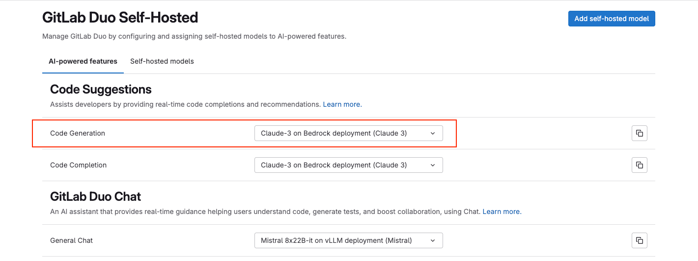
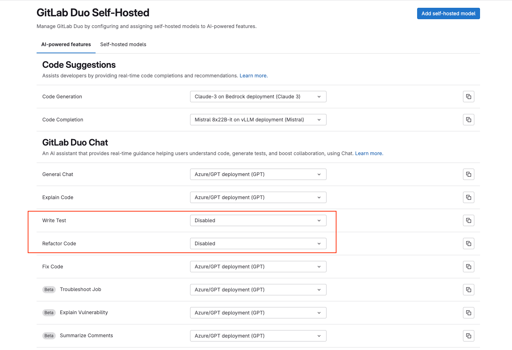



- Tier: Ultimate
- Add-on: GitLab Duo Enterprise
- Offering: GitLab Self-Managed





- [Introduced](https://gitlab.com/groups/gitlab-org/-/epics/12972) in GitLab 17.1 [with a flag](../feature_flags.md) named `ai_custom_model`. Disabled by default.
- [Enabled on GitLab Self-Managed](https://gitlab.com/groups/gitlab-org/-/epics/15176) in GitLab 17.6.
- Changed to require GitLab Duo add-on in GitLab 17.6 and later.
- Feature flag `ai_custom_model` removed in GitLab 17.8
- Ability to set AI gateway URL using UI [added](https://gitlab.com/gitlab-org/gitlab/-/issues/473143) in GitLab 17.9.
- Generally available in GitLab 17.9



Prerequisites:

- [Upgrade GitLab to version 17.9 or later](../../update/_index.md).

To configure your GitLab instance to access the available self-hosted models in your infrastructure:

1. [Confirm that a fully self-hosted configuration is appropriate for your use case](_index.md#decide-on-your-configuration-type).
1. Configure your GitLab instance to access the AI gateway.
1. Configure the self-hosted model.
1. Configure the GitLab Duo features to use your self-hosted model.

## Configure your GitLab instance to access the AI gateway

1. On the left sidebar, at the bottom, select **Admin**.
1. Select **GitLab Duo**.
1. In the **GitLab Duo** section, select **Change configuration**.
1. Under **Local AI Gateway URL**, enter your AI Gateway URL.
1. Select **Save changes**.



If your AI gateway URL points to a local network or private IP address (for example, `172.31.x.x` or internal hostnames like `ip-172-xx-xx-xx.region.compute.internal`), GitLab might block the request for security reasons. To allow requests to this address, [add the address to the IP allowlist](../../security/webhooks.md#allow-outbound-requests-to-certain-ip-addresses-and-domains).



## Configure the self-hosted model

Prerequisites:

- You must be an administrator.
- You must have an Ultimate license.
- You must have a GitLab Duo Enterprise license add-on.

To configure a self-hosted model:

1. On the left sidebar, at the bottom, select **Admin**.
1. Select **GitLab Duo Self-Hosted**.
   - If the **GitLab Duo Self-Hosted** menu item is not available, synchronize your
     subscription after purchase:
     1. On the left sidebar, select **Subscription**.
     1. In **Subscription details**, to the right of **Last sync**, select
        synchronize subscription ().
1. Select **Add self-hosted model**.
1. Complete the fields:
   - **Deployment name**: Enter a name to uniquely identify the model deployment, for example, `Mixtral-8x7B-it-v0.1 on GCP`.
   - **Model family**: Select the model family the deployment belongs to. Only GitLab-approved models
     are in this list.
   - **Endpoint**: Enter the URL where the model is hosted.
     - For more information about configuring the endpoint for models deployed through vLLM, see the [vLLM documentation](supported_llm_serving_platforms.md#endpoint-configuration).
   - **API key**: Optional. Add an API key if you need one to access the model.
   - **Model identifier**: This is a required field. The value of this field is based on your deployment method, and should match the following structure:

     | Deployment method | Format | Example |
     |-------------|---------|---------|
     | vLLM | `custom_openai/<name of the model served through vLLM>` | `custom_openai/Mixtral-8x7B-Instruct-v0.1` |
     | Bedrock | `bedrock/<model ID of the model>` | `bedrock/mistral.mixtral-8x7b-instruct-v0:1` |
     | Azure OpenAI | `azure/<model ID of the model>` | `azure/gpt-35-turbo` |

     For more information about configuring the model identifier for models deployed through vLLM, see the [vLLM documentation](supported_llm_serving_platforms.md#finding-the-model-name).

1. Select **Create self-hosted model**.

## Configure self-hosted beta models and features

Prerequisites:

- You must be an administrator.
- You must have an Ultimate license.
- You must have a GitLab Duo Enterprise license add-on.

To enable self-hosted [beta](../../policy/development_stages_support.md#beta) models and features:

1. On the left sidebar, at the bottom, select **Admin**.
1. Select **GitLab Duo**.
1. In the **GitLab Duo** section, select **Change configuration**.
1. Under **Self-hosted beta models and features**, select the **Use beta models and features in GitLab Duo Self-Hosted** checkbox.
1. Select **Save changes**.



Turning on beta self-hosted models and features also accepts the [GitLab Testing Agreement](https://handbook.gitlab.com/handbook/legal/testing-agreement/).



For more information, see the [list of available beta models](supported_models_and_hardware_requirements.md#experimental-and-beta-models) under evaluation.

## Configure GitLab Duo features to use self-hosted models

Prerequisites:

- You must be an administrator.
- You must have an Ultimate license.
- You must have a GitLab Duo Enterprise license add-on.

### View configured features

1. On the left sidebar, at the bottom, select **Admin**.
1. Select **GitLab Duo Self-Hosted**.
   - If the **GitLab Duo Self-Hosted** menu item is not available, synchronize your
     subscription after purchase:
     1. On the left sidebar, select **Subscription**.
     1. In **Subscription details**, to the right of **Last sync**, select
        synchronize subscription ().
1. Select the **AI-powered features** tab.

### Configure the feature to use a self-hosted model

Configure the GitLab Duo feature and sub-feature to send queries to the configured self-hosted model:

1. On the left sidebar, at the bottom, select **Admin**.
1. Select **GitLab Duo Self-Hosted**.
1. Select the **AI-powered features** tab.
1. For the feature and sub-feature you want to configure, from the dropdown list, choose the self-hosted model you want to use.

   For example, for the code generation sub-feature under GitLab Duo Code Suggestions, you can select **claude sonnet on bedrock (Claude 3)**.

   

#### GitLab Duo Chat sub-feature fall back configuration

When configuring GitLab Duo Chat sub-features, if you do not select a specific self-hosted model for a sub-feature, that sub-feature automatically falls back to using the self-hosted model configured for **General Chat**. This ensures all Chat functionality works even if you have not explicitly configured each sub-feature with its own self-hosted model.

### Self-host the GitLab documentation

If your setup of GitLab Duo Self-Hosted stops you from accessing the GitLab documentation at `docs.gitlab.com`, you can self-host the documentation instead. For more information, see how to [host the GitLab product documentation](../../administration/docs_self_host.md).

### Disable GitLab Duo features

To disable a feature, you must explicitly select **Disabled** when configuring a feature or sub-feature.

- Not choosing a model for a sub-feature is insufficient.
- For Chat sub-features, not selecting a model causes that sub-feature to [fall back to using the model configured for **General Chat**](#gitlab-duo-chat-sub-feature-fall-back-configuration).

To disable a GitLab Duo feature or sub-feature:

1. On the left sidebar, at the bottom, select **Admin**.
1. Select **GitLab Duo Self-Hosted**.
1. Select the **AI-powered features** tab.
1. For the feature or sub-feature you want to disable, from the dropdown list, select **Disabled**.

   For example, to specifically disable the `Write Test` and `Refactor Code` features, select **Disabled**:

   
