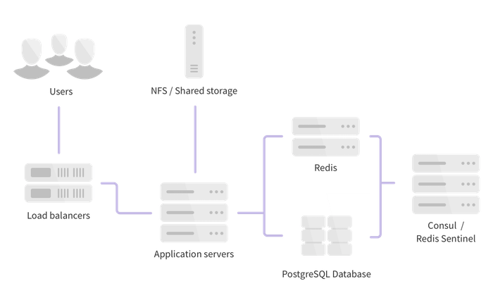
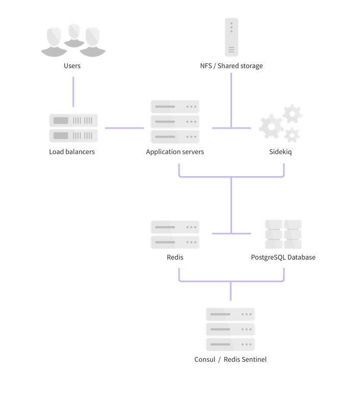
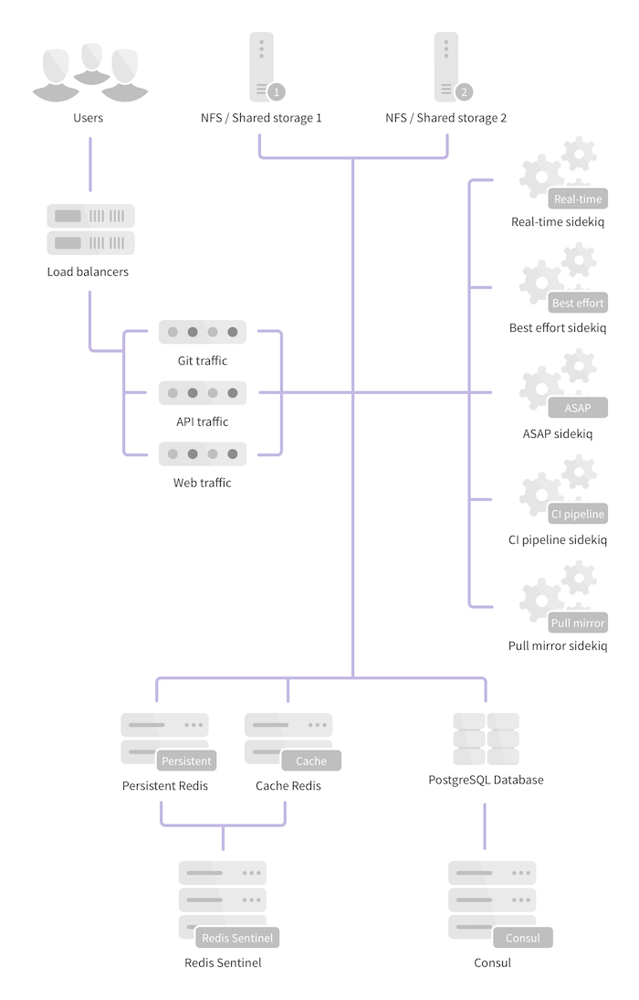

# High Availability

GitLab supports several different types of clustering and high-availability.
The solution you choose will be based on the level of scalability and
availability you require. The easiest solutions are scalable, but not necessarily
highly available.

GitLab provides a service that is usually essential to most organizations: it
enables people to collaborate on code in a timely fashion. Any downtime should
therefore be short and planned. Luckily, GitLab provides a solid setup even on
a single server without special measures. Due to the distributed nature
of Git, developers can still commit code locally even when GitLab is not
available. However, some GitLab features such as the issue tracker and
Continuous Integration are not available when GitLab is down.

**Keep in mind that all Highly Available solutions come with a trade-off between
cost/complexity and uptime**. The more uptime you want, the more complex the
solution. And the more complex the solution, the more work is involved in
setting up and maintaining it. High availability is not free and every HA
solution should balance the costs against the benefits.

# Architecture

There are many options when choosing a highly-available GitLab architecture. We
recommend engaging with GitLab Support to choose the best architecture for your
use-case. This page contains some various options and guidelines based on
experience with GitLab.com and EE on-premises customers.

## GitLab Components

The following components need to be considered for an HA environment. In many
cases components can be combined on the same nodes to reduce complexity.

- Unicorn/Workhorse - Web-requests (UI, API, Git over HTTP)
- Sidekiq - Asynchronous/Background jobs
- PostgreSQL - Database
  - Consul - Database service discovery and health checks/failover
  - PGBouncer - Database pool manager
- Redis - Key/Value store (User sessions, cache, queue for Sidekiq)
  - Sentinel - Redis health check/failover manager

## Architecture Examples

For all examples below, we recommend running Consul and Redis Sentinel on
dedicated nodes. If Consul is running on PostgreSQL nodes or Sentinel on
Redis nodes there is a potential that high resource usage by PostgreSQL or
Redis could prevent communication between the other Consul and Sentinel nodes.
This may lead to the other nodes believing a failure has occurred and automated
failover is necessary. Isolating them away from the services they monitor reduces
the chances of split-brain.

The examples below do not really address high availability of NFS. Some enterprises
have access to NFS appliances that manage availability. This is the best case
scenario. In the future, GitLab may offer a more user-friendly solution to
[GitLab HA Storage](https://gitlab.com/gitlab-org/omnibus-gitlab/issues/2472).

There are many options in between each of these examples. Work with GitLab Support
to understand the best starting point for your workload and adapt from there.

### Horizontal

This is the simplest form of high availability and scaling. It requires the
fewest number of individual servers (virtual or physical) but does have some
trade-offs and limits.

This architecture will work well for many GitLab customers. Larger customers
may begin to notice certain events cause contention/high load - for example,
cloning many large repositories with binary files, high API usage, a large
number of enqueued Sidekiq jobs, etc. If this happens you should consider
moving to a hybrid or fully distributed architecture depending on what is causing
the contention.

- 2 PostgreSQL nodes
- 2 Redis nodes
- 3 Consul/Sentinel nodes
- 2 or more GitLab application nodes (Unicorn, Workhorse, Sidekiq, PGBouncer)
- 1 NFS server/appliance

### Hybrid

In this architecture, certain components are split on dedicated nodes so high
resource usage of one component does not interfere with others. In larger
environments this is a good architecture to consider if you foresee or do have
contention due to certain workloads.

- 2 PostgreSQL nodes
- 2 Redis nodes
- 3 Consul/Sentinel nodes
- 2 or more Sidekiq nodes
- 2 or more Web nodes (Unicorn, Workhorse, PGBouncer)
- 1 or more NFS servers/appliances

### Fully Distributed

This architecture scales to hundreds of thousands of users and projects and is
the basis of the GitLab.com architecture. While this scales well it also comes
with the added complexity of many more nodes to configure, manage and monitor.

- 2 PostgreSQL nodes
- 4 or more Redis nodes (2 separate clusters for persistent and cache data)
- 3 Consul nodes
- 3 Sentinel nodes
- Multiple dedicated Sidekiq nodes (Split into real-time, best effort, ASAP,
  CI Pipeline and Pull Mirror sets)
- 2 or more Git nodes (Git over SSH/Git over HTTP)
- 2 or more API nodes (All requests to `/api`)
- 2 or more Web nodes (All other web requests)
- 2 or more NFS servers/appliances

The following pages outline the steps necessary to configure each component
separately:

1. [Configure the database](database.md)
1. [Configure Redis](redis.md)
  1. [Configure Redis for GitLab source installations](redis_source.md)
1. [Configure NFS](nfs.md)
1. [Configure the GitLab application servers](gitlab.md)
1. [Configure the load balancers](load_balancer.md)

