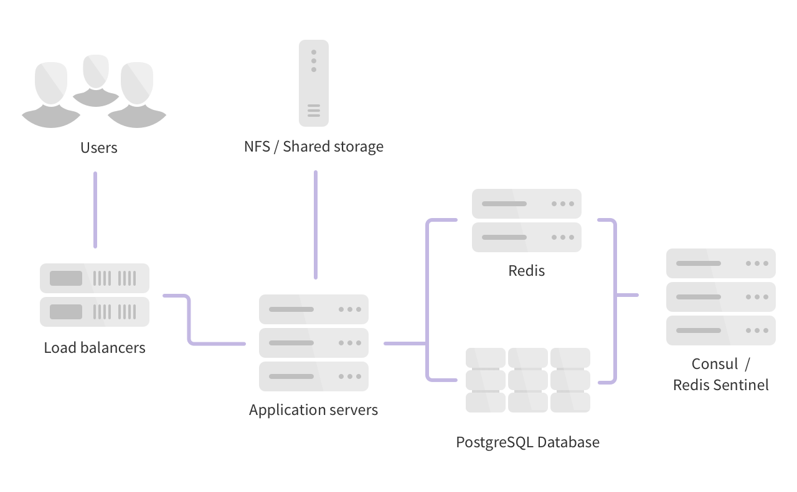
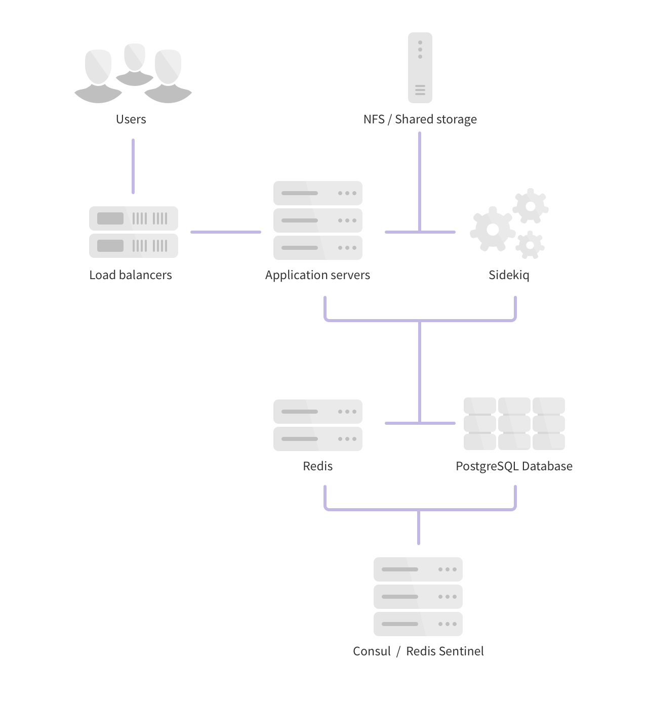
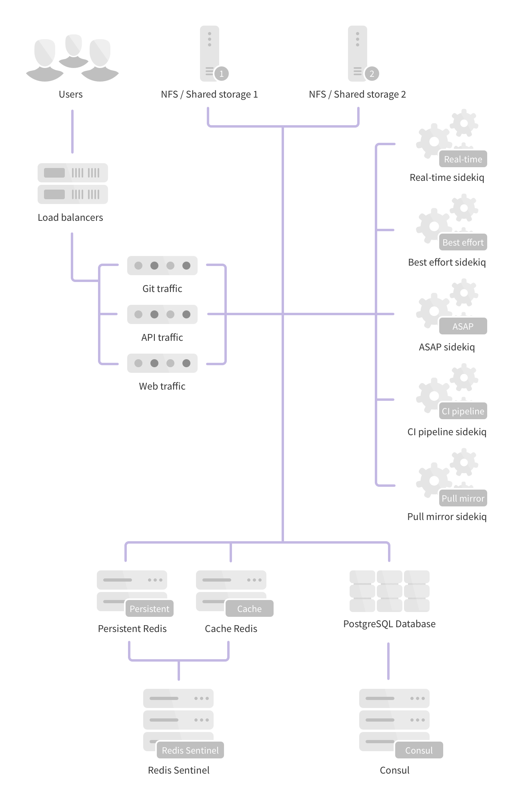

# Scaling and High Availability

GitLab supports several different types of clustering and high-availability.
The solution you choose will be based on the level of scalability and
availability you require. The easiest solutions are scalable, but not necessarily
highly available.

GitLab provides a service that is usually essential to most organizations: it
enables people to collaborate on code in a timely fashion. Any downtime should
therefore be short and planned. Luckily, GitLab provides a solid setup even on
a single server without special measures. Due to the distributed nature
of Git, developers can still commit code locally even when GitLab is not
available. However, some GitLab features such as the issue tracker and
Continuous Integration are not available when GitLab is down.

**Keep in mind that all highly-available solutions come with a trade-off between
cost/complexity and uptime**. The more uptime you want, the more complex the
solution. And the more complex the solution, the more work is involved in
setting up and maintaining it. High availability is not free and every HA
solution should balance the costs against the benefits.

There are many options when choosing a highly-available GitLab architecture. We
recommend engaging with GitLab Support to choose the best architecture for your
use case. This page contains some various options and guidelines based on
experience with GitLab.com and Enterprise Edition on-premises customers.

For detailed insight into how GitLab scales and configures GitLab.com, you can
watch [this 1 hour Q&A](https://www.youtube.com/watch?v=uCU8jdYzpac)
with [John Northrup](https://gitlab.com/northrup), and live questions coming in from some of our customers.

## GitLab Components

The following components need to be considered for a scaled or highly-available
environment. In many cases, components can be combined on the same nodes to reduce
complexity.

- GitLab application nodes (Unicorn / Puma, Workhorse) - Web-requests (UI, API, Git over HTTP)
- Sidekiq - Asynchronous/Background jobs
- PostgreSQL - Database
  - Consul - Database service discovery and health checks/failover
  - PgBouncer - Database pool manager
- Redis - Key/Value store (User sessions, cache, queue for Sidekiq)
  - Sentinel - Redis health check/failover manager
- Gitaly - Provides high-level storage and RPC access to Git repositories
- S3 Object Storage service[^3] and / or NFS storage servers[^4] for entities such as Uploads, Artifacts, LFS Objects, etc...
- Load Balancer[^2] - Main entry point and handles load balancing for the GitLab application nodes.
- Monitor - Prometheus and Grafana monitoring with auto discovery.

## Scalable Architecture Examples

When an organization reaches a certain threshold it will be necessary to scale
the GitLab instance. Still, true high availability may not be necessary. There
are options for scaling GitLab instances relatively easily without incurring the
infrastructure and maintenance costs of full high availability.

### Basic Scaling

This is the simplest form of scaling and will work for the majority of
cases. Backend components such as PostgreSQL, Redis, and storage are offloaded
to their own nodes while the remaining GitLab components all run on 2 or more
application nodes.

This form of scaling also works well in a cloud environment when it is more
cost effective to deploy several small nodes rather than a single
larger one.

- 1 PostgreSQL node
- 1 Redis node
- 1 Gitaly node
- 1 or more Object Storage services[^3] and / or NFS storage server[^4]
- 2 or more GitLab application nodes (Unicorn / Puma, Workhorse, Sidekiq)
- 1 or more Load Balancer nodes[^2]
- 1 Monitoring node (Prometheus, Grafana)

#### Installation Instructions

Complete the following installation steps in order. A link at the end of each
section will bring you back to the Scalable Architecture Examples section so
you can continue with the next step.

1. [Load Balancer(s)](load_balancer.md)[^2]
1. [Consul](consul.md)
1. [PostgreSQL](database.md#postgresql-in-a-scaled-environment) with [PGBouncer](https://docs.gitlab.com/ee/administration/high_availability/pgbouncer.html)
1. [Redis](redis.md#redis-in-a-scaled-environment)
1. [Gitaly](gitaly.md) (recommended) and / or [NFS](nfs.md)[^4]
1. [GitLab application nodes](gitlab.md)
    - With [Object Storage service enabled](../gitaly/index.md#eliminating-nfs-altogether)[^3]
1. [Monitoring node (Prometheus and Grafana)](monitoring_node.md)

### Full Scaling

For very large installations, it might be necessary to further split components
for maximum scalability. In a fully-scaled architecture, the application node
is split into separate Sidekiq and Unicorn/Workhorse nodes. One indication that
this architecture is required is if Sidekiq queues begin to periodically increase
in size, indicating that there is contention or there are not enough resources.

- 1 or more PostgreSQL nodes
- 1 or more Redis nodes
- 1 or more Gitaly storage servers
- 1 or more Object Storage services[^3] and / or NFS storage server[^4]
- 2 or more Sidekiq nodes
- 2 or more GitLab application nodes (Unicorn / Puma, Workhorse, Sidekiq)
- 1 or more Load Balancer nodes[^2]
- 1 Monitoring node (Prometheus, Grafana)

## High Availability Architecture Examples

When organizations require scaling *and* high availability, the following
architectures can be utilized. As the introduction section at the top of this
page mentions, there is a tradeoff between cost/complexity and uptime. Be sure
this complexity is absolutely required before taking the step into full
high availability.

For all examples below, we recommend running Consul and Redis Sentinel on
dedicated nodes. If Consul is running on PostgreSQL nodes or Sentinel on
Redis nodes, there is a potential that high resource usage by PostgreSQL or
Redis could prevent communication between the other Consul and Sentinel nodes.
This may lead to the other nodes believing a failure has occurred and initiating
automated failover. Isolating Redis and Consul from the services they monitor
reduces the chances of a false positive that a failure has occurred.

The examples below do not address high availability of NFS for objects. We recommend a
S3 Object Storage service[^3] is used where possible over NFS but it's still required in
certain cases[^4]. Where NFS is to be used some enterprises have access to NFS appliances
that manage availability and this would be best case scenario.

There are many options in between each of these examples. Work with GitLab Support
to understand the best starting point for your workload and adapt from there.

### Horizontal

This is the simplest form of high availability and scaling. It requires the
fewest number of individual servers (virtual or physical) but does have some
trade-offs and limits.

This architecture will work well for many GitLab customers. Larger customers
may begin to notice certain events cause contention/high load - for example,
cloning many large repositories with binary files, high API usage, a large
number of enqueued Sidekiq jobs, and so on. If this happens, you should consider
moving to a hybrid or fully distributed architecture depending on what is causing
the contention.

- 3 PostgreSQL nodes
- 2 Redis nodes
- 3 Consul/Sentinel nodes
- 2 or more GitLab application nodes (Unicorn / Puma, Workhorse, Sidekiq)
- 1 Gitaly storage servers
- 1 Object Storage service[^3] and / or NFS storage server[^4]
- 1 or more Load Balancer nodes[^2]
- 1 Monitoring node (Prometheus, Grafana)

### Hybrid

In this architecture, certain components are split on dedicated nodes so high
resource usage of one component does not interfere with others. In larger
environments this is a good architecture to consider if you foresee or do have
contention due to certain workloads.

- 3 PostgreSQL nodes
- 1 PgBouncer node
- 2 Redis nodes
- 3 Consul/Sentinel nodes
- 2 or more Sidekiq nodes
- 2 or more GitLab application nodes (Unicorn / Puma, Workhorse, Sidekiq)
- 1 Gitaly storage servers
- 1 Object Storage service[^3] and / or NFS storage server[^4]
- 1 or more Load Balancer nodes[^2]
- 1 Monitoring node (Prometheus, Grafana)

### Fully Distributed

This architecture scales to hundreds of thousands of users and projects and is
the basis of the GitLab.com architecture. While this scales well it also comes
with the added complexity of many more nodes to configure, manage, and monitor.

- 3 PostgreSQL nodes
- 1 or more PgBouncer nodes (with associated internal load balancers)
- 4 or more Redis nodes (2 separate clusters for persistent and cache data)
- 3 Consul nodes
- 3 Sentinel nodes
- Multiple dedicated Sidekiq nodes (Split into real-time, best effort, ASAP,
  CI Pipeline and Pull Mirror sets)
- 2 or more Git nodes (Git over SSH/Git over HTTP)
- 2 or more API nodes (All requests to `/api`)
- 2 or more Web nodes (All other web requests)
- 2 or more Gitaly storage servers
- 1 or more Object Storage services[^3] and / or NFS storage servers[^4]
- 1 or more Load Balancer nodes[^2]
- 1 Monitoring node (Prometheus, Grafana)

## Reference Architecture Examples

The Support and Quality teams build, performance test, and validate Reference
Architectures that support large numbers of users. The specifications below are
a representation of this work so far and may be adjusted in the future based on
additional testing and iteration.

The architectures have been tested with specific coded workloads, and the
throughputs used for testing were calculated based on sample customer data. We
test each endpoint type with the following number of requests per second (RPS)
per 1000 users:

- API: 20 RPS
- Web: 2 RPS
- Git: 2 RPS

Note that your exact needs may be more, depending on your workload. Your
workload is influenced by factors such as - but not limited to - how active your
users are, how much automation you use, mirroring, and repo/change size.

### 5,000 User Configuration

- **Supported Users (approximate):** 50,000
- **Test RPS Rates:** API: 100 RPS, Web: 10 RPS, Git: 10 RPS
- **Status:** Work-in-progress
- **Known Issues:** For the latest list of known performance issues head
[here](https://gitlab.com/gitlab-org/gitlab/issues?label_name%5B%5D=Quality%3Aperformance-issues).

NOTE: **Note:**  This architecture is a work-in-progress of the work so far. The
Quality team will be certifying this environment in late 2019 or early 2020. The specifications
may be adjusted prior to certification based on performance testing.

| Service                     | Nodes | Configuration         | GCP type      |
| ----------------------------|-------|-----------------------|---------------|
| GitLab Rails   - Puma workers on each node set to 90% of available CPUs with 16 threads | 3 | 16 vCPU, 14.4GB Memory | n1-highcpu-16 |
| PostgreSQL                  | 3     | 2 vCPU, 7.5GB Memory  | n1-standard-2 |
| PgBouncer                   | 3     | 2 vCPU, 1.8GB Memory  | n1-highcpu-2  |
| Gitaly   - Gitaly Ruby workers on each node set to 20% of available CPUs | X[^1] . | 8 vCPU, 30GB Memory   | n1-standard-8 |
| Redis Cache + Sentinel   - Cache maxmemory set to 90% of available memory | 3 | 2 vCPU, 7.5GB Memory | n1-standard-2 |
| Redis Persistent + Sentinel | 3     | 2 vCPU, 7.5GB Memory  | n1-standard-2 |
| Sidekiq                     | 4     | 2 vCPU, 7.5GB Memory  | n1-standard-2 |
| Consul                      | 3     | 2 vCPU, 1.8GB Memory  | n1-highcpu-2  |
| NFS Server[^4] .            | 1     | 4 vCPU, 3.6GB Memory  | n1-highcpu-4  |
| S3 Object Storage[^3] .     | -     | -                     | -             |
| Monitoring node             | 1     | 2 vCPU, 1.8GB Memory  | n1-highcpu-2  |
| External load balancing node[^2] . | 1 | 2 vCPU, 1.8GB Memory | n1-highcpu-2 |
| Internal load balancing node[^2] . | 1 | 2 vCPU, 1.8GB Memory | n1-highcpu-2 |

NOTE: **Note:** Memory values are given directly by GCP machine sizes. On different cloud
vendors a best effort like for like can be used.

### 10,000 User Configuration

- **Supported Users (approximate):** 10,000
- **Test RPS Rates:** API: 200 RPS, Web: 20 RPS, Git: 20 RPS
- **Known Issues:** For the latest list of known performance issues head
[here](https://gitlab.com/gitlab-org/gitlab/issues?label_name%5B%5D=Quality%3Aperformance-issues).

| Service                     | Nodes | Configuration         | GCP type      |
| ----------------------------|-------|-----------------------|---------------|
| GitLab Rails   - Puma workers on each node set to 90% of available CPUs with 16 threads | 3 | 32 vCPU, 28.8GB Memory | n1-highcpu-32 |
| PostgreSQL                  | 3     | 4 vCPU, 15GB Memory   | n1-standard-4 |
| PgBouncer                   | 3     | 2 vCPU, 1.8GB Memory  | n1-highcpu-2  |
| Gitaly   - Gitaly Ruby workers on each node set to 20% of available CPUs | X[^1] . | 16 vCPU, 60GB Memory   | n1-standard-16 |
| Redis Cache + Sentinel   - Cache maxmemory set to 90% of available memory | 3 | 4 vCPU, 15GB Memory | n1-standard-4 |
| Redis Persistent + Sentinel | 3     | 4 vCPU, 15GB Memory   | n1-standard-4 |
| Sidekiq                     | 4     | 4 vCPU, 15GB Memory   | n1-standard-4 |
| Consul                      | 3     | 2 vCPU, 1.8GB Memory  | n1-highcpu-2  |
| NFS Server[^4] .            | 1     | 4 vCPU, 3.6GB Memory  | n1-highcpu-4  |
| S3 Object Storage[^3] .     | -     | -                     | -             |
| Monitoring node             | 1     | 4 vCPU, 3.6GB Memory  | n1-highcpu-4  |
| External load balancing node[^2] . | 1 | 2 vCPU, 1.8GB Memory | n1-highcpu-2 |
| Internal load balancing node[^2] . | 1 | 2 vCPU, 1.8GB Memory | n1-highcpu-2 |

NOTE: **Note:** Memory values are given directly by GCP machine sizes. On different cloud
vendors a best effort like for like can be used.

### 25,000 User Configuration

- **Supported Users (approximate):** 25,000
- **Test RPS Rates:** API: 500 RPS, Web: 50 RPS, Git: 50 RPS
- **Known Issues:** For the latest list of known performance issues head
[here](https://gitlab.com/gitlab-org/gitlab/issues?label_name%5B%5D=Quality%3Aperformance-issues).

| Service                     | Nodes | Configuration         | GCP type      |
| ----------------------------|-------|-----------------------|---------------|
| GitLab Rails   - Puma workers on each node set to 90% of available CPUs with 16 threads | 7 | 32 vCPU, 28.8GB Memory | n1-highcpu-32 |
| PostgreSQL                  | 3     | 8 vCPU, 30GB Memory   | n1-standard-8 |
| PgBouncer                   | 3     | 2 vCPU, 1.8GB Memory  | n1-highcpu-2  |
| Gitaly   - Gitaly Ruby workers on each node set to 20% of available CPUs | X[^1] . | 32 vCPU, 120GB Memory | n1-standard-32 |
| Redis Cache + Sentinel   - Cache maxmemory set to 90% of available memory | 3 | 4 vCPU, 15GB Memory | n1-standard-4 |
| Redis Persistent + Sentinel | 3     | 4 vCPU, 15GB Memory   | n1-standard-4 |
| Sidekiq                     | 4     | 4 vCPU, 15GB Memory   | n1-standard-4 |
| Consul                      | 3     | 2 vCPU, 1.8GB Memory  | n1-highcpu-2  |
| NFS Server[^4] .            | 1     | 4 vCPU, 3.6GB Memory  | n1-highcpu-4  |
| S3 Object Storage[^3] .     | -     | -                     | -             |
| Monitoring node             | 1     | 4 vCPU, 3.6GB Memory  | n1-highcpu-4  |
| External load balancing node[^2] . | 1 | 2 vCPU, 1.8GB Memory | n1-highcpu-2 |
| Internal load balancing node[^2] . | 1 | 4 vCPU, 3.6GB Memory | n1-highcpu-4 |

NOTE: **Note:** Memory values are given directly by GCP machine sizes. On different cloud
vendors a best effort like for like can be used.

### 50,000 User Configuration

- **Supported Users (approximate):** 50,000
- **Test RPS Rates:** API: 1000 RPS, Web: 100 RPS, Git: 100 RPS
- **Known Issues:** For the latest list of known performance issues head
[here](https://gitlab.com/gitlab-org/gitlab/issues?label_name%5B%5D=Quality%3Aperformance-issues).

| Service                     | Nodes | Configuration         | GCP type      |
| ----------------------------|-------|-----------------------|---------------|
| GitLab Rails   - Puma workers on each node set to 90% of available CPUs with 16 threads | 15 | 32 vCPU, 28.8GB Memory | n1-highcpu-32 |
| PostgreSQL                  | 3     | 8 vCPU, 30GB Memory   | n1-standard-8 |
| PgBouncer                   | 3     | 2 vCPU, 1.8GB Memory  | n1-highcpu-2  |
| Gitaly   - Gitaly Ruby workers on each node set to 20% of available CPUs | X[^1] . | 64 vCPU, 240GB Memory   | n1-standard-64 |
| Redis Cache + Sentinel   - Cache maxmemory set to 90% of available memory | 3 | 4 vCPU, 15GB Memory | n1-standard-4 |
| Redis Persistent + Sentinel | 3     | 4 vCPU, 15GB Memory   | n1-standard-4 |
| Sidekiq                     | 4     | 4 vCPU, 15GB Memory   | n1-standard-4 |
| Consul                      | 3     | 2 vCPU, 1.8GB Memory  | n1-highcpu-2  |
| NFS Server[^4] .            | 1     | 4 vCPU, 3.6GB Memory  | n1-highcpu-4  |
| S3 Object Storage[^3] .     | -     | -                     | -             |
| Monitoring node             | 1     | 4 vCPU, 3.6GB Memory  | n1-highcpu-4  |
| External load balancing node[^2] . | 1 | 2 vCPU, 1.8GB Memory | n1-highcpu-2 |
| Internal load balancing node[^2] . | 1 | 8 vCPU, 7.2GB Memory | n1-highcpu-8 |

NOTE: **Note:** Memory values are given directly by GCP machine sizes. On different cloud
vendors a best effort like for like can be used.

[^1]: Gitaly node requirements are dependent on customer data, specifically the number of
      projects and their sizes. We recommend 2 nodes as an absolute minimum for HA environments
      and at least 4 nodes should be used when supporting 50,000 or more users.
      We recommend that each Gitaly node should store no more than 5TB of data.
      Additional nodes should be considered in conjunction with a review of expected
      data size and spread based on the recommendations above.

[^2]: Our architectures have been tested and validated with [HAProxy](https://www.haproxy.org/)
      as the load balancer. However other reputable load balancers with similar feature sets
      should also work instead but be aware these aren't validated.

[^3]: For data objects such as LFS, Uploads, Artifacts, etc... We recommend a S3 Object Storage
      where possible over NFS due to better performance and availability. Several types of objects
      are supported for S3 storage - [Job artifacts](../job_artifacts.md#using-object-storage),
      [LFS](../lfs/lfs_administration.md#storing-lfs-objects-in-remote-object-storage),
      [Uploads](../uploads.md#using-object-storage-core-only),
      [Merge Request Diffs](../merge_request_diffs.md#using-object-storage),
      [Packages](../packages/index.md#using-object-storage) (Optional Feature),
      [Dependency Proxy](../packages/dependency_proxy.md#using-object-storage) (Optional Feature).

[^4]: NFS storage server is still required for [GitLab Pages](https://gitlab.com/gitlab-org/gitlab-pages/issues/196)
      and optionally for CI Job Incremental Logging
      ([can be switched to use Redis instead](https://docs.gitlab.com/ee/administration/job_logs.html#new-incremental-logging-architecture)).
