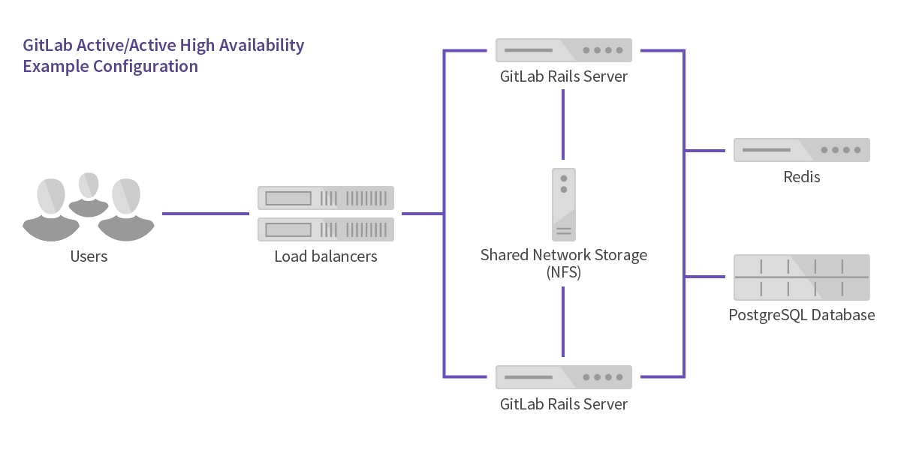
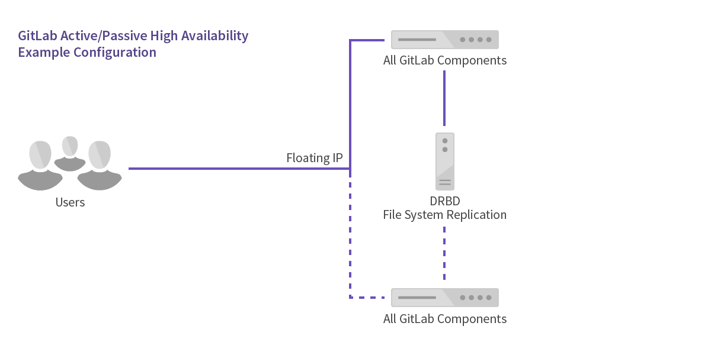

# High Availability

GitLab supports several different types of clustering and high-availability.
The solution you choose will be based on the level of scalability and
availability you require. The easiest solutions are scalable, but not necessarily
highly available.

GitLab provides a service that is usually essential to most organizations: it
enables people to collaborate on code in a timely fashion. Any downtime should
therefore be short and planned. Luckily, GitLab provides a solid setup even on
a single server without special measures. Due to the distributed nature
of Git, developers can still commit code locally even when GitLab is not
available. However, some GitLab features such as the issue tracker and
Continuous Integration are not available when GitLab is down.

**Keep in mind that all Highly Available solutions come with a trade-off between
cost/complexity and uptime**. The more uptime you want, the more complex the
solution. And the more complex the solution, the more work is involved in
setting up and maintaining it. High availability is not free and every HA
solution should balance the costs against the benefits.

## Architecture

There are two kinds of setups:

- active/active
- active/passive

### Active/Active

This architecture scales easily because all application servers handle
user requests simultaneously. The database, Redis, and GitLab application are
all deployed on separate servers. The configuration is **only** highly-available
if the database, Redis and storage are also configured as such.

Follow the steps below to configure an active/active setup:

1. [Configure the database](database.md)
1. [Configure Redis](redis.md)
  1. [Configure Redis for GitLab source installations](redis_source.md)
1. [Configure NFS](nfs.md)
1. [Configure the GitLab application servers](gitlab.md)
1. [Configure the load balancers](load_balancer.md)

### Active/Passive

For pure high-availability/failover with no scaling you can use an
active/passive configuration. This utilizes DRBD (Distributed Replicated
Block Device) to keep all data in sync. DRBD requires a low latency link to
remain in sync. It is not advisable to attempt to run DRBD between data centers
or in different cloud availability zones.

> **Note:** GitLab recommends against choosing this HA method because of the
  complexity of managing DRBD and crafting automatic failover. This is
  *compatible* with GitLab, but not officially *supported*. If you are 
  an EE customer, support will help you with GitLab related problems, but if the
  root cause is identified as DRBD, we will not troubleshoot further.

Components/Servers Required: 2 servers/virtual machines (one active/one passive)

