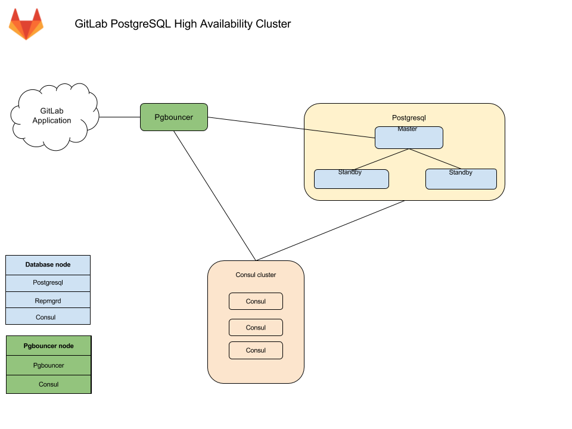

# Configuring a Database for GitLab HA

You can choose to install and manage a database server (PostgreSQL/MySQL)
yourself, or you can use GitLab Omnibus packages to help. GitLab recommends
PostgreSQL. This is the database that will be installed if you use the
Omnibus package to manage your database.

> Important notes:
- This document will focus only on configuration supported with [GitLab Premium](https://about.gitlab.com/products/), using the Omnibus GitLab package.
- If you are a Community Edition or Starter user, consider using a cloud hosted solution.
- This document will not cover installations from source.

>
- If HA setup is not what you were looking for,  see the [database configuration document](http://docs.gitlab.com/omnibus/settings/database.html)
for the Omnibus GitLab packages.

## Configure your own database server

If you're hosting GitLab on a cloud provider, you can optionally use a
managed service for PostgreSQL. For example, AWS offers a managed Relational
Database Service (RDS) that runs PostgreSQL.

If you use a cloud-managed service, or provide your own PostgreSQL:

1. Setup PostgreSQL according to the
   [database requirements document](../../install/requirements.md#database).
1. Set up a `gitlab` username with a password of your choice. The `gitlab` user
   needs privileges to create the `gitlabhq_production` database.
1. Configure the GitLab application servers with the appropriate details.
   This step is covered in [Configuring GitLab for HA](gitlab.md).

## Configure using Omnibus for High Availability

>
Please read this document fully before attempting to configure PostgreSQL HA
for GitLab.

>
This configuration is GA in EE 10.2.

The recommended configuration for a PostgreSQL HA requires:

- A minimum of three database nodes
  - Each node will run the following services:
    - `PostgreSQL` - The database itself
    - `repmgrd` - A service to monitor, and handle failover in case of a failure
    - `Consul` agent - Used for service discovery, to alert other nodes when failover occurs
- A minimum of three `Consul` server nodes
- A minimum of one `pgbouncer` service node

You also need to take into consideration the underlying network topology,
making sure you have redundant connectivity between all Database and GitLab instances,
otherwise the networks will become a single point of failure.

### Architecture



Database nodes run two services besides PostgreSQL
1. Repmgrd -- monitors the cluster and handles failover in case of an issue with the master

   The failover consists of
   * Selecting a new master for the cluster
   * Promoting the new node to master
   * Instructing remaining servers to follow the new master node

   On failure, the old master node is automatically evicted from the cluster, and should be rejoined manually once recovered.

1. Consul -- Monitors the status of each node in the database cluster, and tracks its health in a service definiton on the consul cluster.

Alongside pgbouncer, there is a consul agent that watches the status of the PostgreSQL service. If that status changes, consul runs a script which updates the configuration and reloads pgbouncer

#### Connection flow

Each service in the package comes with a set of [default ports](https://docs.gitlab.com/omnibus/package-information/defaults.html#ports). You may need to make specific firewall rules for the connections listed below:

- Application servers connect to [PgBouncer default port](https://docs.gitlab.com/omnibus/package-information/defaults.html#pgbouncer)
- PgBouncer connects to the primary database servers [PostgreSQL default port](https://docs.gitlab.com/omnibus/package-information/defaults.html#postgresql)
- Repmgr connects to the database servers [PostgreSQL default port](https://docs.gitlab.com/omnibus/package-information/defaults.html#postgresql)
- Postgres secondaries connect to the primary database servers [PostgreSQL default port](https://docs.gitlab.com/omnibus/package-information/defaults.html#postgresql)
- Consul servers and agents connect to each others [Consul default ports](https://docs.gitlab.com/omnibus/package-information/defaults.html#consul)

### Required information

Before proceeding with configuration, you will need to collect all the necessary
information.

#### Network information

PostgreSQL does not listen on any network interface by default. It needs to know
which IP address to listen on in order to be accessible to other services.
Similarly, PostgreSQL access is controlled based on the network source.

This is why you will need:

> IP address of each nodes network interface
- This can be set to `0.0.0.0` to listen on all interfaces. It cannot
  be set to the loopack address `127.0.0.1`

> Network Address
- This can be in subnet (i.e. `192.168.0.0/255.255.255.0`) or CIDR (i.e.
  `192.168.0.0/24`) form.

#### User information

Various services require different configuration to secure
the communication as well as information required for running the service.
Bellow you will find details on each service and the minimum required
information you need to provide.

##### Consul information

When using default setup, minimum configuration requires:

- `CONSUL_USERNAME`. Defaults to `gitlab-consul`
- `CONSUL_DATABASE_PASSWORD`. Password for the database user.
- `CONSUL_PASSWORD_HASH`. This is a hash generated out of consul username/password pair.
Can be generated with:
    ```sh
    sudo gitlab-ctl pg-password-md5 CONSUL_USERNAME
    ```
- `CONSUL_SERVER_NODES`.  The IP addresses or DNS records of the Consul server nodes.

Few notes on the service itself:

- The service runs under a system account, by default `gitlab-consul`.
  - If you are using a different username, you will have to specify it. We
will refer to it with `CONSUL_USERNAME`,
- There will be a database user created with read only access to the repmgr
database
- Passwords will be stored in the following locations:
  - `/etc/gitlab/gitlab.rb`: hashed
  - `/var/opt/gitlab/pgbouncer/pg_auth`: hashed
  - `/var/opt/gitlab/gitlab-consul/.pgpass`: plaintext

##### PostgreSQL information

When configuring PostgreSQL, we will set `max_wal_senders` to one more than
the number of database nodes in the cluster.
This is used to prevent replication from using up all of the
available database connections.

> Note:
- In this document we are assuming 3 database nodes, which makes this configuration:

```
postgresql['max_wal_senders'] = 4
```

As previously mentioned, you'll have to prepare the network subnets that will
be allowed to authenticate with the database.
You'll also need to supply the IP addresses or DNS records of Consul
server nodes.

We will need the following password information for the application's database user:

- `POSTGRESQL_USERNAME`. Defaults to `gitlab`
- `POSTGRESQL_USER_PASSWORD`. The password for the database user
- `POSTGRESQL_PASSWORD_HASH`. This is a hash generated out of the username/password pair.
Can be generated with:
    ```sh
    sudo gitlab-ctl pg-password-md5 POSTGRESQL_USERNAME
    ```

##### Pgbouncer information

When using default setup, minimum configuration requires:

- `PGBOUNCER_USERNAME`. Defaults to `pgbouncer`
- `PGBOUNCER_PASSWORD`. This is a password for pgbouncer service.
- `PGBOUNCER_PASSWORD_HASH`. This is a hash generated out of pgbouncer username/password pair.
Can be generated with:
    ```sh
    sudo gitlab-ctl pg-password-md5 PGBOUNCER_USERNAME
    ```
- `PGBOUNCER_NODE`, is the IP address or a FQDN of the node running Pgbouncer.

Few notes on the service itself:

- The service runs as the same system account as the database
  - In the package, this is by default `gitlab-psql`
- If you use a non-default user account for Pgbouncer service (by default `pgbouncer`), you will have to specify this username. We will refer to this requirement with `PGBOUNCER_USERNAME`.
- The service will have a regular database user account generated for it
  - This defaults to `repmgr`
- Passwords will be stored in the following locations:
  - `/etc/gitlab/gitlab.rb`: hashed, and in plain text
  - `/var/opt/gitlab/pgbouncer/pg_auth`: hashed

##### Repmgr information

When using default setup, you will only have to prepare the network subnets that will
be allowed to authenticate with the service.

Few notes on the service itself:

- The service runs under the same system account as the database
  -  In the package, this is by default `gitlab-psql`
- The service will have a superuser database user account generated for it
  - This defaults to `gitlab_repmgr`

### Installing Omnibus GitLab

First, make sure to [download/install](https://about.gitlab.com/installation)
GitLab Omnibus **on each node**.

Make sure you install the necessary dependencies from step 1,
add GitLab package repository from step 2.
When installing the GitLab package, do not supply `EXTERNAL_URL` value.

### Configuring the Consul nodes

On each Consul node perform the following:

1. Make sure you collect [`CONSUL_SERVER_NODES`](#consul_information) before executing the next step.

1. Edit `/etc/gitlab/gitlab.rb` replacing values noted in the `# START user configuration` section:

    ```ruby
    # Disable all components except Consul
    roles ['consul_role']

    # START user configuration
    # Replace placeholders:
    #
    # Y.Y.Y.Y consul1.gitlab.example.com Z.Z.Z.Z
    # with the addresses gathered for CONSUL_SERVER_NODES
    consul['configuration'] = {
      server: true,
      retry_join: %w(Y.Y.Y.Y consul1.gitlab.example.com Z.Z.Z.Z)
    }

    # Disable auto migrations
    gitlab_rails['auto_migrate'] = false
    #
    # END user configuration
    ```

    > `consul_role` was introduced with GitLab 10.3

1. [Reconfigure GitLab] for the changes to take effect.

#### Consul Checkpoint

Before moving on, make sure Consul is configured correctly. Run the following
command to verify all server nodes are communicating:

```
/opt/gitlab/embedded/bin/consul members
```

The output should be similar to:

```
Node                 Address               Status  Type    Build  Protocol  DC
CONSUL_NODE_ONE      XXX.XXX.XXX.YYY:8301  alive   server  0.9.2  2         gitlab_consul
CONSUL_NODE_TWO      XXX.XXX.XXX.YYY:8301  alive   server  0.9.2  2         gitlab_consul
CONSUL_NODE_THREE    XXX.XXX.XXX.YYY:8301  alive   server  0.9.2  2         gitlab_consul
```

If any of the nodes isn't `alive` or if any of the three nodes are missing,
check the [Troubleshooting section](#troubleshooting) before proceeding.

### Configuring the Database nodes

On each database node perform the following:

1. Make sure you collect [`CONSUL_SERVER_NODES`](#consul_information), [`PGBOUNCER_PASSWORD_HASH`](#pgbouncer_information), [`POSTGRESQL_PASSWORD_HASH`](#postgresql_information), [`Number of db nodes`](#postgresql_information), and [`Network Address`](#network_address) before executing the next step.

1. Edit `/etc/gitlab/gitlab.rb` replacing values noted in the `# START user configuration` section:

    ```ruby
    # Disable all components except PostgreSQL and Repmgr and Consul
    roles ['postgres_role']

    # PostgreSQL configuration
    postgresql['listen_address'] = '0.0.0.0'
    postgresql['hot_standby'] = 'on'
    postgresql['wal_level'] = 'replica'
    postgresql['shared_preload_libraries'] = 'repmgr_funcs'

    # Disable automatic database migrations
    gitlab_rails['auto_migrate'] = false

    # Configure the consul agent
    consul['services'] = %w(postgresql)

    # START user configuration
    # Please set the real values as explained in Required Information section
    #
    # Replace PGBOUNCER_PASSWORD_HASH with a generated md5 value
    postgresql['pgbouncer_user_password'] = 'PGBOUNCER_PASSWORD_HASH'
    # Replace POSTGRESQL_PASSWORD_HASH with a generated md5 value
    postgresql['sql_user_password'] = 'POSTGRESQL_PASSWORD_HASH'
    # Replace X with value of number of db nodes + 1
    postgresql['max_wal_senders'] = X

    # Replace XXX.XXX.XXX.XXX/YY with Network Address
    postgresql['trust_auth_cidr_addresses'] = %w(XXX.XXX.XXX.XXX/YY)
    repmgr['trust_auth_cidr_addresses'] = %w(127.0.0.1/32 XXX.XXX.XXX.XXX/YY)

    # Replace placeholders:
    #
    # Y.Y.Y.Y consul1.gitlab.example.com Z.Z.Z.Z
    # with the addresses gathered for CONSUL_SERVER_NODES
    consul['configuration'] = {
      retry_join: %w(Y.Y.Y.Y consul1.gitlab.example.com Z.Z.Z.Z)
    }
    #
    # END user configuration
    ```

    > `postgres_role` was introduced with GitLab 10.3

1. [Reconfigure GitLab] for the changes to take effect.

> Please note:
- If you want your database to listen on a specific interface, change the config:
`postgresql['listen_address'] = '0.0.0.0'`
- If your Pgbouncer service runs under a different user account,
you also need to specify: `postgresql['pgbouncer_user'] = PGBOUNCER_USERNAME` in
your configuration

#### Database nodes post-configuration

##### Primary node

Select one node as a primary node.

1. Open a database prompt:

    ```sh
    gitlab-psql -d gitlabhq_production
    ```

1. Enable the `pg_trgm` extension:

    ```sh
    CREATE EXTENSION pg_trgm;
    ```

1. Exit the database prompt by typing `\q` and Enter.

1. Verify the cluster is initialized with one node:

     ```sh
     gitlab-ctl repmgr cluster show
     ```

     The output should be similar to the following:

     ```
     Role      | Name     | Upstream | Connection String
     ----------+----------|----------|----------------------------------------
     * master  | HOSTNAME |          | host=HOSTNAME user=gitlab_repmgr dbname=gitlab_repmgr
     ```

1. Note down the hostname/ip in the connection string: `host=HOSTNAME`. We will
   refer to the hostname in the next section as `MASTER_NODE_NAME`. If the value
   is not an IP address, it will need to be a resolvable name (via DNS or
   `/etc/hosts`)


##### Secondary nodes

1. Setup the repmgr standby:

    ```sh
    gitlab-ctl repmgr standby setup MASTER_NODE_NAME
    ```
    Do note that this will remove the existing data on the node. The command
    has a wait time.

    The output should be similar to the following:

    ```console
    # gitlab-ctl repmgr standby setup MASTER_NODE_NAME
    Doing this will delete the entire contents of /var/opt/gitlab/postgresql/data
    If this is not what you want, hit Ctrl-C now to exit
    To skip waiting, rerun with the -w option
    Sleeping for 30 seconds
    Stopping the database
    Removing the data
    Cloning the data
    Starting the database
    Registering the node with the cluster
    ok: run: repmgrd: (pid 19068) 0s
    ```

1. Verify the node now appears in the cluster:

     ```sh
     gitlab-ctl repmgr cluster show
     ```

     The output should be similar to the following:

     ```
     Role      | Name    | Upstream  | Connection String
     ----------+---------|-----------|------------------------------------------------
     * master  | MASTER  |           | host=MASTER_NODE_NAME user=gitlab_repmgr dbname=gitlab_repmgr
       standby | STANDBY | MASTER    | host=STANDBY_HOSTNAME user=gitlab_repmgr dbname=gitlab_repmgr
     ```

Repeat the above steps on all secondary nodes.

#### Database checkpoint

Before moving on, make sure the databases are configured correctly. Run the
following command on the **primary** node to verify that replication is working
properly:

```
gitlab-ctl repmgr cluster show
```

The output should be similar to:

```
Role      | Name         | Upstream     | Connection String
----------+--------------|--------------|--------------------------------------------------------------------
* master  | MASTER  |        | host=MASTER port=5432 user=gitlab_repmgr dbname=gitlab_repmgr
  standby | STANDBY | MASTER | host=STANDBY port=5432 user=gitlab_repmgr dbname=gitlab_repmgr
```

If the 'Role' column for any node says "FAILED", check the
[Troubleshooting section](#troubleshooting) before proceeding.

### Configuring the Pgbouncer node

1. Make sure you collect [`CONSUL_SERVER_NODES`](#consul_information), [`CONSUL_PASSWORD_HASH`](#consul_information), and [`PGBOUNCER_PASSWORD_HASH`](#pgbouncer_information) before executing the next step.

1. Edit `/etc/gitlab/gitlab.rb` replacing values noted in the `# START user configuration` section:

    ```ruby
    # Disable all components except Pgbouncer and Consul agent
    roles ['pgbouncer_role']

    # Configure Pgbouncer
    pgbouncer['admin_users'] = %w(pgbouncer gitlab-consul)

    # Configure Consul agent
    consul['watchers'] = %w(postgresql)

    # START user configuration
    # Please set the real values as explained in Required Information section
    # Replace CONSUL_PASSWORD_HASH with with a generated md5 value
    # Replace PGBOUNCER_PASSWORD_HASH with with a generated md5 value
    pgbouncer['users'] = {
      'gitlab-consul': {
        password: 'CONSUL_PASSWORD_HASH'
      },
      'pgbouncer': {
        password: 'PGBOUNCER_PASSWORD_HASH'
      }
    }
    # Replace placeholders:
    #
    # Y.Y.Y.Y consul1.gitlab.example.com Z.Z.Z.Z
    # with the addresses gathered for CONSUL_SERVER_NODES
    consul['configuration'] = {
      retry_join: %w(Y.Y.Y.Y consul1.gitlab.example.com Z.Z.Z.Z)
    }
    #
    # END user configuration
    ```

    > `pgbouncer_role` was introduced with GitLab 10.3

1. [Reconfigure GitLab] for the changes to take effect.

1. Create a `.pgpass` file so Consule is able to
   reload pgbouncer. Enter the `PGBOUNCER_PASSWORD` twice when asked:

     ```sh
     gitlab-ctl write-pgpass --host 127.0.0.1 --database pgbouncer --user pgbouncer --hostuser gitlab-consul
     ```

#### PGBouncer Checkpoint

1. Ensure the node is talking to the current master:

     ```sh
     gitlab-ctl pgb-console # You will be prompted for PGBOUNCER_PASSWORD
     ```

     If there is an error `psql: ERROR:  Auth failed` after typing in the
     password, ensure you previously generated the MD5 password hashes with the correct
     format. The correct format is to concatenate the password and the username:
     `PASSWORDUSERNAME`. For example, `Sup3rS3cr3tpgbouncer` would be the text
     needed to generate an MD5 password hash for the `pgbouncer` user.

1. Once the console prompt is available, run the following queries:

     ```sh
     show databases ; show clients ;
     ```

     The output should be similar to the following:

     ```
             name         |  host       | port |      database       | force_user | pool_size | reserve_pool | pool_mode | max_connections | current_connections
     ---------------------+-------------+------+---------------------+------------+-----------+--------------+-----------+-----------------+---------------------
      gitlabhq_production | MASTER_HOST | 5432 | gitlabhq_production |            |        20 |            0 |           |               0 |                   0
      pgbouncer           |             | 6432 | pgbouncer           | pgbouncer  |         2 |            0 | statement |               0 |                   0
     (2 rows)

      type |   user    |      database       |  state  |   addr         | port  | local_addr | local_port |    connect_time     |    request_time     |    ptr    | link | remote_pid | tls
     ------+-----------+---------------------+---------+----------------+-------+------------+------------+---------------------+---------------------+-----------+------+------------+-----
      C    | pgbouncer | pgbouncer           | active  | 127.0.0.1      | 56846 | 127.0.0.1  |       6432 | 2017-08-21 18:09:59 | 2017-08-21 18:10:48 | 0x22b3880 |      |          0 |
     (2 rows)
     ```

### Configuring the Application nodes

These will be the nodes running the `gitlab-rails` service. You may have other
attributes set, but the following need to be set.

1. Edit `/etc/gitlab/gitlab.rb`:

    ```ruby
    # Disable PostgreSQL on the application node
    postgresql['enable'] = false

    gitlab_rails['db_host'] = 'PGBOUNCER_NODE'
    gitlab_rails['db_port'] = 6432
    gitlab_rails['db_password'] = 'POSTGRESQL_USER_PASSWORD'
    gitlab_rails['auto_migrate'] = false
    ```

1. [Reconfigure GitLab] for the changes to take effect.

#### Application node post-configuration

Ensure that all migrations ran:

```sh
gitlab-rake gitlab:db:configure
```

> **Note**: If you encounter a `rake aborted!` error stating that PGBouncer is failing to connect to
PostgreSQL it may be that your PGBouncer node's IP address is missing from
PostgreSQL's `trust_auth_cidr_addresses` in `gitlab.rb` on your database nodes. See 
[PGBouncer error `ERROR:  pgbouncer cannot connect to server`](#pgbouncer-error-error-pgbouncer-cannot-connect-to-server) 
in the Troubleshooting section before proceeding.

#### Ensure GitLab is running

At this point, your GitLab instance should be up and running. Verify you are
able to login, and create issues and merge requests.  If you have troubles check
the [Troubleshooting section](#troubleshooting).

### Example configuration

Here we'll show you some fully expanded example configurations.

#### Example recommended setup

This example uses 3 consul servers, 3 postgresql servers, and 1 application node.

We start with all servers on the same 10.6.0.0/16 private network range, they
can connect to each freely other on those addresses.

Here is a list and description of each machine and the assigned IP:

* `10.6.0.11`: Consul 1
* `10.6.0.12`: Consul 2
* `10.6.0.13`: Consul 3
* `10.6.0.21`: PostgreSQL master
* `10.6.0.22`: PostgreSQL secondary
* `10.6.0.23`: PostgreSQL secondary
* `10.6.0.31`: GitLab application

All passwords are set to `toomanysecrets`, please do not use this password or derived hashes.

The external_url for GitLab is `http://gitlab.example.com`

Please note that after the initial configuration, if a failover occurs, the PostgresSQL master will change to one of the available secondaries until it is failed back.

##### Example recommended setup for Consul servers

On each server edit `/etc/gitlab/gitlab.rb`:

```ruby
# Disable all components except Consul
roles ['consul_role']

consul['configuration'] = {
  server: true,
  retry_join: %w(10.6.0.11 10.6.0.12 10.6.0.13)
}
```

[Reconfigure Omnibus GitLab][reconfigure Gitlab] for the changes to take effect.

##### Example recommended setup for PostgreSQL servers

On each server edit `/etc/gitlab/gitlab.rb`:

```ruby
# Disable all components except PostgreSQL and Repmgr and Consul
roles ['postgres_role']

# PostgreSQL configuration
postgresql['listen_address'] = '0.0.0.0'
postgresql['hot_standby'] = 'on'
postgresql['wal_level'] = 'replica'
postgresql['shared_preload_libraries'] = 'repmgr_funcs'

# Disable automatic database migrations
gitlab_rails['auto_migrate'] = false

# Configure the consul agent
consul['services'] = %w(postgresql)

postgresql['pgbouncer_user_password'] = '771a8625958a529132abe6f1a4acb19c'
postgresql['sql_user_password'] = '450409b85a0223a214b5fb1484f34d0f'
postgresql['max_wal_senders'] = 4

postgresql['trust_auth_cidr_addresses'] = %w(10.6.0.0/16)
repmgr['trust_auth_cidr_addresses'] = %w(10.6.0.0/16)

consul['configuration'] = {
  retry_join: %w(10.6.0.11 10.6.0.12 10.6.0.13)
}
```

[Reconfigure Omnibus GitLab][reconfigure Gitlab] for the changes to take effect.

##### Example recommended setup for application server

On the server edit `/etc/gitlab/gitlab.rb`:

```ruby
external_url 'http://gitlab.example.com'

gitlab_rails['db_host'] = '127.0.0.1'
gitlab_rails['db_port'] = 6432
gitlab_rails['db_password'] = 'toomanysecrets'
gitlab_rails['auto_migrate'] = false

postgresql['enable'] = false
pgbouncer['enable'] = true
consul['enable'] = true

# Configure Pgbouncer
pgbouncer['admin_users'] = %w(pgbouncer gitlab-consul)

# Configure Consul agent
consul['watchers'] = %w(postgresql)

pgbouncer['users'] = {
  'gitlab-consul': {
    password: '5e0e3263571e3704ad655076301d6ebe'
  },
  'pgbouncer': {
    password: '771a8625958a529132abe6f1a4acb19c'
  }
}

consul['configuration'] = {
  retry_join: %w(10.6.0.11 10.6.0.12 10.6.0.13)
}
```

[Reconfigure Omnibus GitLab][reconfigure Gitlab] for the changes to take effect.

##### Example recommended setup manual steps

After deploying the configuration follow these steps:

1. On `10.6.0.21`, our primary database

    Enable the `pg_trgm` extension

    ```sh
    gitlab-psql -d gitlabhq_production
    ```

    ```
    CREATE EXTENSION pg_trgm;
    ```

1. On `10.6.0.22`, our first standby database

    Make this node a standby of the primary

    ```sh
    gitlab-ctl repmgr standby setup 10.6.0.21
    ```

1. On `10.6.0.23`, our second standby database

    Make this node a standby of the primary

    ```sh
    gitlab-ctl repmgr standby setup 10.6.0.21
    ```

1. On `10.6.0.31`, our application server

    Set gitlab-consul's pgbouncer password to `toomanysecrets`

    ```sh
    gitlab-ctl write-pgpass --host 127.0.0.1 --database pgbouncer --user pgbouncer --hostuser gitlab-consul
    ```

    Run database migrations

    ```sh
    gitlab-rake gitlab:db:configure
    ```

#### Example minimal setup

This example uses 3 postgresql servers, and 1 application node.

It differs from the [recommended setup](#example_recommended_setup) by moving the consul servers into the same servers we use for PostgreSQL.
The trade-off is between reducing server counts, against the increased operational complexity of needing to deal with postgres [failover](#failover_procedure) and [restore](#restore_procedure) procedures in addition to [consul outage recovery](consul.md#outage_recovery) on the same set of machines.

In this example we start with all servers on the same 10.6.0.0/16 private network range, they can connect to each freely other on those addresses.

Here is a list and description of each machine and the assigned IP:

* `10.6.0.21`: PostgreSQL master
* `10.6.0.22`: PostgreSQL secondary
* `10.6.0.23`: PostgreSQL secondary
* `10.6.0.31`: GitLab application

All passwords are set to `toomanysecrets`, please do not use this password or derived hashes.

The external_url for GitLab is `http://gitlab.example.com`

Please note that after the initial configuration, if a failover occurs, the PostgresSQL master will change to one of the available secondaries until it is failed back.

##### Example minimal configuration for database servers

On each server edit `/etc/gitlab/gitlab.rb`:

```ruby
# Disable all components except PostgreSQL, Repmgr, and Consul
roles ['postgres_role']

# PostgreSQL configuration
postgresql['listen_address'] = '0.0.0.0'
postgresql['hot_standby'] = 'on'
postgresql['wal_level'] = 'replica'
postgresql['shared_preload_libraries'] = 'repmgr_funcs'

# Disable automatic database migrations
gitlab_rails['auto_migrate'] = false

# Configure the consul agent
consul['services'] = %w(postgresql)

postgresql['pgbouncer_user_password'] = '771a8625958a529132abe6f1a4acb19c'
postgresql['sql_user_password'] = '450409b85a0223a214b5fb1484f34d0f'
postgresql['max_wal_senders'] = 4

postgresql['trust_auth_cidr_addresses'] = %w(10.6.0.0/16)
repmgr['trust_auth_cidr_addresses'] = %w(10.6.0.0/16)

consul['configuration'] = {
  server: true,
  retry_join: %w(10.6.0.21 10.6.0.22 10.6.0.23)
}
```

[Reconfigure Omnibus GitLab][reconfigure Gitlab] for the changes to take effect.

##### Example minimal configuration for application server

On the server edit `/etc/gitlab/gitlab.rb`:

```ruby
external_url 'http://gitlab.example.com'

gitlab_rails['db_host'] = '127.0.0.1'
gitlab_rails['db_port'] = 6432
gitlab_rails['db_password'] = 'toomanysecrets'
gitlab_rails['auto_migrate'] = false

postgresql['enable'] = false
pgbouncer['enable'] = true
consul['enable'] = true

# Configure Pgbouncer
pgbouncer['admin_users'] = %w(pgbouncer gitlab-consul)

# Configure Consul agent
consul['watchers'] = %w(postgresql)

pgbouncer['users'] = {
  'gitlab-consul': {
    password: '5e0e3263571e3704ad655076301d6ebe'
  },
  'pgbouncer': {
    password: '771a8625958a529132abe6f1a4acb19c'
  }
}

consul['configuration'] = {
  retry_join: %w(10.6.0.21 10.6.0.22 10.6.0.23)
}
```

[Reconfigure Omnibus GitLab][reconfigure Gitlab] for the changes to take effect.

##### Example minimal setup manual steps

The manual steps for this configuration are the same as for the [example recommended setup](#example_recommended_setup_manual_steps).

### Failover procedure

By default, if the master database fails, `repmgrd` should promote one of the
standby nodes to master automatically, and consul will update pgbouncer with
the new master.

If you need to failover manually, you have two options:

**Shutdown the current master database**

Run:

```sh
gitlab-ctl stop postgresql
```

The automated failover process will see this and failover to one of the
standby nodes.

**Or perform a manual failover**

1. Ensure the old master node is not still active.
1. Login to the server that should become the new master and run:

    ```sh
    gitlab-ctl repmgr standby promote
    ```

1. If there are any other standby servers in the cluster, have them follow
   the new master server:

    ```sh
    gitlab-ctl repmgr standby follow NEW_MASTER
    ```

### Restore procedure

If a node fails, it can be removed from the cluster, or added back as a standby
after it has been restored to service.

- If you want to remove the node from the cluster, on any other node in the
  cluster, run:

    ```sh
    gitlab-ctl repmgr standby unregister --node=X
    ```

    where X is the value of node in `repmgr.conf` on the old server.

    To find this, you can use:

    ```sh
    awk -F = '$1 == "node" { print $2 }' /var/opt/gitlab/postgresql/repmgr.conf
    ```

    It will output something like:

    ```
    959789412
    ```

    Then you will use this id to unregister the node:

    ```sh
    gitlab-ctl repmgr standby unregister --node=959789412
    ```

- To add the node as a standby server:

    ```sh
    gitlab-ctl repmgr standby follow NEW_MASTER
    gitlab-ctl restart repmgrd
    ```

    CAUTION: **Warning:** When the server is brought back online, and before
    you switch it to a standby node, repmgr will report that there are two masters.
    If there are any clients that are still attempting to write to the old master,
    this will cause a split, and the old master will need to be resynced from
    scratch by performing a `standby setup NEW_MASTER`.

### Alternate configurations

#### Database authorization

By default, we give any host on the database network the permission to perform
repmgr operations using PostgreSQL's `trust` method. If you do not want this
level of trust, there are alternatives.

You can trust only the specific nodes that will be database clusters, or you
can require md5 authentication.

##### Trust specific addresses

If you know the IP address, or FQDN of all database and pgbouncer nodes in the
cluster, you can trust only those nodes.

In `/etc/gitlab/gitlab.rb` on all of the database nodes, set
`repmgr['trust_auth_cidr_addresses']` to an array of strings containing all of
the addresses.

If setting to a node's FQDN, they must have a corresponding PTR record in DNS.
If setting to a node's IP address, specify it as `XXX.XXX.XXX.XXX/32`.

For example:

```ruby
repmgr['trust_auth_cidr_addresses'] = %w(192.168.1.44/32 db2.example.com)
```


##### MD5 Authentication

If you are running on an untrusted network, repmgr can use md5 authentication
with a [.pgpass file](https://www.postgresql.org/docs/9.6/static/libpq-pgpass.html)
to authenticate.

You can specify by IP address, FQDN, or by subnet, using the same format as in
the previous section:

1. On the current master node, create a password for the `gitlab` and
   `gitlab_repmgr` user:

    ```sh
    gitlab-psql -d template1
    template1=# \password gitlab_repmgr
    Enter password: ****
    Confirm password: ****
    template1=# \password gitlab
    ```

1. On each database node:

  1. Edit `/etc/gitlab/gitlab.rb`:
    1. Ensure `repmgr['trust_auth_cidr_addresses']` is **not** set
    1. Set `postgresql['md5_auth_cidr_addresses']` to the desired value
    1. Set `postgresql['sql_replication_user'] = 'gitlab_repmgr'`
    1. Reconfigure with `gitlab-ctl reconfigure`
    1. Restart postgresql with `gitlab-ctl restart postgresql`

  1. Create a `.pgpass` file. Enter the `gitlab_repmgr` password twice to
     when asked:

        ```sh
        gitlab-ctl write-pgpass --user gitlab_repmgr --hostuser gitlab-psql --database '*'
        ```

1. On each pgbouncer node, edit `/etc/gitlab/gitlab.rb`:
  1. Ensure `gitlab_rails['db_password']` is set to the plaintext password for
     the `gitlab` database user
  1. [Reconfigure GitLab] for the changes to take effect

### Troubleshooting

#### Consul and PostgreSQL changes not taking effect.

Due to the potential impacts, `gitlab-ctl reconfigure` only reloads Consul and PostgreSQL, it will not restart the services. However, not all changes can be activated by reloading.

To restart either service, run `gitlab-ctl restart SERVICE`

For PostgreSQL, it is usually safe to restart the master node by default. Automatic failover defaults to a 1 minute timeout. Provided the database returns before then, nothing else needs to be done. To be safe, you can stop `repmgrd` on the standby nodes first with `gitlab-ctl stop repmgrd`, then start afterwards with `gitlab-ctl start repmgrd`.

On the consul server nodes, it is important to restart the consul service in a controlled fashion. Read our [consul documentation](consul.md#restarting-the-server-cluster) for instructions on how to restart the service.

#### PGBouncer error `ERROR:  pgbouncer cannot connect to server`

You may get this error when running `gitlab-rake gitlab:db:configure` or you 
may see the error in the PGBouncer log file. 

```
PG::ConnectionBad: ERROR:  pgbouncer cannot connect to server
```

The problem may be that your PGBouncer node's IP address is not included in the
`trust_auth_cidr_addresses` setting in `/etc/gitlab/gitlab.rb` on the database nodes. 

You can confirm that this is the issue by checking the PostgreSQL log on the master
database node. If you see the following error then `trust_auth_cidr_addresses` 
is the problem.

```
2018-03-29_13:59:12.11776 FATAL:  no pg_hba.conf entry for host "123.123.123.123", user "pgbouncer", database "gitlabhq_production", SSL off
```

To fix the problem, add the IP address to `/etc/gitlab/gitlab.rb`. 

```
postgresql['trust_auth_cidr_addresses'] = %w(123.123.123.123/32 <other_cidrs>)
```

[Reconfigure GitLab] for the changes to take effect.

#### Issues with other components

If you're running into an issue with a component not outlined here, be sure to check the troubleshooting section of their specific documentation page.

- [Consul](consul.md#troubleshooting)
- [PostgreSQL](http://docs.gitlab.com/omnibus/settings/database.html#troubleshooting)
- [GitLab application](gitlab.md#troubleshooting)

## Configure using Omnibus

**Note**: We recommend that you follow the instructions here for a full [PostgreSQL cluster](#configure_using_omnibus_for_high_availability).
If you are reading this section due to an old bookmark, you can find that old documentation [in the repository](https://gitlab.com/gitlab-org/gitlab-ce/blob/v10.1.4/doc/administration/high_availability/database.md#configure-using-omnibus).

---

Read more on high-availability configuration:

1. [Configure Redis](redis.md)
1. [Configure NFS](nfs.md)
1. [Configure the GitLab application servers](gitlab.md)
1. [Configure the load balancers](load_balancer.md)
1. [Manage the bundled Consul cluster](consul.md)

[reconfigure GitLab]: ../restart_gitlab.md#omnibus-gitlab-reconfigure
