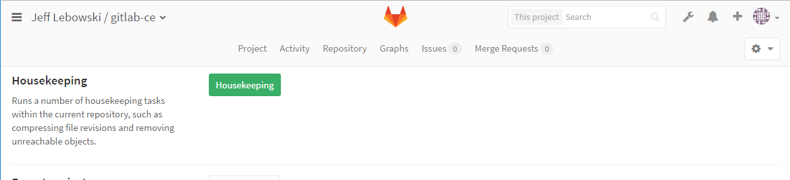

# Housekeeping

> [Introduced](https://gitlab.com/gitlab-org/gitlab-foss/issues/3041) in GitLab 8.4.

## Automatic housekeeping

GitLab automatically runs `git gc` and `git repack` on repositories
after Git pushes. You can change how often this happens or turn it off in
**Admin area > Settings > Repository** (`/admin/application_settings/repository`).

## Manual housekeeping

The housekeeping function runs `repack` or `gc` depending on the
**Housekeeping** settings configured in **Admin area > Settings > Repository**.

For example in the following scenario a `git repack -d` will be executed:

- Project: pushes since gc counter (`pushes_since_gc`) = `10`
- Git GC period = `200`
- Full repack period = `50`

When the `pushes_since_gc` value is 50 a `repack -A -d --pack-kept-objects` will run, similarly when
the `pushes_since_gc` value is 200 a `git gc` will be run.

- `git gc` ([man page](https://mirrors.edge.kernel.org/pub/software/scm/git/docs/git-gc.html)) runs a number of housekeeping tasks,
  such as compressing filerevisions (to reduce disk space and increase performance)
  and removing unreachable objects which may have been created from prior invocations of
  `git add`.
- `git repack` ([man page](https://mirrors.edge.kernel.org/pub/software/scm/git/docs/git-repack.html)) re-organize existing packs into a single, more efficient pack.

You can find this option under your project's **Settings > General > Advanced**.

