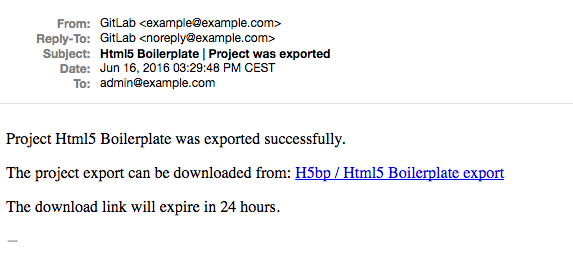

# Project import/export

Existing projects running on any GitLab instance or GitLab.com can be exported
with all its related data and be moved to a new GitLab instance.

>**Note:** 
  - This feature was [introduced][ce-3050] in GitLab 8.9
  - Importing will not be possible if the import instance version is lower
  than that of the exporter.
 
## Exported contents
 
- The following items will be exported:
  - Project and wiki repositories
  - Project uploads
  - Project configuration including web hooks and services
  - Issues with comments, merge requests with diffs and comments, labels, milestones, snippets,
   and other project entities
- The following items will NOT be exported:
  - Build traces and artifacts
  - LFS objects

## Exporting a project and its data 

1. Go to the project settings page and find the Export button

    

1. Once the export is generated, you should receive an e-mail with a link to download the file

    

1. You can come back to project settings and download the file from there, or delete it so it
can be generated again

    

## Importing the project

1. The new GitLab project import feature is at the far right of the import options on New Project

    

1. After choosing a namespace or path, you can then select the file exported previously

    

1. Click on Import to begin importing  and you will see your newly imported project page soon

[ce-3050]: https://gitlab.com/gitlab-org/gitlab-ce/issues/3050

## Advanced

> The GitLab Import/Export version can be checked by using:

```bash
cd /home/git/gitlab
sudo -u git -H bundle exec rake gitlab:import_export:version
```

> The current list of DB tables that will get exported can be listed by using:

```bash
cd /home/git/gitlab
sudo -u git -H bundle exec rake gitlab:import_export:data RAILS_ENV=production
```