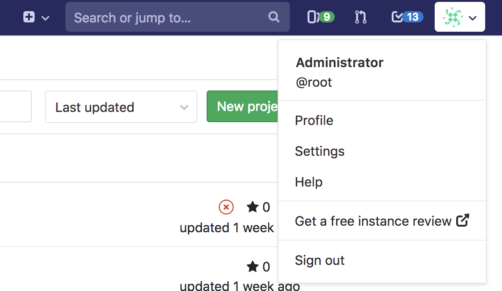

# Instance Review **(FREE SELF)**

> [Introduced](https://gitlab.com/gitlab-org/gitlab-foss/-/merge_requests/6995) in [GitLab Free](https://about.gitlab.com/pricing/) 11.3.

If you run a medium-sized self-managed instance (50+ users) of a free version of GitLab,
[either Community Edition or unlicensed Enterprise Edition](https://about.gitlab.com/install/ce-or-ee/),
you qualify for a free Instance Review.

1. Sign in as a user with administrator [permissions](../user/permissions.md).
1. In the top menu, click your user icon, and select
   **Get a free instance review**:

   

1. GitLab redirects you to a form with prefilled data obtained from your instance.
1. Click **Submit** to see the initial report.

<!-- vale gitlab.FutureTense = NO -->

You will be contacted by a GitLab team member for further review, to provide suggestions
intended to help you improve your usage of GitLab.

<!-- vale gitlab.FutureTense = YES -->
