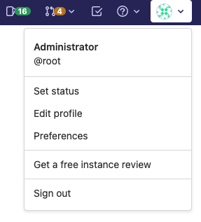

DETAILS:
**Tier:** Free, Premium, Ultimate
**Offering:** GitLab Self-Managed

If you run a GitLab Self-Managed instance with 50 or more users on the Free tier
([either Community Edition or unlicensed Enterprise Edition](https://about.gitlab.com/install/ce-or-ee/)),
you can request a free instance review.

<!-- vale gitlab_base.FutureTense = NO -->

After you submit the request, a GitLab team member will review your instance
details and contact you with suggestions to improve your use of GitLab.

<!-- vale gitlab_base.FutureTense = YES -->

To request an instance review:

1. Sign in as an administrator.
1. On the left sidebar, select your avatar.
1. Select **Get a free instance review**.

   

1. On the instance review page, enter your contact details.
1. Select **Request Instance Review**.
