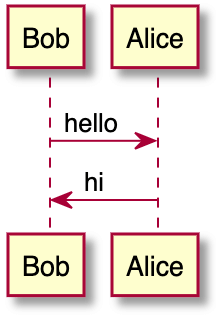

DETAILS:
**Tier:** Free, Premium, Ultimate
**Offering:** GitLab Self-Managed

With the [Kroki](https://kroki.io) integration,
you can create diagrams-as-code within AsciiDoc, Markdown, reStructuredText, and Textile.

## Enable Kroki in GitLab

You need to enable Kroki integration from Settings under **Admin** area.
To do that, sign in with an administrator account and follow these steps:

1. On the left sidebar, at the bottom, select **Admin**.
1. Go to **Settings > General**.
1. Expand the **Kroki** section.
1. Select **Enable Kroki** checkbox.
1. Enter the **Kroki URL**, for example, `https://kroki.io`.

## Kroki server

When you enable Kroki, GitLab sends diagrams to an instance of Kroki to display them as images.
You can use the free public cloud instance `https://kroki.io` or you can [install Kroki](https://docs.kroki.io/kroki/setup/install/)
on your own infrastructure.
After you've installed Kroki, make sure to update the **Kroki URL** in the settings to point to your instance.

NOTE:
Kroki diagrams are not stored on GitLab, so standard GitLab access controls and other user permission restrictions are not in force.

### Docker

With Docker, run a container like this:

```shell
docker run -d --name kroki -p 8080:8000 yuzutech/kroki
```

The **Kroki URL** is the hostname of the server running the container.

The [`yuzutech/kroki`](https://hub.docker.com/r/yuzutech/kroki) Docker image supports most diagram
types out of the box. For a complete list, see the [Kroki installation docs](https://docs.kroki.io/kroki/setup/install/#_the_kroki_container).

Supported diagram types include:

<!-- vale gitlab_base.Spelling = NO -->

- [Bytefield](https://bytefield-svg.deepsymmetry.org/bytefield-svg/intro.html)
- [D2](https://d2lang.com/tour/intro/)
- [DBML](https://dbml.dbdiagram.io/home/)
- [Ditaa](https://ditaa.sourceforge.net)
- [Erd](https://github.com/BurntSushi/erd)
- [GraphViz](https://www.graphviz.org/)
- [Nomnoml](https://github.com/skanaar/nomnoml)
- [PlantUML](https://github.com/plantuml/plantuml)
  - [C4 model](https://github.com/RicardoNiepel/C4-PlantUML) (with PlantUML)
- [Structurizr](https://structurizr.com/) (great for C4 Model diagrams)
- [Svgbob](https://github.com/ivanceras/svgbob)
- [UMlet](https://github.com/umlet/umlet)
- [Vega](https://github.com/vega/vega)
- [Vega-Lite](https://github.com/vega/vega-lite)
- [WaveDrom](https://wavedrom.com/)

<!-- vale gitlab_base.Spelling = YES -->

If you want to use additional diagram libraries,
read the [Kroki installation](https://docs.kroki.io/kroki/setup/install/#_images) to learn how to start Kroki companion containers.

## Create diagrams

With Kroki integration enabled and configured, you can start adding diagrams to
your AsciiDoc or Markdown documentation using delimited blocks:

- **Markdown**

  ````markdown
  ```plantuml
  Bob -> Alice : hello
  Alice -> Bob : hi
  ```
  ````

- **AsciiDoc**

  ```plaintext
  [plantuml]
  ....
  Bob->Alice : hello
  Alice -> Bob : hi
  ....
  ```

- **reStructuredText**

  ```plaintext
  .. code-block:: plantuml

    Bob->Alice : hello
    Alice -> Bob : hi
  ```

- **Textile**

  ```plaintext
  bc[plantuml]. Bob->Alice : hello
  Alice -> Bob : hi
  ```

The above blocks are converted to an HTML image tag with source pointing to the
Kroki instance. If the Kroki server is correctly configured, this should
render a nice diagram instead of the block:



Kroki supports more than a dozen diagram libraries. Here's a few examples for AsciiDoc:

**GraphViz**

```plaintext
[graphviz]
....
digraph finite_state_machine {
  rankdir=LR;
  node [shape = doublecircle]; LR_0 LR_3 LR_4 LR_8;
  node [shape = circle];
  LR_0 -> LR_2 [ label = "SS(B)" ];
  LR_0 -> LR_1 [ label = "SS(S)" ];
  LR_1 -> LR_3 [ label = "S($end)" ];
  LR_2 -> LR_6 [ label = "SS(b)" ];
  LR_2 -> LR_5 [ label = "SS(a)" ];
  LR_2 -> LR_4 [ label = "S(A)" ];
  LR_5 -> LR_7 [ label = "S(b)" ];
  LR_5 -> LR_5 [ label = "S(a)" ];
  LR_6 -> LR_6 [ label = "S(b)" ];
  LR_6 -> LR_5 [ label = "S(a)" ];
  LR_7 -> LR_8 [ label = "S(b)" ];
  LR_7 -> LR_5 [ label = "S(a)" ];
  LR_8 -> LR_6 [ label = "S(b)" ];
  LR_8 -> LR_5 [ label = "S(a)" ];
}
....
```


**C4 (based on PlantUML)**

```plaintext
[c4plantuml]
....
@startuml
!include C4_Context.puml

title System Context diagram for Internet Banking System

Person(customer, "Banking Customer", "A customer of the bank, with personal bank accounts.")
System(banking_system, "Internet Banking System", "Allows customers to check their accounts.")

System_Ext(mail_system, "E-mail system", "The internal Microsoft Exchange e-mail system.")
System_Ext(mainframe, "Mainframe Banking System", "Stores all of the core banking information.")

Rel(customer, banking_system, "Uses")
Rel_Back(customer, mail_system, "Sends e-mails to")
Rel_Neighbor(banking_system, mail_system, "Sends e-mails", "SMTP")
Rel(banking_system, mainframe, "Uses")
@enduml
....
```


<!-- vale gitlab_base.Spelling = NO -->

**Nomnoml**

<!-- vale gitlab_base.Spelling = YES -->

```plaintext
[nomnoml]
....
[Pirate|eyeCount: Int|raid();pillage()|
  [beard]--[parrot]
  [beard]-:>[foul mouth]
]

[<abstract>Marauder]<:--[Pirate]
[Pirate]- 0..7[mischief]
[jollyness]->[Pirate]
[jollyness]->[rum]
[jollyness]->[singing]
[Pirate]-> *[rum|tastiness: Int|swig()]
[Pirate]->[singing]
[singing]<->[rum]
....
```


