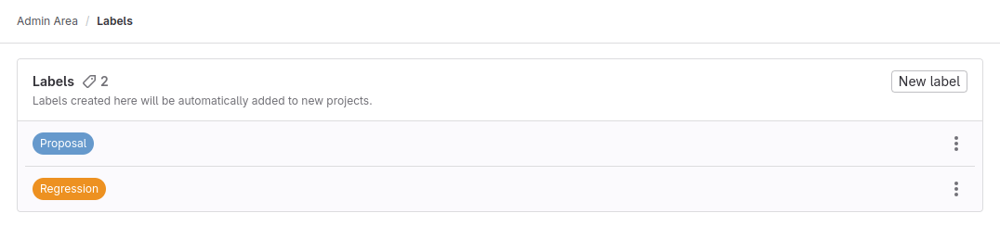

DETAILS:
**Tier:** Free, Premium, Ultimate
**Offering:** GitLab Self-Managed

To manage labels for the GitLab instance:

1. On the left sidebar, at the bottom, select **Admin**.
1. Select **Labels**.

For more details on how to manage labels, see [Labels](../user/project/labels.md).

Labels created in the **Admin** area are automatically added to new projects.
They are not available to new groups.
Updating or adding labels in the **Admin** area does not modify labels in existing projects.

<!-- ## Troubleshooting

Include any troubleshooting steps that you can foresee. If you know beforehand what issues
one might have when setting this up, or when something is changed, or on upgrading, it's
important to describe those, too. Think of things that may go wrong and include them here.
This is important to minimize requests for support, and to avoid doc comments with
questions that you know someone might ask.

Each scenario can be a third-level heading, for example `### Getting error message X`.
If you have none to add when creating a doc, leave this section in place
but commented out to help encourage others to add to it in the future. -->
