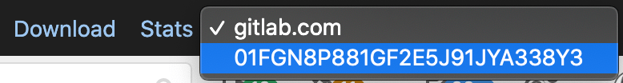

DETAILS:
**Tier:** Free, Premium, Ultimate
**Offering:** GitLab Self-Managed

GitLab instances log a unique request tracking ID (known as the
"correlation ID") for most requests. Each individual request to GitLab gets
its own correlation ID, which then gets logged in each GitLab component's logs for that
request. This makes it easier to trace behavior in a
distributed system. Without this ID it can be difficult or
impossible to match correlating log entries.

## Identify the correlation ID for a request

The correlation ID is logged in structured logs under the key `correlation_id`
and in all response headers GitLab sends under the header `x-request-id`.
You can find your correlation ID by searching in either place.

### Getting the correlation ID in your browser

You can use your browser's developer tools to monitor and inspect network
activity with the site that you're visiting. See the links below for network monitoring
documentation for some popular browsers.

- [Network Monitor - Firefox Developer Tools](https://firefox-source-docs.mozilla.org/devtools-user/network_monitor/index.html)
- [Inspect Network Activity In Chrome DevTools](https://developer.chrome.com/docs/devtools/network/)
- [Safari Web Development Tools](https://developer.apple.com/safari/tools/)
- [Microsoft Edge Network panel](https://learn.microsoft.com/en-us/microsoft-edge/devtools-guide-chromium/network/)

To locate a relevant request and view its correlation ID:

1. Enable persistent logging in your network monitor. Some actions in GitLab redirect you quickly after you submit a form, so this helps capture all relevant activity.
1. To help isolate the requests you are looking for, you can filter for `document` requests.
1. Select the request of interest to view further detail.
1. Go to the **Headers** section and look for **Response Headers**. There you should find an `x-request-id` header with a
   value that was randomly generated by GitLab for the request.

See the following example:


### Getting the correlation ID from your logs

Another approach to finding the correct correlation ID is to search or watch
your logs and find the `correlation_id` value for the log entry that you're
watching for.

For example, let's say that you want learn what's happening or breaking when
you reproduce an action in GitLab. You could tail the GitLab logs, filtering
to requests by your user, and then watch the requests until you see what you're
interested in.

### Getting the correlation ID from curl

If you're using `curl` then you can use the verbose option to show request and response headers, as well as other debug information.

```shell
➜  ~ curl --verbose "https://gitlab.example.com/api/v4/projects"
# look for a line that looks like this
< x-request-id: 4rAMkV3gof4
```

#### Using jq

This example uses [jq](https://stedolan.github.io/jq/) to filter results and
display values we most likely care about.

```shell
sudo gitlab-ctl tail gitlab-rails/production_json.log | jq 'select(.username == "bob") | "User: \(.username), \(.method) \(.path), \(.controller)#\(.action), ID: \(.correlation_id)"'
```

```plaintext
"User: bob, GET /root/linux, ProjectsController#show, ID: U7k7fh6NpW3"
"User: bob, GET /root/linux/commits/master/signatures, Projects::CommitsController#signatures, ID: XPIHpctzEg1"
"User: bob, GET /root/linux/blob/master/README, Projects::BlobController#show, ID: LOt9hgi1TV4"
```

#### Using grep

This example uses only `grep` and `tr`, which are more likely to be installed than `jq`.

```shell
sudo gitlab-ctl tail gitlab-rails/production_json.log | grep '"username":"bob"' | tr ',' '\n' | egrep 'method|path|correlation_id'
```

```plaintext
{"method":"GET"
"path":"/root/linux"
"username":"bob"
"correlation_id":"U7k7fh6NpW3"}
{"method":"GET"
"path":"/root/linux/commits/master/signatures"
"username":"bob"
"correlation_id":"XPIHpctzEg1"}
{"method":"GET"
"path":"/root/linux/blob/master/README"
"username":"bob"
"correlation_id":"LOt9hgi1TV4"}
```

## Searching your logs for the correlation ID

When you have the correlation ID you can start searching for relevant log
entries. You can filter the lines by the correlation ID itself.
Combining a `find` and `grep` should be sufficient to find the entries you are looking for.

```shell
# find <gitlab log directory> -type f -mtime -0 exec grep '<correlation ID>' '{}' '+'
find /var/log/gitlab -type f -mtime 0 -exec grep 'LOt9hgi1TV4' '{}' '+'
```

```plaintext
/var/log/gitlab/gitlab-workhorse/current:{"correlation_id":"LOt9hgi1TV4","duration_ms":2478,"host":"gitlab.domain.tld","level":"info","method":"GET","msg":"access","proto":"HTTP/1.1","referrer":"https://gitlab.domain.tld/root/linux","remote_addr":"68.0.116.160:0","remote_ip":"[filtered]","status":200,"system":"http","time":"2019-09-17T22:17:19Z","uri":"/root/linux/blob/master/README?format=json\u0026viewer=rich","user_agent":"Mozilla/5.0 (Mac) Gecko Firefox/69.0","written_bytes":1743}
/var/log/gitlab/gitaly/current:{"correlation_id":"LOt9hgi1TV4","grpc.code":"OK","grpc.meta.auth_version":"v2","grpc.meta.client_name":"gitlab-web","grpc.method":"FindCommits","grpc.request.deadline":"2019-09-17T22:17:47Z","grpc.request.fullMethod":"/gitaly.CommitService/FindCommits","grpc.request.glProjectPath":"root/linux","grpc.request.glRepository":"project-1","grpc.request.repoPath":"@hashed/6b/86/6b86b273ff34fce19d6b804eff5a3f5747ada4eaa22f1d49c01e52ddb7875b4b.git","grpc.request.repoStorage":"default","grpc.request.topLevelGroup":"@hashed","grpc.service":"gitaly.CommitService","grpc.start_time":"2019-09-17T22:17:17Z","grpc.time_ms":2319.161,"level":"info","msg":"finished streaming call with code OK","peer.address":"@","span.kind":"server","system":"grpc","time":"2019-09-17T22:17:19Z"}
/var/log/gitlab/gitlab-rails/production_json.log:{"method":"GET","path":"/root/linux/blob/master/README","format":"json","controller":"Projects::BlobController","action":"show","status":200,"duration":2448.77,"view":0.49,"db":21.63,"time":"2019-09-17T22:17:19.800Z","params":[{"key":"viewer","value":"rich"},{"key":"namespace_id","value":"root"},{"key":"project_id","value":"linux"},{"key":"id","value":"master/README"}],"remote_ip":"[filtered]","user_id":2,"username":"bob","ua":"Mozilla/5.0 (Mac) Gecko Firefox/69.0","queue_duration":3.38,"gitaly_calls":1,"gitaly_duration":0.77,"rugged_calls":4,"rugged_duration_ms":28.74,"correlation_id":"LOt9hgi1TV4"}
```

### Searching in distributed architectures

If you have done some horizontal scaling in your GitLab infrastructure, then
you must search across _all_ of your GitLab nodes. You can do this with
some sort of log aggregation software like Loki, ELK, Splunk, or others.

You can use a tool like Ansible or PSSH (parallel SSH) that can execute identical commands across your servers in
parallel, or craft your own solution.

### Viewing the request in the Performance Bar

You can use the [performance bar](../monitoring/performance/performance_bar.md) to view interesting data including calls made to SQL and Gitaly.

To view the data, the correlation ID of the request must match the same session as the user
viewing the performance bar. For API requests, this means that you must perform the request
using the session cookie of the authenticated user.

For example, if you want to view the database queries executed for the following API endpoint:

```shell
https://gitlab.com/api/v4/groups/2564205/projects?with_security_reports=true&page=1&per_page=1
```

First, enable the **Developer Tools** panel. See [Getting the correlation ID in your browser](#getting-the-correlation-id-in-your-browser) for details on how to do this.

After developer tools have been enabled, obtain a session cookie as follows:

1. Visit <https://gitlab.com> while logged in.
1. Optional. Select **Fetch/XHR** request filter in the **Developer Tools** panel. This step is described for Google Chrome developer tools and is not strictly necessary, it just makes it easier to find the correct request.
1. Select the `results?request_id=<some-request-id>` request on the left hand side.
1. The session cookie is displayed under the `Request Headers` section of the `Headers` panel. Right-click on the cookie value and select `Copy value`.


You have the value of the session cookie copied to your clipboard, for example:

```shell
experimentation_subject_id=<subject-id>; _gitlab_session=<session-id>; event_filter=all; visitor_id=<visitor-id>; perf_bar_enabled=true; sidebar_collapsed=true; diff_view=inline; sast_entry_point_dismissed=true; auto_devops_settings_dismissed=true; cf_clearance=<cf-clearance>; collapsed_gutter=false
```

Use the value of the session cookie to craft an API request by pasting it into a custom header of a `curl` request:

```shell
$ curl --include "https://gitlab.com/api/v4/groups/2564205/projects?with_security_reports=true&page=1&per_page=1" \
--header 'cookie: experimentation_subject_id=<subject-id>; _gitlab_session=<session-id>; event_filter=all; visitor_id=<visitor-id>; perf_bar_enabled=true; sidebar_collapsed=true; diff_view=inline; sast_entry_point_dismissed=true; auto_devops_settings_dismissed=true; cf_clearance=<cf-clearance>; collapsed_gutter=false'

  date: Tue, 28 Sep 2021 03:55:33 GMT
  content-type: application/json
  ...
  x-request-id: 01FGN8P881GF2E5J91JYA338Y3
  ...
  [
    {
      "id":27497069,
      "description":"Analyzer for images used on live K8S containers based on Starboard"
    },
    "container_registry_image_prefix":"registry.gitlab.com/gitlab-org/security-products/analyzers/cluster-image-scanning",
    "..."
  ]
```

The response contains the data from the API endpoint, and a `correlation_id` value, returned in the `x-request-id` header, as described in the [Identify the correlation ID for a request](#identify-the-correlation-id-for-a-request) section.

You can then view the database details for this request:

1. Paste the `x-request-id` value into the `request details` field of the [performance bar](../monitoring/performance/performance_bar.md) and press <kbd>Enter/Return</kbd>. This example uses the `x-request-id` value `01FGN8P881GF2E5J91JYA338Y3`, returned by the above response:

   

1. A new request is inserted into the `Request Selector` dropdown list on the right-hand side of the Performance Bar. Select the new request to view the metrics of the API request:

   

   <!-- vale gitlab_base.Substitutions = NO -->
1. Select the `pg` link in the Progress Bar to view the database queries executed by the API request:

   
   <!-- vale gitlab_base.Substitutions = YES -->

   The database query dialog is displayed:

   
