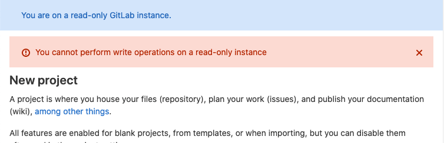

# GitLab Maintenance Mode **(PREMIUM SELF)**

> [Introduced](https://gitlab.com/groups/gitlab-org/-/epics/2149) in GitLab Premium 13.9.

Maintenance Mode allows administrators to reduce write operations to a minimum while maintenance tasks are performed. The main goal is to block all external actions that change the internal state, including the PostgreSQL database, but especially files, Git repositories, Container repositories, and so on.

Once Maintenance Mode is enabled, in-progress actions finish relatively quickly since no new actions are coming in, and internal state changes are minimal.
In that state, various maintenance tasks are easier, and services can be stopped completely or be
further degraded for a much shorter period of time than might otherwise be needed. For example, stopping cron jobs and draining queues should be fairly quick.

Maintenance Mode allows most external actions that do not change internal state. On a high-level, HTTP POST, PUT, PATCH, and DELETE requests are blocked and a detailed overview of [how special cases are handled](#rest-api) is available.

## Enable Maintenance Mode

There are three ways to enable Maintenance Mode as an administrator:

- **Web UI**:
  1. On the top bar, select **Menu >** **{admin}** **Admin**.
  1. On the left sidebar, select **Settings > General**.
  1. Expand **Maintenance Mode**, and toggle **Enable Maintenance Mode**.
     You can optionally add a message for the banner as well.
  1. Select **Save changes**.

- **API**:

  ```shell
  curl --request PUT --header "PRIVATE-TOKEN:$ADMIN_TOKEN" "<gitlab-url>/api/v4/application/settings?maintenance_mode=true"
  ```

- [**Rails console**](../operations/rails_console.md#starting-a-rails-console-session):

  ```ruby
  ::Gitlab::CurrentSettings.update!(maintenance_mode: true)
  ::Gitlab::CurrentSettings.update!(maintenance_mode_message: "New message")
  ```

## Disable Maintenance Mode

There are three ways to disable Maintenance Mode:

- **Web UI**:
  1. On the top bar, select **Menu >** **{admin}** **Admin**.
  1. On the left sidebar, select **Settings > General**.
  1. Expand **Maintenance Mode**, and toggle **Enable Maintenance Mode**.
     You can optionally add a message for the banner as well.
  1. Select **Save changes**.

- **API**:

  ```shell
  curl --request PUT --header "PRIVATE-TOKEN:$ADMIN_TOKEN" "<gitlab-url>/api/v4/application/settings?maintenance_mode=false"
  ```

- [**Rails console**](../operations/rails_console.md#starting-a-rails-console-session):

  ```ruby
  ::Gitlab::CurrentSettings.update_attributes!(maintenance_mode: false)
  ```

## Behavior of GitLab features in Maintenance Mode

When Maintenance Mode is enabled, a banner is displayed at the top of the page.
The banner can be customized with a specific message.

An error is displayed when a user tries to perform a write operation that isn't allowed.



NOTE:
In some cases, the visual feedback from an action could be misleading, for example when starring a project, the **Star** button changes to show the **Unstar** action, however, this is only the frontend update, and it doesn't take into account the failed status of the POST request. These visual bugs are to be fixed [in follow-up iterations](https://gitlab.com/gitlab-org/gitlab/-/issues/295197).

### Admin functions

Systems administrators can edit the application settings. This allows
them to disable Maintenance Mode after it's been enabled.

### Authentication

All users can log in and out of the GitLab instance but no new users can be created.

If there are [LDAP syncs](../auth/ldap/index.md) scheduled for that time, they fail since user creation is disabled. Similarly, [user creations based on SAML](../../integration/saml.md#general-setup) fail.

### Git actions

All read-only Git operations continue to work, for example
`git clone` and `git pull`. All write operations fail, both through the CLI and Web IDE with the error message: `Git push is not allowed because this GitLab instance is currently in (read-only) maintenance mode.`

If Geo is enabled, Git pushes to both primary and secondaries fail.

### Merge requests, issues, epics

All write actions except those mentioned above fail. For example, a user cannot update merge requests or issues.

### Incoming email

Creating new issue replies, issues (including new Service Desk issues), merge requests [by email](../incoming_email.md) fail.

### Outgoing email

Notification emails continue to arrive, but emails that require database writes, like resetting the password, do not arrive.

### REST API

For most JSON requests, POST, PUT, PATCH, and DELETE are blocked, and the API returns a 403 response with the error message: `You cannot perform write operations on a read-only instance`. Only the following requests are allowed:

|HTTP request | Allowed routes |  Notes |
|:----:|:--------------------------------------:|:----:|
| POST | `/admin/application_settings/general` | To allow updating application settings in the admin UI |
| PUT  | `/api/v4/application/settings` | To allow updating application settings with the API |
| POST | `/users/sign_in` | To allow users to log in. |
| POST | `/users/sign_out`| To allow users to log out. |
| POST | `/oauth/token` | To allow users to log in to a Geo secondary for the first time. |
| POST | `/admin/session`, `/admin/session/destroy` | To allow [Admin mode for GitLab administrators](https://gitlab.com/groups/gitlab-org/-/epics/2158) |
| POST | Paths ending with `/compare`| Git revision routes. |
| POST | `.git/git-upload-pack` | To allow Git pull/clone. |
| POST | `/api/v4/internal` | [internal API routes](../../development/internal_api.md) |
| POST | `/admin/sidekiq` | To allow management of background jobs in the admin UI |
| POST | `/admin/geo` | To allow updating Geo Nodes in the admin UI |
| POST | `/api/v4/geo_replication`| To allow certain Geo-specific admin UI actions on secondary sites |

### GraphQL API

`POST /api/graphql` requests are allowed but mutations are blocked with the error message `You cannot perform write operations on a read-only instance`.

### Continuous Integration

- No new jobs or pipelines start, scheduled or otherwise.
- Jobs that were already running continue to have a `running` status in the GitLab UI,
  even if they finish running on the GitLab Runner.
- Jobs in the `running` state for longer than the project's time limit do not time out.
- Pipelines cannot be started, retried or canceled. No new jobs can be created either.

After Maintenance Mode is disabled, new jobs are picked up again. Jobs that were
in the `running` state before enabling Maintenance Mode resume and their logs start
updating again.

NOTE:
It is recommended that you restart previously `running` pipelines after Maintenance Mode
is turned off.

### Deployments

Deployments don't go through because pipelines are unfinished.

It is recommended to disable auto deploys during Maintenance Mode, and enable them once it is disabled.

#### Terraform integration

Terraform integration depends on running CI pipelines, hence it is blocked.

### Container Registry

`docker push` fails with this error: `denied: requested access to the resource is denied`, but `docker pull` works.

### Package Registry

Package Registry allows you to install but not publish packages.

### Background jobs

Background jobs (cron jobs, Sidekiq) continue running as is, because background jobs are not automatically disabled.

[During a planned Geo failover](../geo/disaster_recovery/planned_failover.md#prevent-updates-to-the-primary-node),
it is recommended that you disable all cron jobs except for those related to Geo.

To monitor queues and disable jobs:

1. On the top bar, select **Menu >** **{admin}** **Admin**.
1. On the left sidebar, select **Monitoring > Background Jobs**.

### Incident management

[Incident management](../../operations/incident_management/index.md) functions are limited. The creation of [alerts](../../operations/incident_management/alerts.md) and [incidents](../../operations/incident_management/incidents.md#incident-creation) are paused entirely. Notifications and paging on alerts and incidents are therefore disabled.

### Feature flags

- [Development feature flags](../../development/feature_flags/index.md) cannot be turned on or off through the API, but can be toggled through the Rails console.
- [The feature flag service](../../operations/feature_flags.md) responds to feature flag checks but feature flags cannot be toggled

### Geo secondaries

When primary is in Maintenance Mode, secondary also automatically goes into Maintenance Mode.

It is important that you do not disable replication before enabling Maintenance Mode.

Replication and verification continues to work but proxied Git pushes to primary do not work.

### Secure features

Features that depend on creating issues or creating or approving Merge Requests, do not work.

Exporting a vulnerability list from a Vulnerability Report page does not work.

Changing the status on a finding or vulnerability object does not work, even though no error is shown in the UI.

SAST and Secret Detection cannot be initiated because they depend on passing CI jobs to create artifacts.

## An example use case: a planned failover

In the use case of [a planned failover](../geo/disaster_recovery/planned_failover.md), a few writes in the primary database are acceptable, since they are replicated quickly and are not significant in number.

For the same reason we don't automatically block background jobs when Maintenance Mode is enabled.

The resulting database writes are acceptable. Here, the trade-off is between more service degradation and the completion of replication.

However, during a planned failover, we [ask users to turn off cron jobs that are not related to Geo, manually](../geo/disaster_recovery/planned_failover.md#prevent-updates-to-the-primary-node). In the absence of new database writes and non-Geo cron jobs, new background jobs would either not be created at all or be minimal.
