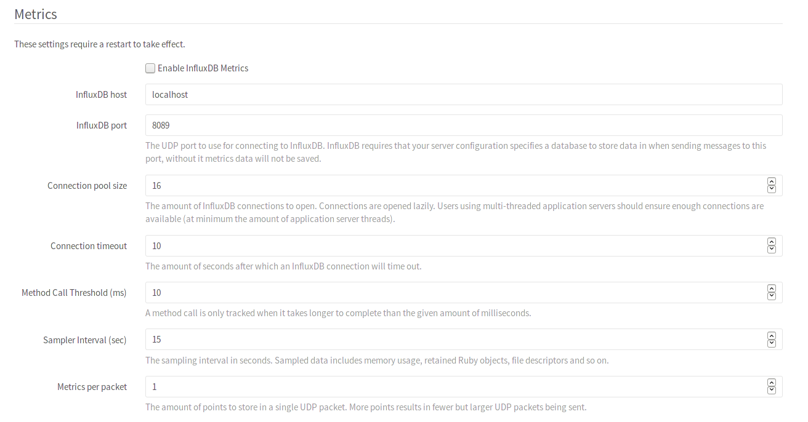

# GitLab Configuration

CAUTION: **InfluxDB is deprecated in favor of Prometheus:**
InfluxDB support is scheduled to be removed in GitLab 13.0.
You are advised to use [Prometheus](../prometheus/index.md) instead.

GitLab Performance Monitoring is disabled by default. To enable it and change any of its
settings, navigate to **Admin Area > Settings > Metrics and profiling**
(`/admin/application_settings/metrics_and_profiling`).

The minimum required settings you need to set are the InfluxDB host and port.
Make sure _Enable InfluxDB Metrics_ is checked and hit **Save** to save the
changes.



Finally, a restart of all GitLab processes is required for the changes to take
effect:

```bash
# For Omnibus installations
sudo gitlab-ctl restart

# For installations from source
sudo service gitlab restart
```

## Pending Migrations

When any migrations are pending, the metrics are disabled until the migrations
have been performed.

Read more on:

- [Introduction to GitLab Performance Monitoring](index.md)
- [InfluxDB Configuration](influxdb_configuration.md)
- [InfluxDB Schema](influxdb_schema.md)
- [Grafana Install/Configuration](grafana_configuration.md)
