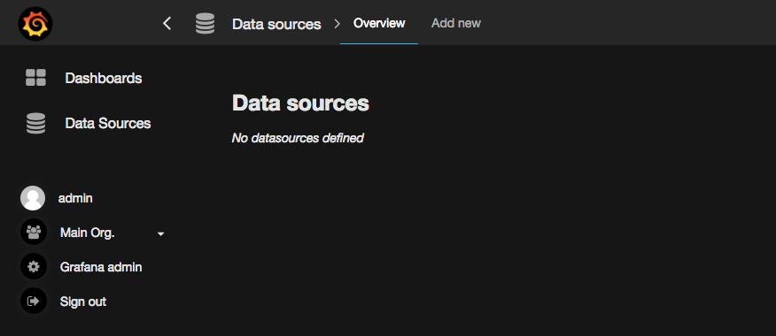
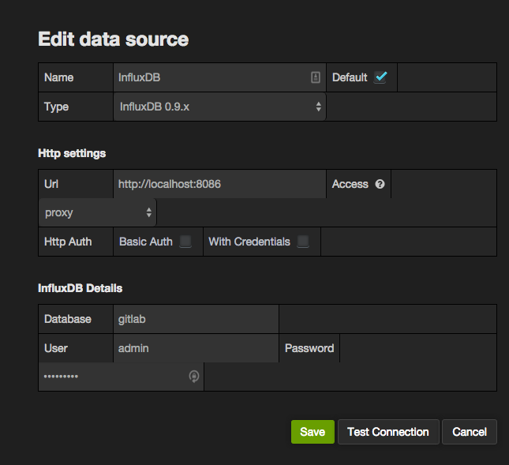
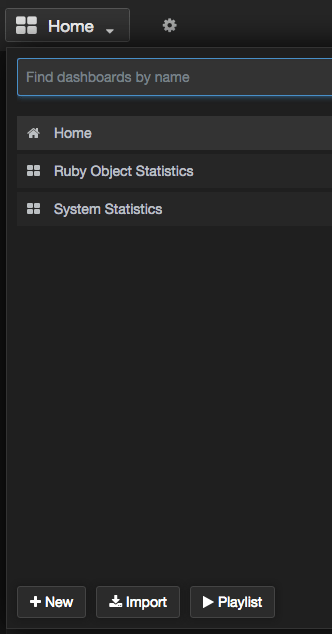
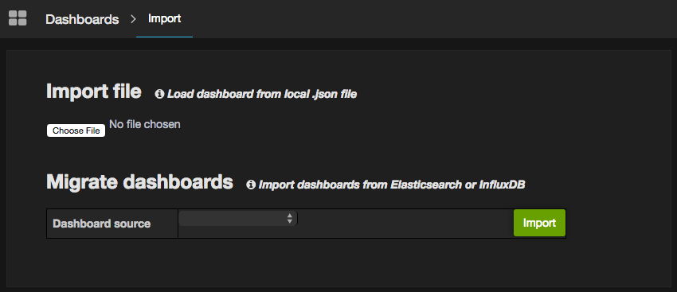
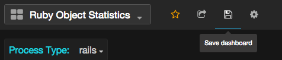

# Grafana Configuration

CAUTION: **InfluxDB is deprecated in favor of Prometheus:**
InfluxDB support is scheduled to be removed in GitLab 13.0.
You are advised to use [Prometheus](../prometheus/index.md) instead.

[Grafana](https://grafana.com/) is a tool that allows you to visualize time
series metrics through graphs and dashboards. It supports several backend
data stores, including InfluxDB. GitLab writes performance data to InfluxDB
and Grafana will allow you to query to display useful graphs.

For the easiest installation and configuration, install Grafana on the same
server as InfluxDB. For larger installations, you may want to split out these
services.

## Installation

[GitLab Omnibus can help you install Grafana (recommended)](https://docs.gitlab.com/omnibus/settings/grafana.html)
or Grafana supplies package repositories (Yum/Apt) for easy installation.
See [Grafana installation documentation](https://grafana.com/docs/installation/)
for detailed steps.

NOTE: **Note:**
Before starting Grafana for the first time, set the admin user
and password in `/etc/grafana/grafana.ini`. Otherwise, the default password
will be `admin`.

## Configuration

Login as the admin user. Expand the menu by clicking the Grafana logo in the
top left corner. Choose 'Data Sources' from the menu. Then, click 'Add new'
in the top bar.



Fill in the configuration details for the InfluxDB data source. Save and
Test Connection to ensure the configuration is correct.

- **Name**: `InfluxDB`
- **Default**: Checked
- **Type**: `InfluxDB 0.9.x` (Even if you're using InfluxDB 0.10.x)
- **Url**: `https://localhost:8086` (Or the remote URL if you've installed InfluxDB
  on a separate server)
- **Access**: `proxy`
- **Database**: `gitlab`
- **User**: `admin` (Or the username configured when setting up InfluxDB)
- **Password**: The password configured when you set up InfluxDB



## Apply retention policies and create continuous queries

If you intend to import the GitLab provided Grafana dashboards, you will need to
set up the right retention policies and continuous queries. The easiest way of
doing this is by using the [influxdb-management](https://gitlab.com/gitlab-org/influxdb-management)
repository.

To use this repository you must first clone it:

```
git clone https://gitlab.com/gitlab-org/influxdb-management.git
cd influxdb-management
```

Next you must install the required dependencies:

```
gem install bundler
bundle install
```

Now you must configure the repository by first copying `.env.example` to `.env`
and then editing the `.env` file to contain the correct InfluxDB settings. Once
configured you can simply run `bundle exec rake` and the InfluxDB database will
be configured for you.

For more information see the [influxdb-management README](https://gitlab.com/gitlab-org/influxdb-management/blob/master/README.md).

## Import Dashboards

You can now import a set of default dashboards that will give you a good
start on displaying useful information. GitLab has published a set of default
[Grafana dashboards][grafana-dashboards] to get you started. Clone the
repository or download a zip/tarball, then follow these steps to import each
JSON file.

Open the dashboard dropdown menu and click 'Import'



Click 'Choose file' and browse to the location where you downloaded or cloned
the dashboard repository. Pick one of the JSON files to import.



Once the dashboard is imported, be sure to click save icon in the top bar. If
you do not save the dashboard after importing it will be removed when you
navigate away.



Repeat this process for each dashboard you wish to import.

Alternatively you can automatically import all the dashboards into your Grafana
instance. See the README of the [Grafana dashboards][grafana-dashboards]
repository for more information on this process.

[grafana-dashboards]: https://gitlab.com/gitlab-org/grafana-dashboards

## Integration with GitLab UI

> [Introduced](https://gitlab.com/gitlab-org/gitlab-foss/issues/61005) in GitLab 12.1.

If you have set up Grafana, you can enable a link to access it easily from the sidebar:

1. Go to the admin area under **Settings > Metrics and profiling**
   and expand "Metrics - Grafana".
1. Check the "Enable access to Grafana" checkbox.
1. If Grafana is enabled through Omnibus GitLab and on the same server,
   leave "Grafana URL" unchanged. In any other case, enter the full URL
   path of the Grafana instance.
1. Click **Save changes**.
1. The new link will be available in the admin area under **Monitoring > Metrics Dashboard**.

## Security Update

Users running GitLab version 12.0 or later should immediately upgrade to one of the following security releases due to a known vulnerability with the embedded Grafana dashboard:

- 12.0.6
- 12.1.6

After upgrading, the Grafana dashboard will be disabled and the location of your existing Grafana data will be changed from `/var/opt/gitlab/grafana/data/` to `/var/opt/gitlab/grafana/data.bak.#{Date.today}/`.

To prevent the data from being relocated, you can run the following command prior to upgrading:

```sh
echo "0" > /var/opt/gitlab/grafana/CVE_reset_status
```

To reinstate your old data, move it back into its original location:

```
sudo mv /var/opt/gitlab/grafana/data.bak.xxxx/ /var/opt/gitlab/grafana/data/
```

However, you should **not** reinstate your old data _except_ under one of the following conditions:

1. If you are certain that you changed your default admin password when you enabled Grafana
1. If you run GitLab in a private network, accessed only by trusted users, and your Grafana login page has not been exposed to the internet

If you require access to your old Grafana data but do not meet one of these criteria, you may consider reinstating it temporarily, [exporting the dashboards](https://grafana.com/docs/reference/export_import/#exporting-a-dashboard) you need, then refreshing the data and [re-importing your dashboards](https://grafana.com/docs/reference/export_import/#importing-a-dashboard). Note that this poses a temporary vulnerability while your old Grafana data is in use, and the decision to do so should be weighed carefully with your need to access existing data and dashboards.

For more information and further mitigation details, please refer to our [blog post on the security release](https://about.gitlab.com/blog/2019/08/12/critical-security-release-gitlab-12-dot-1-dot-6-released/).

---

Read more on:

- [Introduction to GitLab Performance Monitoring](index.md)
- [GitLab Configuration](gitlab_configuration.md)
- [InfluxDB Installation/Configuration](influxdb_configuration.md)
- [InfluxDB Schema](influxdb_schema.md)
